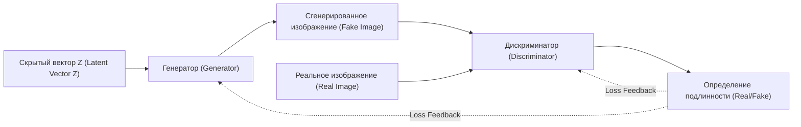
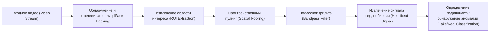
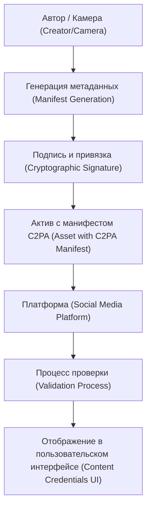

# Введение: Эпоха, когда стирается грань между реальностью и вымыслом

В 2020-х годах развитие генеративного ИИ (Generative AI) происходит с невиданной ранее скоростью. Всего за несколько секунд можно создать контент — от текстов и аудио до изображений и видео — который невозможно отличить от созданного человеком. Хотя этот технологический скачок приносит огромную пользу творческим сферам, он также порождает серьезную социальную угрозу в виде потока изощренного поддельного контента, называемого «дипфейк» (Deepfake).

Дипфейки угрожают обществу в различных формах: фейковые выступления политиков, мошенничество от лица CEO компаний (эволюция BEC-мошенничества) или порнография, порочащая честь знаменитостей. Особенно в периоды выборов распространение фейковых новостей с использованием дипфейков перерастает в ситуацию, которая расшатывает основы демократии.

В такую эпоху от нас требуется обновление «информационной грамотности». Здравый смысл «верить своим глазам» больше не работает. В этой статье мы начнем с технических основ того, как создаются дипфейки, и продолжим невероятно глубоким техническим разбором передовых методов цифровой криминалистики для их «технического» распознавания, а также обсудим концепции противодействия дезинформации на уровне всего общества (например, C2PA), с использованием математических формул и кода.

---

# 1. Механизмы генеративного ИИ, лежащие в основе дипфейков

Чтобы понять дипфейки, необходимо сначала узнать принципы работы генеративного ИИ, который является их основой. В настоящее время для генерации изображений и видео высокого разрешения используются две основные архитектуры: «GAN» (Generative Adversarial Networks — Генеративно-состязательные сети) и «Diffusion Models» (Диффузионные модели).

## 1.1 Генеративно-состязательная сеть (GAN)

GAN, предложенная Иэном Гудфеллоу и его коллегами в 2014 году, послужила катализатором технологии дипфейков. GAN состоит из двух нейронных сетей, выполняющих роли «фальшивомонетчика» и «полицейского», которые обучаются, конкурируя друг с другом (состязательное обучение), что позволяет генерировать крайне реалистичные данные.

- **Генератор (Generator, $G$)**: Принимает случайный шум (скрытый вектор $z$) на вход и генерирует данные (например, изображения), которые выглядят как настоящие.
- **Дискриминатор (Discriminator, $D$)**: Определяет, являются ли введенные данные «настоящими» (Real) из реального набора данных или «поддельными» (Fake), созданными генератором.

Эти две сети обучаются оптимизировать функцию потерь, которая формулируется как следующая минимаксная (Minimax) игра:

$$
\min_G \max_D V(D, G) = \mathbb{E}_{x \sim p_{data}(x)}[\log D(x)] + \mathbb{E}_{z \sim p_{z}(z)}[\log(1 - D(G(z)))]
$$

Здесь $x$ — реальные данные, а $z$ — скрытая переменная (шум). Дискриминатор $D$ пытается максимизировать эту формулу (точно отличать настоящее от подделки), а генератор $G$ пытается минимизировать ее (обмануть дискриминатор). Когда это обучение достигает состояния равновесия (равновесия Нэша), генератор может создавать данные, неотличимые от настоящих.



## 1.2 Диффузионные модели (Diffusion Models)

В последние годы технологией, которая превосходит GAN по качеству изображений и стабильности и является базовой для таких систем, как Midjourney и Stable Diffusion, стали «Диффузионные модели». Диффузионная модель состоит из «процесса прямой диффузии», который постепенно добавляет шум к данным, и «процесса обратной диффузии», который восстанавливает исходные данные из шума.

В **процессе прямой диффузии (Forward Process)** к чистому изображению $x_0$ на каждом временном шаге $t$ добавляется гауссов шум. Этот процесс выражается как марковская цепь с помощью следующей формулы:

$$
q(x_t | x_{t-1}) = \mathcal{N}(x_t; \sqrt{1 - \beta_t} x_{t-1}, \beta_t \mathbf{I})
$$

Здесь $\beta_t$ — параметр расписания, управляющий дисперсией шума. После достаточного количества шагов $T$ изображение $x_T$ становится полностью случайным шумом.

В **процессе обратной диффузии (Reverse Process)** нейронная сеть (обычно с архитектурой U-Net) обучается прогнозировать шум по зашумленному изображению $x_t$ и восстанавливать предыдущий шаг $x_{t-1}$. Комбинируя этот процесс с условиями (например, текстовыми подсказками), можно сгенерировать любое изображение с нуля (из шума).

---

# 2. Цифровая криминалистика: Технологии поиска следов генерации

Независимо от того, насколько совершенной становится генеративная модель, данные, сгенерированные ИИ, всегда будут содержать невидимые для человека «математические и статистические следы» (артефакты). Технологии обнаружения (детекторы дипфейков) улавливают эти микроскопические следы с помощью различных подходов.

## 2.1 Анализ в частотной области и ДКП (Дискретное косинусное преобразование)

Человеческий глаз чувствителен к пространственным изменениям цвета и яркости изображения (в пространственной области), но нечувствителен к изменениям частот (в частотной области). Изображения, сгенерированные с помощью GAN или диффузионных моделей, даже если на первый взгляд выглядят идеально, в процессе апсемплинга (увеличения разрешения от низкого к высокому) порождают специфические частотные паттерны (такие как артефакты шахматной доски).

Для обнаружения этого часто используется **Дискретное косинусное преобразование (Discrete Cosine Transform, DCT)**. ДКП представляет изображение как сумму косинусоид разных частот. Формула двумерного ДКП выглядит следующим образом:

$$
X_{k_1, k_2} = \sum_{n_1=0}^{N_1-1} \sum_{n_2=0}^{N_2-1} x_{n_1, n_2} \cos\left[\frac{\pi}{N_1}\left(n_1 + \frac{1}{2}\right)k_1\right] \cos\left[\frac{\pi}{N_2}\left(n_2 + \frac{1}{2}\right)k_2\right]
$$

Сгенерированные изображения, по сравнению с естественными, как правило, имеют аномальное распределение энергии в **высокочастотных компонентах (мелкий шум и резкие перепады границ)**. Ниже приведен простой пример кода на Python для извлечения энергии высокочастотных компонентов из изображения с использованием ДКП.

```python
import cv2
import numpy as np
import scipy.fftpack

def extract_high_frequency_features(image_path):
    # Чтение изображения и преобразование в оттенки серого
    img = cv2.imread(image_path, cv2.IMREAD_GRAYSCALE)
    if img is None:
        raise ValueError("Image not found")
    
    # Применение двумерного дискретного косинусного преобразования (ДКП)
    # Сначала применяется одномерное ДКП к строкам, затем к столбцам
    dct_result = scipy.fftpack.dct(scipy.fftpack.dct(img.T, norm='ortho').T, norm='ortho')
    
    # Извлечение высокочастотных компонентов (маскирование и обнуление низкочастотных компонентов в левом верхнем углу)
    rows, cols = dct_result.shape
    mask = np.ones((rows, cols))
    
    # Маскирование низкочастотной области (10% от всей)
    mask[:int(rows*0.1), :int(cols*0.1)] = 0
    
    high_freq_features = dct_result * mask
    
    # Вычисление количества энергии высокочастотной области
    energy = np.sum(np.abs(high_freq_features))
    
    return energy

# При сравнении естественных изображений со сгенерированными, значение energy часто показывает статистически значимую разницу
```

Эта неестественность в частотной области возникает из-за того, что, хотя ИИ может научиться «локальной согласованности на уровне пикселей», ему трудно идеально имитировать «глобальные частотные характеристики всего изображения».

---

# 3. Обнаружение по биометрическим сигналам: проверка «пульса жизни» с помощью rPPG

В дополнение к технологиям обнаружения на изображениях (фотографиях), прорывным подходом к выявлению дипфейков в видео является **извлечение биометрических сигналов (Biological Signals)**.

Пока человек жив, его сердце бьется, и кровь циркулирует по телу. Поскольку гемоглобин в крови хорошо поглощает свет определенной длины волны (особенно зеленый свет, около 530 нм), цвет кожи лица микроскопически (на невидимом для человека уровне) изменяется синхронно с сердцебиением. Технология бесконтактной оценки частоты сердечных сокращений по видео с обычной RGB-камеры, использующая этот принцип, называется **rPPG (дистанционная фотоплетизмография, remote Photoplethysmography)**.

Базовая модель rPPG, основанная на поглощении и отражении света, выражается законом Ламберта-Бера следующим образом:

$$
I(t) = I_0(t) e^{-\left( \mu_{dc} + \mu_{ac}(t) \right) d}
$$

Здесь $I(t)$ — интенсивность света, наблюдаемая камерой, $I_0(t)$ — интенсивность источника света, $\mu_{dc}$ — статический коэффициент поглощения света тканями, $\mu_{ac}(t)$ — динамический коэффициент поглощения света из-за колебаний кровотока (сердцебиения), а $d$ — длина пути света.

Дипфейк-видео (например, FaceSwap для замены лиц или Lip-sync для синхронизации движений губ со звуком) стремятся к визуальной реалистичности на уровне кадров, но **не могут воспроизвести микроскопические изменения кровотока (сигнал сердцебиения) вдоль временной оси.** Поэтому, если попытаться извлечь сигнал rPPG из дипфейк-видео, получится неестественный сигнал, полный шума, который отличается от естественного сердцебиения человека (обычно регулярный цикл в диапазоне 60-100 ударов в минуту).



Ниже приведен пример концептуальной реализации конвейера на Python для извлечения сигнала rPPG из видео.

```python
import cv2
import numpy as np
from scipy import signal

def extract_rppg_signal(video_path):
    cap = cv2.VideoCapture(video_path)
    green_signals = []
    
    while cap.isOpened():
        ret, frame = cap.read()
        if not ret:
            break
            
        # 1. Обнаружение лица и извлечение ROI (области интереса: например, лоб или щеки)
        # roi = detect_face_and_extract_roi(frame)
        # Здесь для упрощения в качестве ROI берется центральная часть всего кадра
        h, w = frame.shape[:2]
        roi = frame[int(h*0.3):int(h*0.6), int(w*0.4):int(w*0.6)]
        
        # 2. Извлечение зеленого канала (Green) из пространства RGB
        # Поскольку гемоглобин в крови сильнее всего поглощает зеленый свет
        g_channel = roi[:, :, 1]
        
        # 3. Пространственный пулинг (вычисление среднего значения)
        mean_g = np.mean(g_channel)
        green_signals.append(mean_g)
        
    cap.release()
    
    if len(green_signals) == 0:
        return None
        
    # 4. Полосовой фильтр для удаления шума
    # Извлечение частотной полосы сердцебиения человека (например: 0.7 Гц - 2.5 Гц = 42 - 150 уд/мин)
    fps = 30.0 # Предполагаемая частота кадров
    nyquist = 0.5 * fps
    low = 0.7 / nyquist
    high = 2.5 / nyquist
    b, a = signal.butter(3, [low, high], btype='bandpass')
    filtered_signal = signal.filtfilt(b, a, green_signals)
    
    return filtered_signal

# Анализируется частотный спектр извлеченного filtered_signal,
# и если четких пиков (сердцебиений) нет, вероятность дипфейка считается высокой.
```

---

# 4. Бесконечная игра в «кошки-мышки»: Состязательное обучение и технологии обхода

Как уже упоминалось, существуют передовые криминалистические технологии, такие как частотный анализ и биометрические сигналы (rPPG). Однако в мире ИИ не существует «абсолютной стены». Как только технология обнаружения публикуется в виде научной статьи, злоумышленники (создатели дипфейков) немедленно улучшают генеративные модели, чтобы обходить эти детекторы.

Например, предположим, что детектор распознает дипфейки, обнаруживая «аномалии в частотной области». Злоумышленник встраивает **сам этот детектор в качестве «дискриминатора» (Discriminator) новой GAN** и заново обучает генератор (Generator). В результате генератор эволюционирует так, чтобы выводить «изображения, которые даже в частотной области невозможно отличить от естественных».

Более того, уже есть исследования по обходу систем обнаружения (Anti-Forensics) на базе rPPG путем намеренного добавления в видео искусственных «микроскопических колебаний цвета (поддельный сигнал сердцебиения)» во время постобработки.

Обнаружение и генерация ведут бесконечную игру в «кошки-мышки» (Cat-and-Mouse Game) по принципу «щита и меча». В связи с этим отмечается, что подход к определению подлинности путем последующего анализа только сгенерированных данных (изображений и видео), то есть пассивное обнаружение, в конечном итоге достигнет своего предела.

---

# 5. Фундаментальные контрмеры: Доказательство происхождения и структура C2PA

В условиях, когда методы ретроспективного обнаружения достигают своих пределов, в мире сейчас стремительно продвигается активный подход к защите, криптографически гарантирующий «происхождение» (Provenance) данных. Глобальным стандартом для этой концепции является **C2PA (Coalition for Content Provenance and Authenticity)**.

C2PA — это консорциум, созданный при участии таких крупных компаний, как Adobe, Microsoft, Intel, BBC и Sony, который разрабатывает технические спецификации для внедрения истории происхождения цифрового контента (кто, когда, на какую камеру снимал и какие редактирования были внесены) в сам контент таким образом, чтобы защитить его от подделки.

## 5.1 Как работает C2PA

Ключевой технологией C2PA является цифровая подпись с использованием инфраструктуры открытых ключей (PKI) и привязка хэша контента.

1. **Генерация метаданных (Manifest)**: В момент съемки фотографии на камеру или при ее редактировании в программном обеспечении создаются метаданные, называемые «манифестом» (Manifest), которые включают историю операций, информацию об устройстве и данные о создателе.
2. **Криптографическая подпись (Digital Signature)**: На манифест и значение хэша самого изображения (сводка пиксельных данных) накладывается цифровая подпись с использованием аппаратного или программного закрытого ключа.
3. **Внедрение в актив (Asset)**: Подписанный манифест (C2PA учетные данные) внедряется в информацию заголовка файлов таких форматов, как JPEG или MP4.

Если злоумышленник попытается подделать часть изображения или прикрепить поддельные метаданные к сгенерированному ИИ изображению, хэш-значение самого изображения изменится, поэтому проверка цифровой подписи не удастся, и подделка будет немедленно раскрыта.



## 5.2 Визуализация с помощью значка «Content Credentials»

В системах, совместимых со стандартом C2PA, когда пользователь просматривает изображение в социальных сетях или на новостных сайтах, в углу изображения отображается значок «CR» (Content Credentials). Если нажать на него, любой сможет прозрачно проверить историю изображения, например, «было ли оно сгенерировано ИИ», «было ли оно снято на реальную камеру» или «была ли выполнена цветокоррекция в Photoshop».

В настоящее время крупные разработчики ИИ, такие как OpenAI (DALL-E 3) и Google, также начали прикреплять метаданные C2PA к сгенерированным изображениям, а производители камер, такие как Leica и Sony, внедряют функции подписи C2PA на аппаратном уровне. Социальная парадигма смещается от «распознавания подделок» к «доказательству подлинности (подход Zero-Trust)».

---

# 6. Информационная грамотность нового поколения: что мы можем сделать

Технические контрмеры (инфраструктура, такая как детекторы дипфейков и подтверждение происхождения вроде C2PA) — это всего лишь инструменты для защиты общества. В конечном счете именно человеческий мозг принимает решение о потреблении и распространении информации.

В эпоху ИИ «информационная грамотность» нового поколения означает наличие следующих подходов:

1. **Избегать рефлекторного распространения (Stop and Think)**
   Именно когда вы сталкиваетесь с шокирующими видео или контентом, разжигающим гнев (информация, взывающая к эмоциям), важно остановиться и не спешить делать репост или делиться этим. Главная цель создателей дипфейков — взломать человеческие эмоции для распространения информации.
2. **Проверять источник информации (Verify the Source)**
   Опубликована ли информация надежным новостным агентством? Прикреплено ли доказательство происхождения, такое как C2PA (Content Credentials)? Важно выработать привычку перекрестной проверки источников информации.
3. **Здоровый скептицизм: «всё может быть фейком» (Healthy Skepticism)**
   Нет необходимости становиться пессимистом, но от старого здравого смысла «видео = факт» нужно отказаться. Информацию следует воспринимать исходя из того, что мы живем в эпоху, когда аудио, видео и тексты можно легко подделать.

# Заключение

Развитие технологий ИИ открыло ящик Пандоры. Уничтожить саму технологию создания дипфейков уже невозможно.

Однако, как было описано в этой статье, технические специалисты борются с угрозой фейковых новостей с помощью разнообразных подходов, таких как частотный анализ, обнаружение биометрических сигналов и доказательство происхождения с использованием криптографии (C2PA). Объединив этот технический щит (меры защиты) с социальным щитом в виде нашей индивидуальной «информационной грамотности», мы сможем преодолеть волну вымысла, которую приносит ИИ, и защитить ценность истины.

Именно потому, что мы живем в эпоху, когда стирается граница между реальностью и вымыслом, человеческая «воля» к распознаванию истины становится как никогда важной.


