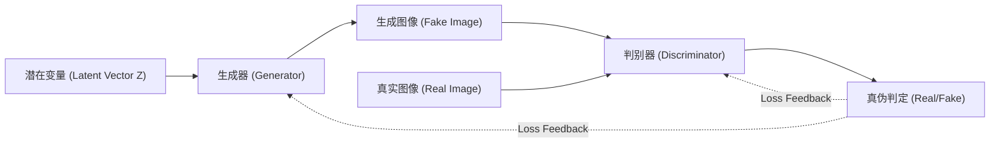
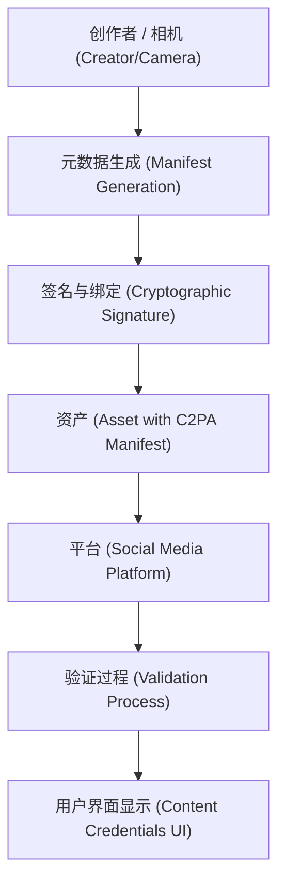

# 引言：现实与虚构边界消融的时代

进入2020年代，生成式AI（Generative AI）以惊人的速度演进。从文章、语音、图像到视频，仅需短短几秒，即可生成与人类创作难以区分的内容。这一技术飞跃在为创意领域带来巨大福祉的同时，也催生了被称为“深度伪造（Deepfake）”的精巧伪造内容泛滥这一严重的社会威胁。

深度伪造正以多种形式威胁着社会，包括政客的虚假演说、冒充企业CEO的诈骗（BEC诈骗的进化版），以及损害名人名誉的色情内容等。特别是在选举期间，深度伪造引发的假新闻扩散，甚至发展成了动摇民主制度根基的事态。

在这样的时代，我们亟需更新自己的“信息素养”。“眼见为实”的常识已不再适用。本文将从深度伪造是如何生成的技术背景讲起，结合公式与代码，极具深度地为您解析用于“从技术上”识破它的最前沿数字取证手段，以及整个社会抗击虚假信息的框架（如C2PA等）。

---

# 1. 支撑深度伪造的生成式AI机制

要理解深度伪造，首先需要了解其底层生成式AI的原理。目前，用于生成高精度图像和视频的代表性架构主要有“GAN（生成对抗网络，Generative Adversarial Networks）”和“扩散模型（Diffusion Models）”两种。

## 1.1 生成对抗网络（GAN）

由Ian Goodfellow等人在2014年提出的GAN，是深度伪造技术的推手。GAN由两个神经网络扮演“造假者”和“警察”的角色，通过相互竞争（对抗性训练），生成极为逼真的数据。

- **生成器（Generator, $G$）** ：接收随机噪声（潜在变量 $z$）作为输入，生成以假乱真的数据（如图像等）。
- **判别器（Discriminator, $D$）** ：判断输入的数据是来自真实数据集的“真品（Real）”，还是生成器制造的“赝品（Fake）”。

这两个网络会不断推进训练，以优化被公式化为以下极小极大（Minimax）博弈的损失函数：

$$
\min_G \max_D V(D, G) = \mathbb{E}_{x \sim p_{data}(x)}[\log D(x)] + \mathbb{E}_{z \sim p_{z}(z)}[\log(1 - D(G(z)))]
$$

其中，$x$ 为真实数据，$z$ 为潜在变量（噪声）。判别器 $D$ 试图最大化该公式（准确分辨真伪），而生成器 $G$ 试图最小化它（欺骗判别器）。当这种训练达到均衡状态（纳什均衡）时，生成器就能生成真假难辨的数据。



## 1.2 扩散模型（Diffusion Models）

近年来，在画质和稳定性上超越GAN，并成为Midjourney和Stable Diffusion底层技术的，便是“扩散模型”。扩散模型由逐步向数据中添加噪声的“前向扩散过程”和从噪声中恢复原始数据的“逆向扩散过程”组成。

**前向扩散过程（Forward Process）** ：针对清晰图像 $x_0$，在每个时间步 $t$ 中加入高斯噪声。该过程作为[马尔可夫链](https://kenji.blog/p/markov-chain/)，用以下公式表示：

$$
q(x_t | x_{t-1}) = \mathcal{N}(x_t; \sqrt{1 - \beta_t} x_{t-1}, \beta_t \mathbf{I})
$$

这里 $\beta_t$ 是控制噪声方差的调度参数。经过足够的步骤 $T$ 后，$x_T$ 将变成完全的随机噪声。

**逆向扩散过程（Reverse Process）** ：神经网络（通常是U-Net架构）学习从噪声图像 $x_t$ 中预测噪声，从而恢复出前一步 $x_{t-1}$。通过将这一过程与条件控制（如文本提示词）相结合，就能从零（噪声）生成任意图像。

---

# 2. 数字取证：寻找生成物痕迹的技术

无论生成模型多么高级，AI生成的数据中必定会残留人类肉眼无法察觉的“数学/统计学痕迹（伪影，Artifacts）”。检测技术（Deepfake Detector）正是通过各种手段来捕捉这些微小的痕迹。

## 2.1 频域分析与DCT（离散余弦变换）

人类的眼睛对图像色彩和亮度的空间变化（空间域）很敏感，但对频率的变化（频域）却很迟钝。GAN或扩散模型生成的图像，即使乍看之下完美无瑕，但在上采样（从低分辨率放大到高分辨率）的过程中，会产生特有的频率特征（如棋盘格伪影等）。

为了检测这一点，通常使用的是 **离散余弦变换（Discrete Cosine Transform, DCT）** 。DCT将图像表示为不同频率余弦波的叠加。二维DCT的公式如下：

$$
X_{k_1, k_2} = \sum_{n_1=0}^{N_1-1} \sum_{n_2=0}^{N_2-1} x_{n_1, n_2} \cos\left[\frac{\pi}{N_1}\left(n_1 + \frac{1}{2}\right)k_1\right] \cos\left[\frac{\pi}{N_2}\left(n_2 + \frac{1}{2}\right)k_2\right]
$$

与自然图像相比，生成图像往往在 **高频分量（细微的噪声或急剧的边缘变化）** 上具有异常的能量分布。以下Python代码展示了如何使用DCT从图像中提取高频分量能量的简单示例：

```python
import cv2
import numpy as np
import scipy.fftpack

def extract_high_frequency_features(image_path):
    # 读取图像并转换为灰度图
    img = cv2.imread(image_path, cv2.IMREAD_GRAYSCALE)
    if img is None:
        raise ValueError("Image not found")
    
    # 应用二维离散余弦变换（DCT）
    # 首先对行应用一维DCT，然后对列应用一维DCT
    dct_result = scipy.fftpack.dct(scipy.fftpack.dct(img.T, norm='ortho').T, norm='ortho')
    
    # 提取高频分量（掩蔽左上角的低频分量使其为零）
    rows, cols = dct_result.shape
    mask = np.ones((rows, cols))
    
    # 掩蔽低频区域（整体的10%）
    mask[:int(rows*0.1), :int(cols*0.1)] = 0
    
    high_freq_features = dct_result * mask
    
    # 计算高频区域的能量大小
    energy = np.sum(np.abs(high_freq_features))
    
    return energy

# 将自然图像与生成图像进行比较时，往往会在energy值上产生统计学上的显著差异
```

这种频域上的不自然，是因为AI虽然能学到“像素级别的局部一致性”，但却难以完全模仿“图像整体的全局频率特性”。

---

# 3. 生物信号检测：通过rPPG确认“生命的跳动”

除了图像（静态图片）的检测技术，在视频深度伪造检测领域，一种具有突破性意义的方法是 **提取生物信号（Biological Signals）** 。

只要人还活着，血液就会随着心脏的跳动在体内循环。因为血液中的血红蛋白能很好地吸收特定波长（特别是绿光，约530nm），所以脸部皮肤的颜色会随着心跳发生微小变化（人类肉眼无法察觉的级别）。利用这一原理，从普通RGB摄像头的画面中非接触式地估算心率的技术，被称为 **rPPG（远程光电容积脉搏波描记法，remote Photoplethysmography）** 。

基于光的吸收与反射的rPPG基本模型，可通过比尔-朗伯定律表示如下：

$$
I(t) = I_0(t) e^{-\left( \mu_{dc} + \mu_{ac}(t) \right) d}
$$

其中，$I(t)$ 为摄像头观测到的光强，$I_0(t)$ 为光源强度，$\mu_{dc}$ 为静态组织的吸光系数，$\mu_{ac}(t)$ 为血流波动（心跳）引起的动态吸光系数，$d$ 为光程长。

深度伪造视频（例如进行换脸的FaceSwap，或将唇部动作与语音同步的Lip-sync），虽然追求逐帧的视觉逼真度，但 **无法再现沿时间轴的微小血流变化（心跳信号）。** 因此，如果试图从深度伪造视频中提取rPPG信号，会得到充满噪声的、不自然的信号，这与自然人类的心跳率（通常在60〜100 bpm范围内的规律性周期）截然不同。


以下是使用Python从视频中提取rPPG信号管线的概念性实现示例：

```python
import cv2
import numpy as np
from scipy import signal

def extract_rppg_signal(video_path):
    cap = cv2.VideoCapture(video_path)
    green_signals = []
    
    while cap.isOpened():
        ret, frame = cap.read()
        if not ret:
            break
            
        # 1. 人脸检测与ROI（感兴趣区域：例如额头或脸颊）的提取
        # roi = detect_face_and_extract_roi(frame)
        # 为简化起见，这里将画面的中心部分作为ROI
        h, w = frame.shape[:2]
        roi = frame[int(h*0.3):int(h*0.6), int(w*0.4):int(w*0.6)]
        
        # 2. 从RGB空间提取Green（绿）通道
        # 因为血液中的血红蛋白最能吸收绿光
        g_channel = roi[:, :, 1]
        
        # 3. 空间池化（计算平均值）
        mean_g = np.mean(g_channel)
        green_signals.append(mean_g)
        
    cap.release()
    
    if len(green_signals) == 0:
        return None
        
    # 4. 通过带通滤波器去除噪声
    # 提取人类心跳频率频段（例如：0.7Hz〜2.5Hz = 42〜150 bpm）
    fps = 30.0 # 假设的帧率
    nyquist = 0.5 * fps
    low = 0.7 / nyquist
    high = 2.5 / nyquist
    b, a = signal.butter(3, [low, high], btype='bandpass')
    filtered_signal = signal.filtfilt(b, a, green_signals)
    
    return filtered_signal

# 分析提取出的filtered_signal的频谱，
# 如果不存在明确的峰值（心跳），则判定为深度伪造的可能性很高。
```

---

# 4. 无止境的“猫鼠游戏”：对抗性训练与规避技术

如前所述，目前存在频率分析和生物信号（rPPG）等高级取证技术。但在AI世界中，不存在“绝对的壁垒”。当检测技术作为论文发表后，攻击者（深度伪造制作者）会立刻改良生成模型以规避该检测器。

例如，假设检测器通过发现“频域异常”识破了深度伪造。攻击者就会将 **该检测器本身作为新GAN的“判别器（Discriminator）”集成进去** ，重新训练生成器（Generator）。这样一来，生成器就会进化出输出“即便在频域上也与自然图像无法区分的图像”的能力。

甚至，已有研究（反取证，Anti-Forensics）报告指出，攻击者试图通过在后期处理中人为给视频添加“微小的色彩波动（虚假心跳信号）”，来欺骗基于rPPG的检测系统。

检测与生成，正在上演一场“矛与盾”的无止境的猫鼠游戏（Cat-and-Mouse Game）。因此，有观点指出，仅靠事后分析输出数据（图像或视频）来判定真伪的方法（被动检测），迟早会迎来瓶颈。

---

# 5. 根本对策：内容溯源与C2PA框架

在事后检测遇到瓶颈的当下，全世界正迅速推进一种从密码学角度保证数据“出处（Provenance）”的主动防御方法。而构建其全球标准框架的，正是 **C2PA（内容溯源和真实性联盟，Coalition for Content Provenance and Authenticity）** 。

C2PA是由Adobe、Microsoft、Intel、BBC、Sony等主要企业参与成立的联盟，正在制定将数字内容的来源（谁、在何时、用哪台相机拍摄，并进行了何种编辑）以防篡改的方式嵌入到内容本身的技术规范。

## 5.1 C2PA的机制

C2PA的核心技术是使用公钥基础设施（PKI）的数字签名，以及与内容哈希值的绑定。

1. **元数据生成（Manifest）** ：在用相机拍下照片的瞬间，或使用软件进行编辑时，会生成一个包含其操作历史、设备信息及创作者信息的，称为“清单（Manifest）”的元数据。
2. **密码学签名（Digital Signature）** ：针对清单以及图像本身的哈希值（像素数据的摘要），使用硬件或软件的私钥施加数字签名。
3. **嵌入到资产中** ：签过名的清单（C2PA凭证）会被嵌入到JPEG或MP4等文件格式的头部信息中。

如果攻击者篡改了图像的一部分，或者试图给AI生成的图像附加虚假的元数据，由于图像本身的哈希值会发生改变，数字签名验证就会失败，篡改将立刻败露。



## 5.2 “Content Credentials”图标的可视化

在遵循C2PA标准的系统中，当用户在社交网络或新闻网站上看到图像时，图像角落会显示一个“CR（Content Credentials）”图标。点击该图标，任何人都可以透明地查看到该图像的履历——它是“AI生成的”、“真实相机拍摄的”，还是“经过Photoshop色彩校正的”。

目前，OpenAI（DALL-E 3）和Google等主要的AI供应商也开始为生成的图像添加C2PA元数据，而徕卡和索尼等相机制造商也正在推进在硬件层面上实现C2PA签名功能。社会的范式正在从“识破假货”向“证明真品（零信任架构，Zero-Trust）”转变。

---

# 6. 下一代信息素养：我们能做什么

技术对策（如深度伪造检测器或C2PA这样的内容溯源）终究只是保护社会的基础设施。最终判断是否消费并传播信息的，还是我们人类的大脑。

AI时代所谓的下一代“信息素养”，就是具备以下态度：

1. **避免反射性地传播（Stop and Think）**
   越是接触到令人震惊的影像或煽动愤怒的内容（诉诸情感的信息），就越应停下脚步，停止转发和分享。深度伪造制造者的主要目的，就是黑客般地操纵人类情感来扩散信息。
2. **确认信息的“出处”（Verify the Source）**
   该信息是否由值得信赖的新闻机构发布？是否附带了像C2PA这样的内容溯源（Content Credentials）？养成交叉验证信息来源的习惯至关重要。
3. **抱有“一切都可能是伪造的”的健康怀疑精神（Healthy Skepticism）**
   无需过度悲观，但必须抛弃“视频=事实”这一过去的常识。我们需要在默认语音、视频、文章等一切都很容易被伪造的前提下，去摄取信息。

# 结语

AI技术的演进打开了潘多拉的魔盒。要消除产生深度伪造的技术本身已不再可能。

然而，正如本文所解析的那样，技术人员正在通过频率分析、生物信号检测以及利用密码学的溯源证明（C2PA）等多种手段，对抗着假新闻的威胁。通过将这些技术护盾（防御措施）与我们每个人名为“信息素养”的社会护盾相结合，我们一定能够驾驭AI带来的虚构浪潮，守卫真实的价值。

正因为这是一个现实与虚构边界消融的时代，人类力求辨明真相的“意志”，才变得比以往任何时候都更加重要。


