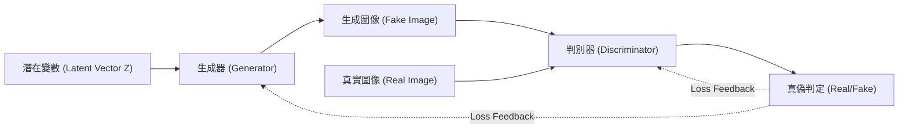
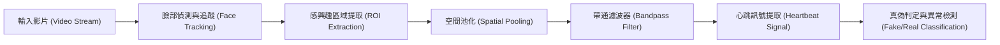
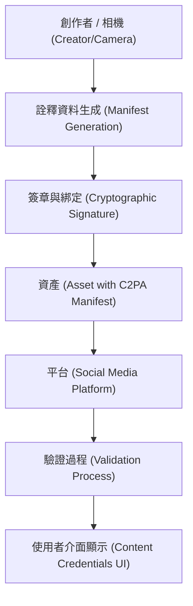

# 前言：現實與虛構邊界消融的時代

進入 2020 年代，生成式 AI（Generative AI）以史無前例的速度發展。從文字、語音、圖像，甚至到影片，我們已經能在短短幾秒內生成出與人類創作無異的內容。這項技術的飛躍雖然為創意領域帶來了巨大的恩惠，但同時也衍生出名為「深偽技術（Deepfake）」的精巧偽造內容氾濫問題，造成了嚴重的社會威脅。

深偽技術正以各種形式威脅著我們的社會，例如政治人物的偽造演說、假冒企業執行長的詐騙（BEC 詐騙的進化版），或是損害名人名譽的色情內容等。尤其在選舉期間，利用深偽技術散播假新聞，甚至已經發展到動搖民主根基的地步。

在這樣的時代，我們需要的是更新「資訊素養」。過去「眼見為憑」的常識已不再適用。本文將從深偽技術生成的技術背景開始，深入探討如何「從技術層面」識破深偽的最先進數位鑑識手法，以及整個社會為了對抗假資訊而建立的框架（如 C2PA），並穿插數學公式與程式碼，進行非常深度的解說。

---

# 1. 支撐深偽技術的生成式 AI 機制

要了解深偽技術，首先必須認識其基礎——生成式 AI 的運作原理。目前，用於生成高畫質圖像與影片的代表性架構有兩種：「GAN（生成對抗網路）」與「Diffusion Models（擴散模型）」。

## 1.1 生成對抗網路（GAN）

由 Ian Goodfellow 等人於 2014 年提出的 GAN，是點燃深偽技術熱潮的推手。GAN 由兩個神經網路組成，分別扮演「偽造者」和「警察」的角色，透過相互競爭（對抗式學習），生成極度逼真的資料。

- **生成器（Generator, $G$）** ：接收隨機雜訊（潛在變數 $z$）作為輸入，生成栩栩如生的資料（如圖像）。
- **判別器（Discriminator, $D$）** ：判斷輸入的資料是來自實際資料集的「真實（Real）」，還是由生成器製造的「偽造（Fake）」。

這兩個網路會透過最佳化以下被公式化為極小極大（Minimax）賽局的損失函數來進行學習：

$$
\min_G \max_D V(D, G) = \mathbb{E}_{x \sim p_{data}(x)}[\log D(x)] + \mathbb{E}_{z \sim p_{z}(z)}[\log(1 - D(G(z)))]
$$

在此，$x$ 為真實資料，$z$ 為潛在變數（雜訊）。判別器 $D$ 試圖最大化此公式（正確區分真實與偽造），而生成器 $G$ 則試圖最小化它（欺騙判別器）。當這個學習過程達到均衡狀態（納許均衡）時，生成器就能夠生成出與真品難以區分的資料。



## 1.2 擴散模型（Diffusion Models）

近年來，以超越 GAN 的畫質與穩定性為傲，並成為 Midjourney 與 Stable Diffusion 基礎技術的，就是「擴散模型」。擴散模型由逐漸對資料加入雜訊的「前向擴散過程」與從雜訊中還原原始資料的「反向擴散過程」所組成。

在 **前向擴散過程（Forward Process）** 中，會對乾淨的圖像 $x_0$，在每個時間步長 $t$ 加入高斯雜訊。這個過程以[馬可夫鏈](https://kenji.blog/zh-tw/p/markov-chain/)的數學公式表示如下：

$$
q(x_t | x_{t-1}) = \mathcal{N}(x_t; \sqrt{1 - \beta_t} x_{t-1}, \beta_t \mathbf{I})
$$

其中 $\beta_t$ 是控制雜訊變異數的排程參數。經過足夠的步長 $T$ 後，$x_T$ 將變成完全隨機的雜訊。

在 **反向擴散過程（Reverse Process）** 中，神經網路（通常是 U-Net 架構）會學習從雜訊圖像 $x_t$ 中預測雜訊，並還原出上一步的 $x_{t-1}$。將這個過程與條件設定（如文字提示）結合，就能從零（雜訊）開始生成任意圖像。

---

# 2. 數位鑑識：尋找生成物的痕跡

無論生成模型變得多麼先進，AI 生成的資料必定會留下人類肉眼無法察覺的「數學與統計學痕跡（偽影）」。檢測技術（深偽檢測器）會透過各種方法來捕捉這些微小的痕跡。

## 2.1 頻域分析與 DCT（離散餘弦轉換）

人類的眼睛對圖像顏色和亮度的空間變化（空間域）很敏感，但對頻率的變化（頻域）則較為遲鈍。由 GAN 或擴散模型生成的圖像，乍看之下可能完美無缺，但在上取樣（從低解析度放大到高解析度）的過程中，會產生特有的頻率模式（例如棋盤格偽影等）。

為了檢測這一點，經常使用的是 **離散餘弦轉換（Discrete Cosine Transform, DCT）** 。DCT 將圖像表示為不同頻率餘弦波的疊加。二維 DCT 的數學公式如下：

$$
X_{k_1, k_2} = \sum_{n_1=0}^{N_1-1} \sum_{n_2=0}^{N_2-1} x_{n_1, n_2} \cos\left[\frac{\pi}{N_1}\left(n_1 + \frac{1}{2}\right)k_1\right] \cos\left[\frac{\pi}{N_2}\left(n_2 + \frac{1}{2}\right)k_2\right]
$$

與自然圖像相比，生成圖像在 **高頻成分（細微雜訊或邊緣的急劇變化）** 上往往具有異常的能量分布。以下 Python 程式碼是一個簡單的範例，使用 DCT 從圖像中提取高頻成分的能量。

```python
import cv2
import numpy as np
import scipy.fftpack

def extract_high_frequency_features(image_path):
    # 讀取圖像並轉換為灰階
    img = cv2.imread(image_path, cv2.IMREAD_GRAYSCALE)
    if img is None:
        raise ValueError("Image not found")
    
    # 套用二維離散餘弦轉換（DCT）
    # 首先對列套用一維 DCT，接著對行套用一維 DCT
    dct_result = scipy.fftpack.dct(scipy.fftpack.dct(img.T, norm='ortho').T, norm='ortho')
    
    # 提取高頻成分（遮罩左上的低頻成分使其為零）
    rows, cols = dct_result.shape
    mask = np.ones((rows, cols))
    
    # 遮罩低頻區域（整體的 10%）
    mask[:int(rows*0.1), :int(cols*0.1)] = 0
    
    high_freq_features = dct_result * mask
    
    # 計算高頻區域的能量值
    energy = np.sum(np.abs(high_freq_features))
    
    return energy

# 比較自然圖像與生成圖像時，energy 的值通常會出現統計上的顯著差異
```

這種頻域上的不自然，是因為 AI 雖然能夠學習「像素級別的局部一致性」，但卻難以完全模仿「整張圖像的全域頻率特性」所造成的。

---

# 3. 生理訊號檢測：透過 rPPG 確認「生命的脈動」

除了圖像（靜態圖片）的檢測技術外，針對影片的深偽檢測還有一項劃時代的方法，那就是 **生理訊號（Biological [Signals](https://kenji.blog/zh-tw/p/state-management-history-future/)）的提取** 。

只要人還活著，血液就會配合心臟的跳動在體內循環。血液中的血紅素會吸收特定波長（尤其是綠光，約 530nm），因此臉部皮膚的顏色會隨著心跳產生微小（人類肉眼無法察覺）的變化。利用這個原理，從一般 RGB 攝影機的影像中非接觸式估算心率的技術，被稱為 **rPPG（遠端光體積變化描記圖法, remote Photoplethysmography）** 。

基於光吸收與反射的 rPPG 基本模型，可透過比爾-朗伯定律表示如下：

$$
I(t) = I_0(t) e^{-\left( \mu_{dc} + \mu_{ac}(t) \right) d}
$$

其中，$I(t)$ 是攝影機觀測到的光強度，$I_0(t)$ 是光源強度，$\mu_{dc}$ 是靜態組織的光吸收係數，$\mu_{ac}(t)$ 是血流變化（心跳）引起的動態光吸收係數，$d$ 是光的路徑長度。

深偽影片（例如換臉的 FaceSwap，或是讓嘴唇動作配合語音的 Lip-sync）追求的是逐幀的視覺逼真度，但 **卻無法重現沿著時間軸的細微血流變化（心跳訊號）。** 因此，當我們試圖從深偽影片中提取 rPPG 訊號時，會得到充滿雜訊、極不自然的訊號，這與自然人類的心跳率（通常在 60 到 100 bpm 範圍內的規律週期）截然不同。



以下是使用 Python 從影像中提取 rPPG 訊號的管道概念性實作範例。

```python
import cv2
import numpy as np
from scipy import signal

def extract_rppg_signal(video_path):
    cap = cv2.VideoCapture(video_path)
    green_signals = []
    
    while cap.isOpened():
        ret, frame = cap.read()
        if not ret:
            break
            
        # 1. 臉部偵測與 ROI（感興趣區域：如額頭或臉頰）提取
        # roi = detect_face_and_extract_roi(frame)
        # 這裡為了簡化，取整個影格的中央部分作為 ROI
        h, w = frame.shape[:2]
        roi = frame[int(h*0.3):int(h*0.6), int(w*0.4):int(w*0.6)]
        
        # 2. 從 RGB 空間提取綠色（Green）通道
        # 因為血液中的血紅素對綠光的吸收率最高
        g_channel = roi[:, :, 1]
        
        # 3. 空間池化（計算平均值）
        mean_g = np.mean(g_channel)
        green_signals.append(mean_g)
        
    cap.release()
    
    if len(green_signals) == 0:
        return None
        
    # 4. 使用帶通濾波器去除雜訊
    # 提取人類心跳頻率區間（例如：0.7Hz～2.5Hz = 42～150 bpm）
    fps = 30.0 # 假設的幀率
    nyquist = 0.5 * fps
    low = 0.7 / nyquist
    high = 2.5 / nyquist
    b, a = signal.butter(3, [low, high], btype='bandpass')
    filtered_signal = signal.filtfilt(b, a, green_signals)
    
    return filtered_signal

# 分析提取出的 filtered_signal 頻譜，
# 若不存在明確的峰值（心跳），則判定為深偽影片的可能性很高。
```

---

# 4. 無止盡的「貓捉老鼠」：對抗式學習與規避技術

如前所述，目前已經有頻域分析與生理訊號（rPPG）等高度的鑑識技術存在。然而，在 AI 的世界裡，並沒有「絕對的防禦壁壘」。當檢測技術以論文形式發表後，攻擊者（深偽製造者）很快就會改良生成模型，以規避該檢測器。

例如，假設檢測器透過檢測「頻域異常」來識破深偽。攻擊者會 **將該檢測器本身作為新 GAN 的「判別器（Discriminator）」納入其中** ，並重新訓練生成器（Generator）。如此一來，生成器就會進化到輸出「在頻域上也與自然圖像無法區分的圖像」。

更有甚者，目前已經有研究（反鑑識技術, Anti-Forensics）報告指出，可以透過後製處理，刻意在影片中加入人為的「微小色彩波動（偽造的心跳訊號）」，試圖欺騙基於 rPPG 的檢測系統。

檢測與生成，正展開一場宛如「矛與盾」般無止盡的貓捉老鼠遊戲（Cat-and-Mouse Game）。因此，有人指出，僅靠事後分析輸出的資料（圖像或影片）來判定真偽的方法（被動檢測），終究會面臨極限。

---

# 5. 治本之道：來源證明與 C2PA 框架

在事後檢測面臨極限之際，目前世界各地正迅速推動一種利用密碼學來保證資料「來源（Provenance）」的主動防禦方法。而建立這項世界標準框架的，正是 **C2PA（Coalition for Content Provenance and Authenticity）** 。

C2PA 是由 Adobe、微軟、Intel、BBC、Sony 等主要企業參與設立的聯盟，致力於制定一項技術規範，將數位內容的來源（誰、何時、用哪台相機拍攝，以及進行了什麼編輯）以不可竄改的形式嵌入內容本身。

## 5.1 C2PA 的運作機制

C2PA 的核心技術是使用公開金鑰基礎建設（PKI）的數位簽章，以及內容雜湊值的綁定。

1. **詮釋資料生成（Manifest）** ：在用相機拍攝照片，或使用軟體進行編輯的瞬間，會生成包含操作歷史、裝置資訊、創作者資訊等稱為「清單（Manifest）」的詮釋資料。
2. **密碼學簽章（[Digital Signature](https://kenji.blog/zh-tw/p/modern-cryptography-public-key-hash-signature/)）** ：針對清單與圖像本身的雜湊值（像素資料的摘要），使用硬體或軟體的私鑰施加數位簽章。
3. **嵌入資產** ：經過簽章的清單（C2PA 憑證）會被嵌入到 JPEG 或 MP4 等檔案格式的標頭資訊中。

如果攻擊者竄改了圖像的某一部分，或者試圖為 AI 生成的圖像加上偽造的詮釋資料，因為圖像本身的雜湊值會發生改變，將導致數位簽章驗證失敗，竄改行為就會立刻曝光。



## 5.2 透過「Content Credentials」圖示進行視覺化

在符合 C2PA 標準的系統中，當使用者在社群媒體或新聞網站上看到圖像時，圖像角落會顯示一個「CR（Content Credentials）」圖示。點擊該圖示，任何人都能透明地確認該圖像是「由 AI 生成」、「使用實際相機拍攝」，還是「使用 Photoshop 進行過調色」等歷史記錄。

目前，包括 OpenAI（DALL-E 3）與 Google 在內的主要 AI 供應商，已經開始為生成的圖像附加 C2PA 詮釋資料，而徠卡與 Sony 等相機製造商也正推進在硬體層面實作 C2PA 簽章功能。社會的典範正從「識破偽造」轉向「證明真實（零信任方法, Zero-Trust Approach）」。

---

# 6. 次世代的資訊素養：我們能做的事

技術層面的對策（如深偽檢測器或 C2PA 來源證明）終究只是保護社會的基礎設施。最終決定是否要消費並散播資訊的，是我們人類的大腦。

在 AI 時代，次世代的「資訊素養」應該具備以下態度：

1. **避免反射性散播（Stop and Think）**
   當接觸到令人震驚的影像或煽動憤怒的內容（訴諸情感的資訊）時，更應該先停下來，停止轉發或分享的動作。深偽製造者的主要目的，就是駭入人類的情感以散播資訊。
2. **確認資訊的「來源」（Verify the Source）**
   該資訊是由值得信賴的新聞機構發布的嗎？是否有附加如 C2PA 這樣的來源證明（Content Credentials）？養成交叉比對資訊來源的習慣非常重要。
3. **抱持「一切都可能是偽造」的健康懷疑態度（Healthy Skepticism）**
   我們不需要過度悲觀，但必須拋棄「影片＝事實」的過時常識。我們必須在前提是語音、影像、文章都可能輕易被偽造的時代中，去吸收資訊。

# 結語

AI 技術的發展已經打開了潘朵拉的盒子。要將創造深偽技術本身抹除已經是不可能的。

然而，正如本文所述，工程師們正透過頻域分析、生理訊號檢測，以及使用密碼學的來源證明（C2PA）等多樣化的方法，來對抗假新聞的威脅。將這些技術層面的盾牌（防禦措施）與我們每個人「資訊素養」這塊社會層面的盾牌結合，我們一定能夠駕馭 AI 帶來的虛構浪潮，並守護真實的價值。

正因為處於這個現實與虛構邊界消融的時代，人類試圖看清真實的「意志」，變得比以往任何時候都更加重要。


