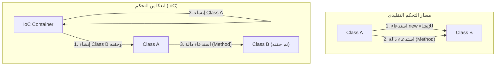

في عالم هندسة البرمجيات، مع نمو الأنظمة وزيادة تعقيدها، فإن أحد أكبر التحديات التي نواجهها هو "درجة الاقتران بين المكونات" (Coupling). الحالة التي يعتمد فيها صنف (class) بقوة على صنف آخر تجعل تغيير الشيفرة أمرًا صعبًا، وتصبح مرتعًا للأخطاء (bugs)، وتدفع عملية إجراء اختبارات الوحدة (unit tests) إلى حالة قريبة من الاستحالة.

في هذا المقال، سنغوص بعمق ونشرح بتفصيل شامل المفهوم الأساسي في التصميم الكائني التوجه وهو "انعكاس التحكم" (IoC: Inversion of Control)، والأسلوب القوي لتجسيده وهو "حقن التبعيات" (DI: Dependency Injection)، بدءًا من المفاهيم الأساسية وحتى إدارة دورة الحياة في أطر العمل المحددة (مثل Spring، Dagger، وغيرها).

## لماذا لا يجب عليك استخدام "new"؟

من الأنماط الشائعة التي يكتبها المطورون المبتدئون هي الاستنساخ المباشر للكائنات التابعة داخل الصنف باستخدام الكلمة المفتاحية `new`. قد يبدو الأمر بديهيًا وبسيطًا للوهلة الأولى، ولكن هذا هو العامل الأكبر الذي يسبب "الاقتران الوثيق" (Tight Coupling).

### أضرار التبعيات المشفرة (Hard-coded)

دعونا نفكر في الشيفرة التالية.

```java
public class OrderService {
    private PaymentProcessor paymentProcessor;
    private NotificationService notificationService;

    public OrderService() {
        // يتم تشفير التبعيات مباشرة (hard-coded)
        this.paymentProcessor = new StripePaymentProcessor();
        this.notificationService = new EmailNotificationService();
    }

    public void processOrder(Order order) {
        paymentProcessor.process(order.getAmount());
        notificationService.notifyUser(order.getUser());
    }
}
```

هذا التصميم يعاني من عدة مشاكل قاتلة.
أولاً، الصنف `OrderService` مقيد تمامًا بأصناف تنفيذية محددة وهي `StripePaymentProcessor` و `EmailNotificationService`. إذا أردنا في المستقبل إضافة PayPal كوسيلة دفع، أو تغيير وسيلة الإشعارات إلى رسائل نصية قصيرة (SMS)، فسنضطر إلى تعديل الشيفرة المصدرية للصنف `OrderService` مباشرةً. هذا ينتهك تمامًا "مبدأ الفتح والإغلاق" (OCP - Open-Closed Principle)، والذي ينص على أن البرمجيات يجب أن تكون مغلقة أمام التعديل، ولكن مفتوحة للتوسيع.

### صعوبة الاختبار (نقص القابلية للاختبار Testability)

ثانيًا، والمشكلة الأخطر، هي صعوبة الاختبار. إذا حاولنا إجراء اختبار وحدة (unit test) للصنف `OrderService`، فبما أنه تم استخدام `new` لإنشاء `StripePaymentProcessor` بداخله، فقد يتم إرسال طلب فعلي إلى واجهة برمجة تطبيقات الدفع (API) أثناء تنفيذ الاختبار.

حتى إذا أردنا إدخال كائنات وهمية (Mock) أو بدائل (Stub) لأغراض الاختبار، فلا يوجد مجال لحقن كائنات الاختبار من الخارج لأن الاستنساخ يتم مباشرة داخل المشيّد (constructor). هذا يعيق تقديم الاختبارات التلقائية، ويؤدي إلى ارتفاع تكاليف ضمان الجودة بشكل كبير.

## فلسفة انعكاس التحكم (IoC: Inversion of Control)

الفلسفة التصميمية لحل مشكلة الاقتران الوثيق هي "انعكاس التحكم" (IoC). IoC هو مفهوم يتم فيه تفويض (أو عكس) سلطة التحكم في المكونات (مثل إنشاء النُسخ وحل التبعيات) من المكون نفسه إلى إطار عمل (framework) أو حاوية (container) خارجية.

### مبدأ هوليوود (Hollywood Principle)

هناك مقولة شهيرة تعبر بشكل دقيق عن IoC وهي "مبدأ هوليوود".

> "Don't call us, we'll call you." (لا تتصل بنا، نحن سنتصل بك)

في تجارب الأداء في هوليوود، لا يقوم الممثلون بالاتصال بالمنتجين للاستفسار عن نجاحهم، بل يقوم المنتجون بالاتصال بالممثلين المطلوبين. الأمر نفسه ينطبق تمامًا على IoC في تصميم البرمجيات. فالصنف نفسه لا يقوم بالبحث عن المكونات التي يعتمد عليها للحصول عليها (الاتصال بها)، بل يتخذ موقفًا ينتظر فيه أن يوفر له النظام (إطار العمل أو الحاوية) المكونات التابعة المطلوبة من الخارج (يتم الاتصال به).



## حقن التبعيات (DI: Dependency Injection)

يعتبر IoC مبدأً تصميميًا مجردًا (Principle)، بينما النمط التطبيقي الملموس له (Pattern) هو "حقن التبعيات" (DI). في نمط DI، الصنف لا يُنشئ الكائنات التي يعتمد عليها بداخله، بل يتم "حقنها" (Inject) من الخارج عن طريق المعاملات (arguments) وما شابه.

ينقسم DI بشكل رئيسي إلى ثلاثة أساليب أو مناهج:

### 1. حقن المشيّد (Constructor Injection)

وهو الأسلوب الأكثر توصية، حيث يتم تمرير الكائنات التابعة عبر مشيّد الصنف.

```java
public class OrderService {
    private final PaymentProcessor paymentProcessor;
    private final NotificationService notificationService;

    // استقبال الواجهات من الخارج (يتم حقنها)
    public OrderService(PaymentProcessor paymentProcessor, 
                        NotificationService notificationService) {
        this.paymentProcessor = paymentProcessor;
        this.notificationService = notificationService;
    }
    // ...
}
```

**المزايا:**
- يضمن تلبية التبعيات المطلوبة (يتطلب دائمًا المعاملات عند الإنشاء).
- يمكن جعل الحقول `final` (غير قابلة للتغيير)، مما يجعلها آمنة للاستخدام في بيئة متعددة الخيوط (thread-safe) ويمنع تغيير الحالة غير المقصود.
- في مرحلة الاختبار، يكفي تمرير كائنات وهمية (mock) مباشرة إلى المشيّد، مما يجعل الاختبار سهلًا للغاية.

### 2. حقن المعيّن (Setter Injection)

يتم حقن الكائنات التابعة من خلال دوال التعيين (setter methods).

```java
public class OrderService {
    private PaymentProcessor paymentProcessor;

    public void setPaymentProcessor(PaymentProcessor paymentProcessor) {
        this.paymentProcessor = paymentProcessor;
    }
}
```

**المزايا والعيوب:**
- مفيد في حال كانت التبعيات اختيارية (optional)، أو عند الحاجة إلى تبديل الكائنات التابعة ديناميكيًا أثناء التشغيل.
- مع ذلك، لا يمكن جعل الحقول `final`، وهناك خطر من استدعاء الدوال قبل التهيئة، مما يؤدي إلى حدوث خطأ `NullPointerException`.

### 3. حقن الواجهة (Interface Injection)

هو أسلوب يتم فيه تعريف واجهة مخصصة للحقن، ويتم جعل الصنف الذي يستقبل التبعيات ينفذ (implement) هذه الواجهة. يميل هذا الأسلوب إلى أن يكون معقدًا، ونادرًا ما يُستخدم في التطوير الحديث.

## دور حاوية DI وإدارة دورة الحياة المتقدمة

في التطبيقات الصغيرة، يمكن للمطور أن يُنشئ الكائنات بنفسه داخل الدالة `main` ويقوم بربط التبعيات يدويًا (يُعرف هذا بـ Pure DI أو Poor Man's DI). لكن في الأنظمة الضخمة على مستوى المؤسسات، من المستحيل إدارة مخطط تبعيات (dependency graph) يضم آلاف الأصناف بشكل يدوي.

وهنا يأتي دور "حاوية DI" (أو حاوية IoC).

حاوية DI هي بنية تحتية تدير تلقائيًا "دورة الحياة الكاملة" لكائنات التطبيق (التي تُسمى أحيانًا Bean)، بدءًا من إنشائها، مرورًا بحل التبعيات، وحتى تدميرها.

### DI الديناميكي ودورة الحياة في إطار عمل Spring

إطار عمل Spring، الذي يُعد المعيار الفعلي (de facto standard) في بيئة Java، يمتلك حاوية DI قوية جدًا تعمل في وقت التشغيل (Runtime).

في Spring، عند تعريف البيانات الوصفية (metadata) باستخدام التعليقات التوضيحية (Annotations مثل `@Component`، `@Autowired`، `@Service`، وغيرها)، تقوم الحاوية بتحليل الأصناف عند تشغيل التطبيق باستخدام الانعكاس (Reflection)، وتقوم تلقائيًا بإنشاء النُسخ وحقنها.

```java
@Service
public class OrderService {
    private final PaymentProcessor paymentProcessor;

    @Autowired // منذ Spring 4.3، يمكن الاستغناء عنه إذا كان هناك مشيّد واحد فقط
    public OrderService(PaymentProcessor paymentProcessor) {
        this.paymentProcessor = paymentProcessor;
    }
}
```

**إدارة النطاق (Scope):**
تدير حاوية DI أيضًا عمر (نطاق) الكائنات.
- **Singleton (الافتراضي):** يتم إنشاء نسخة واحدة فقط داخل الحاوية، وتتم مشاركتها في كل الطلبات. هذا الخيار فعال من حيث استخدام الذاكرة.
- **Prototype:** يتم إنشاء نسخة جديدة في كل مرة يتم فيها الحقن. يُستخدم للكائنات التي تحتفظ بحالة (stateful).
- **Request / Session:** في تطبيقات الويب، يتم إنشاء وإدارة النُسخ على مستوى طلب HTTP أو الجلسة (Session).

### DI في وقت الترجمة באמצעות Dagger (كما في تطوير أندرويد وغيرها)

من ناحية أخرى، في بيئات مثل تطوير الأجهزة المحمولة (خاصة أندرويد)، لتجنب العبء في الأداء (performance overhead) الناتج عن الانعكاس أثناء بدء التشغيل، يتم اعتماد نهج توليد شيفرة التبعيات تلقائيًا في وقت الترجمة (Compile-time) بدلاً من وقت التشغيل. يُعد **Dagger** (بالإضافة إلى Hilt) الذي طورته Google من أبرز الأمثلة على ذلك.

يستخدم Dagger معالج التعليقات التوضيحية في Java (Annotation Processor) لتحليل مخطط التبعيات أثناء الترجمة، وإنشاء أصناف مصانع (factory classes) تعمل بنفس سرعة الـ Pure DI المكتوب يدويًا. هذا يجلب فائدة هائلة تتمثل في اكتشاف أخطاء وقت التشغيل (فشل حل التبعيات) في وقت مبكر كأخطاء في الترجمة (compile errors).

## التأثير على الهندسة المعمارية: المستقبل الذي يجلبه الاقتران الفضفاض

من خلال التطبيق الشامل لـ DI و IoC، يتجاوز الأمر مجرد كونه تقنية برمجة، بل يُحدث نقلة نوعية (paradigm shift) في الهندسة المعمارية بأكملها.

1. **تحقيق معمارية الإضافات (Plugin Architecture):**
   من خلال الاعتماد على الواجهات، يمكن فصل عمليات التنفيذ المحددة كوحدات مستقلة (modules). هذا يجعل الانتقال إلى بنية الخدمات المصغرة (Microservices) أو المعمارية السداسية (Hexagonal Architecture) سلسًا للغاية.
2. **تعزيز التكامل المستمر (CI) والتطوير الموجه بالاختبار (TDD):**
   عندما تصبح كل المكونات قابلة لاختبار الوحدة (unit testable)، يصبح بالإمكان إجراء عمليات إعادة الهيكلة (Refactoring) بوتيرة عالية وبأمان تام.
3. **تسريع التطوير المتوازي:**
   طالما تم الاتفاق على الواجهات (Interfaces)، يصبح من الممكن لفرق مختلفة تطوير منطق الواجهة الأمامية (Frontend) والتكامل مع قاعدة بيانات الواجهة الخلفية (Backend) بشكل مستقل تمامًا ومتوازي في نفس الوقت.

## الخلاصة

الاستخدام السهل والغير مدروس للكلمة المفتاحية "new" يربط الأصناف ببعضها بقوة، مما يخلق نظامًا صلبًا لا يتحمل التغييرات. من خلال تبني فلسفة "انعكاس التحكم (IoC)" وممارسة "حقن التبعيات (DI)"، يمكننا بناء برمجيات قوية، قابلة للاختبار، عالية المرونة، وسهلة الصيانة.

حاوية DI ليست سحرًا. إنها كخادم ممتاز يتولى عنك العمل المنزلي الشاق المتمثل في إنشاء الكائنات وتدميرها. في تصميم البرمجيات الحديث، يمكن القول إن فهم DI و IoC هو شرط أساسي لتصبح مهندسًا من الدرجة الأولى.
