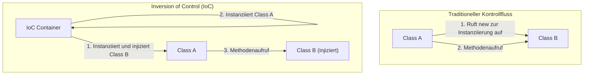

In der Welt des Software Engineerings ist eine der größten Herausforderungen, denen man begegnet, wenn Systeme wachsen und komplexer werden, der "Kopplungsgrad" (Coupling) zwischen Komponenten. Ein Zustand, in dem eine Klasse stark von einer anderen Klasse abhängt, macht Codeänderungen schwierig, wird zu einer Brutstätte für Fehler und treibt Unit-Tests in einen Zustand, in dem sie fast unmöglich durchzuführen sind.

In diesem Artikel werden wir "Inversion of Control" (IoC), ein Kernkonzept des objektorientierten Designs, und "Dependency Injection" (DI), eine leistungsstarke Methode zu dessen Umsetzung, gründlich untersuchen. Die Erklärung reicht von den grundlegenden Konzepten bis hin zur Lebenszyklusverwaltung in spezifischen Frameworks (wie Spring und Dagger).

## Warum darf man nicht „new“ verwenden?

Ein Code, den Entwicklungsanfänger oft schreiben, ist die direkte Instanziierung abhängiger Objekte innerhalb einer Klasse mithilfe des Schlüsselworts `new`. Auf den ersten Blick ist dies intuitiv und einfach, aber es ist die Hauptursache für "enge Kopplung" (Tight Coupling).

### Die Nachteile fest codierter Abhängigkeiten

Betrachten wir den folgenden Code:

```java
public class OrderService {
    private PaymentProcessor paymentProcessor;
    private NotificationService notificationService;

    public OrderService() {
        // Fest codierte Abhängigkeiten
        this.paymentProcessor = new StripePaymentProcessor();
        this.notificationService = new EmailNotificationService();
    }

    public void processOrder(Order order) {
        paymentProcessor.process(order.getAmount());
        notificationService.notifyUser(order.getUser());
    }
}
```

Es gibt einige fatale Probleme mit diesem Design.
Erstens ist `OrderService` vollständig an die spezifischen Implementierungsklassen `StripePaymentProcessor` und `EmailNotificationService` gebunden (Lock-in). Wenn Sie in Zukunft PayPal als Zahlungsmethode hinzufügen oder die Benachrichtigungsmethode auf SMS ändern möchten, müssen Sie den Quellcode von `OrderService` selbst direkt ändern. Dies verstößt vollständig gegen das "Open-Closed-Prinzip" (OCP), das besagt, dass Softwareentitäten für Erweiterungen offen, aber für Modifikationen geschlossen sein sollten.

### Schwierigkeiten beim Testen (Mangel an Testability)

Das zweite und gravierendste Problem ist die Schwierigkeit beim Testen. Wenn Sie versuchen, einen Unit-Test für `OrderService` durchzuführen, wird intern `StripePaymentProcessor` mit `new` instanziiert, wodurch die Möglichkeit besteht, dass während der Testausführung tatsächliche Anfragen an die Zahlungs-API gesendet werden.

Selbst wenn Sie Mocks oder Stubs für Testzwecke einfügen möchten, gibt es keinen Spielraum, Testobjekte von außen zu injizieren, da diese direkt im Konstruktor instanziiert werden. Dies verhindert die Einführung automatisierter Tests und lässt die Kosten für die Qualitätssicherung in die Höhe schnellen.

## Die Philosophie der Inversion of Control (IoC)

Die Designphilosophie zur Lösung des Problems der engen Kopplung ist die "Inversion of Control" (IoC). IoC ist das Konzept, die Kontrolle über Komponenten (wie die Instanziierung und die Auflösung von Abhängigkeiten) von der Komponente selbst an ein externes Framework oder einen Container zu delegieren (umzukehren).

### Das Hollywood-Prinzip

Ein berühmtes Sprichwort, das IoC auf den Punkt bringt, ist das "Hollywood-Prinzip".

> "Don't call us, we'll call you." (Rufen Sie uns nicht an, wir rufen Sie an.)

Bei Hollywood-Auditions fragt der Schauspieler den Produzenten nicht nach der Entscheidung, sondern der Produzent kontaktiert die benötigten Schauspieler. Dasselbe gilt für IoC im Softwaredesign. Die Klasse selbst sucht und holt (ruft) keine abhängigen Komponenten; stattdessen nimmt sie eine Haltung ein, bei der sie darauf wartet, dass das System (Framework oder Container) die benötigten Abhängigkeiten von außen bereitstellt (gerufen wird).



## Dependency Injection (DI)

Während IoC nur ein abstraktes Designprinzip (Principle) ist, ist "Dependency Injection" (DI) das spezifische Implementierungsmuster (Pattern), das es konkretisiert. Bei DI erstellt eine Klasse die Objekte, von denen sie abhängt, nicht intern, sondern lässt sie sich von außen über Parameter "injizieren" (Inject).

Es gibt drei wesentliche Ansätze für DI.

### 1. Constructor Injection (Konstruktor-Injektion)

Dies ist die am meisten empfohlene Methode, bei der die Abhängigkeitsobjekte über den Konstruktor der Klasse übergeben werden.

```java
public class OrderService {
    private final PaymentProcessor paymentProcessor;
    private final NotificationService notificationService;

    // Erhält Schnittstellen von außen (injiziert)
    public OrderService(PaymentProcessor paymentProcessor, 
                        NotificationService notificationService) {
        this.paymentProcessor = paymentProcessor;
        this.notificationService = notificationService;
    }
    // ...
}
```

**Vorteile:**
- Es ist garantiert, dass die erforderlichen Abhängigkeiten erfüllt sind (bei der Instanziierung sind zwingend Argumente erforderlich).
- Da Felder als `final` (unveränderlich) deklariert werden können, wird die Klasse threadsicher und unbeabsichtigte Zustandsänderungen werden verhindert.
- Das Testen wird extrem einfach, da man beim Testen Mock-Objekte direkt an den Konstruktor übergeben kann.

### 2. Setter Injection (Setter-Injektion)

Abhängigkeitsobjekte werden über Setter-Methoden injiziert.

```java
public class OrderService {
    private PaymentProcessor paymentProcessor;

    public void setPaymentProcessor(PaymentProcessor paymentProcessor) {
        this.paymentProcessor = paymentProcessor;
    }
}
```

**Vor- und Nachteile:**
- Nützlich, wenn Abhängigkeiten optional sind oder wenn Sie Abhängigkeitsobjekte zur Laufzeit dynamisch wechseln möchten.
- Die Felder können jedoch nicht `final` gemacht werden, und es besteht das Risiko, dass Methoden aufgerufen werden, wenn die Objekte noch uninitialisiert sind, was zu einer `NullPointerException` führt.

### 3. Interface Injection (Schnittstellen-Injektion)

Bei diesem Ansatz wird eine dedizierte Schnittstelle für die Injektion definiert, und die Klasse, die die Abhängigkeit erhält, implementiert diese Schnittstelle. Es neigt dazu, komplex zu sein, und wird in der modernen Entwicklung selten verwendet.

## Die Rolle von DI-Containern und erweitertes Lifecycle-Management

Bei kleinen Anwendungen ist es für den Entwickler möglich, Objekte in der `main`-Methode selbst zu instanziieren und Abhängigkeiten manuell aufzubauen (dies wird als Pure DI oder Poor Man's DI bezeichnet). In riesigen Systemen auf Enterprise-Ebene ist es jedoch unmöglich, einen Abhängigkeitsgraphen aus Tausenden von Klassen manuell zu verwalten.

Hier kommt der "DI-Container" (IoC-Container) ins Spiel.

Ein DI-Container ist eine Infrastruktur, die automatisch den "gesamten Lebenszyklus" von Objekten in der gesamten Anwendung (oft als Beans bezeichnet) verwaltet – von der Instanziierung über die Auflösung von Abhängigkeiten bis hin zur Zerstörung.

### Dynamische DI und Lebenszyklus im Spring Framework

Das Spring Framework, der De-facto-Standard im Java-Ökosystem, verfügt über einen extrem leistungsstarken Runtime-DI-Container.

Wenn in Spring Metadaten mit Annotationen (wie `@Component`, `@Autowired`, `@Service` usw.) definiert werden, analysiert der Container Klassen beim Start der Anwendung mithilfe von Reflection und führt automatisch die Instanziierung und Injektion durch.

```java
@Service
public class OrderService {
    private final PaymentProcessor paymentProcessor;

    @Autowired // Seit Spring 4.3 bei einem einzelnen Konstruktor optional
    public OrderService(PaymentProcessor paymentProcessor) {
        this.paymentProcessor = paymentProcessor;
    }
}
```

**Scope-Management:**
Der DI-Container verwaltet auch die Lebensdauer (Scope) von Objekten.
- **Singleton (Standard):** Im Container wird nur eine einzige Instanz erstellt und von allen Anfragen gemeinsam genutzt. Speicherplatzeffizient.
- **Prototype:** Bei jeder Injektion wird eine neue Instanz erstellt. Wird für zustandsbehaftete (stateful) Objekte verwendet.
- **Request / Session:** In Webanwendungen werden Instanzen pro HTTP-Request oder Sitzung (Session) erstellt und verwaltet.

### Compile-time DI mit Dagger (Android-Entwicklung etc.)

In Umgebungen wie der mobilen Entwicklung (insbesondere Android) wird ein Ansatz gewählt, bei dem Code für Abhängigkeiten nicht zur Laufzeit, sondern zur Kompilierzeit (Compile-time) automatisch generiert wird, um Performance-Overheads durch Reflection beim Start zu vermeiden. **Dagger** (und Hilt), entwickelt von Google, ist ein typisches Beispiel dafür.

Dagger verwendet den Java-Annotation-Prozessor und analysiert den Abhängigkeitsgraphen zur Kompilierzeit, um Fabrikklassen zu generieren, die so schnell arbeiten wie handgeschriebenes Pure DI. Dies bietet den immensen Vorteil, dass Laufzeitfehler (Fehler bei der Auflösung von Abhängigkeiten) frühzeitig als Kompilierungsfehler erkannt werden können.

## Auswirkungen auf die Architektur: Die Zukunft der losen Kopplung

Die konsequente Umsetzung von DI und IoC geht über reine Programmiertechniken hinaus und führt zu einem Paradigmenwechsel in der gesamten Architektur.

1. **Realisierung der Plugin-Architektur:**
   Durch die Abhängigkeit von Schnittstellen können konkrete Implementierungen als Module getrennt werden. Dies macht den Übergang zu einer Microservices-Architektur oder Hexagonal-Architektur sehr reibungslos.
2. **Förderung von Continuous Integration (CI) und Test-Driven Development (TDD):**
   Da alle Komponenten unit-testbar werden, können Refactorings in hoher Frequenz sicher durchgeführt werden.
3. **Beschleunigung der parallelen Entwicklung:**
   Sobald die Schnittstellen vereinbart sind, ist es möglich, dass verschiedene Teams beispielsweise die Frontend-Logik und die Backend-Datenbankintegration völlig unabhängig und parallel zueinander entwickeln.

## Zusammenfassung

Die unbedachte Verwendung des Schlüsselworts `new` bindet Klassen stark aneinander und führt zu starren Systemen, die anfällig für Änderungen sind. Indem wir die Philosophie der "Inversion of Control (IoC)" annehmen und "Dependency Injection (DI)" praktizieren, können wir testbare, hochflexible und wartbare, robuste Software erstellen.

Ein DI-Container ist keine Magie. Er ist ein äußerst fähiger Butler, der die mühsame Hausarbeit der Erstellung und Zerstörung von Objekten übernimmt. Im modernen Softwaredesign ist das Verständnis von DI und IoC eine absolute Voraussetzung, um ein erstklassiger Ingenieur zu werden.
