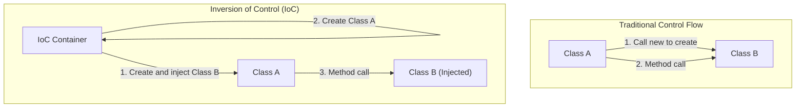

In the world of software engineering, one of the biggest challenges faced as systems grow and become more complex is the "Coupling" between components. A state where one class strongly depends on another makes code modification difficult, becomes a hotbed for bugs, and drives unit testing into a near-impossible state.

In this article, we will delve deeply into "Inversion of Control (IoC)", a core concept of object-oriented design, and "Dependency Injection (DI)", a powerful technique that embodies it. We will thoroughly explain everything from basic concepts to lifecycle management in specific frameworks (Spring, Dagger, etc.).

## Why you shouldn't use 'new'?

A technique often written by beginner developers is to directly instantiate dependent objects inside a class using the `new` keyword. At first glance, this is intuitive and simple, but it is the biggest factor that causes "Tight Coupling".

### The Detrimental Effects of Hard-Coded Dependencies

Consider the following code:

```java
public class OrderService {
    private PaymentProcessor paymentProcessor;
    private NotificationService notificationService;

    public OrderService() {
        // Hard-coding dependencies
        this.paymentProcessor = new StripePaymentProcessor();
        this.notificationService = new EmailNotificationService();
    }

    public void processOrder(Order order) {
        paymentProcessor.process(order.getAmount());
        notificationService.notifyUser(order.getUser());
    }
}
```

There are several fatal problems with this design.
First, `OrderService` is completely locked into the specific implementation classes `StripePaymentProcessor` and `EmailNotificationService`. If you want to add PayPal as a payment method in the future, or change the notification method to SMS, you must directly modify the source code of `OrderService` itself. This completely violates the "Open-Closed Principle (OCP)", which states that software entities should be open for extension, but closed for modification.

### Lack of Testability

Second, and the most serious problem, is the difficulty of testing. If you attempt to unit test `OrderService`, the actual payment API might be requested during test execution because `StripePaymentProcessor` is instantiated via `new` internally.

Even if you want to insert a Mock or Stub for testing, there is no room to inject a test object from the outside because it is instantiated directly within the constructor. This hinders the introduction of automated testing and causes quality assurance costs to skyrocket.

## The Philosophy of Inversion of Control (IoC)

The design philosophy to solve the problem of tight coupling is "Inversion of Control (IoC)". IoC is the concept of delegating (inverting) the control of components (such as instance creation and dependency resolution) from the component itself to an external framework or container.

### The Hollywood Principle

A famous maxim that perfectly expresses IoC is the "Hollywood Principle".

> "Don't call us, we'll call you."

In Hollywood auditions, actors do not contact producers to inquire about their success or failure; producers contact the necessary actors. IoC in software design is exactly the same. Instead of a class itself looking for and obtaining (calling) the components it depends on, it takes the stance of waiting for the system (framework or container) to provide (be called with) the necessary dependency components from the outside.



## Dependency Injection (DI)

IoC is purely an abstract design Principle, but the one that drops it into a specific implementation Pattern is "Dependency Injection (DI)". In DI, instead of generating the objects a class depends on internally, they are "Injected" from the outside through arguments, etc.

There are broadly 3 main approaches to DI.

### 1. Constructor Injection

The most recommended technique, passing dependent objects via the class constructor.

```java
public class OrderService {
    private final PaymentProcessor paymentProcessor;
    private final NotificationService notificationService;

    // Receive interfaces from the outside (Injected)
    public OrderService(PaymentProcessor paymentProcessor, 
                        NotificationService notificationService) {
        this.paymentProcessor = paymentProcessor;
        this.notificationService = notificationService;
    }
    // ...
}
```

**Merits:**
- Ensures that required dependencies are satisfied (arguments are always required during instantiation).
- Since fields can be made `final` (immutable), it becomes thread-safe and prevents unintended state changes.
- Tests become extremely easy, as you only need to pass mock objects directly into the constructor during testing.

### 2. Setter Injection

Injects dependent objects through setter methods.

```java
public class OrderService {
    private PaymentProcessor paymentProcessor;

    public void setPaymentProcessor(PaymentProcessor paymentProcessor) {
        this.paymentProcessor = paymentProcessor;
    }
}
```

**Merits and Demerits:**
- Effective when dependencies are optional or when you want to dynamically switch dependent objects at runtime.
- However, fields cannot be made `final`, and there is a risk of a `NullPointerException` occurring if methods are called while it remains uninitialized.

### 3. Interface Injection

A technique where a dedicated interface for injection is defined, and the class receiving the dependency is made to implement that interface. It tends to become complex and is rarely used in modern development.

## The Role of DI Containers and Advanced Lifecycle Management

If it's a small application, developers can instantiate objects themselves inside the `main` method and manually assemble dependencies (this is called Pure DI or Poor Man's DI). However, in a massive enterprise-grade system, it is impossible to manually manage the dependency graph of thousands of classes.

This is where "DI Containers (IoC Containers)" come in.

A DI container is an infrastructure that automatically manages the "entire lifecycle" of an application's objects (often called Beans), from creation and dependency resolution to destruction.

### Dynamic DI and Lifecycle in the Spring Framework

The Spring Framework, the de facto standard of the Java ecosystem, comes with a very powerful runtime DI container.

In Spring, by defining metadata using annotations (`@Component`, `@Autowired`, `@Service`, etc.), the container parses the classes using Reflection at application startup, automatically handling instantiation and injection.

```java
@Service
public class OrderService {
    private final PaymentProcessor paymentProcessor;

    @Autowired // Can be omitted for single constructors since Spring 4.3
    public OrderService(PaymentProcessor paymentProcessor) {
        this.paymentProcessor = paymentProcessor;
    }
}
```

**Scope Management:**
DI containers also manage the lifespan (scope) of objects.
- **Singleton (Default):** Only one instance is created within the container and shared across all requests. Good memory efficiency.
- **Prototype:** A new instance is created every time it is injected. Used for stateful objects.
- **Request / Session:** In Web applications, instances are created and managed per HTTP request or session.

### Compile-time DI with Dagger (Android Development, etc.)

On the other hand, in environments like mobile development (especially Android), to avoid the performance overhead caused by reflection at startup, an approach is taken where dependency code is automatically generated at Compile-time rather than runtime. **Dagger** (and Hilt) developed by Google is a prime example of this.

Dagger uses Java annotation processors to analyze the dependency graph at compile time, generating factory classes that run just as fast as hand-written Pure DI. This brings an immense advantage of early detection, turning runtime errors (dependency resolution failures) into compile-time errors.

## Impact on Architecture: The Future Brought by Loose Coupling

By thoroughly implementing DI and IoC, it goes beyond a mere coding technique, causing a paradigm shift in the entire architecture.

1. **Realization of Plugin Architecture:**
   By depending on interfaces, specific implementations can be separated as modules. This makes the transition to microservices architecture or hexagonal architecture extremely smooth.
2. **Promotion of Continuous Integration (CI) and Test-Driven Development (TDD):**
   By making all components unit-testable, high-frequency refactoring can be performed safely.
3. **Acceleration of Concurrent Development:**
   As long as interfaces are agreed upon, frontend logic and backend database integration, for instance, can be developed completely independently and concurrently by different teams.

## Conclusion

Carelessly using the `new` keyword strongly binds classes together and creates a rigid system that is vulnerable to change. By accepting the philosophy of "Inversion of Control (IoC)" and practicing "Dependency Injection (DI)", we can build robust software that is testable, highly flexible, and maintainable.

A DI container is not magic. It is an extremely capable butler that takes on the tedious chore of creating and destroying objects. In modern software design, understanding DI and IoC can be said to be an absolute requirement for becoming a first-class engineer.
