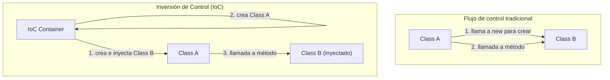

En el mundo de la ingeniería de software, uno de los mayores desafíos que enfrentamos a medida que los sistemas crecen y se vuelven más complejos es el "grado de acoplamiento (Coupling) entre componentes". Un estado en el que una clase depende fuertemente de otra hace que los cambios en el código sean difíciles, se convierte en un nido de errores y empuja la ejecución de pruebas unitarias a un estado casi imposible.

En este artículo, profundizaremos y explicaremos exhaustivamente la "Inversión de Control (IoC: Inversion of Control)", un concepto central en el diseño orientado a objetos, y la "Inyección de Dependencias (DI: Dependency Injection)", una técnica poderosa para materializarlo, desde los conceptos básicos hasta la gestión del ciclo de vida en frameworks específicos (Spring, Dagger, etc.).

## ¿Por qué no deberías hacer "new"?

Una práctica común entre los desarrolladores principiantes es crear una instancia de los objetos dependientes directamente dentro de una clase usando la palabra clave `new`. A primera vista, es intuitivo y simple, pero este es el factor principal que causa el "Alto Acoplamiento (Tight Coupling)".

### Los efectos perjudiciales de las dependencias codificadas (Hardcoded)

Consideremos el siguiente código.

```java
public class OrderService {
    private PaymentProcessor paymentProcessor;
    private NotificationService notificationService;

    public OrderService() {
        // Codificando las dependencias de forma rígida (hardcoding)
        this.paymentProcessor = new StripePaymentProcessor();
        this.notificationService = new EmailNotificationService();
    }

    public void processOrder(Order order) {
        paymentProcessor.process(order.getAmount());
        notificationService.notifyUser(order.getUser());
    }
}
```

Existen varios problemas fatales en este diseño.
Primero, `OrderService` está completamente bloqueado a las clases de implementación específicas `StripePaymentProcessor` y `EmailNotificationService`. Si en el futuro queremos agregar PayPal como método de pago, o cambiar el método de notificación a SMS, debemos cambiar directamente el código fuente de `OrderService`. Esto viola completamente el "Principio de Abierto/Cerrado (OCP)", que establece que el código debe estar abierto a la extensión pero cerrado a la modificación.

### Dificultad de prueba (Falta de Testability)

En segundo lugar, y el problema más grave, es la dificultad para realizar pruebas. Si intentamos realizar una prueba unitaria (unit test) de `OrderService`, dado que `StripePaymentProcessor` se ha instanciado con `new` internamente, es probable que se envíen solicitudes a la API de pagos real durante la ejecución de la prueba.

Incluso si deseamos insertar un Mock o Stub para la prueba, dado que se ha instanciado directamente en el constructor, no hay lugar para inyectar un objeto de prueba desde el exterior. Esto impide la introducción de pruebas automatizadas y dispara los costos de garantía de calidad.

## La filosofía de la Inversión de Control (IoC: Inversion of Control)

El principio de diseño para resolver el problema del alto acoplamiento es la "Inversión de Control (IoC)". IoC es el concepto de delegar (invertir) el poder de control de los componentes (como la creación de instancias o la resolución de dependencias) desde el componente mismo hacia un framework o contenedor externo.

### El Principio de Hollywood (Hollywood Principle)

Una frase famosa que expresa el IoC de forma concisa es el "Principio de Hollywood".

> "Don't call us, we'll call you." (No nos llames, nosotros te llamaremos)

En las audiciones de Hollywood, el actor no se pone en contacto con el productor para preguntar si pasó o no; el productor se comunica con los actores necesarios. El IoC en el diseño de software es exactamente igual. La clase misma no busca y obtiene (llama) a los componentes de los que depende, sino que adopta una postura de esperar a que el sistema (framework o contenedor) proporcione (le llame con) los componentes dependientes necesarios desde el exterior.



## Inyección de Dependencias (DI: Dependency Injection)

Mientras que IoC es puramente un principio de diseño abstracto (Principle), su traducción a un patrón de implementación concreto (Pattern) es la "Inyección de Dependencias (DI)". En DI, en lugar de que una clase genere los objetos de los que depende internamente, estos son "inyectados" desde el exterior, por ejemplo, a través de argumentos.

Existen 3 enfoques principales para DI.

### 1. Constructor Injection (Inyección por Constructor)

Es el enfoque más recomendado, donde el objeto dependiente se pasa a través del constructor de la clase.

```java
public class OrderService {
    private final PaymentProcessor paymentProcessor;
    private final NotificationService notificationService;

    // Recibe interfaces del exterior (son inyectadas)
    public OrderService(PaymentProcessor paymentProcessor, 
                        NotificationService notificationService) {
        this.paymentProcessor = paymentProcessor;
        this.notificationService = notificationService;
    }
    // ...
}
```

**Ventajas:**
- Se garantiza que las dependencias obligatorias se cumplan (siempre se requieren los argumentos en el momento de la instanciación).
- Al permitir que los campos sean `final` (inmutables), se vuelve thread-safe y previene cambios de estado no deseados.
- En las pruebas, basta con pasar directamente el objeto Mock al constructor, haciendo las pruebas extremadamente fáciles.

### 2. Setter Injection (Inyección por Setter)

Inyecta objetos dependientes a través de métodos setter.

```java
public class OrderService {
    private PaymentProcessor paymentProcessor;

    public void setPaymentProcessor(PaymentProcessor paymentProcessor) {
        this.paymentProcessor = paymentProcessor;
    }
}
```

**Ventajas y Desventajas:**
- Es útil cuando la dependencia es opcional, o cuando se desea cambiar dinámicamente el objeto dependiente en tiempo de ejecución.
- Sin embargo, los campos no pueden ser `final`, y existe el riesgo de que los métodos se llamen sin inicializar, generando un `NullPointerException`.

### 3. Interface Injection (Inyección por Interfaz)

Es una técnica donde se define una interfaz dedicada para realizar la inyección, y se hace que la clase que recibe la dependencia implemente dicha interfaz. Tiende a ser compleja y apenas se usa en el desarrollo moderno.

## El papel del contenedor DI y la gestión avanzada del ciclo de vida

Para aplicaciones pequeñas, es posible que los desarrolladores creen objetos por sí mismos dentro del método `main` y construyan manualmente el árbol de dependencias (esto se llama Pure DI o Poor Man's DI). Sin embargo, en sistemas gigantes de clase empresarial, es imposible gestionar manualmente el gráfico de dependencias de miles de clases.

Ahí es donde entra el "Contenedor DI (Contenedor IoC)".

Un contenedor DI es una infraestructura que gestiona automáticamente todo el "ciclo de vida" de los objetos de la aplicación (a menudo llamados Beans), desde la creación, pasando por la resolución de dependencias, hasta la destrucción.

### DI dinámico y ciclo de vida en Spring Framework

Spring Framework, el estándar de facto en el ecosistema de Java, cuenta con un contenedor DI en tiempo de ejecución (Runtime) extremadamente poderoso.

En Spring, cuando defines metadatos usando anotaciones (como `@Component`, `@Autowired`, `@Service`), el contenedor analiza las clases usando reflexión (Reflection) en el arranque de la aplicación y crea e inyecta instancias automáticamente.

```java
@Service
public class OrderService {
    private final PaymentProcessor paymentProcessor;

    @Autowired // En Spring 4.3 o posterior, es opcional si solo hay un constructor
    public OrderService(PaymentProcessor paymentProcessor) {
        this.paymentProcessor = paymentProcessor;
    }
}
```

**Gestión del Alcance (Scope):**
El contenedor DI también gestiona la vida útil (scope) de los objetos.
- **Singleton (predeterminado):** Se crea una única instancia en el contenedor, compartida en todas las solicitudes. Tiene buena eficiencia de memoria.
- **Prototype:** Se genera una nueva instancia cada vez que se inyecta. Se utiliza para objetos con estado (stateful).
- **Request / Session:** En aplicaciones web, genera y gestiona instancias por cada solicitud HTTP o sesión.

### DI en tiempo de compilación con Dagger (Desarrollo en Android, etc.)

Por otro lado, en entornos como el desarrollo móvil (especialmente Android), para evitar la sobrecarga de rendimiento debida a la reflexión en el momento del inicio, se adopta el enfoque de generar automáticamente código para las dependencias en tiempo de compilación (Compile-time) en lugar de en tiempo de ejecución. **Dagger** (y Hilt), desarrollado por Google, es el máximo representante de esto.

Dagger utiliza un procesador de anotaciones de Java, analiza el gráfico de dependencias en tiempo de compilación y genera clases de fábrica que funcionan tan rápido como un Pure DI escrito a mano. Esto proporciona la enorme ventaja de que los errores en tiempo de ejecución (fallas en la resolución de dependencias) se pueden detectar tempranamente como errores de compilación.

## Impacto en la arquitectura: El futuro que trae el bajo acoplamiento

Al ser minuciosos con la DI y el IoC, se trasciende los límites de una simple técnica de codificación, provocando un cambio de paradigma en toda la arquitectura.

1. **Realización de arquitectura de plugins:**
   Al depender de las interfaces, las implementaciones específicas se pueden desacoplar como módulos. Esto hace que la transición a una arquitectura de microservicios o arquitectura hexagonal sea muy suave.
2. **Promoción de Integración Continua (CI) y Desarrollo Guiado por Pruebas (TDD):**
   Dado que todos los componentes pueden someterse a pruebas unitarias, se pueden realizar refactorizaciones frecuentes de manera segura.
3. **Aceleración del desarrollo en paralelo:**
   Siempre y cuando se acuerde la interfaz, diferentes equipos pueden desarrollar la lógica del frontend y la integración de la base de datos del backend completamente independientes y en paralelo al mismo tiempo.

## Conclusión

El uso a la ligera de la palabra clave "new" une fuertemente a las clases, creando un sistema rígido y vulnerable a los cambios. Al aceptar la filosofía de "Inversión de Control (IoC)" y practicar la "Inyección de Dependencias (DI)", podemos construir software robusto, altamente testeable, flexible y fácil de mantener.

Los contenedores DI no son magia. Son mayordomos extremadamente competentes que se encargan de las tediosas tareas domésticas de crear y destruir objetos. En el diseño de software moderno, entender DI e IoC es un requisito indispensable para convertirse en un ingeniero de primer nivel.
