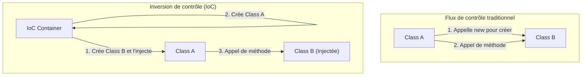

Dans le monde de l'ingénierie logicielle, l'un des plus grands défis rencontrés à mesure qu'un système se développe et se complexifie est le "degré de couplage (Coupling) entre les composants". L'état dans lequel une classe dépend fortement d'une autre rend la modification du code difficile, devient un nid à bugs, et pousse la réalisation de tests unitaires vers un état de quasi-impossibilité.

Dans cet article, nous explorerons en profondeur l'« inversion de contrôle (IoC : Inversion of Control) », un concept au cœur de la conception orientée objet, et l'« injection de dépendances (DI : Dependency Injection) », une méthode puissante pour la concrétiser, allant des concepts de base jusqu'à la gestion du cycle de vie dans des frameworks spécifiques (Spring, Dagger, etc.).

## Pourquoi ne faut-il pas utiliser "new" ?

L'une des pratiques courantes chez les développeurs débutants consiste à instancier directement les objets dépendants à l'intérieur d'une classe à l'aide du mot-clé `new`. Bien que cela puisse paraître intuitif et simple à première vue, c'est le principal facteur qui provoque un "couplage fort (Tight Coupling)".

### Les effets néfastes des dépendances codées en dur

Considérons le code suivant.

```java
public class OrderService {
    private PaymentProcessor paymentProcessor;
    private NotificationService notificationService;

    public OrderService() {
        // Dépendances codées en dur
        this.paymentProcessor = new StripePaymentProcessor();
        this.notificationService = new EmailNotificationService();
    }

    public void processOrder(Order order) {
        paymentProcessor.process(order.getAmount());
        notificationService.notifyUser(order.getUser());
    }
}
```

Cette conception présente plusieurs problèmes critiques.
Premièrement, `OrderService` est complètement verrouillé sur les classes d'implémentation concrètes `StripePaymentProcessor` et `EmailNotificationService`. Si à l'avenir vous souhaitez ajouter PayPal comme moyen de paiement ou changer le moyen de notification par SMS, vous devrez modifier directement le code source de `OrderService` lui-même. Cela viole totalement le "principe ouvert/fermé (OCP)", selon lequel les entités doivent être ouvertes à l'extension mais fermées à la modification.

### Difficulté de test (Absence de Testability)

Deuxièmement, et c'est le problème le plus grave, réside dans la difficulté à effectuer des tests. Si vous essayez de réaliser un test unitaire (unit test) pour `OrderService`, étant donné que `StripePaymentProcessor` est instancié avec `new` en interne, il est possible qu'une requête soit envoyée à l'API de paiement réelle lors de l'exécution du test.

Même si vous souhaitez insérer un mock (Mock) ou un stub (Stub) pour les tests, l'instanciation directe dans le constructeur ne laisse aucune place pour injecter un objet de test depuis l'extérieur. Cela entrave l'introduction de tests automatisés et fait grimper en flèche les coûts d'assurance qualité.

## La philosophie de l'inversion de contrôle (IoC : Inversion of Control)

La philosophie de conception permettant de résoudre le problème du couplage fort est l'"inversion de contrôle (IoC)". L'IoC est le concept de délégation (inversion) du droit de contrôle d'un composant (comme la création d'instances ou la résolution de dépendances) du composant lui-même vers un framework ou un conteneur externe.

### Le principe d'Hollywood (Hollywood Principle)

Un dicton célèbre qui exprime succinctement l'IoC est le "principe d'Hollywood".

> "Don't call us, we'll call you." (Ne nous appelez pas, nous vous appellerons)

Lors des auditions à Hollywood, ce ne sont pas les acteurs qui contactent les producteurs pour connaître le résultat, mais les producteurs qui contactent les acteurs nécessaires. L'IoC dans la conception logicielle fonctionne exactement de la même manière. La classe ne cherche et ne récupère (appelle) pas les composants dont elle dépend, mais elle adopte l'attitude d'attendre que le système (framework ou conteneur) lui fournisse (l'appelle avec) les composants dépendants nécessaires de l'extérieur.



## L'injection de dépendances (DI : Dependency Injection)

L'IoC n'est qu'un principe de conception abstrait (Principle), mais sa déclinaison en un motif d'implémentation concret (Pattern) est l'"injection de dépendances (DI)". Dans la DI, une classe ne crée pas en interne les objets dont elle dépend, mais se les fait "injecter (Inject)" de l'extérieur, par le biais d'arguments, par exemple.

Il existe principalement 3 grandes approches de la DI.

### 1. Constructor Injection (Injection par constructeur)

C'est la méthode la plus recommandée. Les objets dépendants sont passés via le constructeur de la classe.

```java
public class OrderService {
    private final PaymentProcessor paymentProcessor;
    private final NotificationService notificationService;

    // Reçoit des interfaces de l'extérieur (elles sont injectées)
    public OrderService(PaymentProcessor paymentProcessor, 
                        NotificationService notificationService) {
        this.paymentProcessor = paymentProcessor;
        this.notificationService = notificationService;
    }
    // ...
}
```

**Avantages :**
- Elle garantit que les dépendances obligatoires sont satisfaites (des arguments sont toujours requis lors de l'instanciation).
- Comme les champs peuvent être déclarés `final` (immuables), elle devient thread-safe et empêche toute modification d'état non intentionnelle.
- Lors des tests, il suffit de passer un objet mock directement au constructeur, ce qui rend les tests extrêmement faciles.

### 2. Setter Injection (Injection par mutateur)

Les objets dépendants sont injectés via des méthodes setter.

```java
public class OrderService {
    private PaymentProcessor paymentProcessor;

    public void setPaymentProcessor(PaymentProcessor paymentProcessor) {
        this.paymentProcessor = paymentProcessor;
    }
}
```

**Avantages et Inconvénients :**
- C'est efficace lorsque la dépendance est optionnelle (facultative) ou lorsque vous souhaitez changer dynamiquement l'objet dépendant à l'exécution.
- Cependant, les champs ne peuvent pas être `final`, et il y a un risque de lever une `NullPointerException` si la méthode est appelée alors qu'ils ne sont pas initialisés.

### 3. Interface Injection (Injection par interface)

C'est une méthode où l'on définit une interface dédiée à l'injection, et on fait implémenter cette interface à la classe recevant la dépendance. Elle a tendance à devenir complexe et est rarement utilisée dans le développement moderne.

## Le rôle du conteneur DI et la gestion avancée du cycle de vie

Pour une petite application, il est possible pour le développeur de créer lui-même les objets dans la méthode `main` et de construire manuellement les relations de dépendance (cela s'appelle la Pure DI ou la Poor Man's DI). Cependant, dans un système massif de classe entreprise, il est impossible de gérer manuellement le graphe de dépendance de milliers de classes.

C'est là qu'intervient le "conteneur DI (conteneur IoC)".

Le conteneur DI est une infrastructure qui gère automatiquement "l'ensemble du cycle de vie" des objets (souvent appelés Beans) de toute l'application : de leur création à leur destruction, en passant par la résolution de leurs dépendances.

### DI dynamique et cycle de vie dans Spring Framework

Le Spring Framework, qui est le standard de facto de l'écosystème Java, dispose d'un conteneur DI à l'exécution (Runtime) extrêmement puissant.

Dans Spring, en utilisant des annotations (`@Component`, `@Autowired`, `@Service`, etc.) pour définir des métadonnées, le conteneur analyse les classes en utilisant la réflexion (Reflection) au démarrage de l'application, et effectue automatiquement la création des instances et l'injection.

```java
@Service
public class OrderService {
    private final PaymentProcessor paymentProcessor;

    @Autowired // Depuis Spring 4.3, peut être omis s'il y a un seul constructeur
    public OrderService(PaymentProcessor paymentProcessor) {
        this.paymentProcessor = paymentProcessor;
    }
}
```

**Gestion de la portée (Scope) :**
Le conteneur DI gère également la durée de vie (la portée) des objets.
- **Singleton (par défaut) :** Une seule et unique instance est créée dans le conteneur et partagée par toutes les requêtes. Efficace en mémoire.
- **Prototype :** Une nouvelle instance est créée à chaque fois qu'elle est injectée. Utilisé pour les objets stateful.
- **Request / Session :** Dans les applications Web, les instances sont créées et gérées par requête HTTP ou par session.

### DI à la compilation avec Dagger (Développement Android, etc.)

D'autre part, dans des environnements comme le développement mobile (notamment Android), pour éviter les problèmes de performances (overhead) dus à la réflexion au démarrage, on adopte une approche où le code de dépendance est généré automatiquement à la compilation (Compile-time) plutôt qu'à l'exécution. **Dagger** (et Hilt) développé par Google en est le représentant.

Dagger utilise le processeur d'annotations de Java, analyse le graphe de dépendance à la compilation et génère des classes de fabrique qui fonctionnent aussi rapidement qu'une Pure DI écrite à la main. Cela apporte l'immense avantage de pouvoir détecter de manière précoce les erreurs d'exécution (échecs de résolution de dépendances) sous forme d'erreurs de compilation.

## L'impact sur l'architecture : L'avenir du couplage lâche

En appliquant rigoureusement la DI et l'IoC, cela dépasse le cadre d'une simple technique de codage et provoque un changement de paradigme dans toute l'architecture.

1. **Réalisation d'une architecture de plugins :**
   En dépendant d'interfaces, les implémentations concrètes peuvent être séparées sous forme de modules. Cela rend la transition vers une architecture de microservices ou une architecture hexagonale très fluide.
2. **Promotion de l'intégration continue (CI) et du développement piloté par les tests (TDD) :**
   Le fait que tous les composants soient testables unitairement permet d'effectuer des refactorisations fréquentes en toute sécurité.
3. **Accélération du développement parallèle :**
   Tant que l'interface est convenue, il devient possible pour différentes équipes de développer en parallèle et de manière totalement indépendante la logique front-end et l'intégration de la base de données back-end, par exemple.

## Résumé

L'utilisation inconsidérée du mot-clé "new" lie fortement les classes entre elles et engendre un système rigide, vulnérable aux changements. En acceptant la philosophie de l'"inversion de contrôle (IoC)" et en pratiquant l'"injection de dépendances (DI)", nous pouvons construire des logiciels testables, extrêmement flexibles, hautement maintenables et robustes.

Le conteneur DI n'est pas magique. C'est un majordome extrêmement compétent qui prend en charge la tâche fastidieuse de création et de destruction des objets. Dans la conception logicielle moderne, la compréhension de la DI et de l'IoC peut être considérée comme une condition requise pour devenir un ingénieur de premier ordre.
