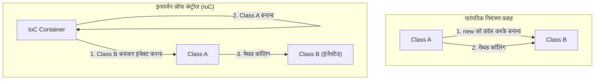

सॉफ्टवेयर इंजीनियरिंग की दुनिया में, जैसे-जैसे सिस्टम बढ़ते और जटिल होते जाते हैं, सबसे बड़ी चुनौतियों में से एक जिसका हमें सामना करना पड़ता है वह है "कम्पोनेंट्स के बीच कपलिंग" (Coupling between components)। जब एक क्लास दूसरी क्लास पर अत्यधिक निर्भर होती है, तो कोड को बदलना मुश्किल हो जाता है, यह बग्स (bugs) का केंद्र बन जाता है, और यूनिट टेस्टिंग (unit testing) को लगभग असंभव बना देता है।

इस लेख में, हम "इनवर्जन ऑफ कंट्रोल" (IoC: Inversion of Control) की अवधारणा, जो ऑब्जेक्ट-ओरिएंटेड डिज़ाइन (Object-Oriented Design) का मूल है, और "डिपेंडेंसी इंजेक्शन" (DI: Dependency Injection), जो इसे लागू करने की एक शक्तिशाली तकनीक है, पर गहराई से चर्चा करेंगे। हम बुनियादी अवधारणाओं से लेकर विशिष्ट फ्रेमवर्क (जैसे Spring, Dagger आदि) में जीवनचक्र (lifecycle) प्रबंधन तक सब कुछ कवर करेंगे।

## हमें 'new' का उपयोग क्यों नहीं करना चाहिए?

शुरुआती डेवलपर्स द्वारा अक्सर लिखे जाने वाले कोड में, क्लास के अंदर निर्भर ऑब्जेक्ट्स को सीधे `new` कीवर्ड का उपयोग करके इंस्टेंशिएट (instantiate) किया जाता है। पहली नज़र में यह सहज और सरल लगता है, लेकिन यही "टाइट कपलिंग" (Tight Coupling) का सबसे बड़ा कारण है।

### हार्डकोडेड डिपेंडेंसी के नुकसान

आइए निम्नलिखित कोड पर विचार करें:

```java
public class OrderService {
    private PaymentProcessor paymentProcessor;
    private NotificationService notificationService;

    public OrderService() {
        // डिपेंडेंसी को हार्डकोड करना
        this.paymentProcessor = new StripePaymentProcessor();
        this.notificationService = new EmailNotificationService();
    }

    public void processOrder(Order order) {
        paymentProcessor.process(order.getAmount());
        notificationService.notifyUser(order.getUser());
    }
}
```

इस डिज़ाइन में कई गंभीर समस्याएं हैं।
सबसे पहले, `OrderService` पूरी तरह से `StripePaymentProcessor` और `EmailNotificationService` जैसी विशिष्ट इम्प्लीमेंटेशन क्लास से लॉक-इन (lock-in) है। यदि भविष्य में, हम पेमेंट मेथड के रूप में PayPal जोड़ना चाहते हैं, या नोटिफिकेशन मेथड को SMS में बदलना चाहते हैं, तो हमें `OrderService` के सोर्स कोड को ही सीधे संशोधित करना होगा। यह "ओपन-क्लोज्ड प्रिंसिपल" (OCP: Open-Closed Principle) का पूरी तरह से उल्लंघन करता है, जो बताता है कि सॉफ्टवेयर एन्टिटीज़ (entities) विस्तार (extension) के लिए खुली होनी चाहिए, लेकिन संशोधन (modification) के लिए बंद होनी चाहिए।

### टेस्ट करने में कठिनाई (Lack of Testability)

दूसरी, और सबसे गंभीर समस्या परीक्षण (testing) की कठिनाई है। यदि आप `OrderService` का यूनिट टेस्ट करने का प्रयास करते हैं, तो चूंकि `StripePaymentProcessor` आंतरिक रूप से `new` के साथ बनाया गया है, इसलिए परीक्षण निष्पादन के दौरान वास्तविक पेमेंट API को रिक्वेस्ट भेजी जा सकती है।

भले ही आप परीक्षण के लिए मॉक (Mock) या स्टब (Stub) डालना चाहें, आप बाहरी रूप से टेस्ट ऑब्जेक्ट्स इंजेक्ट नहीं कर सकते क्योंकि उन्हें सीधे कंस्ट्रक्टर के भीतर इंस्टेंशिएट किया गया है। यह ऑटोमेटेड टेस्टिंग को रोकता है और क्वालिटी एश्योरेंस (Quality Assurance) की लागत को बहुत बढ़ा देता है।

## इनवर्जन ऑफ कंट्रोल (IoC) का दर्शन

टाइट कपलिंग की समस्या को हल करने वाली डिज़ाइन फिलॉसफी को "इनवर्जन ऑफ कंट्रोल" (IoC) कहा जाता है। IoC एक ऐसी अवधारणा है जिसमें कम्पोनेंट का नियंत्रण (जैसे ऑब्जेक्ट्स बनाना और डिपेंडेंसी को हल करना) कम्पोनेंट से बाहरी फ्रेमवर्क या कंटेनर को सौंप (या उलट) दिया जाता है।

### हॉलीवुड सिद्धांत (Hollywood Principle)

IoC को संक्षेप में व्यक्त करने वाला एक प्रसिद्ध मुहावरा "हॉलीवुड सिद्धांत" है।

> "Don't call us, we'll call you." (हमें कॉल न करें, हम आपको कॉल करेंगे)

हॉलीवुड ऑडिशन में, अभिनेता निर्माताओं (producers) से परिणाम के बारे में पूछताछ नहीं करते हैं; इसके बजाय, निर्माता आवश्यक अभिनेताओं से संपर्क करते हैं। सॉफ्टवेयर डिज़ाइन में IoC बिल्कुल वैसा ही है। क्लास खुद उन कम्पोनेंट्स को नहीं खोजती और प्राप्त नहीं करती (कॉल नहीं करती) जिन पर वह निर्भर है, बल्कि वह सिस्टम (फ्रेमवर्क या कंटेनर) की प्रतीक्षा करती है कि वह बाहरी रूप से आवश्यक डिपेंडेंसी प्रदान करे (कॉल की जाए)।



## डिपेंडेंसी इंजेक्शन (DI: Dependency Injection)

जबकि IoC केवल एक अमूर्त डिज़ाइन सिद्धांत (Principle) है, "डिपेंडेंसी इंजेक्शन" (DI) इसका एक ठोस कार्यान्वयन पैटर्न (Pattern) है। DI में, एक क्लास अपने भीतर उन ऑब्जेक्ट्स को नहीं बनाती है जिन पर वह निर्भर करती है, बल्कि उन्हें तर्कों (arguments) आदि के माध्यम से बाहरी रूप से "इंजेक्ट" (Inject) किया जाता है।

DI के तीन मुख्य दृष्टिकोण हैं:

### 1. Constructor Injection (कंस्ट्रक्टर इंजेक्शन)

यह सबसे अनुशंसित तरीका है, जहाँ निर्भर ऑब्जेक्ट्स क्लास के कंस्ट्रक्टर के माध्यम से पास किए जाते हैं।

```java
public class OrderService {
    private final PaymentProcessor paymentProcessor;
    private final NotificationService notificationService;

    // बाहरी रूप से इंटरफेस प्राप्त करना (इंजेक्ट किया जाना)
    public OrderService(PaymentProcessor paymentProcessor, 
                        NotificationService notificationService) {
        this.paymentProcessor = paymentProcessor;
        this.notificationService = notificationService;
    }
    // ...
}
```

**फायदे:**
- यह गारंटी देता है कि आवश्यक डिपेंडेंसी पूरी हो गई है (इंस्टेंशिएट करते समय तर्कों की हमेशा आवश्यकता होती है)।
- फील्ड्स को `final` (अपरिवर्तनीय) बनाया जा सकता है, जो थ्रेड-सेफ (thread-safe) बनाता है और अनपेक्षित स्थिति परिवर्तनों को रोकता है।
- परीक्षण करते समय, आपको बस सीधे कंस्ट्रक्टर में मॉक ऑब्जेक्ट पास करने की आवश्यकता होती है, जिससे परीक्षण बहुत आसान हो जाता है।

### 2. Setter Injection (सेटर इंजेक्शन)

सेटर मेथड्स के माध्यम से निर्भर ऑब्जेक्ट्स को इंजेक्ट किया जाता है।

```java
public class OrderService {
    private PaymentProcessor paymentProcessor;

    public void setPaymentProcessor(PaymentProcessor paymentProcessor) {
        this.paymentProcessor = paymentProcessor;
    }
}
```

**फायदे और नुकसान:**
- यह तब उपयोगी होता है जब डिपेंडेंसी वैकल्पिक (optional) हो या जब आप रनटाइम पर डिपेंडेंसी ऑब्जेक्ट को गतिशील (dynamically) रूप से स्विच करना चाहते हों।
- हालाँकि, आप फील्ड को `final` नहीं बना सकते हैं, और यदि मेथड को बिना इनिशियलाइज़ेशन (initialization) के कॉल किया जाता है तो `NullPointerException` होने का जोखिम होता है।

### 3. Interface Injection (इंटरफ़ेस इंजेक्शन)

इसमें इंजेक्शन करने के लिए एक समर्पित इंटरफ़ेस परिभाषित किया जाता है, और जिस क्लास को डिपेंडेंसी प्राप्त करनी होती है उसे उस इंटरफ़ेस को लागू करना होता है। यह जटिल हो जाता है और आधुनिक विकास में इसका शायद ही कभी उपयोग किया जाता है।

## DI कंटेनर की भूमिका और उन्नत जीवनचक्र प्रबंधन

छोटे एप्लिकेशन के लिए, डेवलपर्स स्वयं `main` मेथड के भीतर ऑब्जेक्ट बना सकते हैं और मैन्युअल रूप से डिपेंडेंसी असेंबल कर सकते हैं (इसे Pure DI या Poor Man's DI कहा जाता है)। हालाँकि, बड़े एंटरप्राइज़-स्तरीय सिस्टम में, हजारों क्लास के डिपेंडेंसी ग्राफ को मैन्युअल रूप से प्रबंधित करना असंभव है।

यहीं पर "DI कंटेनर (IoC कंटेनर)" काम आता है।

DI कंटेनर एक इन्फ्रास्ट्रक्चर है जो पूरे एप्लिकेशन ऑब्जेक्ट्स (जिन्हें Bean आदि कहा जाता है) के निर्माण, डिपेंडेंसी रिज़ॉल्यूशन और विनाश (destruction) तक के पूरे "जीवनचक्र" (lifecycle) को स्वचालित रूप से प्रबंधित करता है।

### Spring Framework में डायनामिक DI और जीवनचक्र

Java इकोसिस्टम में डी-फैक्टो स्टैंडर्ड, Spring Framework, एक बहुत शक्तिशाली रनटाइम (Runtime) DI कंटेनर प्रदान करता है।

Spring में, যখন आप एनोटेशन (`@Component`, `@Autowired`, `@Service`, आदि) का उपयोग करके मेटाडेटा परिभाषित करते हैं, तो कंटेनर एप्लिकेशन के स्टार्टअप के दौरान रिफ्लेक्शन (Reflection) का उपयोग करके क्लास का विश्लेषण करता है, और स्वचालित रूप से इंस्टेंस बनाता है और इंजेक्ट करता है।

```java
@Service
public class OrderService {
    private final PaymentProcessor paymentProcessor;

    @Autowired // Spring 4.3 के बाद से, यदि केवल एक कंस्ट्रक्टर है तो इसे छोड़ा जा सकता है
    public OrderService(PaymentProcessor paymentProcessor) {
        this.paymentProcessor = paymentProcessor;
    }
}
```

**स्कोप प्रबंधन:**
DI कंटेनर ऑब्जेक्ट्स के जीवनकाल (Scope) को भी प्रबंधित करता है।
- **Singleton (डिफ़ॉल्ट):** कंटेनर में केवल एक इंस्टेंस बनाया जाता है और इसे सभी रिक्वेस्ट्स के बीच साझा किया जाता है। यह मेमोरी-कुशल है।
- **Prototype:** हर बार इंजेक्ट किए जाने पर एक नया इंस्टेंस उत्पन्न होता है। स्टेटफुल (stateful) ऑब्जेक्ट्स के लिए उपयोग किया जाता है。
- **Request / Session:** वेब एप्लिकेशन में, HTTP रिक्वेस्ट या सेशन के आधार पर इंस्टेंस बनाए और प्रबंधित किए जाते हैं।

### Dagger के साथ कंपाइल-टाइम DI (Android डेवलपमेंट आदि)

दूसरी ओर, मोबाइल डेवलपमेंट (विशेष रूप से Android) जैसे वातावरण में, स्टार्टअप पर रिफ्लेक्शन के कारण प्रदर्शन ओवरहेड से बचने के लिए, रनटाइम के बजाय कंपाइल-टाइम (Compile-time) पर स्वचालित रूप से डिपेंडेंसी कोड उत्पन्न करने का दृष्टिकोण अपनाया जाता है। Google द्वारा विकसित **Dagger** (और Hilt) इसके प्रमुख उदाहरण हैं।

Dagger Java एनोटेशन प्रोसेसर का उपयोग करता है, कंपाइल-टाइम पर डिपेंडेंसी ग्राफ का विश्लेषण करता है, और फैक्ट्री क्लास उत्पन्न करता है जो हाथ से लिखे Pure DI जितनी तेजी से काम करते हैं। इसका एक बहुत बड़ा लाभ यह है कि रनटाइम त्रुटियों (डिपेंडेंसी रिज़ॉल्यूशन विफलताओं) का कंपाइल त्रुटियों के रूप में जल्दी पता लगाया जा सकता है।

## आर्किटेक्चर पर प्रभाव: लूज कपलिंग का भविष्य

DI और IoC को पूरी तरह से लागू करने से, यह सिर्फ एक कोडिंग तकनीक की सीमाओं को पार कर जाता है, और पूरे आर्किटेक्चर में एक पैराडाइम शिफ्ट (paradigm shift) का कारण बनता है।

1. **प्लगइन आर्किटेक्चर को साकार करना:**
   इंटरफेस पर निर्भर होने से, विशिष्ट कार्यान्वयन (implementations) को मॉड्यूल के रूप में अलग किया जा सकता है। यह माइक्रो-सर्विसेज आर्किटेक्चर (Microservices Architecture) या हेक्सागोनल आर्किटेक्चर (Hexagonal Architecture) में माइग्रेशन को बहुत आसान बनाता है।
2. **सतत एकीकरण (CI) और टेस्ट-ड्रिवन डेवलपमेंट (TDD) को बढ़ावा देना:**
   चूंकि सभी कम्पोनेंट्स का यूनिट टेस्ट किया जा सकता है, इसलिए उच्च आवृत्ति वाला रिफैक्टरिंग (refactoring) सुरक्षित रूप से किया जा सकता है।
3. **समानांतर विकास (Parallel Development) में तेजी लाना:**
   जब तक इंटरफेस पर सहमति होती है, तब तक अलग-अलग टीमें फ्रंटएंड लॉजिक और बैकएंड डेटाबेस इंटीग्रेशन जैसे कार्यों को पूरी तरह से स्वतंत्र रूप से और एक ही समय में विकसित कर सकती हैं।

## निष्कर्ष

`new` कीवर्ड का लापरवाही से उपयोग करने से क्लास एक-दूसरे से मजबूती से जुड़ जाती हैं, जिससे एक कठोर (rigid) सिस्टम बनता है जो बदलाव के प्रति संवेदनशील होता है। "इनवर्जन ऑफ कंट्रोल (IoC)" के दर्शन को अपनाकर और "डिपेंडेंसी इंजेक्शन (DI)" का अभ्यास करके, हम एक मजबूत, परीक्षण योग्य, लचीला और उच्च-रखरखाव वाला (maintainable) सॉफ्टवेयर बना सकते हैं।

DI कंटेनर कोई जादू नहीं हैं। वे एक उत्कृष्ट बटलर (butler) की तरह हैं जो ऑब्जेक्ट्स को बनाने और नष्ट करने का कठिन कार्य करते हैं। आधुनिक सॉफ्टवेयर डिज़ाइन में, प्रथम श्रेणी (top-tier) का इंजीनियर बनने के लिए DI और IoC को समझना एक आवश्यक शर्त है।
