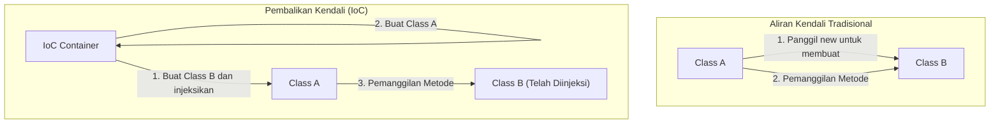

Di dunia rekayasa perangkat lunak, salah satu tantangan terbesar yang dihadapi saat sistem berkembang dan menjadi semakin kompleks adalah "tingkat keterikatan antar komponen (Coupling)". Keadaan di mana sebuah kelas sangat bergantung pada kelas lain membuat kode sulit diubah, menjadi sarang *bug*, dan membuat pelaksanaan pengujian unit (unit test) hampir mustahil dilakukan.

Dalam artikel ini, kita akan membahas secara mendalam konsep utama desain berorientasi objek, yaitu "Pembalikan Kendali (IoC: Inversion of Control)" dan "Injeksi Dependensi (DI: Dependency Injection)", yang merupakan metode kuat untuk mewujudkannya. Pembahasan akan mencakup konsep dasar hingga manajemen siklus hidup dalam kerangka kerja (framework) spesifik seperti Spring dan Dagger.

## Mengapa kita tidak boleh melakukan 'new'?

Sebuah pola pengkodean yang sering ditulis oleh pengembang pemula adalah menginstansiasi objek yang menjadi dependensi secara langsung di dalam kelas menggunakan kata kunci `new`. Sekilas pendekatan ini terlihat intuitif dan sederhana, tetapi ini adalah penyebab terbesar dari "Keterikatan Erat (Tight Coupling)".

### Dampak Buruk Dependensi yang Di-hardcode

Mari kita pertimbangkan kode berikut.

```java
public class OrderService {
    private PaymentProcessor paymentProcessor;
    private NotificationService notificationService;

    public OrderService() {
        // Dependensi di-hardcode
        this.paymentProcessor = new StripePaymentProcessor();
        this.notificationService = new EmailNotificationService();
    }

    public void processOrder(Order order) {
        paymentProcessor.process(order.getAmount());
        notificationService.notifyUser(order.getUser());
    }
}
```

Terdapat beberapa masalah fatal dalam desain ini.
Pertama, `OrderService` sepenuhnya terkunci (lock-in) pada kelas implementasi spesifik, yaitu `StripePaymentProcessor` dan `EmailNotificationService`. Jika di masa depan kita ingin menambahkan PayPal sebagai metode pembayaran atau mengubah metode notifikasi menjadi SMS, kode sumber dari `OrderService` itu sendiri harus diubah secara langsung. Hal ini sepenuhnya melanggar "Prinsip Terbuka-Tertutup (OCP: Open-Closed Principle)", yang menyatakan bahwa entitas perangkat lunak harus terbuka untuk perluasan tetapi tertutup untuk modifikasi.

### Kesulitan Pengujian (Kurangnya Testability)

Kedua, dan yang merupakan masalah paling serius, adalah kesulitan dalam pengujian. Jika kita mencoba melakukan pengujian unit pada `OrderService`, karena `StripePaymentProcessor` di-`new` di dalamnya, ada kemungkinan permintaan akan dikirim ke API pembayaran yang sebenarnya saat pengujian dijalankan.

Bahkan jika kita ingin menyisipkan *Mock* atau *Stub* untuk pengujian, karena instansiasi dilakukan secara langsung di dalam konstruktor, tidak ada ruang untuk menyuntikkan objek pengujian dari luar. Akibatnya, pengenalan pengujian otomatis terhambat, dan biaya jaminan kualitas (quality assurance) akan melonjak tajam.

## Filosofi Pembalikan Kendali (IoC: Inversion of Control)

Filosofi desain untuk memecahkan masalah *tight coupling* adalah "Pembalikan Kendali (IoC)". IoC adalah konsep di mana hak kendali komponen (seperti pembuatan instans dan penyelesaian dependensi) didelegasikan (dibalikkan) dari komponen itu sendiri ke kerangka kerja (framework) atau kontainer eksternal.

### Prinsip Hollywood (Hollywood Principle)

Sebuah ungkapan terkenal yang secara singkat menggambarkan IoC adalah "Prinsip Hollywood".

> "Don't call us, we'll call you." (Jangan panggil kami, kami yang akan memanggil Anda)

Dalam audisi Hollywood, aktor tidak menghubungi produser untuk menanyakan kelulusan, melainkan pihak produser yang akan menghubungi aktor yang dibutuhkan. IoC dalam desain perangkat lunak juga persis sama. Alih-alih kelas itu sendiri mencari dan mendapatkan (memanggil) komponen yang menjadi dependensinya, kelas tersebut mengambil sikap menunggu sistem (framework atau kontainer) untuk memberikan (dipanggil) komponen dependensi yang diperlukan dari luar.



## Injeksi Dependensi (DI: Dependency Injection)

IoC pada dasarnya hanyalah sebuah prinsip (Principle) desain abstrak, tetapi ketika diwujudkan ke dalam pola implementasi (Pattern) yang konkret, itu disebut "Injeksi Dependensi (DI)". Dalam DI, objek yang menjadi dependensi dari suatu kelas tidak dibuat di dalam kelas tersebut, melainkan "diinjeksi (Inject)" dari luar, misalnya melalui argumen.

Secara garis besar, terdapat 3 pendekatan utama dalam DI.

### 1. Constructor Injection (Injeksi Konstruktor)

Ini adalah metode yang paling direkomendasikan, di mana objek dependensi dilewatkan melalui konstruktor kelas.

```java
public class OrderService {
    private final PaymentProcessor paymentProcessor;
    private final NotificationService notificationService;

    // Menerima antarmuka dari luar (diinjeksi)
    public OrderService(PaymentProcessor paymentProcessor, 
                        NotificationService notificationService) {
        this.paymentProcessor = paymentProcessor;
        this.notificationService = notificationService;
    }
    // ...
}
```

**Keuntungan:**
- Memastikan bahwa dependensi yang wajib telah terpenuhi (argumen selalu dibutuhkan saat instansiasi).
- Bidang (field) dapat diatur menjadi `final` (tidak dapat diubah/immutable), sehingga menjadi *thread-safe* dan mencegah perubahan status yang tidak disengaja.
- Saat pengujian, kita cukup memberikan objek *mock* langsung ke konstruktor, sehingga pengujian menjadi sangat mudah.

### 2. Setter Injection (Injeksi Setter)

Objek dependensi diinjeksikan melalui metode *setter*.

```java
public class OrderService {
    private PaymentProcessor paymentProcessor;

    public void setPaymentProcessor(PaymentProcessor paymentProcessor) {
        this.paymentProcessor = paymentProcessor;
    }
}
```

**Keuntungan dan Kerugian:**
- Efektif ketika dependensi bersifat opsional (pilihan) atau ketika kita ingin mengganti objek dependensi secara dinamis saat *runtime* (waktu jalan).
- Namun, *field* tidak dapat dijadikan `final`, dan ada risiko terjadinya `NullPointerException` jika metode dipanggil saat dependensi belum diinisialisasi.

### 3. Interface Injection (Injeksi Antarmuka)

Ini adalah metode di mana sebuah antarmuka (interface) khusus didefinisikan untuk melakukan injeksi, dan kelas yang menerima dependensi harus mengimplementasikan antarmuka tersebut. Metode ini cenderung menjadi rumit dan jarang digunakan dalam pengembangan modern.

## Peran Kontainer DI dan Manajemen Siklus Hidup Tingkat Lanjut

Untuk aplikasi skala kecil, pengembang dapat membuat objek secara manual di dalam metode `main` dan menyusun dependensi sendiri (ini disebut *Pure DI* atau *Poor Man's DI*). Namun, dalam sistem skala perusahaan (enterprise) yang sangat besar, mengatur grafik dependensi dari ribuan kelas secara manual adalah hal yang mustahil.

Di sinilah peran "Kontainer DI (Kontainer IoC)" muncul.

Kontainer DI adalah infrastruktur yang secara otomatis mengelola seluruh "siklus hidup" objek di seluruh aplikasi (sering disebut *Bean*), mulai dari pembuatan objek, penyelesaian dependensi, hingga penghancuran objek.

### DI Dinamis dan Siklus Hidup dalam Spring Framework

Spring Framework, yang merupakan standar *de facto* dalam ekosistem Java, dilengkapi dengan kontainer DI waktu jalan (Runtime) yang sangat kuat.

Di Spring, jika kita mendefinisikan metadata menggunakan anotasi (seperti `@Component`, `@Autowired`, `@Service`, dll.), kontainer akan menganalisis kelas menggunakan refleksi (Reflection) saat aplikasi dimulai, dan secara otomatis melakukan instansiasi dan injeksi.

```java
@Service
public class OrderService {
    private final PaymentProcessor paymentProcessor;

    @Autowired // Sejak Spring 4.3, bisa diabaikan jika hanya ada satu konstruktor
    public OrderService(PaymentProcessor paymentProcessor) {
        this.paymentProcessor = paymentProcessor;
    }
}
```

**Manajemen Cakupan (Scope):**
Kontainer DI juga mengelola umur (scope) dari sebuah objek.
- **Singleton (Default):** Hanya satu instans yang dibuat dalam kontainer, dan instans ini dibagikan untuk semua permintaan. Sangat efisien dalam penggunaan memori.
- **Prototype:** Instans baru dibuat setiap kali diinjeksikan. Digunakan untuk objek yang *stateful* (memiliki status).
- **Request / Session:** Dalam aplikasi Web, instans dibuat dan dikelola pada tingkat permintaan HTTP atau tingkat sesi.

### DI Waktu Kompilasi (Compile-time) oleh Dagger (Pengembangan Android, dll.)

Di sisi lain, dalam lingkungan seperti pengembangan seluler (terutama Android), untuk menghindari *overhead* kinerja yang disebabkan oleh refleksi saat *startup*, pendekatan yang diambil adalah membuat kode dependensi secara otomatis pada waktu kompilasi (Compile-time), bukan pada waktu jalan (Runtime). **Dagger** (dan Hilt) yang dikembangkan oleh Google adalah contoh utamanya.

Dagger menggunakan prosesor anotasi Java untuk menganalisis grafik dependensi pada saat kompilasi, dan menghasilkan kelas *factory* yang berjalan secepat *Pure DI* yang ditulis tangan. Hal ini memberikan keuntungan besar karena kesalahan *runtime* (kegagalan penyelesaian dependensi) dapat dideteksi lebih awal sebagai kesalahan kompilasi.

## Dampak pada Arsitektur: Masa Depan yang Dibawa oleh Loose Coupling

Dengan menerapkan DI dan IoC secara menyeluruh, terjadi pergeseran paradigma (paradigm shift) pada arsitektur secara keseluruhan yang melampaui sekadar teknik pengkodean.

1. **Realisasi Arsitektur Plug-in:**
   Dengan bergantung pada antarmuka (interface), implementasi konkret dapat dipisahkan sebagai modul. Hal ini membuat transisi ke arsitektur layanan mikro (Microservices) atau arsitektur heksagonal (Hexagonal Architecture) menjadi sangat lancar.
2. **Promosi Integrasi Berkelanjutan (CI) dan Pengembangan Berbasis Pengujian (TDD):**
   Karena seluruh komponen dapat diuji secara unit, *refactoring* frekuensi tinggi dapat dilakukan dengan aman.
3. **Akselerasi Pengembangan Paralel:**
   Selama ada kesepakatan mengenai antarmuka, berbagai tim dapat mengembangkan logika *front-end* dan integrasi basis data *back-end* secara bersamaan dan sepenuhnya independen.

## Kesimpulan

Menggunakan kata kunci `new` secara sembarangan akan mengikat kelas secara kuat satu sama lain, menciptakan sistem kaku yang rentan terhadap perubahan. Dengan menerima filosofi "Pembalikan Kendali (IoC)" dan mempraktikkan "Injeksi Dependensi (DI)", kita dapat membangun perangkat lunak yang tangguh, mudah diuji, sangat fleksibel, dan mudah dipelihara.

Kontainer DI bukanlah sihir. Ia adalah pelayan yang sangat cakap yang mengambil alih tugas-tugas rumah tangga yang merepotkan, yaitu membuat dan menghancurkan objek. Dalam desain perangkat lunak modern, pemahaman tentang DI dan IoC bisa dikatakan sebagai syarat mutlak untuk menjadi insinyur kelas satu.
