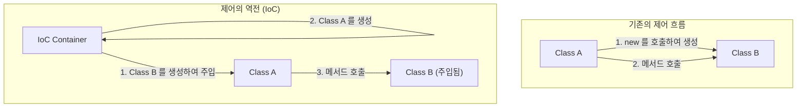

소프트웨어 엔지니어링의 세계에서 시스템이 성장하고 복잡해짐에 따라 직면하게 되는 가장 큰 과제 중 하나가 바로 '컴포넌트 간의 결합도(Coupling)'입니다. 어떤 클래스가 다른 클래스에 강하게 의존하고 있는 상태는 코드의 변경을 어렵게 만들고, 버그의 온상이 되며, 단위 테스트의 실행을 거의 불가능한 상태로 몰아넣습니다.

본 문서에서는 객체 지향 설계의 핵심을 이루는 개념인 '제어의 역전(IoC: Inversion of Control)'과 이를 구체화하는 강력한 기법인 '의존성 주입(DI: Dependency Injection)'에 대해 기본 개념부터 구체적인 프레임워크(Spring, Dagger 등)에서의 수명 주기(Lifecycle) 관리에 이르기까지 철저하게 파헤쳐 설명합니다.

## 왜 'new'를 사용하면 안 되는가?

개발 초보자가 자주 작성하는 코드 중에는 클래스 내부에서 의존하는 객체를 직접 `new` 키워드로 인스턴스화하는 방식이 있습니다. 언뜻 보기에는 직관적이고 단순해 보이지만, 이것이 '강한 결합(Tight Coupling)'을 일으키는 가장 큰 요인입니다.

### 하드코딩된 의존 관계의 폐해

다음과 같은 코드를 생각해 봅시다.

```java
public class OrderService {
    private PaymentProcessor paymentProcessor;
    private NotificationService notificationService;

    public OrderService() {
        // 의존 관계를 하드코딩하고 있다
        this.paymentProcessor = new StripePaymentProcessor();
        this.notificationService = new EmailNotificationService();
    }

    public void processOrder(Order order) {
        paymentProcessor.process(order.getAmount());
        notificationService.notifyUser(order.getUser());
    }
}
```

이 설계에는 치명적인 문제가 몇 가지 존재합니다.
첫째로, `OrderService`는 `StripePaymentProcessor`와 `EmailNotificationService`라는 구체적인 구현 클래스에 완전히 종속(Lock-in)되어 있습니다. 만약 미래에 결제 수단으로 PayPal을 추가하고 싶거나 알림 수단을 SMS로 변경하고 싶을 경우, `OrderService`의 소스 코드 자체를 직접 수정해야만 합니다. 이는 변경에는 닫혀 있고 확장에는 열려 있어야 한다는 '개방-폐쇄 원칙(OCP)'을 완전히 위반하는 것입니다.

### 테스트의 어려움(Testability의 결여)

둘째로, 그리고 가장 심각한 문제는 테스트의 어려움입니다. `OrderService`를 단위 테스트(Unit Test)하려고 할 경우, 내부에서 `StripePaymentProcessor`가 `new`로 생성되고 있기 때문에 테스트 실행 시 실제 결제 API로 요청이 날아갈 가능성이 있습니다.

테스트용으로 모의 객체(Mock)나 스텁(Stub)을 삽입하고 싶어도 생성자 내부에서 직접 인스턴스화되어 있으므로, 외부에서 테스트용 객체를 주입할 여지가 없습니다. 이로 인해 자동화 테스트의 도입이 가로막히고, 품질 보증 비용이 급증하게 됩니다.

## 제어의 역전(IoC: Inversion of Control)의 철학

강한 결합 문제를 해결하기 위한 설계 사상이 '제어의 역전(IoC)'입니다. IoC는 컴포넌트의 제어권(인스턴스의 생성이나 의존 관계의 해결 등)을 컴포넌트 자신으로부터 외부의 프레임워크나 컨테이너로 위임(역전)시킨다는 개념입니다.

### 할리우드 원칙(Hollywood Principle)

IoC를 단적으로 나타내는 유명한 격언으로 '할리우드 원칙'이 있습니다.

> "Don't call us, we'll call you." (우리를 부르지 마라, 우리가 너를 부를 것이다)

할리우드의 오디션에서는 배우가 프로듀서에게 합격 여부를 묻는 것이 아니라, 프로듀서 측에서 필요한 배우에게 연락을 취합니다. 소프트웨어 설계에서의 IoC도 완전히 동일합니다. 클래스 자신이 의존하는 컴포넌트를 찾아서 가져오는(부르는) 것이 아니라, 시스템 측(프레임워크나 컨테이너)이 필요한 의존 컴포넌트를 외부에서 제공해 줄(불려질) 때까지 기다리는 입장을 취합니다.



## 의존성 주입(DI: Dependency Injection)

IoC는 어디까지나 추상적인 설계 원칙(Principle)이지만, 이를 구체적인 구현 패턴(Pattern)으로 구체화한 것이 '의존성 주입(DI)'입니다. DI에서는 클래스가 의존하는 객체를 자신의 내부에서 생성하는 것이 아니라, 외부에서 인수 등을 통해 '주입(Inject)' 받습니다.

DI에는 크게 세 가지 주요 접근 방식이 존재합니다.

### 1. Constructor Injection(생성자 주입)

가장 권장되는 방식이며, 의존 객체를 클래스의 생성자를 통해 전달합니다.

```java
public class OrderService {
    private final PaymentProcessor paymentProcessor;
    private final NotificationService notificationService;

    // 외부로부터 인터페이스를 전달받음(주입됨)
    public OrderService(PaymentProcessor paymentProcessor, 
                        NotificationService notificationService) {
        this.paymentProcessor = paymentProcessor;
        this.notificationService = notificationService;
    }
    // ...
}
```

**장점:**
- 필수적인 의존 관계가 충족되어 있음을 보장합니다(인스턴스화 시 반드시 인수가 필요함).
- 필드를 `final`(불변)로 만들 수 있어 스레드 안전성(Thread-safe)을 확보하고, 의도치 않은 상태 변경을 방지할 수 있습니다.
- 테스트 시 모의 객체(Mock Object)를 직접 생성자에 넘기기만 하면 되므로 테스트가 매우 용이해집니다.

### 2. Setter Injection(세터 주입)

세터(Setter) 메서드를 통해 의존 객체를 주입합니다.

```java
public class OrderService {
    private PaymentProcessor paymentProcessor;

    public void setPaymentProcessor(PaymentProcessor paymentProcessor) {
        this.paymentProcessor = paymentProcessor;
    }
}
```

**장점 및 단점:**
- 의존 관계가 선택적(Optional)인 경우나, 런타임에 의존 객체를 동적으로 전환하고 싶을 때 유용합니다.
- 하지만 필드를 `final`로 만들 수 없고, 초기화되지 않은 상태에서 메서드가 호출되어 `NullPointerException`이 발생할 위험이 있습니다.

### 3. Interface Injection(인터페이스 주입)

주입을 수행하기 위한 전용 인터페이스를 정의하고, 의존성을 주입받을 클래스가 해당 인터페이스를 구현하게 하는 방식입니다. 구조가 복잡해지기 쉬워 현대의 개발에서는 거의 사용되지 않습니다.

## DI 컨테이너의 역할과 고도화된 수명 주기 관리

소규모 애플리케이션이라면 개발자가 직접 `main` 메서드 안에서 객체를 생성하고 수동으로 의존 관계를 조립하는 것(이를 Pure DI 또는 Poor Man's DI라고 부릅니다)도 가능합니다. 하지만 엔터프라이즈급의 거대한 시스템에서는 수천 개에 달하는 클래스의 의존성 그래프를 수작업으로 관리하는 것은 불가능합니다.

여기서 등장하는 것이 바로 'DI 컨테이너(IoC 컨테이너)'입니다.

DI 컨테이너는 애플리케이션 전체의 객체(Bean 등으로 불림) 생성, 의존 관계의 해결, 그리고 소멸에 이르기까지 '수명 주기(Lifecycle) 전체'를 자동으로 관리해 주는 인프라스트럭처입니다.

### Spring Framework에서의 동적 DI와 수명 주기

Java 생태계의 사실상 표준(De facto standard)인 Spring Framework는 매우 강력한 런타임(Runtime) DI 컨테이너를 갖추고 있습니다.

Spring에서는 어노테이션(`@Component`, `@Autowired`, `@Service` 등)을 사용하여 메타데이터를 정의하면, 컨테이너가 애플리케이션 시작 시 리플렉션(Reflection)을 사용하여 클래스를 분석하고, 인스턴스의 생성과 주입을 자동으로 수행합니다.

```java
@Service
public class OrderService {
    private final PaymentProcessor paymentProcessor;

    @Autowired // Spring 4.3 이후, 단일 생성자인 경우 생략 가능
    public OrderService(PaymentProcessor paymentProcessor) {
        this.paymentProcessor = paymentProcessor;
    }
}
```

**스코프 관리:**
DI 컨테이너는 객체의 수명(스코프)도 관리합니다.
- **Singleton(기본값):** 컨테이너 내에 단일 인스턴스만 생성되어, 모든 요청에서 공유됩니다. 메모리 효율이 좋습니다.
- **Prototype:** 주입될 때마다 새로운 인스턴스가 생성됩니다. 상태를 가지는(Stateful) 객체에 사용됩니다.
- **Request / Session:** 웹 애플리케이션에서 HTTP 요청이나 세션 단위로 인스턴스를 생성하고 관리합니다.

### Dagger를 이용한 컴파일 타임 DI(Android 개발 등)

반면, 모바일 개발(특히 Android)과 같은 환경에서는 시작 시 리플렉션으로 인한 성능 오버헤드를 피하기 위해 런타임이 아닌 컴파일 타임(Compile-time)에 의존 관계의 코드를 자동 생성하는 방식을 취합니다. Google이 개발하는 **Dagger**(그리고 Hilt)가 그 대표격입니다.

Dagger는 Java의 어노테이션 프로세서를 이용하여 컴파일 시 의존성 그래프를 분석하고, 수작업으로 작성한 Pure DI만큼이나 빠르게 동작하는 팩토리 클래스를 생성합니다. 이를 통해 런타임 에러(의존 관계 해결 실패)를 컴파일 에러로서 조기에 발견할 수 있다는 절대적인 장점을 가져다줍니다.

## 아키텍처에 미치는 영향: 느슨한 결합이 가져오는 미래

DI와 IoC를 철저히 적용함으로써, 단순한 코딩 테크닉의 범주를 넘어 아키텍처 전체에 패러다임 전환이 일어납니다.

1. **플러그인 아키텍처의 실현:**
   인터페이스에 의존함으로써, 구체적인 구현을 모듈로서 분리해 낼 수 있습니다. 이를 통해 마이크로서비스 아키텍처나 헥사고날 아키텍처로의 전환이 매우 매끄러워집니다.
2. **지속적 통합(CI)과 테스트 주도 개발(TDD)의 촉진:**
   모든 컴포넌트가 단위 테스트 가능해짐에 따라, 빈번한 리팩터링을 안전하게 수행할 수 있게 됩니다.
3. **병렬 개발의 가속:**
   인터페이스만 합의해 둔다면, 프론트엔드의 로직과 백엔드의 데이터베이스 연동 등을 각기 다른 팀에서 완전히 독립적으로 동시에 병렬 개발하는 것이 가능해집니다.

## 요약

'new' 키워드를 안일하게 사용하는 것은 클래스들끼리 강력하게 결합되게 만들어 변화에 취약하고 경직된 시스템을 낳습니다. '제어의 역전(IoC)'이라는 철학을 받아들이고 '의존성 주입(DI)'을 실천함으로써, 우리는 테스트 가능하고, 유연성이 뛰어나며, 유지보수성이 높은 견고한 소프트웨어를 구축할 수 있습니다.

DI 컨테이너는 마법이 아닙니다. 그것은 객체의 생성과 파기라는 번거로운 가사 노동을 대신해 주는 극히 우수한 집사일 뿐입니다. 현대 소프트웨어 설계에 있어서 DI와 IoC에 대한 이해는 일류 엔지니어가 되기 위한 필수 조건이라고 할 수 있을 것입니다.
