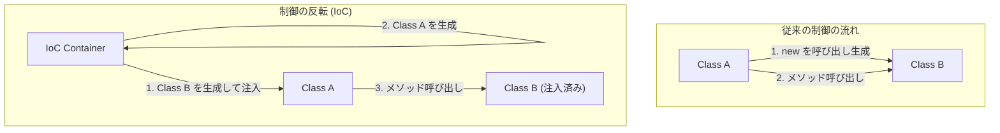

ソフトウェアエンジニアリングの世界において、システムが成長し複雑化するにつれて直面する最大の課題の一つが「コンポーネント間の結合度（Coupling）」です。あるクラスが別のクラスに強く依存している状態は、コードの変更を困難にし、バグの温床となり、単体テストの実施を不可能に近い状態に追い込みます。

本記事では、オブジェクト指向設計の中核を成す概念である「制御の反転（IoC: Inversion of Control）」と、それを具現化する強力な手法である「依存性の注入（DI: Dependency Injection）」について、基本概念から具体的なフレームワーク（Spring、Dagger等）におけるライフサイクル管理に至るまで、徹底的に掘り下げて解説します。

## なぜ「new」してはいけないのか？

開発初心者がよく書くコードとして、クラスの内部で依存するオブジェクトを直接 `new` キーワードでインスタンス化する手法があります。一見すると直感的でシンプルですが、これが「密結合（Tight Coupling）」を引き起こす最大の要因です。

### ハードコードされた依存関係の弊害

以下のようなコードを考えてみましょう。

```java
public class OrderService {
    private PaymentProcessor paymentProcessor;
    private NotificationService notificationService;

    public OrderService() {
        // 依存関係をハードコードしている
        this.paymentProcessor = new StripePaymentProcessor();
        this.notificationService = new EmailNotificationService();
    }

    public void processOrder(Order order) {
        paymentProcessor.process(order.getAmount());
        notificationService.notifyUser(order.getUser());
    }
}
```

この設計には致命的な問題がいくつか存在します。
第一に、`OrderService` は `StripePaymentProcessor` と `EmailNotificationService` という具体的な実装クラスに完全にロックインされています。もし将来、決済手段として PayPal を追加したい場合や、通知手段を SMS に変更したい場合、`OrderService` のソースコードそのものを直接変更しなければなりません。これは、変更に対して閉じており拡張に対して開いているべきとする「オープン・クローズドの原則（OCP）」に完全に違反しています。

### テスト困難性（Testability の欠如）

第二に、そして最も深刻な問題はテストの困難性です。`OrderService` を単体テスト（ユニットテスト）しようとした場合、内部で `StripePaymentProcessor` が `new` されているため、テスト実行時に実際の決済APIへリクエストが飛んでしまう可能性があります。

テスト用にモック（Mock）やスタブ（Stub）を差し込みたくても、コンストラクタ内で直接インスタンス化されているため、外部からテスト用のオブジェクトを注入する余地がありません。これにより、自動テストの導入が阻まれ、品質保証のコストが跳ね上がることになります。

## 制御の反転（IoC: Inversion of Control）の哲学

密結合の問題を解決するための設計思想が「制御の反転（IoC）」です。IoCは、コンポーネントの制御権（インスタンスの生成や依存関係の解決など）を、コンポーネント自身から外部のフレームワークやコンテナへと委譲（反転）させるという概念です。

### ハリウッドの原則（Hollywood Principle）

IoCを端的に表す有名な格言に「ハリウッドの原則」があります。

> "Don't call us, we'll call you."（我々を呼ぶな、我々が君を呼ぶ）

ハリウッドのオーディションでは、役者がプロデューサーに合否の問い合わせをするのではなく、プロデューサー側から必要な役者に連絡をします。ソフトウェア設計におけるIoCも全く同じです。クラス自身が依存するコンポーネントを探して取得する（呼ぶ）のではなく、システム側（フレームワークやコンテナ）が必要な依存コンポーネントを外部から与えてくれる（呼ばれる）のを待つというスタンスを取ります。



## 依存性の注入（DI: Dependency Injection）

IoCはあくまで抽象的な設計原則（Principle）ですが、それを具体的な実装パターン（Pattern）に落とし込んだものが「依存性の注入（DI）」です。DIでは、クラスが依存するオブジェクトを自身の内部で生成するのではなく、外部から引数などを通じて「注入（Inject）」してもらいます。

DIには大きく分けて3つの主要なアプローチが存在します。

### 1. Constructor Injection（コンストラクタ・インジェクション）

最も推奨される手法であり、依存オブジェクトをクラスのコンストラクタ経由で渡します。

```java
public class OrderService {
    private final PaymentProcessor paymentProcessor;
    private final NotificationService notificationService;

    // 外部からインターフェースを受け取る（注入される）
    public OrderService(PaymentProcessor paymentProcessor, 
                        NotificationService notificationService) {
        this.paymentProcessor = paymentProcessor;
        this.notificationService = notificationService;
    }
    // ...
}
```

**メリット:**
- 必須の依存関係が満たされていることが保証される（インスタンス化時に必ず引数が必要）。
- フィールドを `final`（不変）にできるため、スレッドセーフになり、意図しない状態変更を防げる。
- テスト時にモックオブジェクトを直接コンストラクタに渡すだけでよく、テストが極めて容易になる。

### 2. Setter Injection（セッター・インジェクション）

セッターメソッドを通じて依存オブジェクトを注入します。

```java
public class OrderService {
    private PaymentProcessor paymentProcessor;

    public void setPaymentProcessor(PaymentProcessor paymentProcessor) {
        this.paymentProcessor = paymentProcessor;
    }
}
```

**メリットとデメリット:**
- 依存関係がオプショナル（任意）である場合や、実行時に依存オブジェクトを動的に切り替えたい場合に有効です。
- しかし、フィールドを `final` にできず、未初期化のままメソッドが呼ばれて `NullPointerException` が発生するリスクがあります。

### 3. Interface Injection（インターフェース・インジェクション）

注入を行うための専用のインターフェースを定義し、依存を受け取るクラスにそのインターフェースを実装させる手法です。複雑になりがちで、現代の開発ではあまり使われません。

## DIコンテナの役割と高度なライフサイクル管理

小規模なアプリケーションであれば、開発者が自ら `main` メソッドの中でオブジェクトを生成し、手動で依存関係を組み上げる（これを Pure DI または Poor Man's DI と呼びます）ことも可能です。しかし、エンタープライズ級の巨大なシステムでは、数千ものクラスの依存グラフを手作業で管理するのは不可能です。

そこで登場するのが「DIコンテナ（IoCコンテナ）」です。

DIコンテナは、アプリケーション全体のオブジェクト（Beanなどと呼ばれる）の生成、依存関係の解決、そして破棄に至るまでの「ライフサイクル全体」を自動的に管理するインフラストラクチャです。

### Spring Framework における動的DIとライフサイクル

Javaエコシステムのデファクトスタンダードである Spring Framework は、非常に強力な実行時（Runtime）DIコンテナを備えています。

Springでは、アノテーション（`@Component`, `@Autowired`, `@Service` など）を使用してメタデータを定義すると、コンテナがアプリケーション起動時にリフレクション（Reflection）を用いてクラスを解析し、インスタンスの生成と注入を自動的に行います。

```java
@Service
public class OrderService {
    private final PaymentProcessor paymentProcessor;

    @Autowired // Spring 4.3以降、単一コンストラクタの場合は省略可能
    public OrderService(PaymentProcessor paymentProcessor) {
        this.paymentProcessor = paymentProcessor;
    }
}
```

**スコープ管理:**
DIコンテナはオブジェクトの寿命（スコープ）も管理します。
- **Singleton（デフォルト）:** コンテナ内で唯一のインスタンスが作成され、全てのリクエストで共有される。メモリ効率が良い。
- **Prototype:** 注入されるたびに新しいインスタンスが生成される。ステートフルなオブジェクトに用いる。
- **Request / Session:** Webアプリケーションにおいて、HTTPリクエストやセッション単位でインスタンスを生成・管理する。

### Dagger によるコンパイルタイムDI（Android開発等）

一方、モバイル開発（特にAndroid）などの環境では、起動時のリフレクションによるパフォーマンスオーバーヘッドを避けるため、実行時ではなくコンパイル時（Compile-time）に依存関係のコードを自動生成するアプローチが取られます。Googleが開発する **Dagger** （および Hilt）がその代表格です。

DaggerはJavaのアノテーションプロセッサを利用し、コンパイル時に依存グラフを解析して、手書きのPure DIと同じくらい高速に動作するファクトリークラスを生成します。これにより、実行時エラー（依存関係の解決失敗）がコンパイルエラーとして早期発見できるという絶大なメリットをもたらします。

## アーキテクチャへの影響：疎結合がもたらす未来

DIとIoCを徹底することで、単なるコーディングテクニックの枠を超え、アーキテクチャ全体にパラダイムシフトが起こります。

1. **プラグインアーキテクチャの実現:**
   インターフェースに依存することで、具体的な実装をモジュールとして切り離すことができます。これにより、マイクロサービスアーキテクチャやヘキサゴナルアーキテクチャへの移行が非常にスムーズになります。
2. **継続的インテグレーション（CI）とテスト駆動開発（TDD）の促進:**
   全コンポーネントが単体テスト可能になることで、高頻度のリファクタリングが安全に行えるようになります。
3. **並行開発の加速:**
   インターフェースさえ合意しておけば、フロントエンドのロジックとバックエンドのデータベース連携などを、異なるチームで完全に独立して同時並行で開発することが可能になります。

## まとめ

「new」キーワードを安易に使うことは、クラス同士を強力に結びつけ、変化に弱い硬直したシステムを生み出します。「制御の反転（IoC）」という哲学を受け入れ、「依存性の注入（DI）」を実践することで、我々はテスト可能で、柔軟性に富み、保守性の高い堅牢なソフトウェアを構築することができます。

DIコンテナは魔法ではありません。それはオブジェクトの生成と破棄という面倒な家事労働を引き受けてくれる、極めて優秀な執事なのです。現代のソフトウェア設計において、DIとIoCの理解は、一流のエンジニアになるための必須条件と言えるでしょう。
