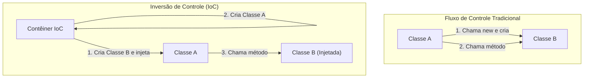

No mundo da engenharia de software, um dos maiores desafios enfrentados à medida que os sistemas crescem e se tornam mais complexos é o "grau de acoplamento (Coupling) entre componentes". O estado em que uma classe depende fortemente de outra dificulta a alteração do código, torna-se um terreno fértil para bugs e leva a um estado em que a execução de testes unitários é quase impossível.

Neste artigo, exploraremos a fundo a "Inversão de Controle (IoC: Inversion of Control)", um conceito central do design orientado a objetos, e a "Injeção de Dependência (DI: Dependency Injection)", uma técnica poderosa que a concretiza. Abordaremos desde os conceitos básicos até o gerenciamento de ciclo de vida em frameworks específicos (Spring, Dagger, etc.).

## Por que não devemos usar o "new"?

Um código frequentemente escrito por desenvolvedores iniciantes é a abordagem de instanciar objetos dependentes diretamente dentro de uma classe usando a palavra-chave `new`. À primeira vista, parece intuitivo e simples, mas esse é o maior fator que causa o "Alto Acoplamento (Tight Coupling)".

### Os males das dependências rigidamente codificadas

Considere o seguinte código:

```java
public class OrderService {
    private PaymentProcessor paymentProcessor;
    private NotificationService notificationService;

    public OrderService() {
        // Dependências são rigidamente codificadas
        this.paymentProcessor = new StripePaymentProcessor();
        this.notificationService = new EmailNotificationService();
    }

    public void processOrder(Order order) {
        paymentProcessor.process(order.getAmount());
        notificationService.notifyUser(order.getUser());
    }
}
```

Existem alguns problemas fatais neste design.
Primeiro, o `OrderService` está completamente preso (lock-in) às classes de implementação concretas `StripePaymentProcessor` e `EmailNotificationService`. Se no futuro quisermos adicionar PayPal como método de pagamento ou alterar o método de notificação para SMS, teremos que modificar diretamente o próprio código-fonte do `OrderService`. Isso viola completamente o "Princípio Aberto-Fechado (OCP)", que estabelece que o código deve estar aberto para extensão, mas fechado para modificação.

### Dificuldade de testes (Falta de Testability)

O segundo e mais sério problema é a dificuldade de testar. Ao tentar realizar um teste unitário no `OrderService`, como o `StripePaymentProcessor` é instanciado com `new` internamente, uma solicitação real para a API de pagamento pode acabar sendo enviada durante a execução do teste.

Mesmo que queiramos inserir Mocks ou Stubs para teste, não há espaço para injetar objetos de teste externos porque a instanciação é feita diretamente no construtor. Isso impede a introdução de testes automatizados e faz com que os custos de garantia de qualidade disparem.

## A Filosofia da Inversão de Controle (IoC: Inversion of Control)

A filosofia de design para resolver o problema do alto acoplamento é a "Inversão de Controle (IoC)". IoC é o conceito de delegar (inverter) os direitos de controle de um componente (como a instanciação e a resolução de dependências) do próprio componente para um framework ou contêiner externo.

### O Princípio de Hollywood (Hollywood Principle)

Um famoso ditado que expressa sucintamente o IoC é o "Princípio de Hollywood".

> "Don't call us, we'll call you." (Não nos ligue, nós ligaremos para você.)

Em uma audição de Hollywood, os atores não contatam os produtores para saber sobre a aprovação, mas sim os produtores contatam os atores necessários. O IoC no design de software é exatamente o mesmo. Em vez de a própria classe procurar e obter (chamar) os componentes dos quais depende, ela adota a postura de esperar que o sistema (framework ou contêiner) forneça (seja chamado) os componentes de dependência necessários a partir do exterior.



## Injeção de Dependência (DI: Dependency Injection)

Enquanto o IoC é apenas um princípio de design abstrato (Principle), a "Injeção de Dependência (DI)" é a tradução disso em um padrão de implementação concreto (Pattern). Na DI, a classe não cria internamente os objetos dos quais depende, mas sim os recebe "injetados (Inject)" através de argumentos ou outros meios externos.

Existem três abordagens principais para DI.

### 1. Injeção por Construtor (Constructor Injection)

É a abordagem mais recomendada, onde os objetos de dependência são passados através do construtor da classe.

```java
public class OrderService {
    private final PaymentProcessor paymentProcessor;
    private final NotificationService notificationService;

    // Recebe interfaces do exterior (injetadas)
    public OrderService(PaymentProcessor paymentProcessor, 
                        NotificationService notificationService) {
        this.paymentProcessor = paymentProcessor;
        this.notificationService = notificationService;
    }
    // ...
}
```

**Vantagens:**
- Garante que as dependências necessárias sejam satisfeitas (os argumentos são sempre necessários na instanciação).
- Como os campos podem ser `final` (imutáveis), tornam-se thread-safe, prevenindo mudanças de estado indesejadas.
- No teste, basta passar objetos mock diretamente para o construtor, tornando o teste extremamente fácil.

### 2. Injeção por Setter (Setter Injection)

Injeta os objetos de dependência através de métodos setter.

```java
public class OrderService {
    private PaymentProcessor paymentProcessor;

    public void setPaymentProcessor(PaymentProcessor paymentProcessor) {
        this.paymentProcessor = paymentProcessor;
    }
}
```

**Vantagens e Desvantagens:**
- Eficaz quando a dependência é opcional ou quando se deseja alternar dinamicamente o objeto dependente em tempo de execução.
- No entanto, os campos não podem ser marcados como `final`, e há o risco de ocorrer uma `NullPointerException` se o método for chamado enquanto não estiver inicializado.

### 3. Injeção por Interface (Interface Injection)

Uma técnica que define uma interface dedicada para a injeção e força a classe que recebe a dependência a implementar essa interface. Tende a ser complexa e raramente é usada no desenvolvimento moderno.

## O Papel do Contêiner DI e Gerenciamento Avançado de Ciclo de Vida

Para aplicações de pequena escala, os próprios desenvolvedores podem instanciar objetos no método `main` e montar manualmente as dependências (isso é chamado de Pure DI ou Poor Man's DI). Contudo, em sistemas gigantescos corporativos, é impossível gerenciar manualmente o grafo de dependências de milhares de classes.

É aí que entra o "Contêiner DI (Contêiner IoC)".

O Contêiner DI é uma infraestrutura que gerencia automaticamente o "ciclo de vida completo" dos objetos (frequentemente chamados de Beans) em toda a aplicação, desde a criação, resolução de dependências, até a destruição.

### Injeção Dinâmica (DI) e Ciclo de Vida no Spring Framework

O padrão de fato no ecossistema Java, o Spring Framework, possui um contêiner DI de tempo de execução (Runtime) extremamente poderoso.

No Spring, definindo metadados usando anotações (como `@Component`, `@Autowired`, `@Service`), o contêiner analisa a classe usando reflexão (Reflection) na inicialização da aplicação e realiza a criação e a injeção de instâncias de forma automática.

```java
@Service
public class OrderService {
    private final PaymentProcessor paymentProcessor;

    @Autowired // A partir do Spring 4.3, pode ser omitido caso haja um único construtor
    public OrderService(PaymentProcessor paymentProcessor) {
        this.paymentProcessor = paymentProcessor;
    }
}
```

**Gerenciamento de Escopo:**
O contêiner DI também gerencia a vida útil (escopo) dos objetos.
- **Singleton (Padrão):** Cria uma única instância no contêiner, que é compartilhada por todas as solicitações. Eficiente em termos de memória.
- **Prototype:** Uma nova instância é criada a cada vez que for injetada. Usada para objetos com estado (stateful).
- **Request / Session:** Em aplicações web, gerencia instâncias criadas e mantidas por solicitação HTTP ou sessão.

### Injeção de Dependência (DI) em Tempo de Compilação com Dagger

Por outro lado, em ambientes como o desenvolvimento móvel (especialmente Android), para evitar a sobrecarga de desempenho devido à reflexão durante a inicialização, adota-se a abordagem de gerar automaticamente o código de resolução de dependências no momento da compilação (Compile-time) em vez de no momento de execução. O **Dagger** (e o Hilt), desenvolvidos pelo Google, são os principais exemplos disso.

O Dagger usa o processador de anotações do Java, analisa o grafo de dependências no momento da compilação e gera classes factory que funcionam tão rápido quanto um Pure DI escrito à mão. Isso traz a tremenda vantagem de detectar falhas de dependência (erros de tempo de execução) precocemente como erros de compilação.

## O Impacto na Arquitetura: O Futuro do Baixo Acoplamento

A aplicação rigorosa de DI e IoC transcende o escopo de uma mera técnica de codificação, provocando uma mudança de paradigma em toda a arquitetura.

1. **Implementação de Arquitetura de Plugins:**
   Ao depender de interfaces, as implementações concretas podem ser separadas como módulos. Isso torna a migração para a Arquitetura de Microsserviços ou Arquitetura Hexagonal muito mais suave.
2. **Promoção de Integração Contínua (CI) e Desenvolvimento Orientado a Testes (TDD):**
   Com todos os componentes tornando-se testáveis de forma unitária, o refatoramento frequente pode ser realizado com segurança.
3. **Aceleração do Desenvolvimento Paralelo:**
   Desde que se chegue a um acordo sobre as interfaces, torna-se possível desenvolver a lógica do frontend e a integração do banco de dados do backend, de forma completamente independente e simultânea por equipes diferentes.

## Conclusão

O uso descuidado da palavra-chave `new` vincula as classes de forma rígida e cria sistemas inflexíveis vulneráveis a mudanças. Ao adotar a filosofia da "Inversão de Controle (IoC)" e praticar a "Injeção de Dependência (DI)", podemos construir softwares robustos que são testáveis, altamente flexíveis e de fácil manutenção.

O Contêiner DI não é mágica. É um mordomo extremamente competente que cuida do trabalho doméstico tedioso de criar e destruir objetos. No design de software moderno, a compreensão de DI e IoC pode ser considerada um requisito essencial para se tornar um engenheiro de primeira linha.
