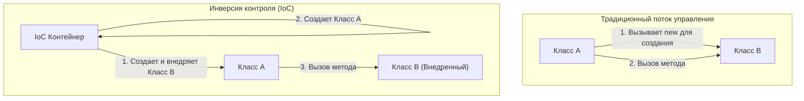

В мире программной инженерии одной из самых больших проблем, с которыми сталкиваются системы по мере их роста и усложнения, является «степень связности (Coupling) между компонентами». Состояние, при котором один класс сильно зависит от другого класса, затрудняет изменение кода, становится рассадником багов и доводит ситуацию до состояния, когда проведение модульного тестирования становится практически невозможным.

В этой статье мы подробно и глубоко рассмотрим «Инверсию контроля (IoC: Inversion of Control)», концепцию, составляющую ядро объектно-ориентированного проектирования, и «Внедрение зависимостей (DI: Dependency Injection)», мощный метод её реализации, начиная от базовых понятий и заканчивая управлением жизненным циклом в конкретных фреймворках (Spring, Dagger и др.).

## Почему не стоит использовать `new`?

Метод, который часто пишут начинающие разработчики — это создание зависимых объектов непосредственно внутри класса с помощью ключевого слова `new`. На первый взгляд это кажется интуитивно понятным и простым, но это является самым большим фактором, вызывающим «сильную связность (Tight Coupling)».

### Негативные последствия жестко закодированных зависимостей

Давайте рассмотрим следующий код:

```java
public class OrderService {
    private PaymentProcessor paymentProcessor;
    private NotificationService notificationService;

    public OrderService() {
        // Жестко закодированные зависимости
        this.paymentProcessor = new StripePaymentProcessor();
        this.notificationService = new EmailNotificationService();
    }

    public void processOrder(Order order) {
        paymentProcessor.process(order.getAmount());
        notificationService.notifyUser(order.getUser());
    }
}
```

В таком дизайне существует несколько фатальных проблем.
Во-первых, `OrderService` полностью привязан (заблокирован) к конкретным классам реализации `StripePaymentProcessor` и `EmailNotificationService`. Если в будущем мы захотим добавить PayPal в качестве способа оплаты или изменить способ уведомления на SMS, нам придется напрямую изменять сам исходный код `OrderService`. Это полностью нарушает «Принцип открытости/закрытости (OCP)», согласно которому программные сущности должны быть открыты для расширения, но закрыты для изменения.

### Трудности тестирования (Отсутствие Testability)

Во-вторых, и это самая серьезная проблема, — сложность тестирования. Если мы попытаемся провести модульное тестирование (Unit Test) `OrderService`, внутри него через `new` создается `StripePaymentProcessor`, что может привести к отправке реального запроса к платежному API во время выполнения теста.

Даже если мы захотим внедрить моки (Mock) или стабы (Stub) для тестирования, они инстанцируются непосредственно в конструкторе, поэтому нет возможности внедрить тестовые объекты извне. Это препятствует внедрению автоматизированного тестирования и приводит к резкому скачку затрат на обеспечение качества.

## Философия Инверсии контроля (IoC: Inversion of Control)

Философия проектирования, направленная на решение проблемы сильной связности, называется «Инверсия контроля (IoC)». IoC — это концепция, при которой права управления компонентом (например, создание экземпляров и разрешение зависимостей) делегируются (инвертируются) от самого компонента внешнему фреймворку или контейнеру.

### Голливудский принцип (Hollywood Principle)

Известное изречение, которое кратко выражает IoC, — это «Голливудский принцип».

> "Don't call us, we'll call you." (Не звоните нам, мы сами вам позвоним.)

На голливудских прослушиваниях актеры не связываются с продюсерами, чтобы узнать результаты, а сами продюсеры связываются с нужными актерами. То же самое относится и к IoC в проектировании программного обеспечения. Вместо того чтобы класс сам искал и получал (вызывал) компоненты, от которых он зависит, он занимает позицию ожидания, когда система (фреймворк или контейнер) предоставит (вызовет) ему необходимые зависимые компоненты извне.



## Внедрение зависимостей (DI: Dependency Injection)

IoC — это абстрактный принцип проектирования (Principle), но его воплощением в конкретный паттерн реализации (Pattern) является «Внедрение зависимостей (DI)». При DI объекты, от которых зависит класс, не создаются внутри него самого, а «внедряются (Inject)» извне через аргументы и т.д.

Существует три основных подхода к DI.

### 1. Constructor Injection (Внедрение через конструктор)

Это наиболее рекомендуемый метод, при котором объекты-зависимости передаются через конструктор класса.

```java
public class OrderService {
    private final PaymentProcessor paymentProcessor;
    private final NotificationService notificationService;

    // Получает интерфейсы извне (внедряются)
    public OrderService(PaymentProcessor paymentProcessor, 
                        NotificationService notificationService) {
        this.paymentProcessor = paymentProcessor;
        this.notificationService = notificationService;
    }
    // ...
}
```

**Преимущества:**
- Гарантируется выполнение обязательных зависимостей (аргументы всегда требуются при создании экземпляра).
- Поля могут быть сделаны `final` (неизменяемыми), что делает их потокобезопасными и предотвращает непреднамеренные изменения состояния.
- Во время тестирования достаточно просто передать мок-объекты непосредственно в конструктор, что делает тестирование чрезвычайно простым.

### 2. Setter Injection (Внедрение через сеттер)

Зависимые объекты внедряются через методы-сеттеры.

```java
public class OrderService {
    private PaymentProcessor paymentProcessor;

    public void setPaymentProcessor(PaymentProcessor paymentProcessor) {
        this.paymentProcessor = paymentProcessor;
    }
}
```

**Преимущества и недостатки:**
- Эффективно, когда зависимости являются опциональными (необязательными) или когда необходимо динамически переключать зависимые объекты во время выполнения.
- Однако поля нельзя сделать `final`, и существует риск возникновения `NullPointerException`, если метод будет вызван без предварительной инициализации.

### 3. Interface Injection (Внедрение через интерфейс)

Метод, при котором определяется специальный интерфейс для выполнения внедрения, и класс, получающий зависимость, должен реализовать этот интерфейс. Это имеет тенденцию к усложнению и редко используется в современной разработке.

## Роль DI-контейнера и расширенное управление жизненным циклом

Если это небольшое приложение, разработчики могут сами создавать объекты в методе `main` и вручную собирать зависимости (это называется Pure DI или Poor Man's DI). Однако в огромных системах корпоративного уровня невозможно вручную управлять графом зависимостей из тысяч классов.

И здесь на сцену выходит «DI-контейнер (IoC-контейнер)».

DI-контейнер — это инфраструктура, которая автоматически управляет «всем жизненным циклом» объектов (часто называемых Beans) во всем приложении: от их создания и разрешения зависимостей до уничтожения.

### Динамическое DI и жизненный цикл во фреймворке Spring

Spring Framework, являющийся стандартом де-факто в экосистеме Java, оснащен чрезвычайно мощным DI-контейнером времени выполнения (Runtime).

В Spring, когда вы определяете метаданные с помощью аннотаций (например, `@Component`, `@Autowired`, `@Service`), контейнер автоматически анализирует классы с использованием рефлексии (Reflection) при запуске приложения, инстанцирует их и внедряет.

```java
@Service
public class OrderService {
    private final PaymentProcessor paymentProcessor;

    @Autowired // Начиная со Spring 4.3, может быть опущено для единственного конструктора
    public OrderService(PaymentProcessor paymentProcessor) {
        this.paymentProcessor = paymentProcessor;
    }
}
```

**Управление областью видимости (Scope):**
DI-контейнер также управляет временем жизни (областью видимости) объектов.
- **Singleton (по умолчанию):** В контейнере создается единственный экземпляр, который используется совместно для всех запросов. Хорошая эффективность использования памяти.
- **Prototype:** Новый экземпляр создается каждый раз при внедрении. Используется для объектов с состоянием (stateful).
- **Request / Session:** В веб-приложениях экземпляры создаются и управляются на уровне HTTP-запроса или сессии.

### DI во время компиляции с помощью Dagger (например, в Android-разработке)

С другой стороны, в таких средах, как мобильная разработка (особенно Android), чтобы избежать накладных расходов на производительность из-за рефлексии при запуске, используется подход автоматической генерации кода зависимостей во время компиляции (Compile-time), а не во время выполнения. **Dagger** (и Hilt), разработанный Google, является типичным представителем этого подхода.

Dagger использует процессоры аннотаций Java и анализирует граф зависимостей во время компиляции, генерируя классы-фабрики, которые работают так же быстро, как и рукописный Pure DI. Это дает огромное преимущество в виде раннего обнаружения ошибок времени выполнения (ошибок разрешения зависимостей) в виде ошибок компиляции.

## Влияние на архитектуру: будущее, обеспечиваемое слабой связностью

Полное внедрение DI и IoC выходит за рамки простой техники программирования и приводит к сдвигу парадигмы в архитектуре в целом.

1. **Реализация плагинной архитектуры:**
   Завися от интерфейсов, конкретные реализации могут быть отделены в виде модулей. Это делает переход к микросервисной архитектуре или гексагональной архитектуре очень плавным.
2. **Содействие непрерывной интеграции (CI) и разработке через тестирование (TDD):**
   Поскольку все компоненты становятся доступными для модульного тестирования, высокочастотный рефакторинг может выполняться безопасно.
3. **Ускорение параллельной разработки:**
   Если интерфейсы согласованы, логика фронтенда и интеграция с базой данных бэкенда могут разрабатываться полностью независимо и параллельно разными командами.

## Заключение

Легкомысленное использование ключевого слова `new` сильно связывает классы между собой и создает жесткую систему, уязвимую к изменениям. Принимая философию «Инверсии контроля (IoC)» и практикуя «Внедрение зависимостей (DI)», мы можем создавать надежное программное обеспечение, которое легко тестировать, которое обладает высокой гибкостью и простотой в обслуживании.

DI-контейнер — это не магия. Это просто чрезвычайно способный дворецкий, который берет на себя хлопотную работу по созданию и уничтожению объектов. В современном проектировании программного обеспечения понимание DI и IoC можно считать обязательным условием для того, чтобы стать первоклассным инженером.
