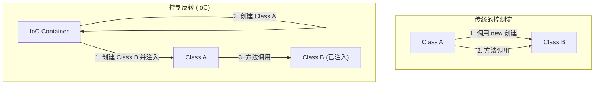

在软件工程的世界中，随着系统的发展和复杂化，我们面临的最大挑战之一就是“组件之间的耦合度（Coupling）”。如果一个类强烈依赖于另一个类，那么代码的修改将变得困难，容易成为Bug的温床，并使单元测试变得几乎不可能。

本文将深入探讨面向对象设计的核心概念“控制反转（IoC: Inversion of Control）”，以及实现该概念的强大方法“依赖注入（DI: Dependency Injection）”，从基本概念到具体框架（Spring、Dagger等）中的生命周期管理，进行全面细致的解析。

## 为什么不应该使用“new”？

初级开发者常写的一种代码模式是：在类内部直接使用 `new` 关键字来实例化其依赖的对象。乍看之下直观且简单，但这也是导致“紧耦合（Tight Coupling）”的最大原因。

### 硬编码依赖关系的弊端

考虑以下代码：

```java
public class OrderService {
    private PaymentProcessor paymentProcessor;
    private NotificationService notificationService;

    public OrderService() {
        // 硬编码了依赖关系
        this.paymentProcessor = new StripePaymentProcessor();
        this.notificationService = new EmailNotificationService();
    }

    public void processOrder(Order order) {
        paymentProcessor.process(order.getAmount());
        notificationService.notifyUser(order.getUser());
    }
}
```

这种设计存在几个致命的问题。
首先，`OrderService` 被完全锁定在 `StripePaymentProcessor` 和 `EmailNotificationService` 这两个具体的实现类上。如果将来想增加 PayPal 作为支付手段，或者将通知方式改为 SMS，就必须直接修改 `OrderService` 的源代码本身。这完全违背了“开闭原则（OCP）”，该原则规定软件实体应该对扩展开放，对修改关闭。

### 测试困难（缺乏 Testability）

其次，也是最严重的问题，是测试的困难性。如果要对 `OrderService` 进行单元测试（Unit Test），由于它在内部使用 `new` 实例化了 `StripePaymentProcessor`，在运行测试时可能会向实际的支付 API 发送请求。

即使你想在测试中注入 Mock 或 Stub，由于是在构造函数内部直接实例化的，也没有留下从外部注入测试用对象的余地。这阻碍了自动化测试的引入，并导致质量保证成本飙升。

## 控制反转（IoC: Inversion of Control）的哲学

为了解决紧耦合问题而产生的架构思想就是“控制反转（IoC）”。IoC 是一种将组件的控制权（如实例的创建和依赖关系的解析等）从组件自身委托（反转）给外部框架或容器的概念。

### 好莱坞原则（Hollywood Principle）

有一句著名的格言简明地表达了 IoC，那就是“好莱坞原则”：

> "Don't call us, we'll call you."（不要打电话给我们，我们会打电话给你。）

在好莱坞的试镜中，演员不需要向制片人询问结果，而是制片人会主动联系需要的演员。软件设计中的 IoC 完全一样。类本身不应该去寻找和获取（调用）它所依赖的组件，而是应该等待系统（框架或容器）从外部提供（被调用）所需的依赖组件。



## 依赖注入（DI: Dependency Injection）

IoC 终究只是一种抽象的设计原则（Principle），而将其落实为具体实现模式（Pattern）的就是“依赖注入（DI）”。在 DI 中，类不应在内部生成其依赖的对象，而是通过参数等方式由外部“注入（Inject）”。

DI 主要分为三种方法。

### 1. 构造函数注入（Constructor Injection）

这是最受推荐的方法，通过类的构造函数传递依赖对象。

```java
public class OrderService {
    private final PaymentProcessor paymentProcessor;
    private final NotificationService notificationService;

    // 从外部接收接口（被注入）
    public OrderService(PaymentProcessor paymentProcessor, 
                        NotificationService notificationService) {
        this.paymentProcessor = paymentProcessor;
        this.notificationService = notificationService;
    }
    // ...
}
```

**优点:**
- 确保必要的依赖关系得到满足（在实例化时必须提供参数）。
- 可以将字段声明为 `final`（不可变），从而实现线程安全，防止意外的状态变更。
- 在测试时，只需将 Mock 对象直接传递给构造函数，测试变得极其容易。

### 2. Setter 注入（Setter Injection）

通过 Setter 方法注入依赖对象。

```java
public class OrderService {
    private PaymentProcessor paymentProcessor;

    public void setPaymentProcessor(PaymentProcessor paymentProcessor) {
        this.paymentProcessor = paymentProcessor;
    }
}
```

**优点与缺点:**
- 当依赖关系是可选（Optional）的，或者需要在运行时动态切换依赖对象时非常有效。
- 但是，字段不能被声明为 `final`，存在方法在未初始化的情况下被调用，从而引发 `NullPointerException` 的风险。

### 3. 接口注入（Interface Injection）

这种方法定义一个专门用于注入的接口，并让需要接收依赖的类实现该接口。这通常会使代码变得复杂，在现代开发中很少使用。

## DI 容器的作用与高级生命周期管理

如果是小型应用程序，开发者可以在 `main` 方法中自行创建对象并手动组装依赖关系（这被称为 Pure DI 或 Poor Man's DI）。但在企业级的庞大系统中，手动管理数千个类的依赖图是不可能的。

于是，“DI 容器（IoC 容器）”应运而生。

DI 容器是一个基础设施，它能自动管理应用程序中所有对象（通常称为 Bean）从创建、解析依赖关系到销毁的“整个生命周期”。

### Spring Framework 中的动态 DI 与生命周期

Java 生态系统的事实标准 Spring Framework 拥有非常强大的运行时（Runtime）DI 容器。

在 Spring 中，只要使用注解（如 `@Component`、`@Autowired`、`@Service` 等）定义元数据，容器在应用程序启动时就会利用反射（Reflection）解析类，自动完成实例的创建与注入。

```java
@Service
public class OrderService {
    private final PaymentProcessor paymentProcessor;

    @Autowired // Spring 4.3 之后，如果是单一构造函数则可省略
    public OrderService(PaymentProcessor paymentProcessor) {
        this.paymentProcessor = paymentProcessor;
    }
}
```

**作用域（Scope）管理:**
DI 容器还管理对象的生命周期（作用域）。
- **Singleton（默认）:** 在容器内创建唯一的实例，并在所有请求中共享。内存效率高。
- **Prototype:** 每次注入时都会生成一个新的实例。用于有状态（Stateful）对象。
- **Request / Session:** 在 Web 应用中，按 HTTP 请求或会话生成和管理实例。

### Dagger 的编译时 DI（Android 开发等）

另一方面，在移动开发（特别是 Android）等环境中，为了避免启动时反射带来的性能开销，通常采用在编译时（Compile-time）而非运行时自动生成依赖代码的方法。Google 开发的 **Dagger**（以及 Hilt）就是其中的典型代表。

Dagger 利用 Java 的注解处理器，在编译时解析依赖图，并生成像手写 Pure DI 一样高速运行的工厂类。这带来了一个巨大的优势：运行时的错误（依赖解析失败）能在编译时被及早发现。

## 对架构的影响：松耦合带来的未来

全面贯彻 DI 和 IoC，已经超越了单纯的编码技巧，能为整个架构带来范式转变。

1. **实现插件化架构:**
   通过依赖接口，可以将具体的实现作为模块分离出来。这使得向微服务架构或六边形架构的过渡变得非常顺畅。
2. **促进持续集成（CI）与测试驱动开发（TDD）:**
   因为所有组件都变得可单元测试，所以可以安全地进行高频的重构。
3. **加速并行开发:**
   只要达成了接口协议，不同团队就可以完全独立、并行地开发前端逻辑和后端数据库交互等功能。

## 总结

轻易地使用 `new` 关键字会使类之间紧密相连，产生对变化抵抗力弱且僵化的系统。通过接受“控制反转（IoC）”的哲学，并践行“依赖注入（DI）”，我们可以构建出易于测试、极具灵活性、高可维护性且健壮的软件。

DI 容器并不是魔法。它只是一个极其优秀的管家，承担了对象创建和销毁这些繁琐的“家务活”。在现代软件设计中，理解 DI 和 IoC 可以说是成为一流工程师的必要条件。
