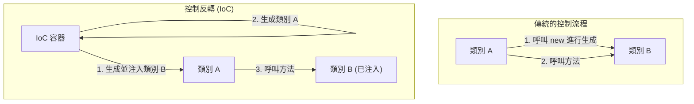

在軟體工程的世界中，隨著系統的成長與複雜化，我們面臨的最大挑戰之一就是「組件間的耦合度（Coupling）」。當一個類別強烈依賴於另一個類別時，會導致程式碼難以修改，成為錯誤的溫床，並使單元測試的執行變得幾乎不可能。

本文將針對物件導向設計中的核心概念「控制反轉（IoC: Inversion of Control）」，以及將其具體化的強大手法「依賴注入（DI: Dependency Injection）」，從基本概念到具體框架（如 Spring、Dagger 等）中的生命週期管理，進行深入透徹的探討與解說。

## 為什麼不能直接使用「new」？

開發新手經常撰寫的一種程式碼模式，是在類別內部直接使用 `new` 關鍵字來實例化所依賴的物件。乍看之下這很直觀且簡單，但這正是引發「緊密耦合（Tight Coupling）」的最大主因。

### 硬編碼依賴關係的弊端

讓我們來思考以下這段程式碼：

```java
public class OrderService {
    private PaymentProcessor paymentProcessor;
    private NotificationService notificationService;

    public OrderService() {
        // 將依賴關係硬編碼（Hardcode）
        this.paymentProcessor = new StripePaymentProcessor();
        this.notificationService = new EmailNotificationService();
    }

    public void processOrder(Order order) {
        paymentProcessor.process(order.getAmount());
        notificationService.notifyUser(order.getUser());
    }
}
```

這樣的設計存在幾個致命的問題。
首先，`OrderService` 被完全鎖死在 `StripePaymentProcessor` 與 `EmailNotificationService` 這兩個具體的實作類別上。如果未來我們想加入 PayPal 作為支付手段，或是將通知方式改為 SMS，就必須直接修改 `OrderService` 的原始碼。這完全違反了「對擴充開放、對修改封閉」的「開閉原則（OCP: Open-Closed Principle）」。

### 測試困難性（Testability 的缺乏）

第二，同時也是最嚴重的問題，就是測試的困難性。當我們試圖對 `OrderService` 進行單元測試（Unit Test）時，因為內部直接 `new` 了 `StripePaymentProcessor`，在執行測試時可能會對實際的支付 API 發出請求。

即使我們想在測試時插入模擬物件（Mock）或預設物件（Stub），但因為實例化是直接寫死在建構子內部，所以完全沒有從外部注入測試用物件的空間。這會阻礙自動化測試的導入，並使品質保證的成本大幅飆升。

## 控制反轉（IoC: Inversion of Control）的哲學

為了解決緊密耦合問題，所提出的設計思想即為「控制反轉（IoC）」。IoC 是一個將組件的控制權（如實例的建立、依賴關係的解析等），從組件自身轉移（反轉）給外部框架或容器的概念。

### 好萊塢原則（Hollywood Principle）

最能精闢詮釋 IoC 的一句名言就是「好萊塢原則」：

> "Don't call us, we'll call you."（別打給我們，我們會打給你）

在好萊塢的試鏡中，演員不會主動向製作人詢問結果，而是由製作人方主動聯絡需要的演員。軟體設計中的 IoC 也是完全相同的道理。類別自身不去尋找並取得（呼叫）所依賴的組件，而是採取一種被動的姿態，等待系統方（框架或容器）從外部將必要的依賴組件提供給它（被呼叫）。



## 依賴注入（DI: Dependency Injection）

IoC 終究只是一個抽象的設計原則（Principle），而將其落實為具體實作模式（Pattern）的，就是「依賴注入（DI）」。在 DI 中，類別不再於內部自行生成其所依賴的物件，而是透過參數等方式從外部「注入（Inject）」。

DI 大致可分為三種主要的方法。

### 1. Constructor Injection（建構子注入）

這是最受推薦的手法，透過類別的建構子來傳遞依賴物件。

```java
public class OrderService {
    private final PaymentProcessor paymentProcessor;
    private final NotificationService notificationService;

    // 從外部接收介面（被注入）
    public OrderService(PaymentProcessor paymentProcessor, 
                        NotificationService notificationService) {
        this.paymentProcessor = paymentProcessor;
        this.notificationService = notificationService;
    }
    // ...
}
```

**優點:**
- 能保證必要的依賴關係已獲滿足（在實例化時必定需要傳入參數）。
- 能將欄位宣告為 `final`（不可變），使其具備執行緒安全（Thread-safe），並防止意料之外的狀態改變。
- 測試時只需將模擬物件（Mock）直接傳入建構子即可，使得測試變得極度容易。

### 2. Setter Injection（設值方法注入）

透過 Setter 方法來注入依賴物件。

```java
public class OrderService {
    private PaymentProcessor paymentProcessor;

    public void setPaymentProcessor(PaymentProcessor paymentProcessor) {
        this.paymentProcessor = paymentProcessor;
    }
}
```

**優點與缺點:**
- 當依賴關係為可選（Optional），或需要在執行時期動態切換依賴物件時，此方法非常有效。
- 然而，欄位無法宣告為 `final`，且存在著未經初始化便呼叫方法而引發 `NullPointerException` 的風險。

### 3. Interface Injection（介面注入）

定義一個專門用來進行注入的介面，並讓需要接收依賴的類別實作該介面的手法。由於容易變得複雜，在現代的開發中已較少被使用。

## DI 容器的角色與進階生命週期管理

如果是小規模的應用程式，開發者可以自行在 `main` 方法中生成物件，並手動組裝依賴關係（這被稱為 Pure DI 或 Poor Man's DI）。然而，在企業級的龐大系統中，要手動管理數以千計類別的依賴圖譜是根本不可能的任務。

因此「DI 容器（IoC 容器）」應運而生。

DI 容器是一個基礎設施，能夠自動管理應用程式中所有物件（通常稱為 Bean）的生成、依賴關係的解析，一直到銷毀為止的「完整生命週期」。

### Spring Framework 中的動態 DI 與生命週期

Java 生態系中的實質標準 Spring Framework，具備了非常強大的執行期（Runtime）DI 容器。

在 Spring 中，只要使用註解（如 `@Component`, `@Autowired`, `@Service` 等）來定義中繼資料（Metadata），容器在應用程式啟動時便會利用反射機制（Reflection）來解析類別，並自動完成實例的生成與注入。

```java
@Service
public class OrderService {
    private final PaymentProcessor paymentProcessor;

    @Autowired // 在 Spring 4.3 之後，若只有單一建構子則可省略
    public OrderService(PaymentProcessor paymentProcessor) {
        this.paymentProcessor = paymentProcessor;
    }
}
```

**作用域（Scope）管理:**
DI 容器同時也管理物件的壽命（作用域）。
- **Singleton（預設）:** 在容器內僅建立唯一的實例，並由所有的請求共享。記憶體效率佳。
- **Prototype:** 每次注入時都會生成一個新的實例。適用於帶有狀態（Stateful）的物件。
- **Request / Session:** 在 Web 應用程式中，以 HTTP 請求或 Session 為單位來生成並管理實例。

### Dagger 的編譯期 DI（Android 開發等）

另一方面，在行動裝置開發（特別是 Android）等環境中，為了避免啟動時因反射機制所造成的效能負擔，通常不會在執行期，而是在編譯期（Compile-time）自動生成依賴關係的程式碼。Google 開發的 **Dagger**（以及 Hilt）便是其中的代表。

Dagger 利用 Java 的註解處理器（Annotation Processor），在編譯時解析依賴圖譜，並生成與手寫 Pure DI 一樣高速運作的工廠類別（Factory Class）。這樣做帶來了一個巨大的優勢：執行期的錯誤（依賴關係解析失敗）可以在編譯階段就被及早發現（編譯錯誤）。

## 對架構的影響：鬆耦合所帶來的未來

徹底落實 DI 與 IoC，不僅超越了單純的寫碼技巧，更會在整個架構層面上引發典範轉移（Paradigm Shift）。

1. **實現外掛程式架構（Plugin Architecture）:**
   透過依賴於介面，可以將具體的實作當作模組抽離出來。這使得系統向微服務架構（Microservices Architecture）或六角架構（Hexagonal Architecture）的轉移變得極為順暢。
2. **促進持續整合（CI）與測試驅動開發（TDD）:**
   所有的組件都變得可以進行單元測試，這讓我們能安全地進行高頻率的重構。
3. **加速平行開發:**
   只要事先針對介面達成共識，前端的邏輯與後端資料庫的串接等工作，就可以完全由不同團隊獨立且平行地進行開發。

## 總結

輕易地使用 `new` 關鍵字，會使類別之間產生強烈的連結，進而衍生出面對變化時顯得僵化且脆弱的系統。只要接納「控制反轉（IoC）」的哲學，並實踐「依賴注入（DI）」，我們就能建構出具備可測試性、充滿彈性，且擁有高可維護性的堅固軟體。

DI 容器並非魔法。它只是一位極度優秀的管家，替我們承擔了生成與銷毀物件這種繁雜的家務勞動。在現代軟體設計中，對 DI 與 IoC 的理解，可以說是成為一流工程師的必備條件。
