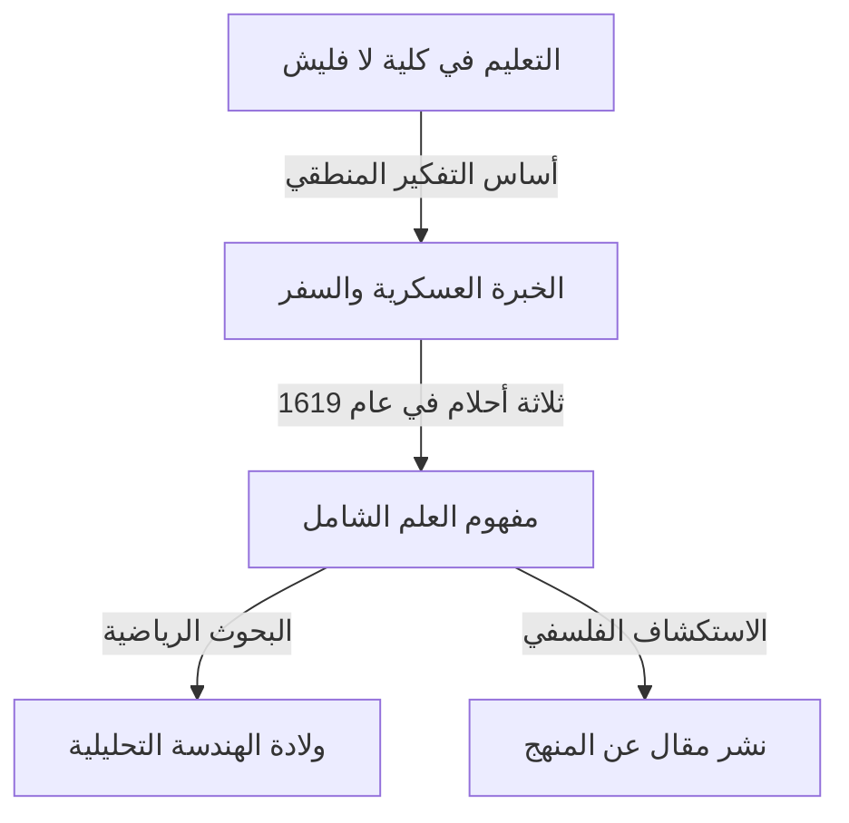

## 1. مقدمة

[رينيه ديكارت](https://kenji.blog/p/descartes/) (1596-1650) كان فيلسوفًا وعالم رياضيات وعالمًا فرنسيًا. ترك وراءه العبارة الشهيرة "أنا أفكر، إذن أنا موجود (Cogito, ergo sum)" ويُعرف على نطاق واسع بأنه أبو الفلسفة الحديثة. ومع ذلك، فإن الدور الذي لعبه في تاريخ الرياضيات كان هائلاً مثل إنجازاته الفلسفية.

كان أعظم إنجاز رياضي لديكارت هو ابتكار **الهندسة التحليلية**، التي دمجت الجبر والهندسة. في هذا المقال، سنشرح بالتفصيل أحداث حياته والثورة التي أحدثها في عالم الرياضيات.

## 2. حياة ديكارت: مسافر الفكر

### الطفولة وكلية لا فليش

ولد ديكارت عام 1596 في لا هاي إن تورين (ديكارت حاليًا)، فرنسا. فقد والدته بعد ولادته بوقت قصير وكان هو نفسه طفلاً مريضًا. في سن العاشرة، التحق بكلية لا فليش اليسوعية. ونظرًا لموهبته وبنيته الضعيفة، سمح له مدير المدرسة بشكل استثنائي بالبقاء في السرير حتى وقت متأخر من الصباح. هذه العادة المتمثلة في "الانغماس في التفكير في السرير" ستستمر طوال حياته.

### الخبرة العسكرية ووحي الأحلام

بعد تخرجه من الكلية، حصل على شهادة في القانون من جامعة بواتييه، لكنه انطلق في رحلة للتعلم من "كتاب العالم العظيم". وعندما اندلعت حرب الثلاثين عامًا، تطوع في الجيش الهولندي.

في 10 نوفمبر 1619، أثناء قضاء فصل الشتاء بالقرب من أولم في ألمانيا، رأى ديكارت ثلاثة أحلام غامضة بينما كان غارقًا في التفكير في غرفة دافئة مدفأة بموقد. وفسر ذلك على أنه وحي "لأسس علم عجيب". ويقال إن هذه التجربة هي أصل مفهومه (نظام عالمي للمعرفة يعتمد على الحقائق الرياضية).

## 3. الإنجازات الرياضية: ولادة الهندسة التحليلية

رافق "مقال عن المنهج"، الذي نشره ديكارت دون الكشف عن هويته عام 1637، ثلاث مقالات. كان أحدها "الهندسة" (La Géométrie). في هذا العمل، قدم فكرة رائدة أعادت كتابة تاريخ الرياضيات.

### اختراع نظام الإحداثيات

في الرياضيات حتى ذلك الحين، كان يُعتبر "الجبر" الذي يتعامل مع الصيغ و"الهندسة" التي تتعامل مع الأشكال مجالات منفصلة تمامًا. اكتشف ديكارت أنه من خلال رسم خطي أعداد متعامدين (المحور $x$ والمحور $y$) على مستوى، يمكن تمثيل أي نقطة على المستوى كزوج من رقمين $(x, y)$. هذا ما نطلق عليه حاليًا **نظام الإحداثيات الديكارتي**.

جعل هذا من الممكن التعبير عن الأشكال الهندسية (مثل الخطوط والدوائر والقطع المكافئ) كمعادلات جبرية وحلها عن طريق الحساب. على سبيل المثال، يتم التعبير عن دائرة نصف قطرها $r$ متمركزة في نقطة الأصل بالمعادلة التالية:

$$
x^2 + y^2 = r^2
$$

### ما أحدثه اندماج الجبر والهندسة

جعلت فكرة ديكارت من الممكن اختزال المشكلات الهندسية الصعبة إلى حسابات جبرية. بالإضافة إلى ذلك، نظم ديكارت أيضًا تدوين التعبيرات الحرفية. استخدام $x, y, z$ للمجاهيل و $a, b, c$ للقيم المعروفة، وكذلك التدوين الذي يعبر عن الأسس بكتابة أرقام صغيرة في أعلى اليمين، مثل $x^2, x^3$، قدمه أيضًا في "الهندسة".

أدناه هي صيغة إيجاد المسافة بين نقطتين على مستوى إحداثي. يتم التعبير عن المسافة $d$ بين النقطة $A(x_1, y_1)$ والنقطة $B(x_2, y_2)$ على النحو التالي باستخدام نظرية فيثاغورس:

$$
d = \sqrt{(x_2 - x_1)^2 + (y_2 - y_1)^2} \quad \text{(المسافة بين نقطتين)}
$$

## 4. التأثير على الفلسفة والعلوم

أصبحت الهندسة التحليلية لديكارت أساسًا لا غنى عنه للتطور اللاحق للرياضيات والفيزياء. يمكن القول إن إنشاء التفاضل والتكامل بواسطة [إسحاق نيوتن](https://kenji.blog/p/newton/) وغوتفريد لايبنيز كان ممكنًا فقط بسبب المسرح الذي وفره نظام الإحداثيات الديكارتي.

بالإضافة إلى ذلك، فإن "شكه المنهجي" في الفلسفة، وهو نهج لإيجاد حقائق مؤكدة بعد الشك في كل شيء، أرسى روح العقلانية التي تعمل كأساس للبحث العلمي.

## 5. خاتمة

كان ديكارت رجلاً أحب التفكير كثيرًا لدرجة أن هناك حكاية تاريخية تقول إنه كان يبقى في السرير حتى وقت متأخر من الصباح يراقب حركة ذبابة على السقف. (وفقًا لإحدى النظريات، أدت محاولة التعبير عن حركة هذه الذبابة إلى فكرة نظام الإحداثيات).

تستمر حياة وفكر [رينيه ديكارت](https://kenji.blog/p/descartes/) في إعطائنا الكثير من الإلهام اليوم، متجاوزة حدود التخصصات الأكاديمية. عندما ندرك أن رسومات الكمبيوتر اليوم، والذكاء الاصطناعي، وجميع أنواع التكنولوجيا العلمية تعمل على نظام الإحداثيات الذي تركه وراءه، يمكننا أن ندرك عظمته مرة أخرى.
