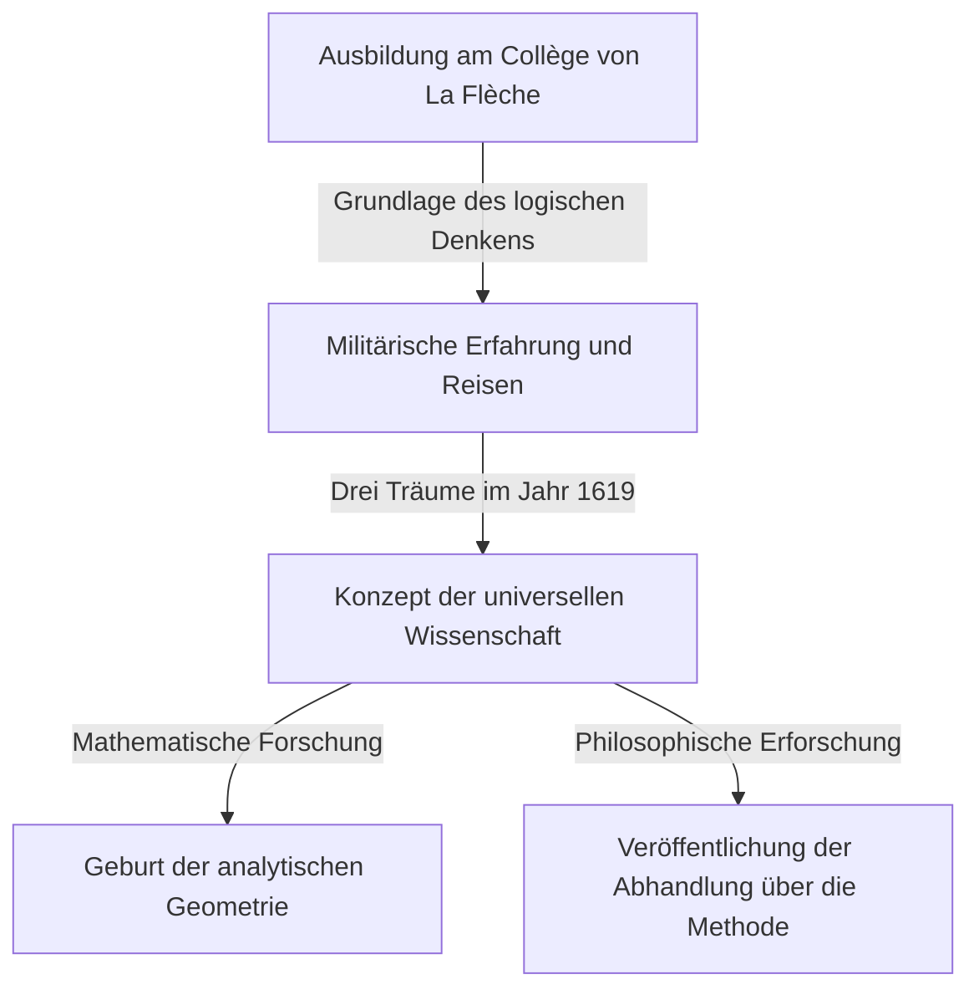

## 1. Einführung

[René Descartes](https://kenji.blog/de/p/descartes/) (1596-1650) war ein französischer Philosoph, Mathematiker und Wissenschaftler. Er hinterließ den berühmten Satz "Ich denke, also bin ich (Cogito, ergo sum)" und ist weithin als Vater der modernen Philosophie bekannt. Die Rolle, die er in der Geschichte der Mathematik spielte, war jedoch ebenso gewaltig wie seine philosophischen Errungenschaften.

[Descartes](https://kenji.blog/de/p/descartes/)' größte mathematische Leistung war die Erschaffung der **analytischen Geometrie**, die Algebra und Geometrie verschmolz. In diesem Artikel werden wir die Episoden seines Lebens und die Revolution, die er in der Welt der Mathematik auslöste, im Detail erklären.

## 2. [Descartes](https://kenji.blog/de/p/descartes/)' Leben: Ein Reisender der Gedanken

### Kindheit und das Collège Royal Henry-Le-Grand in La Flèche

[Descartes](https://kenji.blog/de/p/descartes/) wurde 1596 in La Haye en Touraine (heute [Descartes](https://kenji.blog/de/p/descartes/)), Frankreich, geboren. Er verlor seine Mutter kurz nach der Geburt und war selbst ein kränkliches Kind. Im Alter von 10 Jahren trat er in das Jesuitenkolleg von La Flèche ein. In Anbetracht seiner Begabung und seiner schwachen Konstitution erlaubte ihm der Rektor ausnahmsweise, bis spät in den Morgen im Bett zu bleiben. Diese Gewohnheit, "sich im Bett dem Denken hinzugeben", sollte er sein Leben lang beibehalten.

### Militärische Erfahrung und die Offenbarung der Träume

Nach seinem Abschluss am College erwarb er einen Abschluss in Rechtswissenschaften an der Universität von Poitiers, begab sich jedoch auf eine Reise, um aus dem "großen Buch der Welt" zu lernen. Als der Dreißigjährige Krieg ausbrach, meldete er sich freiwillig für die niederländische Armee.

Am 10. November 1619, während er in der Nähe von Ulm in Deutschland überwinterte, hatte [Descartes](https://kenji.blog/de/p/descartes/) in einem warmen, ofenbeheizten Raum in tiefen Gedanken versunken drei mysteriöse Träume. Er interpretierte dies als eine Offenbarung der "Grundlagen einer bewundernswerten Wissenschaft". Diese Erfahrung gilt als Ursprung seines Konzepts der Mathesis universalis (eines universellen Wissenssystems, das auf mathematischen Wahrheiten basiert).

## 3. Mathematische Errungenschaften: Die Geburt der analytischen Geometrie

Die "Abhandlung über die Methode", die 1637 anonym von [Descartes](https://kenji.blog/de/p/descartes/) veröffentlicht wurde, wurde von drei Essays begleitet. Einer davon war die "Geometrie" (La Géométrie). In diesem Werk präsentierte er eine bahnbrechende Idee, die die Geschichte der Mathematik neu schrieb.

### Erfindung des Koordinatensystems

In der damaligen Mathematik wurden "Algebra", die sich mit Formeln befasste, und "Geometrie", die sich mit Formen befasste, als völlig getrennte Bereiche betrachtet. [Descartes](https://kenji.blog/de/p/descartes/) entdeckte, dass durch das Zeichnen von zwei orthogonalen Zahlenstrahlen (der $x$-Achse und der $y$-Achse) auf einer Ebene jeder Punkt auf der Ebene als ein Paar von zwei Zahlen $(x, y)$ dargestellt werden konnte. Dies ist das, was wir heute als **kartesisches Koordinatensystem** bezeichnen.

Dadurch wurde es möglich, geometrische Formen (wie Linien, Kreise und Parabeln) als algebraische Gleichungen auszudrücken und sie durch Berechnung zu lösen. Zum Beispiel wird ein Kreis mit dem Radius $r$ um den Ursprung durch die folgende Gleichung ausgedrückt:

$$
x^2 + y^2 = r^2
$$

### Was die Verschmelzung von Algebra und Geometrie brachte

[Descartes](https://kenji.blog/de/p/descartes/)' Idee machte es möglich, schwierige geometrische Probleme auf algebraische Berechnungen zu reduzieren. Darüber hinaus wurde auch die Notation für buchstäbliche Ausdrücke von [Descartes](https://kenji.blog/de/p/descartes/) organisiert. Die Verwendung von $x, y, z$ für Unbekannte und $a, b, c$ für bekannte Werte, sowie die Notation, die Exponenten durch kleine Zahlen oben rechts ausdrückt, wie $x^2, x^3$, wurden ebenfalls von ihm in der "Geometrie" eingeführt.

Unten ist die Formel zum Finden des Abstands zwischen zwei Punkten in einer Koordinatenebene. Der Abstand $d$ zwischen Punkt $A(x_1, y_1)$ und Punkt $B(x_2, y_2)$ wird unter Verwendung des Satzes von [Pythagoras](https://kenji.blog/de/p/pythagoras/) wie folgt ausgedrückt:

$$
d = \sqrt{(x_2 - x_1)^2 + (y_2 - y_1)^2} \quad \text{(Abstand zwischen zwei Punkten)}
$$

## 4. Auswirkungen auf Philosophie und Wissenschaft

[Descartes](https://kenji.blog/de/p/descartes/)' analytische Geometrie wurde zu einer unverzichtbaren Grundlage für die spätere Entwicklung von Mathematik und Physik. Man kann sagen, dass die Erschaffung der Infinitesimalrechnung durch Isaac Newton und [Gottfried Leibniz](https://kenji.blog/de/p/leibniz/) nur wegen der Bühne möglich war, die das kartesische Koordinatensystem bot.

Darüber hinaus begründete sein "methodischer Zweifel" in der Philosophie, ein Ansatz, um nach dem Anzweifeln von allem sichere Wahrheiten zu finden, den Geist des Rationalismus, der als Grundlage der wissenschaftlichen Forschung dient.

## 5. Fazit

[Descartes](https://kenji.blog/de/p/descartes/) war ein Mann, der das Denken so sehr liebte, dass eine Anekdote besagt, dass er bis spät in den Morgen im Bett blieb, um die Bewegung einer Fliege an der Decke zu beobachten. (Einer Theorie zufolge führte der Versuch, die Bewegung dieser Fliege auszudrücken, zur Idee des Koordinatensystems).

Das Leben und Denken von [René Descartes](https://kenji.blog/de/p/descartes/) bietet uns auch heute noch viel Inspiration, indem es die Grenzen akademischer Disziplinen überschreitet. Wenn wir bedenken, dass die heutige Computergrafik, KI und alle Arten von wissenschaftlicher Technologie auf dem von ihm hinterlassenen Koordinatensystem basieren, können wir seine Größe einmal mehr erkennen.
