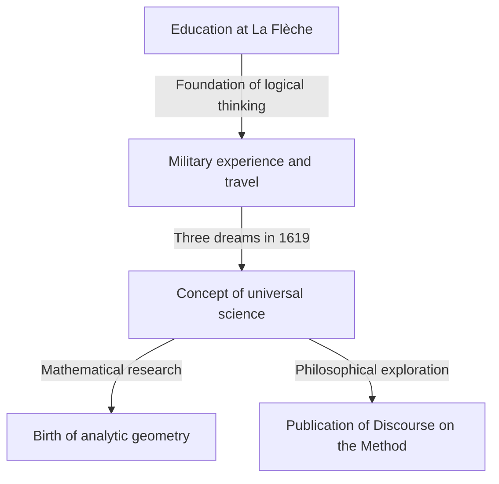

## 1. Introduction

René Descartes (1596-1650) was a French philosopher, mathematician, and scientist. He left the famous phrase "I think, therefore I am (Cogito, ergo sum)" and is widely known as the father of modern philosophy. However, the role he played in the history of mathematics was as immense as his philosophical achievements.

Descartes' greatest mathematical achievement was the creation of **analytic geometry**, which merged algebra and geometry. In this article, we will explain in detail the episodes of his life and the revolution he brought to the world of mathematics.

## 2. Descartes' Life: A Traveler of Thought

### Childhood and Collège Royal Henry-Le-Grand at La Flèche

Descartes was born in 1596 in La Haye en Touraine (now Descartes), France. He lost his mother shortly after birth and was himself a sickly child. At the age of 10, he entered the Jesuit Collège Royal Henry-Le-Grand at La Flèche. Considering his talent and frail constitution, the rector specially permitted him to rest in bed until late in the morning. This habit of "indulging in thought in bed" would continue throughout his life.

### Military Experience and the Revelation of Dreams

After graduating from the college, he obtained a degree in law at the University of Poitiers, but he set out on a journey to learn from "the great book of the world". When the Thirty Years' War broke out, he volunteered for the Dutch army.

On November 10, 1619, while wintering near Ulm in Germany, Descartes had three mysterious dreams while deep in thought in a warm stove-heated room. He interpreted this as a revelation of the "foundation of an amazing science". This experience is said to be the origin of his concept of Mathesis universalis (a universal system of knowledge based on mathematical truths).

## 3. Mathematical Achievements: The Birth of Analytic Geometry

The "Discourse on the Method", published anonymously by Descartes in 1637, was accompanied by three essays. One of them was "Geometry" (La Géométrie). In this work, he presented a groundbreaking idea that rewrote the history of mathematics.

### Invention of the Coordinate System

In mathematics until then, "algebra" dealing with formulas and "geometry" dealing with shapes were considered entirely separate fields. Descartes discovered that by drawing two orthogonal number lines (the $x$-axis and the $y$-axis) on a plane, any point on the plane could be represented as a pair of two numbers $(x, y)$. This is what we currently call the **Cartesian coordinate system**.

This made it possible to express geometric shapes (such as lines, circles, and parabolas) as algebraic equations and solve them by calculation. For example, a circle with radius $r$ centered at the origin is expressed by the following equation:

$$
x^2 + y^2 = r^2
$$

### What the Fusion of Algebra and Geometry Brought

Descartes' idea made it possible to reduce difficult geometric problems to algebraic calculations. In addition, the notation for literal expressions was also organized by Descartes. The use of $x, y, z$ for unknowns and $a, b, c$ for knowns, as well as the notation expressing exponents by writing small numbers to the upper right, such as $x^2, x^3$, were also introduced by him in "Geometry".

Below is the formula for finding the distance between two points on a coordinate plane. The distance $d$ between point $A(x_1, y_1)$ and point $B(x_2, y_2)$ is expressed as follows using the Pythagorean theorem:

$$
d = \sqrt{(x_2 - x_1)^2 + (y_2 - y_1)^2} \quad \text{(Distance between two points)}
$$

## 4. Impact on Philosophy and Science

Descartes' analytic geometry became an indispensable foundation for the subsequent development of mathematics and physics. It can be said that the creation of calculus by Isaac Newton and Gottfried Leibniz was only possible because of the stage provided by the Cartesian coordinate system.

In addition, his "methodological doubt" in philosophy, an approach to finding certain truths after doubting everything, established the spirit of rationalism that serves as the foundation of scientific inquiry.

## 5. Conclusion

Descartes was a man who loved thought so much that an anecdote remains that he stayed in bed until late in the morning observing the movement of a fly on the ceiling. (According to one theory, trying to express the movement of this fly led to the idea of the coordinate system).

The life and thought of René Descartes continue to give us much inspiration today, transcending the boundaries of academic disciplines. When we consider that today's computer graphics, AI, and all kinds of scientific technology operate on the coordinate system he left behind, we can once again realize his greatness.
