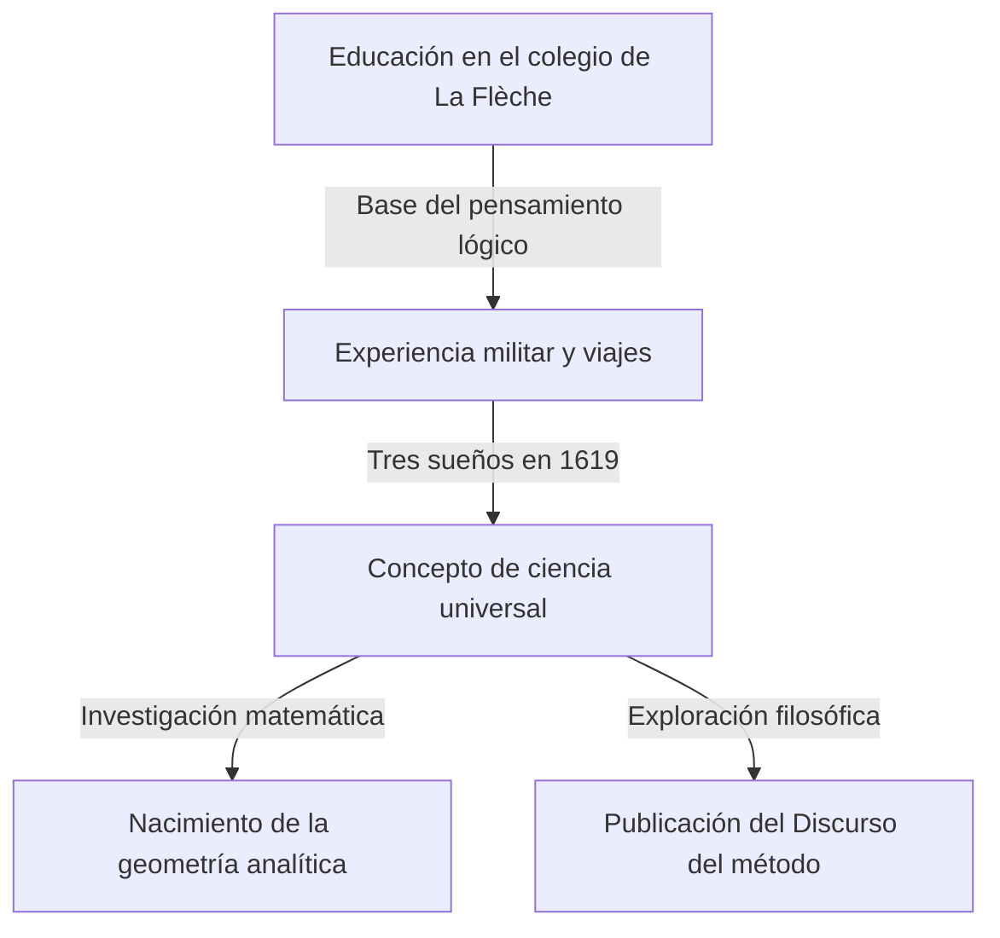

## 1. Introducción

[René Descartes](https://kenji.blog/es/p/descartes/) (1596-1650) fue un filósofo, matemático y científico francés. Dejó la famosa frase "Pienso, luego existo (Cogito, ergo sum)" y es ampliamente conocido como el padre de la filosofía moderna. Sin embargo, el papel que desempeñó en la historia de las matemáticas fue tan inmenso como sus logros filosóficos.

El mayor logro matemático de Descartes fue la creación de la **geometría analítica**, que fusionó el álgebra y la geometría. En este artículo, explicaremos en detalle los episodios de su vida y la revolución que trajo al mundo de las matemáticas.

## 2. La vida de Descartes: Un viajero del pensamiento

### Infancia y el Collège Royal Henry-Le-Grand en La Flèche

Descartes nació en 1596 en La Haye en Touraine (ahora Descartes), Francia. Perdió a su madre poco después de nacer y él mismo era un niño enfermizo. A la edad de 10 años, ingresó en el colegio jesuita de La Flèche. Considerando su talento y su frágil constitución, el rector le permitió excepcionalmente descansar en la cama hasta tarde en la mañana. Este hábito de "entregarse al pensamiento en la cama" continuaría a lo largo de su vida.

### Experiencia militar y la revelación de los sueños

Después de graduarse del colegio, obtuvo un título en derecho en la Universidad de Poitiers, pero emprendió un viaje para aprender del "gran libro del mundo". Cuando estalló la Guerra de los Treinta Años, se ofreció como voluntario para el ejército holandés.

El 10 de noviembre de 1619, mientras pasaba el invierno cerca de Ulm en Alemania, Descartes tuvo tres sueños misteriosos mientras estaba sumido en sus pensamientos en una habitación cálida. Interpretó esto como una revelación de los "fundamentos de una ciencia admirable". Se dice que esta experiencia es el origen de su concepto de Mathesis universalis (un sistema universal de conocimiento basado en verdades matemáticas).

## 3. Logros matemáticos: El nacimiento de la geometría analítica

El "Discurso del método", publicado de forma anónima por Descartes en 1637, iba acompañado de tres ensayos. Uno de ellos fue la "Geometría" (La Géométrie). En esta obra, presentó una idea revolucionaria que reescribió la historia de las matemáticas.

### Invención del sistema de coordenadas

En las matemáticas de entonces, el "álgebra" que trataba de fórmulas y la "geometría" que trataba de formas se consideraban campos completamente separados. Descartes descubrió que al dibujar dos rectas numéricas ortogonales (el eje $x$ y el eje $y$) en un plano, cualquier punto del plano podía representarse como un par de dos números $(x, y)$. Esto es lo que actualmente llamamos el **sistema de coordenadas cartesianas**.

Esto hizo posible expresar formas geométricas (como líneas, círculos y parábolas) como ecuaciones algebraicas y resolverlas mediante cálculo. Por ejemplo, un círculo de radio $r$ centrado en el origen se expresa mediante la siguiente ecuación:

$$
x^2 + y^2 = r^2
$$

### Lo que aportó la fusión del álgebra y la geometría

La idea de Descartes hizo posible reducir problemas geométricos difíciles a cálculos algebraicos. Además, la notación de las expresiones literales también fue organizada por Descartes. El uso de $x, y, z$ para las incógnitas y $a, b, c$ para los valores conocidos, así como la notación que expresa los exponentes escribiendo números pequeños en la parte superior derecha, como $x^2, x^3$, también fueron introducidos por él en la "Geometría".

A continuación se muestra la fórmula para encontrar la distancia entre dos puntos en un plano de coordenadas. La distancia $d$ entre el punto $A(x_1, y_1)$ y el punto $B(x_2, y_2)$ se expresa de la siguiente manera utilizando el teorema de Pitágoras:

$$
d = \sqrt{(x_2 - x_1)^2 + (y_2 - y_1)^2} \quad \text{(Distancia entre dos puntos)}
$$

## 4. Impacto en la filosofía y la ciencia

La geometría analítica de Descartes se convirtió en un pilar indispensable para el desarrollo posterior de las matemáticas y la física. Se puede decir que la creación del cálculo por [Isaac Newton](https://kenji.blog/es/p/newton/) y [Gottfried Leibniz](https://kenji.blog/es/p/leibniz/) solo fue posible gracias al escenario proporcionado por el sistema de coordenadas cartesianas.

Además, su "duda metódica" en filosofía, un enfoque para encontrar verdades ciertas después de dudar de todo, estableció el espíritu del racionalismo que sirve de base para la investigación científica.

## 5. Conclusión

Descartes era un hombre que amaba tanto el pensamiento que queda la anécdota de que se quedaba en la cama hasta tarde en la mañana observando el movimiento de una mosca en el techo. (Según una teoría, tratar de expresar el movimiento de esta mosca condujo a la idea del sistema de coordenadas).

La vida y el pensamiento de [René Descartes](https://kenji.blog/es/p/descartes/) nos siguen sirviendo de inspiración hoy en día, trascendiendo las fronteras de las disciplinas académicas. Cuando consideramos que los gráficos por computadora, la IA y todo tipo de tecnología científica actuales operan en el sistema de coordenadas que dejó, podemos darnos cuenta una vez más de su grandeza.
