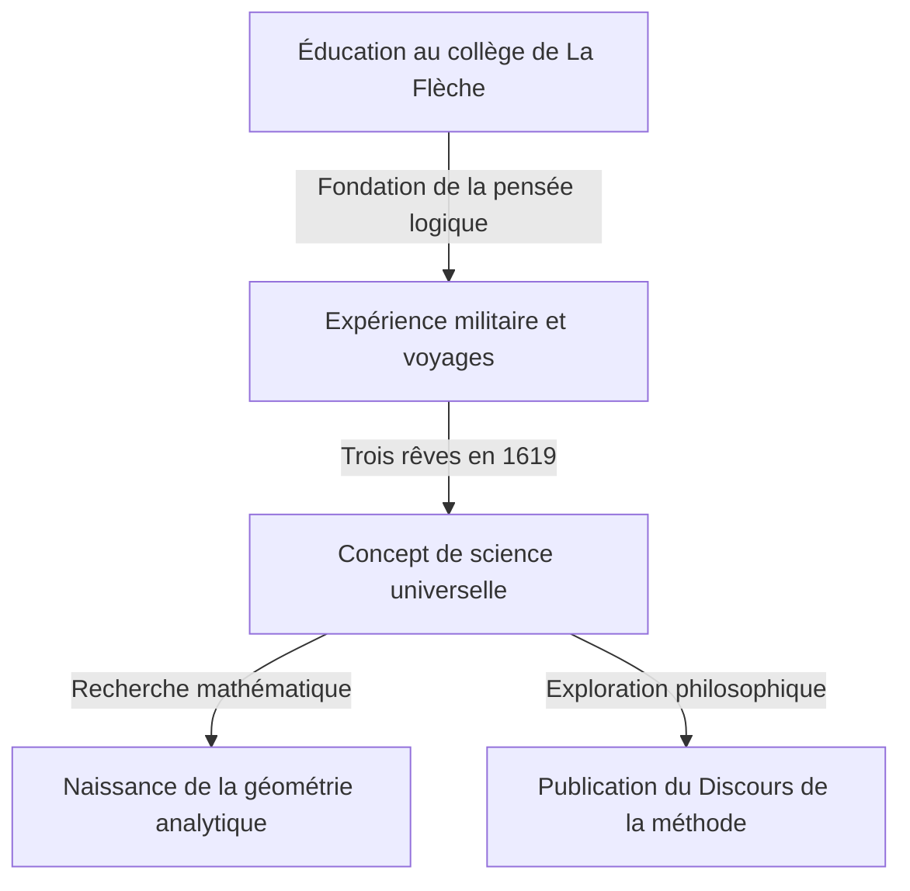

## 1. Introduction

[René Descartes](https://kenji.blog/fr/p/descartes/) (1596-1650) était un philosophe, mathématicien et scientifique français. Il a laissé la célèbre phrase "Je pense, donc je suis (Cogito, ergo sum)" et est largement connu comme le père de la philosophie moderne. Cependant, le rôle qu'il a joué dans l'histoire des mathématiques était tout aussi immense que ses réalisations philosophiques.

La plus grande réalisation mathématique de Descartes a été la création de la **géométrie analytique**, qui a fusionné l'algèbre et la géométrie. Dans cet article, nous expliquerons en détail les épisodes de sa vie et la révolution qu'il a apportée au monde des mathématiques.

## 2. La vie de Descartes : Un voyageur de la pensée

### Enfance et le Collège Royal Henry-Le-Grand à La Flèche

Descartes est né en 1596 à La Haye en Touraine (aujourd'hui Descartes), en France. Il a perdu sa mère peu après sa naissance et était lui-même un enfant maladif. À l'âge de 10 ans, il entre au Collège jésuite de La Flèche. Compte tenu de son talent et de sa constitution fragile, le recteur lui a exceptionnellement permis de se reposer au lit jusqu'à tard dans la matinée. Cette habitude de "se livrer à la réflexion au lit" se poursuivra tout au long de sa vie.

### Expérience militaire et la révélation des rêves

Après avoir obtenu son diplôme universitaire, il a obtenu un diplôme en droit à l'Université de Poitiers, mais il a entrepris un voyage pour apprendre du "grand livre du monde". Lorsque la guerre de Trente Ans a éclaté, il s'est porté volontaire pour l'armée néerlandaise.

Le 10 novembre 1619, alors qu'il passait l'hiver près d'Ulm en Allemagne, Descartes a fait trois rêves mystérieux alors qu'il était plongé dans ses pensées dans une pièce chauffée par un poêle. Il a interprété cela comme une révélation du "fondement d'une science admirable". On dit que cette expérience est à l'origine de son concept de Mathesis universalis (un système universel de connaissances basé sur des vérités mathématiques).

## 3. Réalisations mathématiques : La naissance de la géométrie analytique

Le "Discours de la méthode", publié anonymement par Descartes en 1637, était accompagné de trois essais. L'un d'eux était la "Géométrie" (La Géométrie). Dans ce travail, il a présenté une idée révolutionnaire qui a réécrit l'histoire des mathématiques.

### Invention du système de coordonnées

Dans les mathématiques d'alors, "l'algèbre" traitant des formules et "la géométrie" traitant des formes étaient considérées comme des domaines entièrement séparés. Descartes a découvert qu'en traçant deux droites numériques orthogonales (l'axe $x$ et l'axe $y$) sur un plan, n'importe quel point sur le plan pouvait être représenté comme une paire de deux nombres $(x, y)$. C'est ce que nous appelons actuellement le **système de coordonnées cartésiennes**.

Cela a permis d'exprimer des formes géométriques (telles que des lignes, des cercles et des paraboles) sous forme d'équations algébriques et de les résoudre par le calcul. Par exemple, un cercle de rayon $r$ centré à l'origine est exprimé par l'équation suivante :

$$
x^2 + y^2 = r^2
$$

### Ce que la fusion de l'algèbre et de la géométrie a apporté

L'idée de Descartes a permis de réduire des problèmes géométriques difficiles à des calculs algébriques. De plus, la notation des expressions littérales a également été organisée par Descartes. L'utilisation de $x, y, z$ pour les inconnues et $a, b, c$ pour les valeurs connues, ainsi que la notation exprimant les exposants en écrivant de petits nombres en haut à droite, comme $x^2, x^3$, ont également été introduites par lui dans la "Géométrie".

Ci-dessous se trouve la formule pour trouver la distance entre deux points sur un plan de coordonnées. La distance $d$ entre le point $A(x_1, y_1)$ et le point $B(x_2, y_2)$ s'exprime comme suit en utilisant le théorème de Pythagore :

$$
d = \sqrt{(x_2 - x_1)^2 + (y_2 - y_1)^2} \quad \text{(Distance entre deux points)}
$$

## 4. Impact sur la philosophie et la science

La géométrie analytique de Descartes est devenue une fondation indispensable pour le développement ultérieur des mathématiques et de la physique. On peut dire que la création du calcul infinitésimal par [Isaac Newton](https://kenji.blog/fr/p/newton/) et [Gottfried Leibniz](https://kenji.blog/fr/p/leibniz/) n'a été possible qu'en raison du décor fourni par le système de coordonnées cartésiennes.

De plus, son "doute méthodique" en philosophie, une approche pour trouver des vérités certaines après avoir douté de tout, a établi l'esprit de rationalisme qui sert de fondement à la recherche scientifique.

## 5. Conclusion

Descartes était un homme qui aimait tellement la pensée qu'une anecdote raconte qu'il restait au lit jusqu'à tard dans la matinée à observer le mouvement d'une mouche au plafond. (Selon une théorie, essayer d'exprimer le mouvement de cette mouche a conduit à l'idée du système de coordonnées).

La vie et la pensée de [René Descartes](https://kenji.blog/fr/p/descartes/) continuent de nous donner beaucoup d'inspiration aujourd'hui, transcendant les frontières des disciplines académiques. Lorsque nous considérons que l'infographie d'aujourd'hui, l'IA et toutes sortes de technologies scientifiques fonctionnent sur le système de coordonnées qu'il a laissé derrière lui, nous pouvons à nouveau réaliser sa grandeur.
