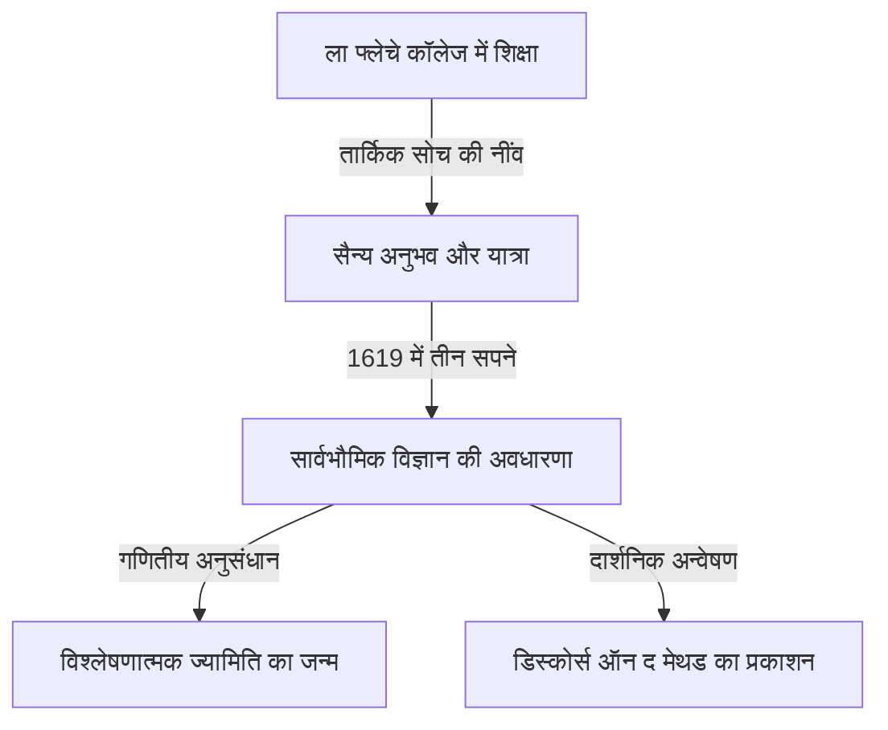

## 1. परिचय

रेने डेसकार्टेस (1596-1650) एक फ्रांसीसी दार्शनिक, गणितज्ञ और वैज्ञानिक थे। उन्होंने प्रसिद्ध वाक्यांश "मैं सोचता हूँ, इसलिए मैं हूँ (Cogito, ergo sum)" छोड़ा और व्यापक रूप से आधुनिक दर्शन के जनक के रूप में जाने जाते हैं। हालाँकि, गणित के इतिहास में उन्होंने जो भूमिका निभाई, वह उनकी दार्शनिक उपलब्धियों जितनी ही अपार थी।

डेसकार्टेस की सबसे बड़ी गणितीय उपलब्धि **विश्लेषणात्मक ज्यामिति** का निर्माण था, जिसने बीजगणित और ज्यामिति का विलय किया। इस लेख में, हम उनके जीवन के प्रसंगों और गणित की दुनिया में उनके द्वारा लाई गई क्रांति के बारे में विस्तार से बताएंगे।

## 2. डेसकार्टेस का जीवन: विचार के एक यात्री

### बचपन और ला फ्लेचे में कॉलेज रॉयल हेनरी-ले-ग्रैंड

डेसकार्टेस का जन्म 1596 में ला हे एन टौरेन (अब डेसकार्टेस), फ्रांस में हुआ था। जन्म के कुछ समय बाद ही उन्होंने अपनी माँ को खो दिया और वे स्वयं एक बीमार बच्चे थे। 10 साल की उम्र में, उन्होंने ला फ्लेचे में जेसुइट कॉलेज में प्रवेश किया। उनकी प्रतिभा और कमजोर संविधान को देखते हुए, रेक्टर ने विशेष रूप से उन्हें सुबह देर तक बिस्तर पर आराम करने की अनुमति दी। "बिस्तर पर विचारों में लिप्त होने" की यह आदत उनके जीवन भर जारी रही।

### सैन्य अनुभव और सपनों का रहस्योद्घाटन

कॉलेज से स्नातक होने के बाद, उन्होंने पोइटियर्स विश्वविद्यालय में कानून की डिग्री प्राप्त की, लेकिन वे "दुनिया की महान पुस्तक" से सीखने के लिए एक यात्रा पर निकल पड़े। जब तीस साल का युद्ध छिड़ गया, तो उन्होंने डच सेना के लिए स्वेच्छा से काम किया।

10 नवंबर, 1619 को, जर्मनी में उल्म के पास सर्दियाँ बिताते समय, डेसकार्टेस ने एक गर्म स्टोव वाले कमरे में गहरे विचारों में डूबे रहने के दौरान तीन रहस्यमयी सपने देखे। उन्होंने इसे "एक अद्भुत विज्ञान की नींव" के रहस्योद्घाटन के रूप में व्याख्या की। कहा जाता है कि यह अनुभव मैथेसिस यूनिवर्सलिस (गणितीय सत्य के आधार पर ज्ञान की एक सार्वभौमिक प्रणाली) की उनकी अवधारणा का मूल है।

## 3. गणितीय उपलब्धियाँ: विश्लेषणात्मक ज्यामिति का जन्म

1637 में डेसकार्टेस द्वारा गुमनाम रूप से प्रकाशित "डिस्कोर्स ऑन द मेथड" के साथ तीन निबंध थे। उनमें से एक "ज्यामिति" (La Géométrie) था। इस काम में, उन्होंने एक अभूतपूर्व विचार प्रस्तुत किया जिसने गणित के इतिहास को फिर से लिखा।

### समन्वय प्रणाली का आविष्कार

तब तक गणित में, सूत्रों से निपटने वाले "बीजगणित" और आकृतियों से निपटने वाले "ज्यामिति" को पूरी तरह से अलग क्षेत्र माना जाता था। डेसकार्टेस ने पता लगाया कि एक तल पर दो लंबकोणीय संख्या रेखाएँ ($x$-अक्ष और $y$-अक्ष) खींचकर, तल पर किसी भी बिंदु को दो संख्याओं के जोड़े $(x, y)$ के रूप में दर्शाया जा सकता है। इसे हम वर्तमान में **कार्टेशियन समन्वय प्रणाली** कहते हैं।

इससे ज्यामितीय आकृतियों (जैसे रेखाएँ, वृत्त और परवलय) को बीजगणितीय समीकरणों के रूप में व्यक्त करना और उन्हें गणना द्वारा हल करना संभव हो गया। उदाहरण के लिए, मूल पर केंद्रित त्रिज्या $r$ वाले एक वृत्त को निम्नलिखित समीकरण द्वारा व्यक्त किया जाता है:

$$
x^2 + y^2 = r^2
$$

### बीजगणित और ज्यामिति के संलयन से क्या हुआ

डेसकार्टेस के विचार ने कठिन ज्यामितीय समस्याओं को बीजगणितीय गणनाओं तक सीमित करना संभव बना दिया। इसके अलावा, शाब्दिक अभिव्यक्तियों के लिए संकेतन भी डेसकार्टेस द्वारा व्यवस्थित किया गया था। अज्ञात के लिए $x, y, z$ और ज्ञात के लिए $a, b, c$ का उपयोग, साथ ही $x^2, x^3$ जैसे ऊपरी दाएं भाग में छोटी संख्याएँ लिखकर घातांक व्यक्त करने वाले संकेतन भी उनके द्वारा "ज्यामिति" में पेश किए गए थे।

नीचे समन्वय तल पर दो बिंदुओं के बीच की दूरी ज्ञात करने का सूत्र दिया गया है। बिंदु $A(x_1, y_1)$ और बिंदु $B(x_2, y_2)$ के बीच की दूरी $d$ को पाइथागोरस प्रमेय का उपयोग करके इस प्रकार व्यक्त किया जाता है:

$$
d = \sqrt{(x_2 - x_1)^2 + (y_2 - y_1)^2} \quad \text{(दो बिंदुओं के बीच की दूरी)}
$$

## 4. दर्शन और विज्ञान पर प्रभाव

डेसकार्टेस की विश्लेषणात्मक ज्यामिति गणित और भौतिकी के बाद के विकास के लिए एक अपरिहार्य आधार बन गई। यह कहा जा सकता है कि आइजैक न्यूटन और गॉटफ्रीड लाइबनिज द्वारा कलन का निर्माण केवल इसलिए संभव था क्योंकि कार्टेशियन समन्वय प्रणाली द्वारा प्रदान किया गया मंच था।

इसके अलावा, दर्शन में उनका "पद्धतिगत संदेह", हर चीज पर संदेह करने के बाद कुछ निश्चित सत्य खोजने का एक दृष्टिकोण है, जिसने तर्कवाद की भावना स्थापित की जो वैज्ञानिक जांच की नींव के रूप में कार्य करती है।

## 5. निष्कर्ष

डेसकार्टेस एक ऐसे व्यक्ति थे जिन्हें विचारों से इतना प्यार था कि एक किस्सा यह है कि वह सुबह देर तक बिस्तर पर रहकर छत पर एक मक्खी की गति को देखते थे। (एक सिद्धांत के अनुसार, इस मक्खी की गति को व्यक्त करने की कोशिश करने से समन्वय प्रणाली का विचार आया)।

रेने डेसकार्टेस का जीवन और विचार आज भी हमें बहुत प्रेरणा देते हैं, जो शैक्षणिक विषयों की सीमाओं को पार करते हैं। जब हम विचार करते हैं कि आज के कंप्यूटर ग्राफिक्स, एआई और सभी प्रकार की वैज्ञानिक तकनीक उनके द्वारा पीछे छोड़ी गई समन्वय प्रणाली पर काम करती हैं, तो हम एक बार फिर उनकी महानता का एहसास कर सकते हैं।
