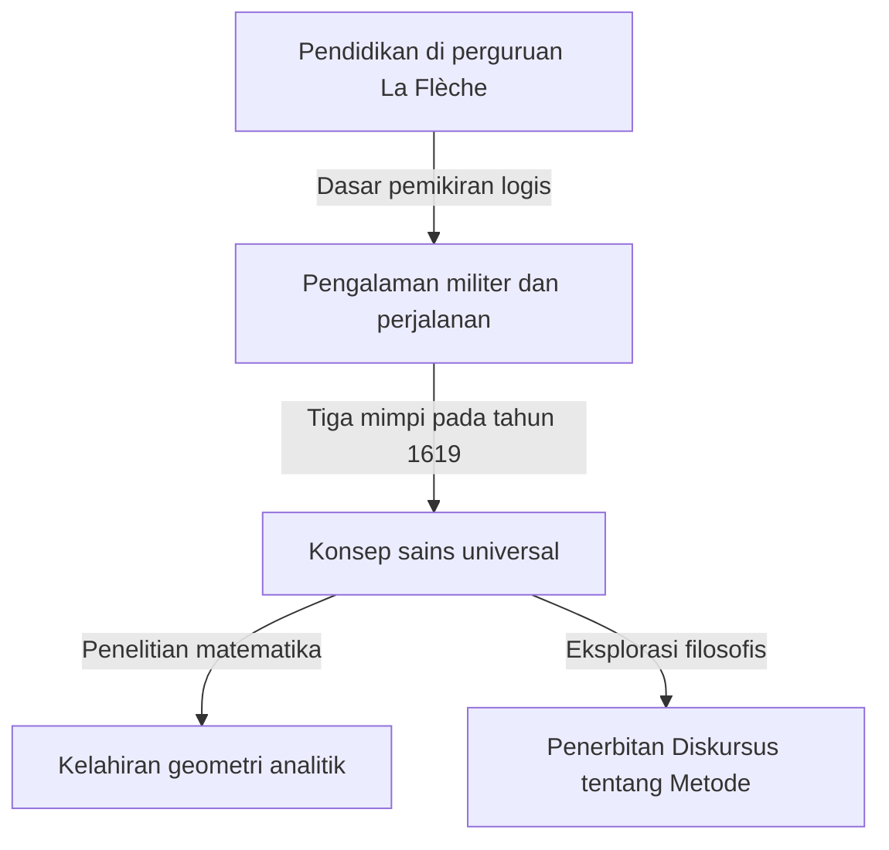

## 1. Pendahuluan

[René Descartes](https://kenji.blog/id/p/descartes/) (1596-1650) adalah seorang filsuf, matematikawan, dan ilmuwan Prancis. Ia meninggalkan ungkapan terkenal "Aku berpikir, maka aku ada (Cogito, ergo sum)" dan secara luas dikenal sebagai bapak filsafat modern. Namun, peran yang dimainkannya dalam sejarah matematika sama besarnya dengan pencapaian filosofisnya.

Pencapaian matematika terbesar [Descartes](https://kenji.blog/id/p/descartes/) adalah penciptaan **geometri analitik**, yang menggabungkan aljabar dan geometri. Dalam artikel ini, kami akan menjelaskan secara rinci tentang episode-episode kehidupannya dan revolusi yang dibawanya ke dunia matematika.

## 2. Kehidupan [Descartes](https://kenji.blog/id/p/descartes/): Seorang Pengembara Pemikiran

### Masa Kecil dan Collège Royal Henry-Le-Grand di La Flèche

[Descartes](https://kenji.blog/id/p/descartes/) lahir pada tahun 1596 di La Haye en Touraine (sekarang [Descartes](https://kenji.blog/id/p/descartes/)), Prancis. Ia kehilangan ibunya tak lama setelah kelahirannya dan ia sendiri adalah anak yang sakit-sakitan. Pada usia 10 tahun, ia masuk perguruan tinggi Jesuit di La Flèche. Mempertimbangkan bakat dan fisiknya yang lemah, rektor secara khusus mengizinkannya untuk beristirahat di tempat tidur hingga larut pagi. Kebiasaan "tenggelam dalam pemikiran di tempat tidur" ini akan terus berlanjut sepanjang hidupnya.

### Pengalaman Militer dan Wahyu dari Mimpi

Setelah lulus dari perguruan tinggi, ia memperoleh gelar sarjana hukum di Universitas Poitiers, tetapi ia memulai perjalanan untuk belajar dari "buku besar dunia". Ketika Perang Tiga Puluh Tahun pecah, ia menjadi sukarelawan untuk tentara Belanda.

Pada tanggal 10 November 1619, saat menghabiskan musim dingin di dekat Ulm di Jerman, [Descartes](https://kenji.blog/id/p/descartes/) mengalami tiga mimpi misterius saat tenggelam dalam pemikiran di ruangan hangat yang dipanaskan kompor. Ia menafsirkannya sebagai wahyu tentang "dasar-dasar ilmu pengetahuan yang menakjubkan". Pengalaman ini dikatakan sebagai asal mula konsep Mathesis universalis (sistem pengetahuan universal yang didasarkan pada kebenaran matematika).

## 3. Pencapaian Matematika: Kelahiran Geometri Analitik

"Diskursus tentang Metode", yang diterbitkan secara anonim oleh [Descartes](https://kenji.blog/id/p/descartes/) pada tahun 1637, disertai dengan tiga esai. Salah satunya adalah "Geometri" (La Géométrie). Dalam karya ini, ia menyajikan ide terobosan yang menulis ulang sejarah matematika.

### Penemuan Sistem Koordinat

Dalam matematika hingga saat itu, "aljabar" yang berurusan dengan rumus dan "geometri" yang berurusan dengan bentuk dianggap sebagai bidang yang sama sekali terpisah. [Descartes](https://kenji.blog/id/p/descartes/) menemukan bahwa dengan menggambar dua garis bilangan ortogonal (sumbu $x$ dan sumbu $y$) pada sebuah bidang, setiap titik pada bidang dapat direpresentasikan sebagai sepasang dua angka $(x, y)$. Inilah yang saat ini kita sebut sebagai **sistem koordinat Kartesius**.

Hal ini memungkinkan untuk mengekspresikan bentuk geometris (seperti garis, lingkaran, dan parabola) sebagai persamaan aljabar dan menyelesaikannya dengan perhitungan. Misalnya, sebuah lingkaran dengan jari-jari $r$ yang berpusat di titik asal dinyatakan dengan persamaan berikut:

$$
x^2 + y^2 = r^2
$$

### Apa yang Dibawa oleh Penggabungan Aljabar dan Geometri

Ide [Descartes](https://kenji.blog/id/p/descartes/) memungkinkan untuk mengurangi masalah geometris yang sulit menjadi perhitungan aljabar. Selain itu, notasi untuk ekspresi harfiah juga diatur oleh [Descartes](https://kenji.blog/id/p/descartes/). Penggunaan $x, y, z$ untuk yang tidak diketahui dan $a, b, c$ untuk nilai yang diketahui, serta notasi yang menyatakan eksponen dengan menulis angka kecil di kanan atas, seperti $x^2, x^3$, juga diperkenalkan olehnya dalam "Geometri".

Di bawah ini adalah rumus untuk mencari jarak antara dua titik pada bidang koordinat. Jarak $d$ antara titik $A(x_1, y_1)$ dan titik $B(x_2, y_2)$ dinyatakan sebagai berikut menggunakan teorema [Pythagoras](https://kenji.blog/id/p/pythagoras/):

$$
d = \sqrt{(x_2 - x_1)^2 + (y_2 - y_1)^2} \quad \text{(Jarak antara dua titik)}
$$

## 4. Dampak pada Filsafat dan Sains

Geometri analitik [Descartes](https://kenji.blog/id/p/descartes/) menjadi fondasi yang sangat diperlukan untuk perkembangan matematika dan fisika selanjutnya. Dapat dikatakan bahwa penciptaan kalkulus oleh [Isaac Newton](https://kenji.blog/id/p/newton/) dan [Gottfried Leibniz](https://kenji.blog/id/p/leibniz/) hanya mungkin terjadi karena panggung yang disediakan oleh sistem koordinat Kartesius.

Selain itu, "keraguan metodologis" miliknya dalam filsafat, sebuah pendekatan untuk menemukan kebenaran yang pasti setelah meragukan segalanya, menetapkan semangat rasionalisme yang berfungsi sebagai dasar penyelidikan ilmiah.

## 5. Kesimpulan

[Descartes](https://kenji.blog/id/p/descartes/) adalah seorang pria yang sangat menyukai pemikiran sehingga ada sebuah anekdot bahwa ia tetap berada di tempat tidur hingga larut pagi mengamati pergerakan lalat di langit-langit. (Menurut satu teori, mencoba mengekspresikan pergerakan lalat ini mengarah pada ide sistem koordinat).

Kehidupan dan pemikiran [René Descartes](https://kenji.blog/id/p/descartes/) terus memberi kita banyak inspirasi hingga hari ini, melampaui batas-batas disiplin akademik. Ketika kita menganggap bahwa grafik komputer saat ini, AI, dan semua jenis teknologi ilmiah beroperasi pada sistem koordinat yang ditinggalkannya, kita dapat menyadari kehebatannya sekali lagi.
