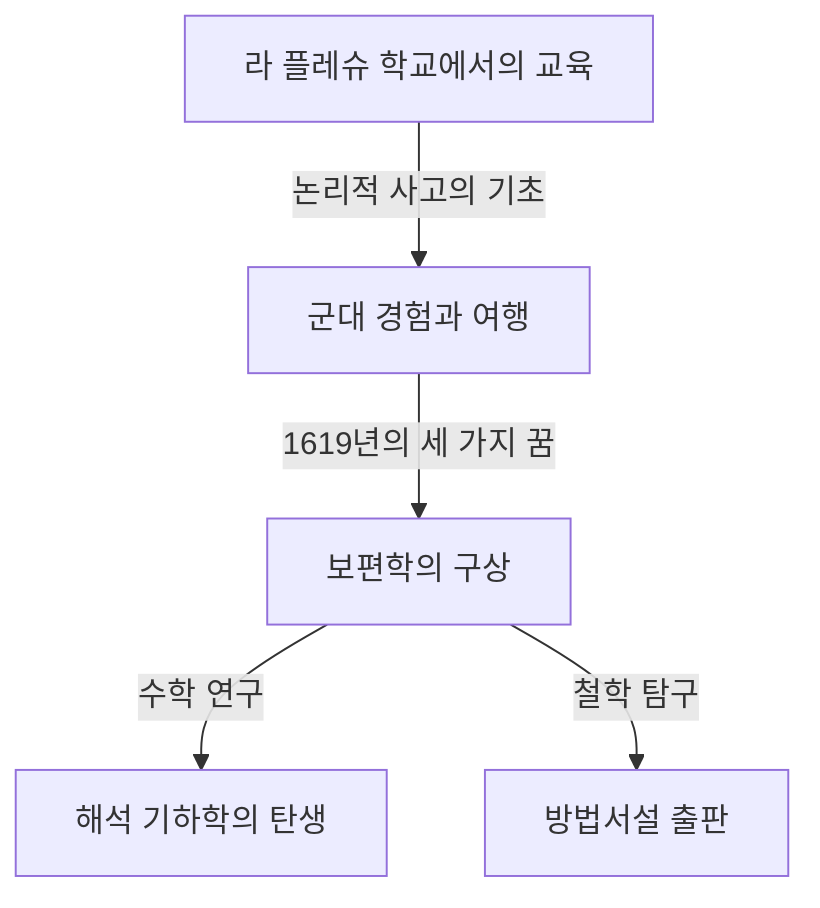

## 1. 서론

[르네 데카르트](https://kenji.blog/ko/p/descartes/) ([René Descartes](https://kenji.blog/ko/p/descartes/), 1596-1650) 는 프랑스 태생의 철학자이자 수학자, 과학자입니다. "나는 생각한다, 고로 나는 존재한다 (Cogito, ergo sum)" 라는 유명한 말을 남겼으며, 근대 철학의 아버지로 널리 알려져 있습니다. 그러나 수학의 역사에서 그가 한 역할은 철학적 업적에 뒤지지 않을 만큼 거대한 것이었습니다.

데카르트의 가장 큰 수학적 업적은 대수학과 기하학을 융합한 **해석 기하학** (analytic geometry) 의 창시입니다. 본 기사에서는 그의 생애 에피소드와 수학 세계에 가져온 혁명에 대해 자세히 설명합니다.

## 2. 데카르트의 생애: 사색의 여행자

### 유년기와 라 플레슈 학교

데카르트는 1596년 프랑스 투렌 지방의 라 에 (현재의 데카르트시) 에서 태어났습니다. 생후 얼마 되지 않아 어머니를 여의고, 자신도 병약한 소년이었습니다. 10살 무렵, 예수회가 운영하는 라 플레슈 학교에 입학합니다. 그의 재능과 허약한 체질을 고려한 교장은 특별히 아침 늦게까지 침대에서 쉬는 것을 허락했습니다. 이 "침대에서 사색에 잠기는" 습관은 그의 평생을 통해 계속됩니다.

### 군대 경험과 "놀라운 학문의 기초"

학교를 졸업한 후 푸아티에 대학에서 법학 학위를 취득했지만, 그는 "세계라는 큰 책" 을 배우기 위해 여행을 떠납니다. 30년 전쟁이 발발하자 그는 네덜란드 군대에 지원했습니다.

1619년 11월 10일, 독일 울름 근처에서 겨울을 나던 데카르트는 따뜻한 난로 방에서 사색에 잠겨 있던 중 세 가지 신비한 꿈을 꾸었습니다. 그는 이를 "놀라운 학문의 기초" 의 계시로 받아들였습니다. 이 경험이 그의 보편학 (수학적 진리에 기초한 보편적인 학문 체계) 구상의 원점이 되었다고 합니다.

## 3. 수학에서의 업적: 해석 기하학의 탄생

데카르트가 1637년에 익명으로 출판한 "방법서설" 에는 세 가지 소논문이 부속되어 있었습니다. 그 중 하나가 "기하학" (La Géométrie) 입니다. 이 저작에서 그는 수학사를 새로 쓰는 획기적인 아이디어를 제시했습니다.

### 좌표계의 발명

그때까지의 수학에서는 수식을 다루는 "대수학" 과 도형을 다루는 "기하학" 은 전혀 다른 분야로 여겨졌습니다. 데카르트는 평면 위에 두 개의 직교하는 수직선 ( $x$ 축과 $y$ 축) 을 그음으로써 평면 위의 임의의 점을 두 수의 쌍 $(x, y)$ 로 표현할 수 있다는 것을 발견했습니다. 현재 우리가 **데카르트 좌표계** (Cartesian coordinate system) 라고 부르는 것입니다.

이로 인해 기하학적인 도형 (직선이나 원, 포물선 등) 을 대수적인 방정식으로 표현하고 계산으로 푸는 것이 가능해졌습니다. 예를 들어, 원점을 중심으로 하는 반지름 $r$ 인 원은 다음 방정식으로 표현됩니다.

$$
x^2 + y^2 = r^2
$$

### 대수와 기하의 융합이 가져온 것

데카르트의 아이디어는 기하학의 난제를 대수 계산으로 귀착시키는 것을 가능하게 했습니다. 또한 문자식의 표기법도 데카르트에 의해 정비되었습니다. 미지수에 $x, y, z$ 를, 기지수에 $a, b, c$ 를 사용하는 것이나, 거듭제곱을 $x^2, x^3$ 과 같이 오른쪽 위에 작은 숫자를 써서 나타내는 표기법도 그가 "기하학" 에서 도입한 것입니다.

아래는 좌표 평면 상의 두 점 사이의 거리를 구하는 공식입니다. 점 $A(x_1, y_1)$ 과 점 $B(x_2, y_2)$ 의 거리 $d$ 는 [피타고라스](/ko/p/pythagoras/)의 정리를 이용하여 다음과 같이 표현됩니다.

$$
d = \sqrt{(x_2 - x_1)^2 + (y_2 - y_1)^2} \quad \text{(두 점 사이의 거리)}
$$

## 4. 철학과 과학에 미친 영향

데카르트의 해석 기하학은 그 후 수학 및 물리학 발전에 없어서는 안 될 토대가 되었습니다. [아이작 뉴턴](https://kenji.blog/ko/p/newton/)이나 [고트프리트 라이프니츠](https://kenji.blog/ko/p/leibniz/)에 의한 미적분학의 창시는 데카르트 좌표계라는 무대가 있었기에 가능했다고 할 수 있습니다.

또한 그의 철학에서의 "방법적 회의" 는 모든 것을 의심한 끝에 확실한 진리를 찾아낸다는 접근 방식이며, 과학적 탐구의 기초가 되는 합리주의 정신을 확립했습니다.

## 5. 결론

아침 늦게까지 침대에서 천장의 파리 움직임을 관찰했다는 일화가 남아 있을 정도로, 데카르트는 사색을 사랑하는 인물이었습니다. (일설에는 이 파리의 움직임을 표현하려 했던 것이 좌표계의 착상으로 이어졌다고도 합니다).

[르네 데카르트](https://kenji.blog/ko/p/descartes/)의 생애와 사상은 학문의 경계를 넘어 현대의 우리에게도 많은 영감을 주고 있습니다. 그가 남긴 좌표계 위에서 오늘의 컴퓨터 그래픽스나 AI, 온갖 과학 기술이 움직이고 있다는 것을 생각하면, 그의 위대함을 다시금 실감할 수 있을 것입니다.
