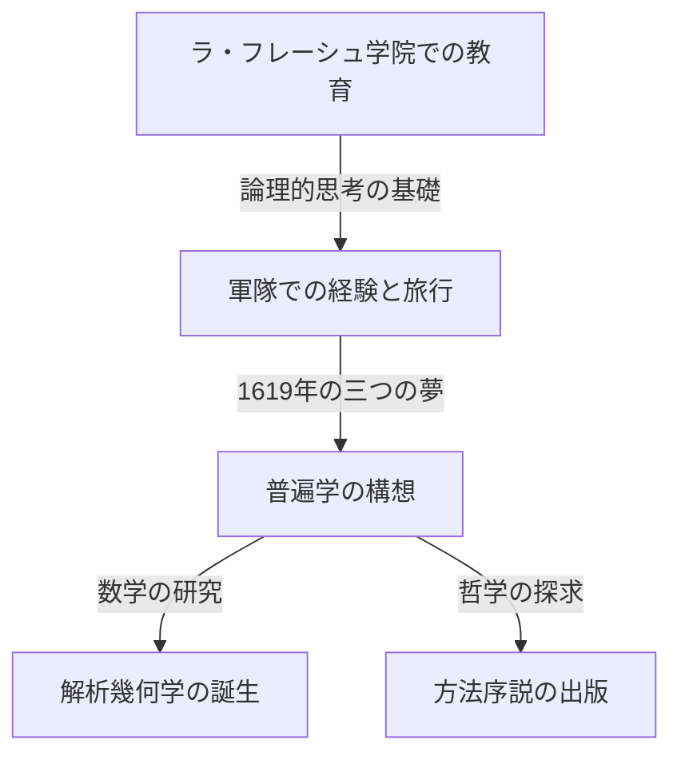

## 1. はじめに

[ルネ・デカルト](https://kenji.blog/p/descartes/) ([René Descartes](https://kenji.blog/p/descartes/), 1596-1650) は、フランス生まれの哲学者であり、数学者、科学者です。「我思う、ゆえに我あり (Cogito, ergo sum)」という有名な言葉を残し、近代哲学の父として広く知られています。しかし、数学の歴史において彼が果たした役割は、その哲学的業績に勝るとも劣らないほど巨大なものでした。

[デカルト](https://kenji.blog/p/descartes/)最大の数学的功績は、代数学と幾何学を融合させた **解析幾何学** (analytic geometry) の創始です。本記事では、彼の生涯のエピソードと、数学の世界にもたらした革命について詳しく解説します。

## 2. [デカルト](https://kenji.blog/p/descartes/)の生涯：思索の旅人

### 幼少期とラ・フレーシュ学院

[デカルト](https://kenji.blog/p/descartes/)は1596年、フランスのトゥーレーヌ地方ラ・エ（現在の[デカルト](https://kenji.blog/p/descartes/)市）で生まれました。生後間もなく母を亡くし、自身も病弱な少年でした。10歳の頃、イエズス会が運営するラ・フレーシュ学院に入学します。彼の才能と虚弱体質を考慮した校長は、特別に朝遅くまでベッドで休むことを許可しました。この「ベッドの中で思索にふける」という習慣は、彼の生涯を通じて続けられることになります。

### 軍隊経験と「驚くべき学問の基礎」

学院を卒業後、ポワティエ大学で法学の学位を取得しましたが、彼は「世界という大きな書物」を学ぶために旅に出ます。三十年戦争が勃発すると、彼はオランダの軍隊に志願しました。

1619年11月10日、ドイツのウルム近郊で冬営していた[デカルト](https://kenji.blog/p/descartes/)は、暖かい炉部屋で思索に耽っていたとき、三つの不思議な夢を見ました。彼はこれを「驚くべき学問の基礎」の啓示と受け取りました。この体験が、彼の普遍学（普遍的な数学的真理に基づく学問体系）構想の原点になったと言われています。

## 3. 数学における業績：解析幾何学の誕生

[デカルト](https://kenji.blog/p/descartes/)が1637年に匿名で出版した『方法序説』には、三つの試論が付属していました。その一つが『幾何学』 (La Géométrie) です。この著作において、彼は数学史を塗り替える画期的なアイデアを提示しました。

### 座標系の発明

それまでの数学では、数式を扱う「代数学」と、図形を扱う「幾何学」は全く別の分野と考えられていました。[デカルト](https://kenji.blog/p/descartes/)は、平面上に2つの直交する数直線（ $x$ 軸と $y$ 軸）を引くことで、平面上の任意の点を2つの数の組 $(x, y)$ として表現できることを発見しました。現在私たちが **[デカルト](https://kenji.blog/p/descartes/)座標系** (Cartesian coordinate system) と呼んでいるものです。

これにより、幾何学的な図形（直線や円、放物線など）を代数的な方程式として表現し、計算で解くことが可能になりました。例えば、原点を中心とする半径 $r$ の円は、次の方程式で表されます。

$$
x^2 + y^2 = r^2
$$

### 代数と幾何の融合がもたらしたもの

[デカルト](https://kenji.blog/p/descartes/)のアイデアは、幾何学の難問を代数の計算に帰着させることを可能にしました。また、文字式の記法も[デカルト](https://kenji.blog/p/descartes/)によって整備されました。未知数に $x, y, z$ を、既知数に $a, b, c$ を用いることや、累乗を $x^2, x^3$ と右上に小さな数字を書いて表す記法も、彼が『幾何学』で導入したものです。

以下は、座標平面上の2点間の距離を求める公式です。点 $A(x_1, y_1)$ と点 $B(x_2, y_2)$ の距離 $d$ は、[ピタゴラス](https://kenji.blog/p/pythagoras/)の定理を用いて次のように表されます。

$$
d = \sqrt{(x_2 - x_1)^2 + (y_2 - y_1)^2} \quad \text{(2点間の距離)}
$$

## 4. 哲学と科学への影響

[デカルト](https://kenji.blog/p/descartes/)の解析幾何学は、その後の数学や物理学の発展に不可欠な土台となりました。アイザック・ニュートンやゴットフリート・ライプニッツによる微積分学の創始は、[デカルト](https://kenji.blog/p/descartes/)座標系という舞台があったからこそ可能だったと言えます。

また、彼の哲学における「方法的懐疑」は、あらゆるものを疑い抜いた末に確実な真理を見出すというアプローチであり、科学的探求の基礎となる合理主義の精神を確立しました。

## 5. おわりに

朝遅くまでベッドで天井の蝿の動きを観察していたという逸話が残るほど、[デカルト](https://kenji.blog/p/descartes/)は思索を愛する人物でした。（一説には、この蝿の動きを表現しようとしたことが座標系の着想につながったとも言われています）。

[ルネ・デカルト](https://kenji.blog/p/descartes/)の生涯と思想は、学問の境界を越えて現代の私たちにも多くのインスピレーションを与え続けています。彼の残した座標系の上で、今日のコンピュータ・[グラフ](https://kenji.blog/p/tree-graph-data-structures-search-dfs-bfs-dijkstra/)ィックスやAI、あらゆる科学技術が動いていることを思えば、彼の偉大さが改めて実感できるでしょう。
