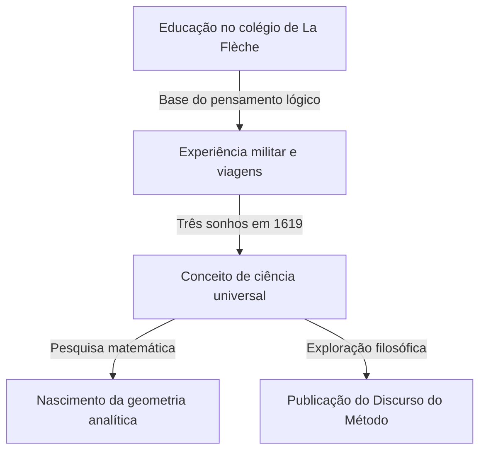

## 1. Introdução

René Descartes (1596-1650) foi um filósofo, matemático e cientista francês. Ele deixou a famosa frase "Penso, logo existo (Cogito, ergo sum)" e é amplamente conhecido como o pai da filosofia moderna. No entanto, o papel que ele desempenhou na história da matemática foi tão imenso quanto suas conquistas filosóficas.

A maior conquista matemática de Descartes foi a criação da **geometria analítica**, que fundiu álgebra e geometria. Neste artigo, explicaremos em detalhes os episódios de sua vida e a revolução que ele trouxe ao mundo da matemática.

## 2. A Vida de Descartes: Um Viajante do Pensamento

### Infância e o Collège Royal Henry-Le-Grand em La Flèche

Descartes nasceu em 1596 em La Haye en Touraine (atualmente Descartes), França. Perdeu a mãe pouco depois de nascer e era ele próprio uma criança doentia. Aos 10 anos, ingressou no colégio jesuíta de La Flèche. Considerando seu talento e constituição frágil, o reitor permitiu-lhe excepcionalmente descansar na cama até o final da manhã. Esse hábito de "entregar-se ao pensamento na cama" continuaria ao longo de sua vida.

### Experiência Militar e a Revelação dos Sonhos

Depois de se formar no colégio, obteve um diploma em direito na Universidade de Poitiers, mas partiu em uma jornada para aprender com "o grande livro do mundo". Quando a Guerra dos Trinta Anos estourou, ele se voluntariou para o exército holandês.

Em 10 de novembro de 1619, enquanto passava o inverno perto de Ulm, na Alemanha, Descartes teve três sonhos misteriosos enquanto estava profundamente imerso em pensamentos em uma sala aquecida. Ele interpretou isso como uma revelação dos "fundamentos de uma ciência admirável". Diz-se que essa experiência é a origem de seu conceito de Mathesis universalis (um sistema universal de conhecimento baseado em verdades matemáticas).

## 3. Conquistas Matemáticas: O Nascimento da Geometria Analítica

O "Discurso do Método", publicado anonimamente por Descartes em 1637, foi acompanhado por três ensaios. Um deles foi a "Geometria" (La Géométrie). Nesta obra, ele apresentou uma ideia inovadora que reescreveu a história da matemática.

### Invenção do Sistema de Coordenadas

Na matemática até então, a "álgebra" lidando com fórmulas e a "geometria" lidando com formas eram consideradas campos inteiramente separados. Descartes descobriu que, ao desenhar duas linhas numéricas ortogonais (o eixo $x$ e o eixo $y$) em um plano, qualquer ponto no plano poderia ser representado como um par de dois números $(x, y)$. Isso é o que chamamos atualmente de **sistema de coordenadas cartesianas**.

Isso tornou possível expressar formas geométricas (como linhas, círculos e parábolas) como equações algébricas e resolvê-las por cálculo. Por exemplo, um círculo de raio $r$ centrado na origem é expresso pela seguinte equação:

$$
x^2 + y^2 = r^2
$$

### O que a Fusão da Álgebra e da Geometria Trouxe

A ideia de Descartes tornou possível reduzir problemas geométricos difíceis a cálculos algébricos. Além disso, a notação para expressões literais também foi organizada por Descartes. O uso de $x, y, z$ para incógnitas e $a, b, c$ para valores conhecidos, bem como a notação que expressa expoentes escrevendo pequenos números no canto superior direito, como $x^2, x^3$, também foram introduzidos por ele na "Geometria".

Abaixo está a fórmula para encontrar a distância entre dois pontos em um plano de coordenadas. A distância $d$ entre o ponto $A(x_1, y_1)$ e o ponto $B(x_2, y_2)$ é expressa da seguinte forma usando o teorema de Pitágoras:

$$
d = \sqrt{(x_2 - x_1)^2 + (y_2 - y_1)^2} \quad \text{(Distância entre dois pontos)}
$$

## 4. Impacto na Filosofia e na Ciência

A geometria analítica de Descartes tornou-se uma base indispensável para o desenvolvimento subsequente da matemática e da física. Pode-se dizer que a criação do cálculo por Isaac Newton e Gottfried Leibniz só foi possível por causa do cenário fornecido pelo sistema de coordenadas cartesianas.

Além disso, sua "dúvida metódica" na filosofia, uma abordagem para encontrar verdades certas depois de duvidar de tudo, estabeleceu o espírito do racionalismo que serve de base para a investigação científica.

## 5. Conclusão

Descartes foi um homem que amava tanto o pensamento que permanece uma anedota de que ele ficava na cama até o final da manhã observando o movimento de uma mosca no teto. (De acordo com uma teoria, tentar expressar o movimento desta mosca levou à ideia do sistema de coordenadas).

A vida e o pensamento de René Descartes continuam a nos dar muita inspiração hoje, transcendendo as fronteiras das disciplinas acadêmicas. Quando consideramos que os gráficos de computador, a IA e todos os tipos de tecnologia científica de hoje operam no sistema de coordenadas que ele deixou para trás, podemos mais uma vez perceber sua grandeza.
