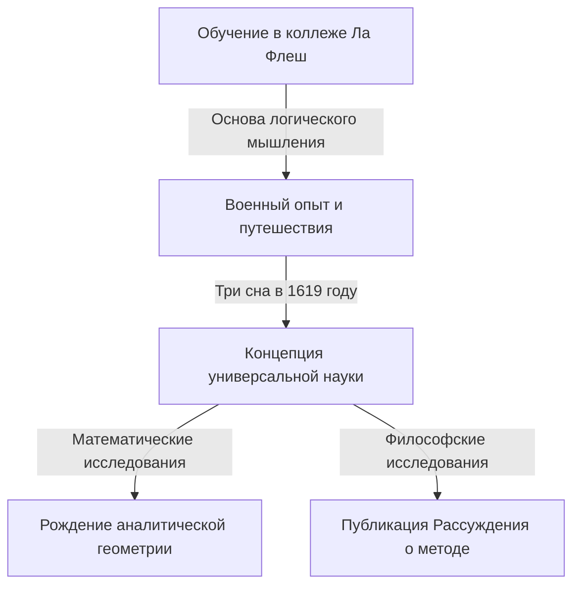

## 1. Введение

Рене Декарт (1596-1650) был французским философом, математиком и ученым. Он оставил после себя знаменитую фразу "Я мыслю, следовательно, я существую (Cogito, ergo sum)" и широко известен как отец современной философии. Однако его роль в истории математики была столь же огромной, как и его философские достижения.

Величайшим математическим достижением Декарта было создание **аналитической геометрии**, которая объединила алгебру и геометрию. В этой статье мы подробно расскажем об эпизодах его жизни и о революции, которую он произвел в мире математики.

## 2. Жизнь Декарта: Путешественник мысли

### Детство и коллеж Ла Флеш

Декарт родился в 1596 году в Ла-Э-ан-Турень (ныне Декарт), Франция. Вскоре после рождения он потерял мать и сам был болезненным ребенком. В возрасте 10 лет он поступил в иезуитский коллеж Ла Флеш. Учитывая его талант и слабое здоровье, ректор в виде исключения разрешил ему отдыхать в постели до позднего утра. Эта привычка "предаваться размышлениям в постели" сохранится у него на всю жизнь.

### Военный опыт и откровение снов

После окончания коллежа он получил степень по праву в Университете Пуатье, но отправился в путешествие, чтобы учиться по "великой книге мира". Когда разразилась Тридцатилетняя война, он пошел добровольцем в голландскую армию.

10 ноября 1619 года, зимуя близ Ульма в Германии, Декарт увидел три загадочных сна, находясь в глубокой задумчивости в теплой комнате с печью. Он истолковал это как откровение "оснований удивительной науки". Считается, что этот опыт послужил источником его концепции Mathesis universalis (универсальной системы знаний, основанной на математических истинах).

## 3. Математические достижения: Рождение аналитической геометрии

"Рассуждение о методе", опубликованное анонимно Декартом в 1637 году, сопровождалось тремя эссе. Одним из них была "Геометрия" (La Géométrie). В этой работе он представил новаторскую идею, которая переписала историю математики.

### Изобретение системы координат

В математике того времени "алгебра", имеющая дело с формулами, и "геометрия", имеющая дело с формами, считались совершенно отдельными областями. Декарт обнаружил, что, нарисовав две ортогональные числовые прямые (ось $x$ и ось $y$) на плоскости, любую точку на плоскости можно представить как пару из двух чисел $(x, y)$. Это то, что мы в настоящее время называем **декартовой системой координат**.

Это сделало возможным выражать геометрические фигуры (такие как линии, круги и параболы) в виде алгебраических уравнений и решать их путем вычислений. Например, окружность радиуса $r$ с центром в начале координат выражается следующим уравнением:

$$
x^2 + y^2 = r^2
$$

### Что принесло слияние алгебры и геометрии

Идея Декарта позволила свести сложные геометрические задачи к алгебраическим вычислениям. Кроме того, Декартом была упорядочена и запись буквенных выражений. Использование $x, y, z$ для неизвестных и $a, b, c$ для известных величин, а также запись, выражающая степени путем написания маленьких чисел в правом верхнем углу, например $x^2, x^3$, также были введены им в "Геометрии".

Ниже приведена формула нахождения расстояния между двумя точками на координатной плоскости. Расстояние $d$ между точкой $A(x_1, y_1)$ и точкой $B(x_2, y_2)$ выражается следующим образом с помощью теоремы Пифагора:

$$
d = \sqrt{(x_2 - x_1)^2 + (y_2 - y_1)^2} \quad \text{(Расстояние между двумя точками)}
$$

## 4. Влияние на философию и науку

Аналитическая геометрия Декарта стала незаменимой основой для последующего развития математики и физики. Можно сказать, что создание исчисления Исааком Ньютоном и Готфридом Лейбницем стало возможным только благодаря платформе, предоставленной декартовой системой координат.

Кроме того, его "методическое сомнение" в философии, подход к поиску несомненных истин после сомнения во всем, установил дух рационализма, который служит основой научного поиска.

## 5. Заключение

Декарт был человеком, который так любил мыслить, что сохранился исторический анекдот о том, как он оставался в постели до позднего утра, наблюдая за движением мухи на потолке. (Согласно одной из теорий, попытка выразить движение этой мухи привела к идее системы координат).

Жизнь и мысли Рене Декарта продолжают вдохновлять нас и сегодня, преодолевая границы научных дисциплин. Когда мы осознаем, что сегодняшняя компьютерная графика, ИИ и все виды научных технологий работают в системе координат, которую он оставил после себя, мы можем еще раз осознать его величие.
