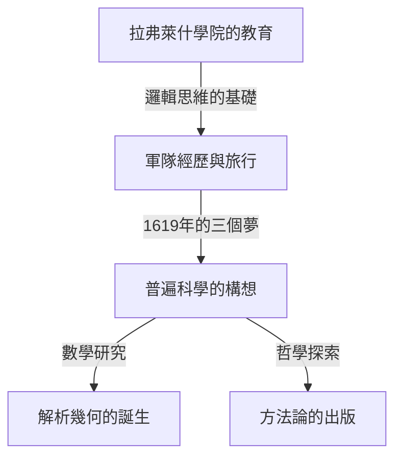

## 1. 前言

勒內·笛卡兒 (René Descartes, 1596-1650) 是法國哲學家、數學家和科學家。他留下了「我思故我在 (Cogito, ergo sum)」的著名命題，並被廣泛譽為近代哲學之父。然而，他在數學史上所扮演的角色，絕不亞於其在哲學上的成就。

笛卡兒最大的數學成就是創立了融合代數與幾何的 **解析幾何** (analytic geometry)。在本文中，我們將詳細介紹他一生的軼事以及他給數學界帶來的革命。

## 2. 笛卡兒的一生：思想的旅行者

### 童年與拉弗萊什學院

笛卡兒於1596年出生於法國圖賴訥地區的拉海（現為笛卡兒市）。他出生後不久便失去了母親，自己也是個體弱多病的少年。10歲時，他進入了耶穌會開辦的拉弗萊什學院。校長考慮到他的才華和虛弱的體質，破例允許他在床上休息到很晚。這種「在床上沉思」的習慣伴隨了他的一生。

### 軍隊經歷與夢的啟示

從學院畢業後，他在普瓦捷大學獲得了法學學位，但他為了學習「世界這本大書」而踏上了旅途。三十年戰爭爆發後，他志願加入了荷蘭軍隊。

1619年11月10日，在德國烏爾姆附近過冬的笛卡兒，在溫暖的火爐房裡沉思時，做了三個神秘的夢。他將其視為「驚人學問的基礎」的啟示。據說這次經歷成為了他構想普遍科學（基於數學真理的普遍知識體系）的起點。

## 3. 數學領域的成就：解析幾何的誕生

笛卡兒在1637年匿名出版的《方法論》附帶有三篇論文。其中之一就是《幾何學》 (La Géométrie)。在這部著作中，他提出了改寫數學史的突破性思想。

### 坐標系的發明

在當時的數學中，處理公式的「代數學」和處理圖形的「幾何學」被認為是完全不同的領域。笛卡兒發現，透過在平面上畫兩條正交的數軸（ $x$ 軸和 $y$ 軸），平面上的任意一點都可以表示為一對數字 $(x, y)$。這就是我們現在所說的 **笛卡兒坐標系** (Cartesian coordinate system)。

這使得將幾何圖形（如直線、圓、拋物線等）表示為代數方程式並透過計算求解成為可能。例如，以原點為中心、半徑為 $r$ 的圓可以用以下方程式表示：

$$
x^2 + y^2 = r^2
$$

### 代數與幾何融合的意義

笛卡兒的思想使得將複雜的幾何難題轉化為代數計算成為可能。此外，文字符號的記法也由笛卡兒進行了規範。用 $x, y, z$ 表示未知數，用 $a, b, c$ 表示已知數，以及透過在右上角寫小數字來表示乘方（如 $x^2, x^3$）的記法，也都是他在《幾何學》中引入的。

以下是求坐標平面上兩點間距離的公式。點 $A(x_1, y_1)$ 和點 $B(x_2, y_2)$ 之間的距離 $d$ 利用畢達哥拉斯定理可表示如下：

$$
d = \sqrt{(x_2 - x_1)^2 + (y_2 - y_1)^2} \quad \text{(兩點之間的距離)}
$$

## 4. 對哲學和科學的影響

笛卡兒的解析幾何成為後來數學和物理學發展不可或缺的基礎。可以說，艾薩克·牛頓和戈特弗里德·萊布尼茲能夠創立微積分學，正是因為有了笛卡兒坐標系這個舞台。

此外，他在哲學上的「普遍懷疑」，即在對一切事物進行懷疑之後尋找確切真理的方法，確立了作為科學探索基礎的理性主義精神。

## 5. 結語

笛卡兒是一個如此熱愛沉思的人，以至於流傳著他一直躺在床上直到很晚，觀察天花板上蒼蠅飛行動跡的軼事。（有一種說法認為，正是試圖表達這隻蒼蠅的運動軌跡，促成了他建立坐標系的靈感）。

勒內·笛卡兒的一生和思想跨越了學科的界線，至今仍給我們帶來許多啟發。當我們想到今天的電腦圖學、人工智慧以及各種科學技術都在他留下的坐標系上運行時，我們就能再次體會到他的偉大。
