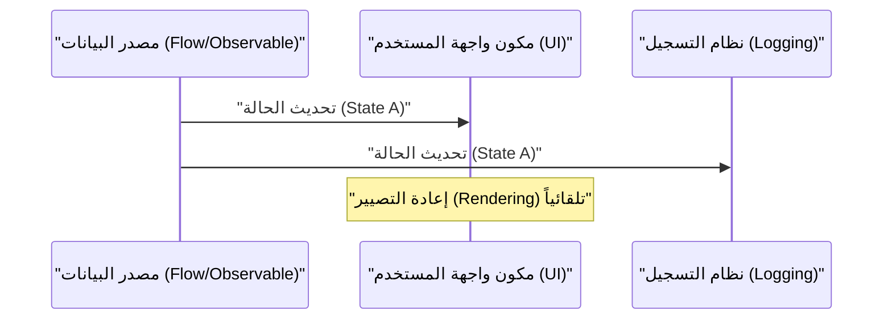
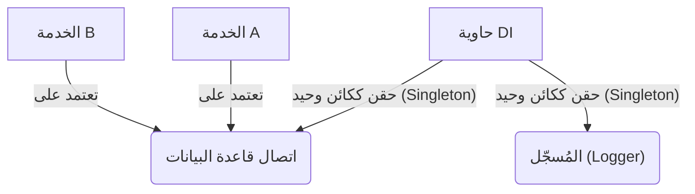

## 1. مقدمة: لعنة GoF والتحرر منها

في عام 1994، نُشر كتاب يعتبر علامة فارقة في تاريخ هندسة البرمجيات بعنوان "أنماط التصميم: عناصر البرمجيات كائنية التوجه القابلة لإعادة الاستخدام" (المعروف باسم كتاب **GoF**). قام هذا الكتاب بفهرسة أفضل ممارسات التصميم كائني التوجه باستخدام لغات ذلك الوقت مثل C++ و Smalltalk في 23 نمطاً، وقدم مفردات مشتركة للمطورين حول العالم.

ومع ذلك، أصبحنا نسمع اليوم بشكل متزايد الادعاء بأن **"أنماط GoF قد عفا عليها الزمن"**. وتعود أسباب ذلك إلى تطور لغات البرمجة، وانتشار نموذج البرمجة الوظيفية (FP)، وظهور الأنظمة الموزعة السحابية الأصلية.

في هذا المقال، سنتعمق في استكشاف مكانة أنماط GoF في تطوير البرمجيات الحديثة، وما هي أفضل الممارسات المعاصرة، مع الاستعانة بأمثلة برمجية ورسوم توضيحية.

## 2. ما هي أنماط التصميم؟ ولماذا ظهرت؟

أنماط التصميم هي **"حلول عامة للمشاكل التي تتكرر بشكل متكرر في سياق معين"**. في الواقع، كانت العديد من المشاكل التي حاولت GoF حلها عبارة عن حلول بديلة (Workarounds) لتعويض "نقص ميزات اللغة في ذلك الوقت".

على سبيل المثال، في اللغات التي لا تحتوي على دوال من الدرجة الأولى (First-class functions)، كانت هناك حاجة إلى نمط `Strategy` أو نمط `Command` لتغليف السلوك ككائن. أما في اللغات الحديثة التي يمكنها تمرير الدوال مباشرة، فإن هذه الأنماط لا تعدو كونها أكواداً نمطية متكررة (Boilerplate) زائدة عن الحاجة. على سبيل المثال، إذا كان لدينا عدد الفئات $C$ وعدد الواجهات $I$، فإن تعقيد GoF التقليدي يمكن التعبير عنه بـ $\mathcal{O}(C \times I)$، ولكن في النهج الوظيفي يقل هذا بشكل كبير.

## 3. إعادة التقييم الحديثة لأنماط GoF والبدائل

هنا، سنتناول أبرز أنماط GoF، ونرى كيف تم استبدالها في اللغات الحديثة المعاصرة (مثل TypeScript، و Kotlin، و Rust، إلخ).

### 3.1. نمط Strategy: الإقصاء بواسطة دوال الدرجة الأولى

نمط `Strategy` هو نمط يحدد عائلة من الخوارزميات، ويغلف كل منها لجعلها قابلة للتبديل.

**نهج GoF التقليدي (على طريقة Java)**

```java
// تعريف الواجهة
interface DiscountStrategy {
    double applyDiscount(double price);
}

// تنفيذ الاستراتيجية الملموسة
class HalfPriceDiscount implements DiscountStrategy {
    public double applyDiscount(double price) {
        return price * 0.5;
    }
}

// السياق
class ShoppingCart {
    private DiscountStrategy strategy;

    public ShoppingCart(DiscountStrategy strategy) {
        this.strategy = strategy;
    }

    public double calculateTotal(double price) {
        return strategy.applyDiscount(price);
    }
}
```

**النهج الحديث (TypeScript / وظيفي)**

في اللغات الحديثة، يكفي تمرير الدالة نفسها كعامل (دوال عليا) لحل المشكلة. ليست هناك حاجة لتسلسل هرمي من الواجهات أو الفئات.

```typescript
// الأسماء المستعارة للأنواع كافية
type DiscountStrategy = (price: number) => number;

// الاستراتيجية هي مجرد دالة
const halfPriceDiscount: DiscountStrategy = price => price * 0.5;

// السياق هو أيضا دالة بسيطة أو فئة
class ShoppingCart {
    constructor(private discount: DiscountStrategy) {}

    calculateTotal(price: number): number {
        return this.discount(price);
    }
}

// مثال على الاستخدام
const cart = new ShoppingCart(halfPriceDiscount);
```

### 3.2. نمط Observer: الارتقاء إلى البرمجة التفاعلية (Reactive Programming)

نمط `Observer`، الذي يُخطر الكائنات التابعة بتغيرات الحالة، يعتبر أمراً لا غنى عنه في تطوير واجهات المستخدم الرسومية (GUI) الحديثة والمعالجة غير المتزامنة، ولكن طريقة تنفيذه تطورت بشكل كبير. تقوم مكتبات وأطر عمل مثل Rx (Reactive Extensions) و Kotlin Flow و Swift Combine بهذا الدور.



في **نهج GoF التقليدي**، كان يتطلب الأمر تنفيذاً فوضوياً لتسجيل Observer في Subject، واستخدام حلقة لاستدعاء طريقة `update()`.

**النهج الحديث (Kotlin Flow)**

```kotlin
// إدارة الحالة التفاعلية باستخدام Flow
class WeatherStation {
    private val _temperature = MutableStateFlow(0.0)
    val temperature: StateFlow<Double> = _temperature.asStateFlow()

    fun updateTemperature(newTemp: Double) {
        _temperature.value = newTemp
    }
}

// الجانب المراقب (Observer)
coroutineScope.launch {
    weatherStation.temperature.collect { temp ->
        println("تم تحديث درجة الحرارة: $temp")
    }
}
```

نظراً لأن التدفقات غير المتزامنة مدعومة على مستوى اللغة، فلا توجد حاجة لبناء آلية إشعارات خاصة بك.

### 3.3. نمط Visitor: مطابقة الأنماط (Pattern Matching) وأنواع البيانات الجبرية (ADT)

نمط `Visitor` هو نمط لفصل هياكل البيانات عن المعالجة التي تتم عليها، ولكنه كان يعاني من مشكلة أن التنفيذ معقد للغاية ويتعارض مع الحدس (يتطلب إرسالاً مزدوجاً Double Dispatch).

في العصر الحديث، يتم حل هذه المشكلة بشكل جميل باستخدام لغات تتميز بـ **أنواع البيانات الجبرية (ADT)** و **مطابقة الأنماط** (مثل Rust و Kotlin و Swift و Scala).

**النهج الحديث (أنواع التعداد ومطابقة الأنماط في Rust)**

```rust
// أنواع البيانات الجبرية (Enum مع متغيرات)
enum Shape {
    Circle { radius: f64 },
    Rectangle { width: f64, height: f64 },
}

// استخدام مطابقة الأنماط بدلاً من فئة Visitor
fn calculate_area(shape: &Shape) -> f64 {
    match shape {
        Shape::Circle { radius } => std::f64::consts::PI * radius * radius,
        Shape::Rectangle { width, height } => width * height,
    }
}
```

بهذه الطريقة، تصبح سلسلة استدعاءات طريقتي `accept` أو `visit` غير ضرورية تماماً، ويصبح الغرض من الكود واضحاً. ونظراً لأن المترجم يتحقق من الشمولية (ما إذا تمت معالجة جميع الحالات)، فإن الأمان يتحسن بشكل كبير.

### 3.4. نمط Singleton: هل هو أسوأ نمط مضاد (Anti-pattern)؟

غالباً ما يُعتبر نمط `Singleton` اليوم **نمطاً مضاداً**، لأنه يخلق حالة عامة (Global State)، ويجعل الاختبار صعباً، ويشكل مرتعاً للأخطاء في بيئات متعددة الخيوط (Multi-threaded).

في أفضل الممارسات الحديثة، تُستخدم **حقن التبعية (Dependency Injection: DI)** لإدارة دورة الحياة.



نظراً لأن حاويات DI مثل Spring Framework (Java) و NestJS (TypeScript) و Dagger/Hilt (Android) تدير إنشاء وتدمير المثيلات، فلا يجب عليك كتابة منطق Singleton (مثل `getInstance()` أو `private constructor`) في الفئة نفسها.

## 4. أنماط التصميم في البرمجة الوظيفية

في عالم البرمجة الوظيفية، توجد "أنماط" ببعد مختلف عن GoF. هذه مدعومة بنظرية الفئات الرياضية (Category Theory).

### 4.1. التحكم في الآثار الجانبية باستخدام Monad (الموناد)

بينما تفترض أنماط GoF "تغيير الحالة (Mutation)"، يقوم النهج الوظيفي بحصر الآثار الجانبية (مثل الاستثناءات، والمعالجة غير المتزامنة، واحتمالية وجود Null) داخل نظام الأنواع.

على سبيل المثال، يتم استبدال نمط كائن Null أو معالجة الاستثناءات بمونادات مثل `Maybe` (أو Optional) أو `Either` (أو Result).

$$
f: A \rightarrow M[B]
$$
$$
g: B \rightarrow M[C]
$$
$$
bind: M[A] \times (A \rightarrow M[B]) \rightarrow M[B]
$$

**نوع Result في Rust (تطبيق على الموناد Either)**

```rust
fn divide(numerator: f64, denominator: f64) -> Result<f64, String> {
    if denominator == 0.0 {
        Err("لا يمكن القسمة على صفر".to_string())
    } else {
        Ok(numerator / denominator)
    }
}

// تكوين معالجة الأخطاء (flatMap / and_then)
let result = divide(10.0, 2.0).and_then(|res| divide(res, 2.0));
```

## 5. أنماط GoF التي نجت أو تطورت في العصر الحديث

لم تمت جميع أنماط GoF. لا تزال الأنماط التي تعمل في حدود البنية المعمارية مهمة للغاية حتى اليوم.

1. **Facade (الواجهة)**: تطور مفهوم توفير واجهة بسيطة لأنظمة فرعية معقدة ليتوسع كبوابة API (أو BFF: Backend for Frontend) في بنية الخدمات المصغرة.
2. **Adapter (المحول)**: أصبح حجر الزاوية في الحفاظ على اقتران النظام بشكل فضفاض (Loosely coupled)، كعمليات التكامل مع الأنظمة الخارجية أو كـ "منافذ ومحولات (Ports and Adapters)" في البنية النظيفة والبنية السداسية.
3. **Decorator (المزخرف)**: في Python و TypeScript، ارتقى ليصبح ميزة في اللغة نفسها كـ `@Decorator` للبرمجة الوصفية القائمة على التعليقات التوضيحية (Annotations).

## 6. الخلاصة: تقبل التحول النموذجي (Paradigm Shift)

الإجابة على السؤال **"هل عفا الزمن على GoF؟"** هي: "نعم، بالنسبة لما تم استيعابه كميزات في اللغة، ولكن لا، كمفاهيم تجريدية للتصميم".

التصميم الذي كان يتطلب في الماضي العشرات من أسطر التسلسل الهرمي للفئات، أصبح يمكن التعبير عنه الآن في بضعة أسطر من الدوال أو أنواع التعداد في اللغات الحديثة. نحن كمهندسي برمجيات يجب ألا نتمسك بشكل GoF (مخططات الفئات أو طرق التنفيذ)، بل يجب أن نوجه أنظارنا إلى الجوهر: **"ما الذي كانوا يحاولون حله؟"**.

أفضل الممارسات الحديثة هي كما يلي:

- **التركيب (Composition) بدلاً من الوراثة (Inheritance) (وهذه حقيقة عالمية من GoF)**
- **الدوال بدلاً من الفئات (الاستفادة من دوال الدرجة الأولى)**
- **مطابقة الأنماط و ADT بدلاً من نمط Visitor**
- **حاوية DI بدلاً من Singleton**
- **الثبات (Immutability) والدوال النقية بدلاً من تغيير الحالة (Mutation)**

أنماط التصميم لم تمت. إنها ببساطة تغيرت إلى شكل أكثر دقة وتهذيباً مع تطور لغات البرمجة.
