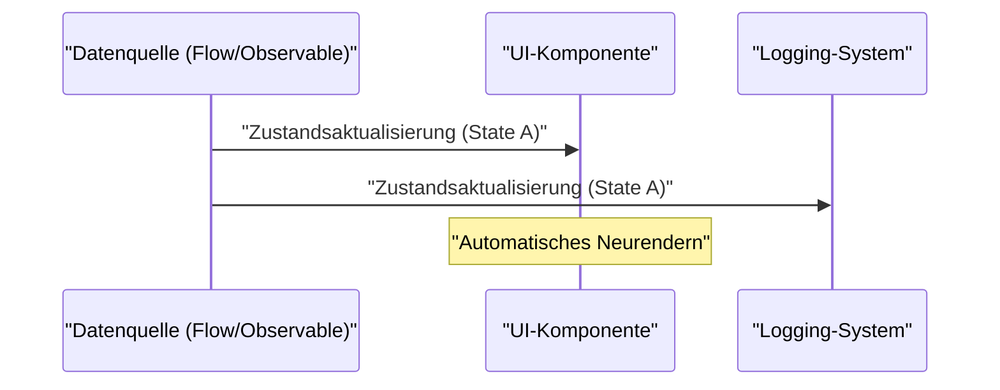
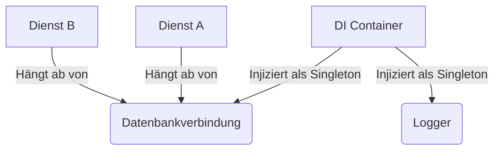

## 1. Einführung: Der Fluch und die Befreiung von GoF

Im Jahr 1994 wurde das monumentale Buch in der Geschichte der Softwareentwicklung, "Design Patterns: Elements of Reusable [Object-Oriented](https://kenji.blog/de/p/oop-vs-fp-vs-dop/) Software" (allgemein bekannt als **GoF**-Buch), veröffentlicht. Dieses Buch katalogisierte Best Practices für objektorientiertes Design unter Verwendung damaliger Sprachen wie C++ und Smalltalk in 23 Muster und bot Entwicklern weltweit ein gemeinsames Vokabular.

Heutzutage hört man jedoch zunehmend die Behauptung, **"GoF-Muster sind veraltet"**. Die Gründe dafür liegen in der Evolution der Programmiersprachen, der Verbreitung des funktionalen Programmierparadigmas (FP) und dem Aufstieg cloud-nativer verteilter Systeme.

In diesem Artikel werden wir anhand von Codebeispielen und Diagrammen tiefgreifend untersuchen, wo GoF-Muster in der modernen Softwareentwicklung stehen und was die heutigen Best Practices sind.

## 2. Was sind Design-Muster? Warum sind sie entstanden?

Design-Muster sind **"allgemeine Lösungen für häufig auftretende Probleme in einem bestimmten Kontext"**. Viele der Probleme, die GoF zu lösen versuchte, waren in Wirklichkeit Workarounds für "fehlende Sprachfunktionen" der damaligen Zeit.

Zum Beispiel waren in Sprachen ohne First-Class-Funktionen das `Strategy`- oder das `Command`-Muster erforderlich, um Verhalten als Objekte zu kapseln. In modernen Sprachen, in denen Funktionen direkt übergeben werden können, sind diese Muster jedoch nichts weiter als redundanter Boilerplate-Code. Wenn es beispielsweise $C$ Klassen und $I$ Schnittstellen gibt, kann die herkömmliche GoF-Komplexität als $\mathcal{O}(C \times I)$ ausgedrückt werden, aber ein funktionaler Ansatz reduziert dies drastisch.

## 3. Moderne Neubewertung von GoF-Mustern und Alternativen

Hier werden wir typische GoF-Muster betrachten und sehen, wie sie in modernen Sprachen (TypeScript, Kotlin, [Rust](https://kenji.blog/de/p/webassembly-wasm-current-future/) usw.) ersetzt werden.

### 3.1. Strategy-Muster: Verdrängt durch First-Class-Funktionen

Das `Strategy`-Muster definiert eine Familie von Algorithmen, kapselt jeden einzelnen und macht sie austauschbar.

**Der traditionelle GoF-Ansatz (Java-Stil)**

```java
// Definition der Schnittstelle
interface DiscountStrategy {
    double applyDiscount(double price);
}

// Implementierung der konkreten Strategie
class HalfPriceDiscount implements DiscountStrategy {
    public double applyDiscount(double price) {
        return price * 0.5;
    }
}

// Kontext
class ShoppingCart {
    private DiscountStrategy strategy;

    public ShoppingCart(DiscountStrategy strategy) {
        this.strategy = strategy;
    }

    public double calculateTotal(double price) {
        return strategy.applyDiscount(price);
    }
}
```

**Der moderne Ansatz (TypeScript / Funktional)**

In modernen Sprachen wird dies einfach dadurch gelöst, dass die Funktion selbst als Argument übergeben wird (Funktion höherer Ordnung). Es ist keine Hierarchie von Schnittstellen oder Klassen erforderlich.

```typescript
// Ein Typ-Alias ist ausreichend
type DiscountStrategy = (price: number) => number;

// Die Strategie ist nur eine Funktion
const halfPriceDiscount: DiscountStrategy = price => price * 0.5;

// Auch der Kontext ist eine einfache Funktion oder Klasse
class ShoppingCart {
    constructor(private discount: DiscountStrategy) {}

    calculateTotal(price: number): number {
        return this.discount(price);
    }
}

// Anwendungsbeispiel
const cart = new ShoppingCart(halfPriceDiscount);
```

### 3.2. Observer-Muster: Aufstieg zum Reactive Programming

Das `Observer`-Muster, das abhängige Objekte über [Zustand](https://kenji.blog/de/p/state-management-history-redux-context-recoil-zustand/)sänderungen benachrichtigt, ist in der modernen GUI-Entwicklung und asynchronen Verarbeitung unerlässlich, aber seine Implementierungsmethode hat sich erheblich weiterentwickelt. Bibliotheken und Frameworks wie Rx (Reactive Extensions), Kotlin Flow und Swift Combine übernehmen nun diese Rolle.



**Im traditionellen GoF-Ansatz** war eine umständliche Implementierung erforderlich, um einen Observer beim Subject zu registrieren und in einer Schleife die `update()`-Methode aufzurufen.

**Der moderne Ansatz (Kotlin Flow)**

```kotlin
// Reaktive Zustandsverwaltung mit Flow
class WeatherStation {
    private val _temperature = MutableStateFlow(0.0)
    val temperature: StateFlow<Double> = _temperature.asStateFlow()

    fun updateTemperature(newTemp: Double) {
        _temperature.value = newTemp
    }
}

// Beobachtende Seite (Observer)
coroutineScope.launch {
    weatherStation.temperature.collect { temp ->
        println("Temperature updated: $temp")
    }
}
```

Da asynchrone Streams auf Sprachebene unterstützt werden, muss kein eigener Benachrichtigungsmechanismus erstellt werden.

### 3.3. Visitor-Muster: Pattern Matching und Algebraische Datentypen (ADT)

Das `Visitor`-Muster wurde entwickelt, um die Datenstruktur von der Verarbeitung zu trennen. Das Problem war jedoch, dass die Implementierung sehr komplex und kontraintuitiv ist (da sie Double Dispatch erfordert).

Heutzutage wird dieses Problem elegant durch Sprachen gelöst ([Rust](https://kenji.blog/de/p/webassembly-wasm-current-future/), Kotlin, Swift, Scala usw.), die über **Algebraische Datentypen (ADT)** und **Pattern Matching** verfügen.

**Der moderne Ansatz (Rust Enums und Pattern Matching)**

```rust
// Algebraischer Datentyp (Enum mit Varianten)
enum Shape {
    Circle { radius: f64 },
    Rectangle { width: f64, height: f64 },
}

// Verwendung von Pattern Matching anstelle einer Visitor-Klasse
fn calculate_area(shape: &Shape) -> f64 {
    match shape {
        Shape::Circle { radius } => std::f64::consts::PI * radius * radius,
        Shape::Rectangle { width, height } => width * height,
    }
}
```

Auf diese Weise wird die Kette von `accept`- und `visit`-Methoden völlig unnötig und die Absicht des Codes wird klar. Da der Compiler die Erschöpfung (ob alle Fälle behandelt werden) überprüft, wird auch die Sicherheit drastisch verbessert.

### 3.4. Singleton-Muster: Das schlimmste Anti-Pattern?

Das `Singleton`-Muster wird heute oft als **Anti-Pattern** angesehen, da es globalen [Zustand](https://kenji.blog/de/p/state-management-history-redux-context-recoil-zustand/) schafft, das Testen erschwert und eine Brutstätte für Fehler in Multithread-Umgebungen ist.

In modernen Best Practices wird die **Dependency Injection (DI)** zur Verwaltung des Lebenszyklus verwendet.



Da DI-[Container](https://kenji.blog/de/p/docker-container-namespace-cgroups-layers/) wie das Spring Framework (Java), NestJS (TypeScript) oder Dagger/Hilt (Android) die Erstellung und Zerstörung von Instanzen verwalten, sollte man keine Singleton-Logik (`getInstance()` oder `private constructor`) in die Klasse selbst schreiben.

## 4. Design-Muster in der funktionalen Programmierung

In der Welt der funktionalen Programmierung gibt es "Muster" in einer anderen Dimension als GoF. Diese werden durch die mathematische Kategorientheorie (Category Theory) untermauert.

### 4.1. Kontrolle von Nebenwirkungen durch Monaden

Während GoF-Muster von einer "[Zustand](https://kenji.blog/de/p/state-management-history-redux-context-recoil-zustand/)smutation" ausgehen, schließt der funktionale Ansatz Nebenwirkungen (Ausnahmen, asynchrone Verarbeitung, Möglichkeit von Null) in das Typsystem ein.

Beispielsweise werden das Null-Objekt-Muster oder die Ausnahmebehandlung durch Monaden wie `Maybe` (Optional) oder `Either` (Result) ersetzt.

$$
f: A \rightarrow M[B]
$$
$$
g: B \rightarrow M[C]
$$
$$
bind: M[A] \times (A \rightarrow M[B]) \rightarrow M[B]
$$

**Der Result-Typ in [Rust](https://kenji.blog/de/p/webassembly-wasm-current-future/) (Anwendung der Either-Monade)**

```rust
fn divide(numerator: f64, denominator: f64) -> Result<f64, String> {
    if denominator == 0.0 {
        Err("Cannot divide by zero".to_string())
    } else {
        Ok(numerator / denominator)
    }
}

// Komposition der Fehlerbehandlung (flatMap / and_then)
let result = divide(10.0, 2.0).and_then(|res| divide(res, 2.0));
```

## 5. GoF-Muster, die heute noch existieren oder sich weiterentwickelt haben

Nicht alle GoF-Muster sind ausgestorben. Muster, die an den Grenzen von Architekturen operieren, sind nach wie vor äußerst wichtig.

1. **Facade (Fassade)**: Das Konzept, eine einfache Schnittstelle zu einem komplexen Subsystem bereitzustellen, wurde als API-Gateway (BFF: Backend for Frontend) in Microservice-Architekturen skaliert.
2. **Adapter**: Als Grundlage für die Integration externer Systeme oder als "Ports und Adapter" in einer sauberen oder hexagonalen Architektur ist es der Schlüssel zur losen Kopplung von Systemen.
3. **Decorator (Dekorierer)**: In Python und TypeScript hat es sich zu einer Sprachfunktion als annotationsbasierte Metaprogrammierungsfunktion `@Decorator` weiterentwickelt.

## 6. Zusammenfassung: Den Paradigmenwechsel akzeptieren

Die Antwort auf die Frage **"Sind GoF-Muster veraltet?"** lautet: "JA für Dinge, die in Sprachfunktionen absorbiert wurden, aber NEIN als abstraktes Konzept des Designs."

Ein Design, das früher Dutzende Zeilen von Klassenhierarchien erforderte, kann jetzt in modernen Sprachen mit ein paar Zeilen von Funktionen oder Aufzählungstypen ausgedrückt werden. Wir Software-Ingenieure sollten uns nicht an die Form von GoF (Klassendiagramme und Implementierungsmethoden) klammern, sondern uns auf das Wesentliche konzentrieren, nämlich darauf, **"was sie zu lösen versuchten"**.

Die heutigen Best Practices sind wie folgt:

- **Komposition statt Vererbung (dies ist eine universelle Wahrheit aus GoF)**
- **Funktionen statt Klassen (Nutzung von First-Class-Funktionen)**
- **Pattern Matching und ADTs statt des Visitor-Musters**
- **DI-[Container](https://kenji.blog/de/p/docker-container-namespace-cgroups-layers/) statt Singletons**
- **Unveränderlichkeit (Immutability) und reine Funktionen statt [Zustand](https://kenji.blog/de/p/state-management-history-redux-context-recoil-zustand/)smutationen**

Design-Muster sind nicht tot. Sie haben mit der Evolution der Programmiersprachen lediglich eine verfeinertere Form angenommen.
