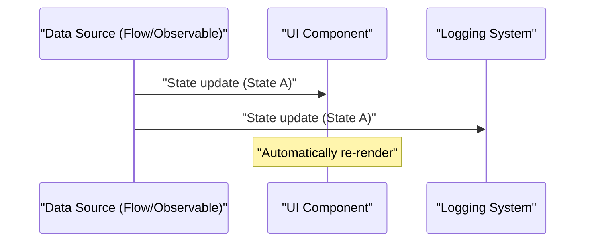
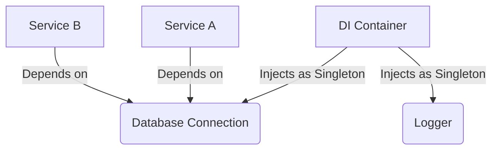

## 1. Introduction: The Spell and Release of GoF

In 1994, a monumental book in the history of software engineering, "Design Patterns: Elements of Reusable [Object-Oriented](https://kenji.blog/en/p/oop-vs-fp-vs-dop/) Software" (commonly known as the **GoF** book), was published. This book cataloged the best practices of object-oriented design using languages of the time like C++ and Smalltalk into 23 patterns, providing a common vocabulary for developers worldwide.

However, nowadays, we increasingly hear the argument that **"GoF patterns are outdated."** Behind this lies the evolution of programming languages, the spread of the functional programming (FP) paradigm, and the rise of cloud-native distributed systems.

In this article, we will dig deep into where GoF patterns stand in modern software development and what the modern best practices are, with code examples and illustrations.

## 2. What Are Design Patterns? Why Were They Created?

Design patterns are **"general solutions to commonly occurring problems within a given context."** Many of the problems GoF tried to solve were actually workarounds (suboptimal solutions) to compensate for the "lack of language features at the time."

For example, in languages without first-class functions, patterns like `Strategy` and `Command` were necessary to encapsulate behavior as objects. However, in modern languages where functions can be passed directly, these patterns are nothing more than redundant boilerplate. For instance, when there are $C$ classes and $I$ interfaces, the traditional GoF complexity can be expressed as $\mathcal{O}(C \times I)$, but this is drastically reduced with a functional approach.

## 3. Modern Re-evaluation and Alternatives of GoF Patterns

Here, we take a look at some of the most representative GoF patterns and see how they are being replaced in modern languages (TypeScript, Kotlin, Rust, etc.).

### 3.1. Strategy Pattern: Ousted by First-Class Functions

The `Strategy` pattern defines a family of algorithms, encapsulates each one, and makes them interchangeable.

**Traditional GoF Approach (Java-style)**

```java
// Definition of the interface
interface DiscountStrategy {
    double applyDiscount(double price);
}

// Implementation of the concrete strategy
class HalfPriceDiscount implements DiscountStrategy {
    public double applyDiscount(double price) {
        return price * 0.5;
    }
}

// Context
class ShoppingCart {
    private DiscountStrategy strategy;

    public ShoppingCart(DiscountStrategy strategy) {
        this.strategy = strategy;
    }

    public double calculateTotal(double price) {
        return strategy.applyDiscount(price);
    }
}
```

**Modern Approach (TypeScript / Functional)**

In modern languages, simply passing the function itself as an argument (higher-order functions) solves the problem. Interface and class hierarchies are unnecessary.

```typescript
// A type alias is sufficient
type DiscountStrategy = (price: number) => number;

// The strategy is just a function
const halfPriceDiscount: DiscountStrategy = price => price * 0.5;

// The context is also a simple function or class
class ShoppingCart {
    constructor(private discount: DiscountStrategy) {}

    calculateTotal(price: number): number {
        return this.discount(price);
    }
}

// Example usage
const cart = new ShoppingCart(halfPriceDiscount);
```

### 3.2. Observer Pattern: Sublimation into Reactive Programming

The `Observer` pattern, which notifies dependent objects of state changes, is essential in modern GUI development and asynchronous processing, but the implementation method has evolved significantly. Libraries and frameworks like Rx (Reactive Extensions), Kotlin Flow, and Swift Combine now take on this role.



In the **Traditional GoF Approach**, it required a clunky implementation of registering Observers to the Subject and looping through to call the `update()` method.

**Modern Approach (Kotlin Flow)**

```kotlin
// Reactive state management using Flow
class WeatherStation {
    private val _temperature = MutableStateFlow(0.0)
    val temperature: StateFlow<Double> = _temperature.asStateFlow()

    fun updateTemperature(newTemp: Double) {
        _temperature.value = newTemp
    }
}

// The monitoring side (Observer)
coroutineScope.launch {
    weatherStation.temperature.collect { temp ->
        println("Temperature updated: $temp")
    }
}
```

Since asynchronous streams are supported at the language level, there is no need to build your own notification mechanism.

### 3.3. Visitor Pattern: Pattern Matching and Algebraic Data Types (ADT)

The `Visitor` pattern is for separating data structures from the operations performed on them, but it had the issue of being highly complex and counter-intuitive to implement (requiring double dispatch).

Nowadays, languages equipped with **Algebraic Data Types (ADT)** and **Pattern Matching** (Rust, Kotlin, Swift, Scala, etc.) elegantly solve this problem.

**Modern Approach (Rust Enums and Pattern Matching)**

```rust
// Algebraic Data Type (Enum with variants)
enum Shape {
    Circle { radius: f64 },
    Rectangle { width: f64, height: f64 },
}

// Using pattern matching instead of a Visitor class
fn calculate_area(shape: &Shape) -> f64 {
    match shape {
        Shape::Circle { radius } => std::f64::consts::PI * radius * radius,
        Shape::Rectangle { width, height } => width * height,
    }
}
```

Thus, the chain of `accept` and `visit` methods becomes completely unnecessary, making the intent of the code clear. Safety is also drastically improved because the compiler checks for exhaustiveness (whether all cases are handled).

### 3.4. Singleton Pattern: The Worst Anti-Pattern?

The `Singleton` pattern creates global state, makes testing difficult, and is a breeding ground for bugs in multi-threaded environments, so it is now often considered an **anti-pattern**.

In modern best practices, lifecycle management is handled using **Dependency Injection (DI)**.



Because DI containers like Spring Framework (Java), NestJS (TypeScript), and Dagger/Hilt (Android) manage the creation and destruction of instances, you shouldn't write Singleton logic (`getInstance()` and `private constructor`) in the class itself.

## 4. Design Patterns in [Functional Programming](https://kenji.blog/en/p/oop-vs-fp-vs-dop/)

The functional programming world has "patterns" of a different dimension than GoF. These are backed by mathematical Category Theory.

### 4.1. Controlling Side Effects with Monads

While GoF patterns premise "state mutation," the functional approach confines side effects (exceptions, asynchronous processing, potential Nulls) within the type system.

For example, the Null Object pattern and exception handling are replaced by monads like `Maybe` (Optional) and `Either` (Result).

$$
f: A \rightarrow M[B]
$$
$$
g: B \rightarrow M[C]
$$
$$
bind: M[A] \times (A \rightarrow M[B]) \rightarrow M[B]
$$

**Result Type in Rust (Application of the Either Monad)**

```rust
fn divide(numerator: f64, denominator: f64) -> Result<f64, String> {
    if denominator == 0.0 {
        Err("Cannot divide by zero".to_string())
    } else {
        Ok(numerator / denominator)
    }
}

// Composition of error handling (flatMap / and_then)
let result = divide(10.0, 2.0).and_then(|res| divide(res, 2.0));
```

## 5. GoF Patterns That Survived or Evolved Today

Not all GoF patterns have died out. Patterns active at architectural boundaries remain extremely important today.

1. **Facade**: The concept of providing a simple interface to a complex subsystem has scaled up as an API Gateway (BFF: Backend for Frontend) in microservices architecture.
2. **Adapter**: It is the keystone for keeping the system loosely coupled, acting as an integration with external systems or as "ports and adapters" in clean and hexagonal architectures.
3. **Decorator**: In Python and TypeScript, it has been sublimated into a language feature as annotation-based metaprogramming `@Decorator`.

## 6. Conclusion: Embracing the Paradigm Shift

The answer to the question, **"Is GoF outdated?"** is "YES for those absorbed as language features, NO as abstract design concepts."

Designs that once required dozens of lines of class hierarchies can now be expressed in a few lines of functions or enums in modern languages. We software engineers shouldn't cling to the forms of GoF (class diagrams and implementation methods), but rather focus on the essence of **"what they were trying to solve."**

Modern best practices are as follows:

- **Composition over inheritance (a universal truth from GoF)**
- **Functions over classes (utilization of first-class functions)**
- **Pattern matching and ADTs over the Visitor pattern**
- **DI containers over Singletons**
- **Immutability and pure functions over state mutation**

Design patterns aren't dead. They have just transformed into a more refined form along with the evolution of programming languages.
