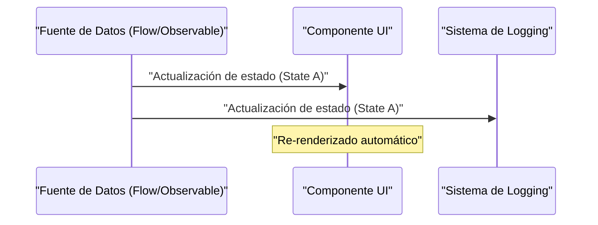
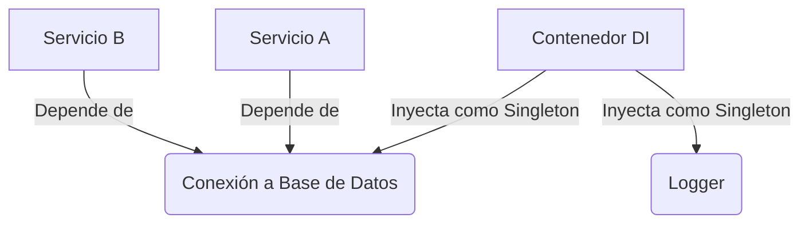

## 1. Introducción: La maldición de GoF y su liberación

En 1994, se publicó un libro monumental en la historia de la ingeniería de software: "Patrones de Diseño: Elementos de Software Orientado a Objetos Reutilizable" (comúnmente conocido como el libro **GoF**). Este libro catalogó las mejores prácticas de diseño orientado a objetos utilizando lenguajes de la época como C++ y Smalltalk en 23 patrones, proporcionando un vocabulario común a los desarrolladores de todo el mundo.

Sin embargo, hoy en día se escucha cada vez más la afirmación de que **"los patrones GoF están obsoletos"**. Detrás de esto está la evolución de los lenguajes de programación, la popularización del paradigma de la programación funcional (FP) y el surgimiento de sistemas distribuidos nativos de la nube.

En este artículo, profundizaremos en la posición de los patrones GoF en el desarrollo de software moderno y cuáles son las mejores prácticas actuales, utilizando ejemplos de código e ilustraciones.

## 2. ¿Qué son los patrones de diseño? ¿Por qué surgieron?

Un patrón de diseño es **"una solución general a un problema que ocurre con frecuencia en un contexto específico"**. Muchos de los problemas que GoF intentó resolver eran, de hecho, soluciones alternativas (workarounds) para compensar la "falta de características de los lenguajes en ese momento".

Por ejemplo, en lenguajes donde no existen funciones de primera clase (First-class functions), se requerían patrones como `Strategy` o `Command` para encapsular el comportamiento como un objeto. Sin embargo, en los lenguajes modernos donde las funciones se pueden pasar directamente, estos patrones no son más que código repetitivo (boilerplate) redundante. Por ejemplo, con un número de clases $C$ y un número de interfaces $I$, la complejidad tradicional de GoF se puede expresar como $\mathcal{O}(C \times I)$, pero en el enfoque funcional esto se reduce drásticamente.

## 3. Reevaluación moderna de los patrones GoF y alternativas

Aquí tomaremos algunos patrones GoF representativos y veremos cómo han sido reemplazados en lenguajes modernos (TypeScript, Kotlin, [Rust](https://kenji.blog/es/p/webassembly-wasm-current-future/), etc.).

### 3.1. Patrón Strategy: Desplazado por las funciones de primera clase

El patrón `Strategy` define una familia de algoritmos, los encapsula individualmente y los hace intercambiables.

**Enfoque tradicional estilo GoF (estilo [Java](https://kenji.blog/es/p/programming-languages-history-paradigm-evolution/))**

```java
// Definición de la interfaz
interface DiscountStrategy {
    double applyDiscount(double price);
}

// Implementación concreta de la estrategia
class HalfPriceDiscount implements DiscountStrategy {
    public double applyDiscount(double price) {
        return price * 0.5;
    }
}

// Contexto
class ShoppingCart {
    private DiscountStrategy strategy;

    public ShoppingCart(DiscountStrategy strategy) {
        this.strategy = strategy;
    }

    public double calculateTotal(double price) {
        return strategy.applyDiscount(price);
    }
}
```

**Enfoque moderno (TypeScript / Funcional)**

En los lenguajes modernos, simplemente se resuelve pasando la función en sí como argumento (funciones de orden superior). No se necesitan jerarquías de interfaces o clases.

```typescript
// Un alias de tipo es suficiente
type DiscountStrategy = (price: number) => number;

// La estrategia es solo una función
const halfPriceDiscount: DiscountStrategy = price => price * 0.5;

// El contexto también es una clase o función simple
class ShoppingCart {
    constructor(private discount: DiscountStrategy) {}

    calculateTotal(price: number): number {
        return this.discount(price);
    }
}

// Ejemplo de uso
const cart = new ShoppingCart(halfPriceDiscount);
```

### 3.2. Patrón Observer: Sublimación a la Programación Reactiva

El patrón `Observer`, que notifica los cambios de estado a los objetos dependientes, es esencial en el desarrollo de GUI moderno y el procesamiento asíncrono, pero su método de implementación ha evolucionado enormemente. Bibliotecas y marcos como Rx (Reactive Extensions), Kotlin Flow y Swift Combine han asumido este papel.



En el **enfoque tradicional estilo GoF**, se requería una implementación engorrosa de registrar el Observer en el Subject y ejecutar un bucle para llamar al método `update()`.

**Enfoque moderno (Kotlin Flow)**

```kotlin
// Gestión de estado reactiva usando Flow
class WeatherStation {
    private val _temperature = MutableStateFlow(0.0)
    val temperature: StateFlow<Double> = _temperature.asStateFlow()

    fun updateTemperature(newTemp: Double) {
        _temperature.value = newTemp
    }
}

// Lado del observador (Observer)
coroutineScope.launch {
    weatherStation.temperature.collect { temp ->
        println("Temperature updated: $temp")
    }
}
```

Dado que los flujos (streams) asíncronos son compatibles a nivel del lenguaje, no hay necesidad de crear un mecanismo de notificación propio.

### 3.3. Patrón Visitor: Pattern Matching y Tipos de Datos Algebraicos (ADT)

El patrón `Visitor` es un patrón para separar una estructura de datos del procesamiento que se realiza en ella, pero tenía el problema de que su implementación era extremadamente compleja y contraintuitiva (requería despacho doble).

En la actualidad, utilizando lenguajes ([Rust](https://kenji.blog/es/p/webassembly-wasm-current-future/), Kotlin, Swift, Scala, etc.) equipados con **Tipos de Datos Algebraicos (ADT)** y **Pattern Matching**, este problema se resuelve de manera elegante.

**Enfoque moderno (Tipos enumerados y Pattern Matching en [Rust](https://kenji.blog/es/p/programming-languages-history-paradigm-evolution/))**

```rust
// Tipos de datos algebraicos (Enum con variantes)
enum Shape {
    Circle { radius: f64 },
    Rectangle { width: f64, height: f64 },
}

// Usar pattern matching en lugar de la clase Visitor
fn calculate_area(shape: &Shape) -> f64 {
    match shape {
        Shape::Circle { radius } => std::f64::consts::PI * radius * radius,
        Shape::Rectangle { width, height } => width * height,
    }
}
```

De esta manera, el encadenamiento de métodos `accept` y `visit` es completamente innecesario y la intención del código se vuelve clara. La seguridad también mejora drásticamente ya que el compilador comprueba la exhaustividad (si se manejan todos los casos).

### 3.4. Patrón Singleton: ¿El peor antipatrón?

El patrón `Singleton` a menudo se considera un **antipatrón** en la actualidad porque crea estado global, dificulta las pruebas y se convierte en un nido de errores en entornos multihilo.

En las mejores prácticas modernas, el ciclo de vida se gestiona utilizando **Inyección de Dependencias (Dependency Injection: DI)**.



Dado que los contenedores DI como Spring Framework ([Java](https://kenji.blog/es/p/programming-languages-history-paradigm-evolution/)), NestJS (TypeScript) y Dagger/Hilt (Android) gestionan la creación y destrucción de instancias, no se debe escribir la lógica Singleton (como `getInstance()` o un `private constructor`) en la propia clase.

## 4. Patrones de Diseño en la Programación Funcional

En el mundo de la programación funcional, existen "patrones" de una dimensión diferente a la de GoF. Estos están respaldados por la Teoría de Categorías matemática (Category Theory).

### 4.1. Control de efectos secundarios mediante [Monad](https://kenji.blog/es/p/functional-programming-concepts-pure-functions-monads/) (Mónada)

Mientras que los patrones de GoF asumen la "mutación del estado", el enfoque funcional confina los efectos secundarios (excepciones, procesamiento asíncrono, posibilidad de Null) al sistema de tipos.

Por ejemplo, el patrón de objeto nulo y el manejo de excepciones son reemplazados por mónadas como `Maybe` (Optional) y `Either` (Result).

$$
f: A \rightarrow M[B]
$$
$$
g: B \rightarrow M[C]
$$
$$
bind: M[A] \times (A \rightarrow M[B]) \rightarrow M[B]
$$

**El tipo Result en [Rust](https://kenji.blog/es/p/webassembly-wasm-current-future/) (Aplicación de la mónada Either)**

```rust
fn divide(numerator: f64, denominator: f64) -> Result<f64, String> {
    if denominator == 0.0 {
        Err("Cannot divide by zero".to_string())
    } else {
        Ok(numerator / denominator)
    }
}

// Composición del manejo de errores (flatMap / and_then)
let result = divide(10.0, 2.0).and_then(|res| divide(res, 2.0));
```

## 5. Patrones GoF que sobreviven o han evolucionado hoy en día

No todos los patrones de GoF han muerto. Los patrones que desempeñan un papel en los límites de la arquitectura siguen siendo extremadamente importantes en la actualidad.

1. **Facade (Fachada)**: El concepto de proporcionar una interfaz simple para un subsistema complejo se ha ampliado como [API Gateway](https://kenji.blog/es/p/microservices-architecture-bff-api-gateway/) ([BFF](https://kenji.blog/es/p/microservices-architecture-bff-api-gateway/): [Backend for Frontend](https://kenji.blog/es/p/microservices-architecture-bff-api-gateway/)) en la arquitectura de microservicios.
2. **Adapter (Adaptador)**: Sirve como eje para mantener sistemas débilmente acoplados, en la integración con sistemas externos y como "puertos y adaptadores" en la Arquitectura Limpia (Clean Architecture) o Arquitectura Hexagonal.
3. **Decorator (Decorador)**: En Python y TypeScript, se ha sublimado en una característica del lenguaje como metaprogramación basada en anotaciones `@Decorator`.

## 6. Conclusión: Aceptando el cambio de paradigma

La respuesta a la pregunta **"¿Están obsoletos los patrones GoF?"** es "SÍ, para los que han sido absorbidos como características del lenguaje, pero NO como conceptos abstractos de diseño".

Los diseños que antes requerían docenas de líneas de jerarquía de clases ahora se pueden expresar en unas pocas líneas de funciones o enumeraciones en los lenguajes modernos. Nosotros, como ingenieros de software, no deberíamos aferrarnos a la forma de GoF (diagramas de clases y métodos de implementación), sino centrarnos en la esencia de **"lo que intentaban resolver"**.

Las mejores prácticas modernas son las siguientes:

- **Composición sobre herencia (esta es una verdad universal de GoF)**
- **Funciones en lugar de clases (aprovechamiento de las funciones de primera clase)**
- **Pattern matching y ADT en lugar del patrón Visitor**
- **Contenedores DI en lugar de Singleton**
- **Inmutabilidad (Immutability) y funciones puras en lugar de la mutación del estado**

Los patrones de diseño no están muertos. Simplemente se han transformado en una forma más refinada con la evolución de los lenguajes de programación.
