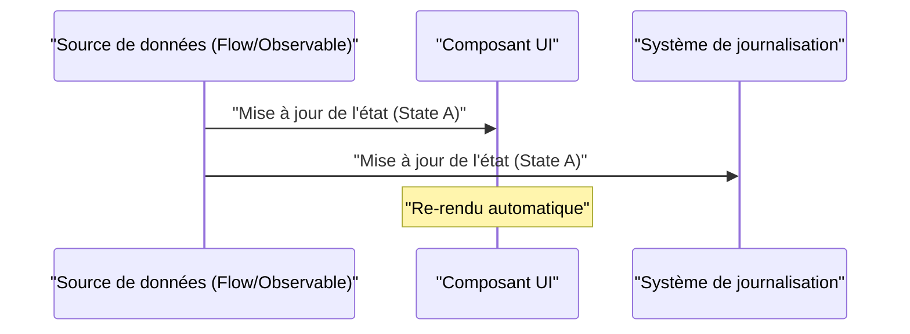
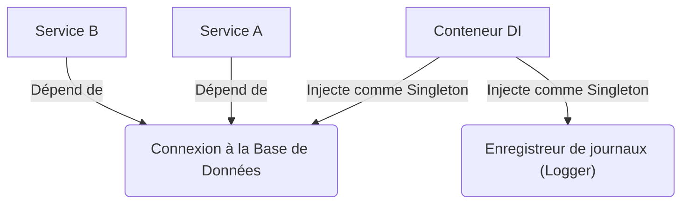

## 1. Introduction : La malédiction et la libération du GoF

En 1994, un livre monumental dans l'histoire du génie logiciel, « Design Patterns: Elements of Reusable [Object-Oriented](https://kenji.blog/fr/p/oop-vs-fp-vs-dop/) Software » (communément appelé le livre **GoF**), a été publié. Ce livre cataloguait les meilleures pratiques de la conception orientée objet utilisant des langages de l'époque tels que C++ et Smalltalk en 23 patrons, fournissant un vocabulaire commun aux développeurs du monde entier.

Cependant, aujourd'hui, on entend de plus en plus l'argument selon lequel **« les patrons GoF sont obsolètes »**. En arrière-plan se trouvent l'évolution des langages de programmation, la propagation du paradigme de la programmation fonctionnelle (PF) et l'essor des systèmes distribués cloud-native.

Dans cet article, nous explorerons en profondeur la position des patrons GoF dans le développement de logiciels contemporain et quelles sont les meilleures pratiques modernes, à l'aide d'exemples de code et de diagrammes.

## 2. Que sont les patrons de conception ? Pourquoi sont-ils nés ?

Les patrons de conception sont **« des solutions générales à des problèmes qui surviennent fréquemment dans un contexte donné »**. La plupart des problèmes que le GoF tentait de résoudre étaient en fait des solutions de contournement (workarounds) pour compenser le « manque de fonctionnalités des langages de l'époque ».

Par exemple, dans les langages sans fonctions de première classe (First-class functions), les patrons `Strategy` et `Command` étaient nécessaires pour encapsuler le comportement en tant qu'objet. Cependant, dans les langages modernes où les fonctions peuvent être passées directement, ces patrons ne sont que du code standard redondant (boilerplate). Par exemple, avec un nombre de classes $C$ et un nombre d'interfaces $I$, la complexité traditionnelle du GoF peut être exprimée comme $\mathcal{O}(C \times I)$, mais cette complexité est considérablement réduite avec l'approche fonctionnelle.

## 3. Réévaluation moderne des patrons GoF et alternatives

Ici, nous examinerons certains patrons GoF représentatifs et comment ils ont été remplacés dans les langages modernes (TypeScript, Kotlin, [Rust](https://kenji.blog/fr/p/webassembly-wasm-current-future/), etc.).

### 3.1. Le patron Strategy : L'élimination par les fonctions de première classe

Le patron `Strategy` définit une famille d'algorithmes, encapsule chacun d'eux et les rend interchangeables.

**L'approche GoF traditionnelle (style Java)**

```java
// Définition de l'interface
interface DiscountStrategy {
    double applyDiscount(double price);
}

// Implémentation de la stratégie concrète
class HalfPriceDiscount implements DiscountStrategy {
    public double applyDiscount(double price) {
        return price * 0.5;
    }
}

// Contexte
class ShoppingCart {
    private DiscountStrategy strategy;

    public ShoppingCart(DiscountStrategy strategy) {
        this.strategy = strategy;
    }

    public double calculateTotal(double price) {
        return strategy.applyDiscount(price);
    }
}
```

**L'approche moderne (TypeScript / Fonctionnelle)**

Dans les langages modernes, il suffit de passer la fonction elle-même en argument (fonction d'ordre supérieur). Aucune hiérarchie d'interfaces ou de classes n'est requise.

```typescript
// Un alias de type suffit
type DiscountStrategy = (price: number) => number;

// La stratégie est une simple fonction
const halfPriceDiscount: DiscountStrategy = price => price * 0.5;

// Le contexte est aussi une fonction ou une classe simple
class ShoppingCart {
    constructor(private discount: DiscountStrategy) {}

    calculateTotal(price: number): number {
        return this.discount(price);
    }
}

// Exemple d'utilisation
const cart = new ShoppingCart(halfPriceDiscount);
```

### 3.2. Le patron Observer : Sublimation vers la Programmation Réactive

Le patron `Observer`, qui notifie les objets dépendants des changements d'état, est essentiel dans le développement d'interfaces utilisateur (GUI) modernes et le traitement asynchrone, mais la méthode d'implémentation a considérablement évolué. Des bibliothèques et frameworks tels que Rx (Reactive Extensions), Kotlin Flow et Swift Combine assument désormais ce rôle.



Dans **l'approche GoF traditionnelle**, une implémentation lourde était nécessaire pour enregistrer l'Observer auprès du Subject et utiliser une boucle pour appeler la méthode `update()`.

**L'approche moderne (Kotlin Flow)**

```kotlin
// Gestion réactive de l'état avec Flow
class WeatherStation {
    private val _temperature = MutableStateFlow(0.0)
    val temperature: StateFlow<Double> = _temperature.asStateFlow()

    fun updateTemperature(newTemp: Double) {
        _temperature.value = newTemp
    }
}

// Côté observateur (Observer)
coroutineScope.launch {
    weatherStation.temperature.collect { temp ->
        println("Température mise à jour : $temp")
    }
}
```

Puisque les flux asynchrones sont pris en charge au niveau du langage, il n'est pas nécessaire de créer son propre mécanisme de notification.

### 3.3. Le patron Visitor : Pattern Matching et Types de Données Algébriques (ADT)

Le patron `Visitor` est un patron pour séparer les structures de données du traitement qui leur est appliqué, mais il présentait le problème d'avoir une implémentation très complexe et contre-intuitive (nécessitant un double dispatch).

Aujourd'hui, ce problème est élégamment résolu en utilisant des langages ([Rust](https://kenji.blog/fr/p/webassembly-wasm-current-future/), Kotlin, Swift, Scala, etc.) dotés de **types de données algébriques (ADT)** et de **pattern matching**.

**L'approche moderne (Énumérations et Pattern Match de Rust)**

```rust
// Type de données algébrique (Enum avec variantes)
enum Shape {
    Circle { radius: f64 },
    Rectangle { width: f64, height: f64 },
}

// Utilisation du pattern match au lieu de la classe Visitor
fn calculate_area(shape: &Shape) -> f64 {
    match shape {
        Shape::Circle { radius } => std::f64::consts::PI * radius * radius,
        Shape::Rectangle { width, height } => width * height,
    }
}
```

De cette façon, l'enchaînement des méthodes `accept` ou `visit` devient totalement inutile, rendant l'intention du code claire. Étant donné que le compilateur vérifie l'exhaustivité (si tous les cas sont traités), la sécurité est également grandement améliorée.

### 3.4. Le patron Singleton : Le pire anti-patron ?

Le patron `Singleton` est souvent considéré aujourd'hui comme un **anti-patron** car il crée un état global, rend les tests difficiles et constitue un foyer de bugs dans les environnements multithreads.

Dans les meilleures pratiques modernes, l'**injection de dépendances (Dependency Injection : DI)** est utilisée pour gérer le cycle de vie.



Étant donné que les conteneurs DI tels que Spring Framework (Java), NestJS (TypeScript) et Dagger/Hilt (Android) gèrent la création et la destruction des instances, vous ne devriez pas écrire de logique Singleton (`getInstance()` ou `private constructor`) dans la classe elle-même.

## 4. Les patrons de conception dans la programmation fonctionnelle

Le monde de la programmation fonctionnelle possède des « patrons » d'une dimension différente de ceux du GoF. Ceux-ci s'appuient sur la théorie mathématique des catégories (Category Theory).

### 4.1. Contrôle des effets secondaires avec les Monades

Alors que les patrons GoF supposent une « mutation de l'état », l'approche fonctionnelle confine les effets secondaires (exceptions, traitements asynchrones, possibilité de Null) dans le système de types.

Par exemple, le patron Null Object ou la gestion des exceptions sont remplacés par des monades telles que `Maybe` (Optional) ou `Either` (Result).

$$
f: A \rightarrow M[B]
$$
$$
g: B \rightarrow M[C]
$$
$$
bind: M[A] \times (A \rightarrow M[B]) \rightarrow M[B]
$$

**Le type Result en [Rust](https://kenji.blog/fr/p/webassembly-wasm-current-future/) (Application de la monade Either)**

```rust
fn divide(numerator: f64, denominator: f64) -> Result<f64, String> {
    if denominator == 0.0 {
        Err("Impossible de diviser par zéro".to_string())
    } else {
        Ok(numerator / denominator)
    }
}

// Composition de la gestion des erreurs (flatMap / and_then)
let result = divide(10.0, 2.0).and_then(|res| divide(res, 2.0));
```

## 5. Les patrons GoF qui survivent ou ont évolué aujourd'hui

Tous les patrons GoF ne sont pas morts. Les patrons qui opèrent aux limites architecturales sont toujours extrêmement importants aujourd'hui.

1. **Facade (Façade)** : Le concept de fournir une interface simple à un sous-système complexe a été mis à l'échelle sous forme d'API Gateway (BFF : Backend for Frontend) dans l'architecture de microservices.
2. **Adapter (Adaptateur)** : Il sert de pierre angulaire pour l'intégration avec des systèmes externes et pour maintenir le système faiblement couplé, comme les « ports et adaptateurs » dans l'architecture propre (Clean Architecture) ou l'architecture hexagonale.
3. **Decorator (Décorateur)** : Dans Python et TypeScript, il a été sublimé en une fonctionnalité de métaprogrammation basée sur des annotations, `@Decorator`, au niveau du langage.

## 6. Conclusion : Accepter le changement de paradigme

La réponse à la question **« Le GoF est-il obsolète ? »** est : « OUI pour ce qui a été absorbé en tant que fonctionnalités du langage, mais NON en tant que concept abstrait de conception ».

Des conceptions qui nécessitaient autrefois des dizaines de lignes de hiérarchies de classes peuvent désormais être exprimées en quelques lignes de fonctions ou d'énumérations dans les langages modernes. En tant qu'ingénieurs logiciels, nous ne devrions pas nous accrocher à la forme du GoF (diagrammes de classes et méthodes d'implémentation), mais plutôt regarder l'essence de **« ce qu'ils essayaient de résoudre »**.

Les meilleures pratiques modernes sont les suivantes :

- **La composition plutôt que l'héritage (C'est une vérité universelle issue du GoF)**
- **Des fonctions plutôt que des classes (Utilisation de fonctions de première classe)**
- **Le pattern matching et les ADT plutôt que le patron Visitor**
- **Les conteneurs DI plutôt que les Singletons**
- **L'immuabilité (Immutability) et les fonctions pures plutôt que la mutation d'état**

Les patrons de conception ne sont pas morts. Ils ont simplement pris une forme plus raffinée avec l'évolution des langages de programmation.
