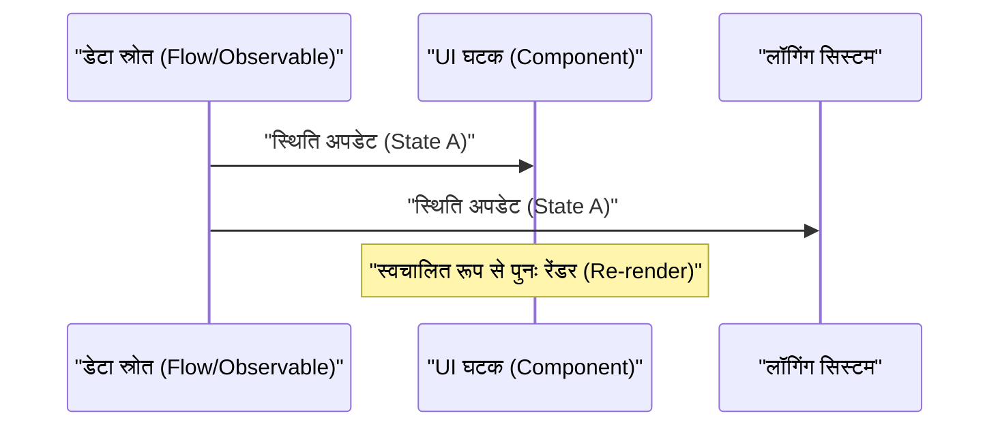
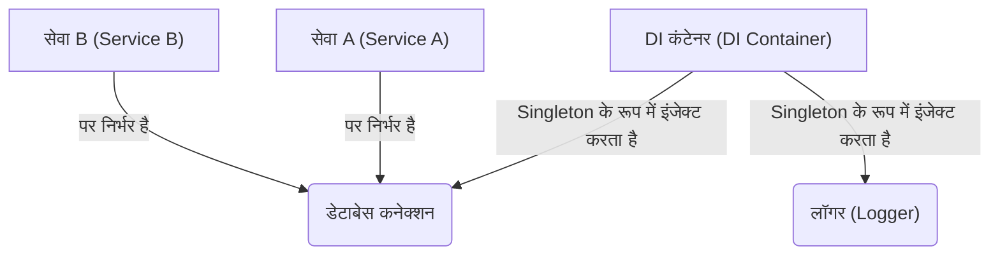

## 1. परिचय: GoF का प्रभाव और मुक्ति

1994 में, सॉफ्टवेयर इंजीनियरिंग के इतिहास में एक महत्वपूर्ण पुस्तक, 'डिज़ाइन पैटर्न्स: एलिमेंट्स ऑफ़ रीयूजेबल ऑब्जेक्ट-ओरिएंटेड सॉफ़्टवेयर' (जिसे आमतौर पर **GoF** पुस्तक के रूप में जाना जाता है) प्रकाशित हुई थी। इस पुस्तक ने उस समय की C++ और Smalltalk जैसी भाषाओं का उपयोग करके ऑब्जेक्ट-ओरिएंटेड डिज़ाइन की सर्वोत्तम प्रथाओं को 23 पैटर्नों के रूप में सूचीबद्ध किया, और दुनिया भर के डेवलपर्स को एक सामान्य शब्दावली प्रदान की।

हालाँकि, आजकल यह दावा अक्सर सुना जाता है कि **"GoF पैटर्न पुराने हो चुके हैं"** । इसके पीछे प्रोग्रामिंग भाषाओं का विकास, कार्यात्मक प्रोग्रामिंग (FP) प्रतिमान का प्रसार, और क्लाउड-नेटिव वितरित प्रणालियों (distributed systems) का उदय है।

इस लेख में, हम गहराई से जानेंगे कि आधुनिक सॉफ्टवेयर विकास में GoF पैटर्न कहाँ खड़े हैं, और कोड उदाहरणों और आरेखों (diagrams) के साथ आधुनिक सर्वोत्तम प्रथाएं क्या हैं।

## 2. डिज़ाइन पैटर्न क्या हैं? वे क्यों बनाए गए?

डिज़ाइन पैटर्न **"एक विशिष्ट संदर्भ में बार-बार आने वाली समस्याओं के लिए सामान्य समाधान"** हैं। GoF ने जिन समस्याओं को हल करने का प्रयास किया, उनमें से कई वास्तव में "उस समय की भाषा सुविधाओं की कमी" की भरपाई के लिए वर्कअराउंड (अस्थायी समाधान) थे।

उदाहरण के लिए, जिन भाषाओं में प्रथम-श्रेणी फ़ंक्शन (First-class functions) मौजूद नहीं थे, वहाँ व्यवहार (behavior) को ऑब्जेक्ट के रूप में एनकैप्सुलेट (encapsulate) करने के लिए `Strategy` पैटर्न या `Command` पैटर्न की आवश्यकता थी। हालाँकि, आधुनिक भाषाओं में जहाँ फ़ंक्शंस को सीधे पास किया जा सकता है, ये पैटर्न केवल अनावश्यक बॉयलरप्लेट (boilerplate) कोड हैं। उदाहरण के लिए, यदि कक्षाओं (classes) की संख्या $C$ है और इंटरफेस की संख्या $I$ है, तो पारंपरिक GoF की जटिलता को $\mathcal{O}(C \times I)$ के रूप में व्यक्त किया जा सकता है, लेकिन कार्यात्मक दृष्टिकोण में यह काफी कम हो जाता है।

## 3. GoF पैटर्नों का आधुनिक पुनर्मूल्यांकन और विकल्प

यहाँ, हम कुछ प्रमुख GoF पैटर्नों पर नज़र डालेंगे और देखेंगे कि उन्हें आधुनिक भाषाओं (TypeScript, Kotlin, [Rust](https://kenji.blog/hi/p/webassembly-wasm-current-future/) आदि) में कैसे प्रतिस्थापित (replace) किया गया है।

### 3.1. Strategy पैटर्न: प्रथम-श्रेणी फ़ंक्शंस द्वारा उन्मूलन

`Strategy` पैटर्न एल्गोरिदम के एक परिवार को परिभाषित करता है, प्रत्येक को एनकैप्सुलेट करता है, और उन्हें विनिमेय (interchangeable) बनाता है।

**पारंपरिक GoF दृष्टिकोण (Java शैली)**

```java
// इंटरफ़ेस की परिभाषा
interface DiscountStrategy {
    double applyDiscount(double price);
}

// कंक्रीट रणनीति का कार्यान्वयन
class HalfPriceDiscount implements DiscountStrategy {
    public double applyDiscount(double price) {
        return price * 0.5;
    }
}

// संदर्भ (Context)
class ShoppingCart {
    private DiscountStrategy strategy;

    public ShoppingCart(DiscountStrategy strategy) {
        this.strategy = strategy;
    }

    public double calculateTotal(double price) {
        return strategy.applyDiscount(price);
    }
}
```

**आधुनिक दृष्टिकोण (TypeScript / कार्यात्मक)**

आधुनिक भाषाओं में, आप केवल फ़ंक्शन को एक तर्क (argument) के रूप में पास करके (उच्च-क्रम फ़ंक्शन - Higher-order functions) इसे हल कर सकते हैं। इंटरफेस या क्लास पदानुक्रम (hierarchy) की कोई आवश्यकता नहीं है।

```typescript
// टाइप एलियास (Type alias) पर्याप्त है
type DiscountStrategy = (price: number) => number;

// रणनीति केवल एक फ़ंक्शन है
const halfPriceDiscount: DiscountStrategy = price => price * 0.5;

// संदर्भ (Context) भी एक साधारण फ़ंक्शन या क्लास है
class ShoppingCart {
    constructor(private discount: DiscountStrategy) {}

    calculateTotal(price: number): number {
        return this.discount(price);
    }
}

// उपयोग का उदाहरण
const cart = new ShoppingCart(halfPriceDiscount);
```

### 3.2. Observer पैटर्न: रिएक्टिव प्रोग्रामिंग (Reactive Programming) में उन्नत

स्थिति (state) परिवर्तन को निर्भर ऑब्जेक्ट्स को सूचित करने के लिए `Observer` पैटर्न आधुनिक GUI विकास और एसिंक्रोनस प्रोसेसिंग में आवश्यक है, लेकिन इसके कार्यान्वयन के तरीके में बहुत विकास हुआ है। Rx (Reactive Extensions), Kotlin Flow, और Swift Combine जैसी लाइब्रेरी और फ्रेमवर्क यह भूमिका निभाते हैं।



**पारंपरिक GoF दृष्टिकोण** में, Subject में Observer को पंजीकृत (register) करने और `update()` विधि (method) को कॉल करने के लिए लूप चलाने का एक जटिल कार्यान्वयन आवश्यक था।

**आधुनिक दृष्टिकोण (Kotlin Flow)**

```kotlin
// Flow का उपयोग करके रिएक्टिव स्थिति प्रबंधन (State management)
class WeatherStation {
    private val _temperature = MutableStateFlow(0.0)
    val temperature: StateFlow<Double> = _temperature.asStateFlow()

    fun updateTemperature(newTemp: Double) {
        _temperature.value = newTemp
    }
}

// निगरानी करने वाला (Observer)
coroutineScope.launch {
    weatherStation.temperature.collect { temp ->
        println("Temperature updated: $temp")
    }
}
```

चूंकि भाषा स्तर पर एसिंक्रोनस स्ट्रीम (asynchronous streams) समर्थित हैं, इसलिए स्वयं से अधिसूचना तंत्र (notification mechanism) बनाने की कोई आवश्यकता नहीं है।

### 3.3. Visitor पैटर्न: पैटर्न मैचिंग और अलजेब्रिक डेटा प्रकार (ADT)

`Visitor` पैटर्न डेटा संरचनाओं और उन पर संचालन को अलग करने के लिए एक पैटर्न है, लेकिन इसमें यह समस्या थी कि इसका कार्यान्वयन बहुत जटिल था और यह सहज (intuitive) नहीं था (डबल डिस्पैच की आवश्यकता थी)।

आजकल, **अलजेब्रिक डेटा प्रकार (ADT)** और **पैटर्न मैचिंग** वाली भाषाओं ([Rust](https://kenji.blog/hi/p/webassembly-wasm-current-future/), Kotlin, Swift, Scala, आदि) का उपयोग करके इस समस्या को बहुत अच्छे से हल किया जा सकता है।

**आधुनिक दृष्टिकोण (Rust के Enums और पैटर्न मैचिंग)**

```rust
// अलजेब्रिक डेटा प्रकार (Variants के साथ Enum)
enum Shape {
    Circle { radius: f64 },
    Rectangle { width: f64, height: f64 },
}

// Visitor क्लास के बजाय पैटर्न मैचिंग का उपयोग करना
fn calculate_area(shape: &Shape) -> f64 {
    match shape {
        Shape::Circle { radius } => std::f64::consts::PI * radius * radius,
        Shape::Rectangle { width, height } => width * height,
    }
}
```

इस तरह, `accept` या `visit` विधियों की श्रृंखला पूरी तरह से अनावश्यक हो जाती है, और कोड का इरादा स्पष्ट हो जाता है। चूँकि कंपाइलर पूर्णता (exhaustiveness - क्या सभी मामलों को संभाला गया है) की जाँच करता है, इसलिए सुरक्षा में भी काफी सुधार होता है।

### 3.4. Singleton पैटर्न: क्या यह सबसे खराब एंटी-पैटर्न है?

`Singleton` पैटर्न वैश्विक स्थिति (global state) बनाता है, परीक्षण (testing) को कठिन बनाता है, और मल्टी-थ्रेडेड वातावरण में बग्स का एक प्रमुख कारण बनता है, इसलिए इसे अक्सर **एंटी-पैटर्न** माना जाता है।

आधुनिक सर्वोत्तम प्रथाओं में, जीवनचक्र (lifecycle) का प्रबंधन करने के लिए **डिपेंडेंसी इंजेक्शन (Dependency Injection: DI)** का उपयोग किया जाता है।



चूँकि Spring Framework (Java), NestJS (TypeScript), और Dagger/Hilt (Android) जैसे DI कंटेनर इंस्टेंस के निर्माण और विनाश का प्रबंधन करते हैं, इसलिए आपको क्लास में Singleton लॉजिक (`getInstance()` या `private constructor`) नहीं लिखना चाहिए।

## 4. कार्यात्मक प्रोग्रामिंग ([Functional Programming](https://kenji.blog/hi/p/oop-vs-fp-vs-dop/)) में डिज़ाइन पैटर्न

कार्यात्मक प्रोग्रामिंग की दुनिया में, ऐसे "पैटर्न" हैं जो GoF से एक अलग आयाम के हैं। ये गणितीय श्रेणी सिद्धांत (Category Theory) द्वारा समर्थित हैं।

### 4.1. Monad (मोनाड) के साथ साइड इफेक्ट्स को नियंत्रित करना

जहाँ GoF पैटर्न "स्थिति परिवर्तन (state mutation)" को मानकर चलते हैं, वहीं कार्यात्मक दृष्टिकोण साइड इफेक्ट्स (अपवाद, एसिंक्रोनस प्रोसेसिंग, Null की संभावना) को टाइप सिस्टम तक ही सीमित रखता है।

उदाहरण के लिए, Null ऑब्जेक्ट पैटर्न और अपवाद प्रबंधन (Exception handling) को `Maybe` (Optional) और `Either` (Result) जैसे मोनाड द्वारा प्रतिस्थापित किया जाता है।

$$
f: A \rightarrow M[B]
$$
$$
g: B \rightarrow M[C]
$$
$$
bind: M[A] \times (A \rightarrow M[B]) \rightarrow M[B]
$$

**[Rust](https://kenji.blog/hi/p/webassembly-wasm-current-future/) में Result प्रकार (Either मोनाड का अनुप्रयोग)**

```rust
fn divide(numerator: f64, denominator: f64) -> Result<f64, String> {
    if denominator == 0.0 {
        Err("Cannot divide by zero".to_string())
    } else {
        Ok(numerator / denominator)
    }
}

// त्रुटि प्रबंधन संयोजन (Error handling composition - flatMap / and_then)
let result = divide(10.0, 2.0).and_then(|res| divide(res, 2.0));
```

## 5. GoF पैटर्न जो आज भी जीवित हैं, या विकसित हुए हैं

सभी GoF पैटर्न खत्म नहीं हुए हैं। आर्किटेक्चर की सीमाओं पर काम करने वाले पैटर्न आज भी बेहद महत्वपूर्ण हैं।

1. **Facade (फसाड)**: जटिल सबसिस्टम के लिए एक सरल इंटरफ़ेस प्रदान करने की अवधारणा माइक्रोसर्विसेज आर्किटेक्चर में API गेटवे ([BFF](https://kenji.blog/hi/p/microservices-architecture-bff-api-gateway/): [Backend for Frontend](https://kenji.blog/hi/p/microservices-architecture-bff-api-gateway/)) के रूप में विकसित हुई है।
2. **Adapter (अडैप्टर)**: बाहरी प्रणालियों के साथ एकीकरण और क्लीन आर्किटेक्चर / हेक्सागोनल आर्किटेक्चर में "पोर्ट और अडैप्टर" के रूप में, यह सिस्टम को शिथिल युग्मित (loosely coupled) रखने की कुंजी बन गया है।
3. **Decorator (डेकोरेटर)**: Python और TypeScript में, इसे एनोटेशन-आधारित मेटा-प्रोग्रामिंग सुविधा `@Decorator` के रूप में भाषा की विशेषता में अपग्रेड किया गया है।

## 6. निष्कर्ष: प्रतिमान बदलाव (Paradigm shift) को स्वीकार करना

**"क्या GoF पुराने हो गए हैं?"** इस प्रश्न का उत्तर है: "भाषा की विशेषताओं के रूप में अवशोषित (absorbed) की गई चीजों के लिए हाँ (YES), लेकिन डिज़ाइन की अमूर्त अवधारणा के रूप में नहीं (NO)।"

जिन डिज़ाइनों के लिए कभी दसियों लाइनों के क्लास पदानुक्रम की आवश्यकता होती थी, उन्हें अब आधुनिक भाषाओं में कुछ ही लाइनों के फ़ंक्शन या एनम (Enum) के साथ व्यक्त किया जा सकता है। हम सॉफ़्टवेयर इंजीनियरों को GoF के रूप (क्लास आरेख और कार्यान्वयन विधियों) पर अड़े रहने के बजाय इस सार पर ध्यान केंद्रित करना चाहिए कि वे **"क्या हल करने का प्रयास कर रहे थे"** ।

आधुनिक सर्वोत्तम प्रथाएं इस प्रकार हैं:

- **विरासत (Inheritance) के बजाय संरचना (Composition) (यह GoF से एक सार्वभौमिक सत्य है)**
- **क्लास के बजाय फ़ंक्शंस (प्रथम-श्रेणी फ़ंक्शंस का उपयोग)**
- **Visitor पैटर्न के बजाय पैटर्न मैचिंग और ADT**
- **Singleton के बजाय DI कंटेनर**
- **स्थिति परिवर्तन ([State](https://kenji.blog/hi/p/iac-infrastructure-as-code-terraform/) mutation) के बजाय अपरिवर्तनशीलता (Immutability) और शुद्ध फ़ंक्शन (Pure functions)**

डिज़ाइन पैटर्न मरे नहीं हैं। प्रोग्रामिंग भाषाओं के विकास के साथ, वे बस अधिक परिष्कृत रूप में बदल गए हैं।
