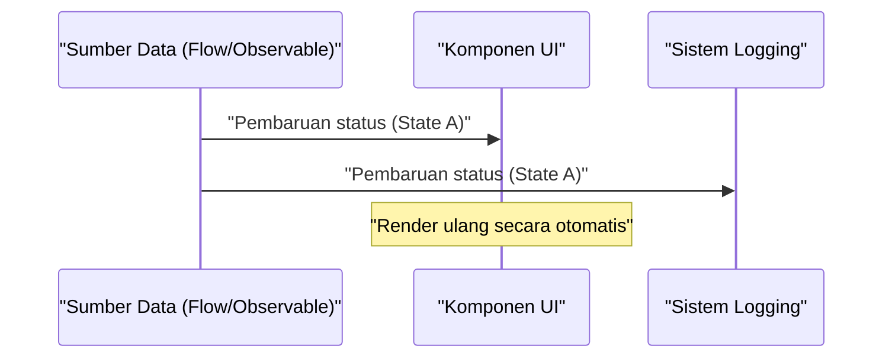
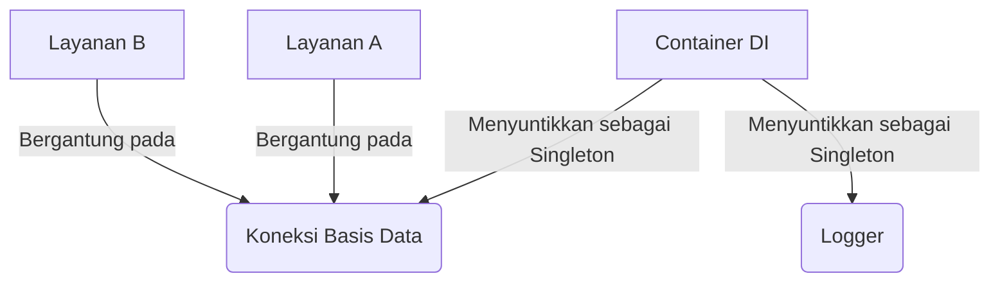

## 1. Pendahuluan: Kutukan dan Pembebasan GoF

Pada tahun 1994, sebuah buku monumental dalam sejarah rekayasa perangkat lunak, "Design Patterns: Elements of Reusable [Object-Oriented](https://kenji.blog/id/p/oop-vs-fp-vs-dop/) Software" (umumnya dikenal sebagai buku **GoF**), diterbitkan. Buku ini mengkatalogkan praktik terbaik untuk desain berorientasi objek menggunakan bahasa-bahasa pada masa itu seperti C++ dan Smalltalk ke dalam 23 pola, memberikan kosakata umum bagi para pengembang di seluruh dunia.

Namun, saat ini kita semakin sering mendengar argumen bahwa **"Pola GoF sudah kuno"**. Latar belakangnya meliputi evolusi bahasa pemrograman, penyebaran paradigma pemrograman fungsional (FP), dan kebangkitan sistem terdistribusi *cloud-native*.

Dalam artikel ini, kita akan menggali lebih dalam tentang posisi pola GoF dalam pengembangan perangkat lunak modern, dan apa saja praktik terbaik modern saat ini, beserta contoh kode dan diagram.

## 2. Apa Itu Design Pattern? Mengapa Mereka Diciptakan?

*Design pattern* atau pola desain adalah **"solusi umum untuk masalah yang sering terjadi dalam konteks tertentu"**. Sebagian besar masalah yang coba diselesaikan oleh GoF sebenarnya adalah *workaround* (solusi sementara) untuk mengimbangi "kurangnya fitur bahasa pada saat itu".

Sebagai contoh, dalam bahasa tanpa fungsi kelas pertama (*first-class functions*), pola `Strategy` dan `Command` diperlukan untuk mengenkapsulasi perilaku sebagai objek. Namun, dalam bahasa modern di mana fungsi dapat diteruskan secara langsung, pola-pola ini tidak lebih dari sekadar *boilerplate* (kode klise) yang berlebihan. Misalnya, jika ada $C$ jumlah kelas dan $I$ jumlah antarmuka, kompleksitas GoF tradisional dapat diekspresikan sebagai $\mathcal{O}(C \times I)$, namun dengan pendekatan fungsional, hal ini berkurang secara drastis.

## 3. Evaluasi Ulang Modern dari Pola GoF dan Alternatifnya

Di sini, kita akan melihat beberapa pola GoF representatif dan bagaimana mereka telah digantikan dalam bahasa modern (TypeScript, Kotlin, [Rust](https://kenji.blog/id/p/webassembly-wasm-current-future/), dll.).

### 3.1. Pola Strategy: Disingkirkan oleh Fungsi Kelas Pertama

Pola `Strategy` mendefinisikan keluarga algoritma, mengenkapsulasi masing-masing algoritma, dan membuatnya dapat dipertukarkan.

**Pendekatan Gaya GoF Tradisional (Gaya Java)**

```java
// Definisi antarmuka
interface DiscountStrategy {
    double applyDiscount(double price);
}

// Implementasi strategi konkret
class HalfPriceDiscount implements DiscountStrategy {
    public double applyDiscount(double price) {
        return price * 0.5;
    }
}

// Konteks
class ShoppingCart {
    private DiscountStrategy strategy;

    public ShoppingCart(DiscountStrategy strategy) {
        this.strategy = strategy;
    }

    public double calculateTotal(double price) {
        return strategy.applyDiscount(price);
    }
}
```

**Pendekatan Modern (TypeScript / Fungsional)**

Dalam bahasa modern, cukup meneruskan fungsi itu sendiri sebagai argumen (*higher-order functions*). Hierarki antarmuka atau kelas tidak diperlukan.

```typescript
// Alias tipe sudah cukup
type DiscountStrategy = (price: number) => number;

// Strategi hanyalah sebuah fungsi
const halfPriceDiscount: DiscountStrategy = price => price * 0.5;

// Konteks juga merupakan fungsi atau kelas sederhana
class ShoppingCart {
    constructor(private discount: DiscountStrategy) {}

    calculateTotal(price: number): number {
        return this.discount(price);
    }
}

// Contoh penggunaan
const cart = new ShoppingCart(halfPriceDiscount);
```

### 3.2. Pola Observer: Sublimasi ke Pemrograman Reaktif

Pola `Observer`, yang memberitahu objek-objek dependen tentang perubahan status, sangat penting dalam pengembangan GUI modern dan pemrosesan asinkron, namun cara penerapannya telah banyak berkembang. Pustaka dan kerangka kerja seperti Rx (Reactive Extensions), Kotlin Flow, dan Swift Combine kini mengambil peran tersebut.



Dalam **pendekatan gaya GoF tradisional**, penerapan yang merepotkan diperlukan untuk mendaftarkan Observer ke Subject dan memanggil metode `update()` dalam sebuah perulangan.

**Pendekatan Modern (Kotlin Flow)**

```kotlin
// Manajemen status reaktif menggunakan Flow
class WeatherStation {
    private val _temperature = MutableStateFlow(0.0)
    val temperature: StateFlow<Double> = _temperature.asStateFlow()

    fun updateTemperature(newTemp: Double) {
        _temperature.value = newTemp
    }
}

// Sisi pengamat (Observer)
coroutineScope.launch {
    weatherStation.temperature.collect { temp ->
        println("Temperature updated: $temp")
    }
}
```

Karena *stream* asinkron didukung pada tingkat bahasa, tidak perlu lagi membuat mekanisme notifikasi Anda sendiri.

### 3.3. Pola Visitor: Pencocokan Pola dan Tipe Data Aljabar (ADT)

Pola `Visitor` memisahkan struktur data dari pemrosesan di atasnya, namun memiliki masalah di mana implementasinya sangat kompleks dan berlawanan dengan intuisi (membutuhkan *double dispatch*).

Di zaman modern, masalah ini diselesaikan dengan indah dengan menggunakan bahasa ([Rust](https://kenji.blog/id/p/webassembly-wasm-current-future/), Kotlin, Swift, Scala, dll.) yang memiliki **tipe data aljabar (ADT)** dan **pencocokan pola** (*pattern matching*).

**Pendekatan Modern (Enum dan Pencocokan Pola di Rust)**

```rust
// Tipe data aljabar (Enum dengan varian)
enum Shape {
    Circle { radius: f64 },
    Rectangle { width: f64, height: f64 },
}

// Menggunakan pencocokan pola sebagai pengganti kelas Visitor
fn calculate_area(shape: &Shape) -> f64 {
    match shape {
        Shape::Circle { radius } => std::f64::consts::PI * radius * radius,
        Shape::Rectangle { width, height } => width * height,
    }
}
```

Dengan cara ini, rantai metode `accept` dan `visit` sama sekali tidak diperlukan, sehingga tujuan kode menjadi jelas. Keamanan juga meningkat secara drastis karena kompiler memeriksa kelengkapan (*exhaustiveness* - apakah semua kasus telah ditangani).

### 3.4. Pola Singleton: Pola Anti-Terburuk?

Pola `Singleton` sering kali dianggap sebagai **anti-pattern** saat ini karena menciptakan status global, mempersulit pengujian, dan menjadi sarang *bug* dalam lingkungan *multi-thread*.

Dalam praktik terbaik modern, siklus hidup dikelola menggunakan **Injeksi Dependensi (Dependency Injection: DI)**.



Karena wadah DI seperti Spring Framework (Java), NestJS (TypeScript), dan Dagger/Hilt (Android) mengelola pembuatan dan penghancuran instans, Anda sebaiknya tidak menulis logika Singleton (seperti `getInstance()` atau *private constructor*) di dalam kelas itu sendiri.

## 4. Pola Desain dalam Pemrograman Fungsional

Dunia pemrograman fungsional memiliki "pola" dengan dimensi yang berbeda dari GoF. Hal ini didukung oleh Teori Kategori matematis.

### 4.1. Pengendalian Efek Samping dengan Monad

Sementara pola GoF mengasumsikan "mutasi status", pendekatan fungsional membatasi efek samping (pengecualian, asinkron, kemungkinan Null) ke dalam sistem tipe.

Misalnya, pola Null Object dan penanganan pengecualian digantikan oleh Monad seperti `Maybe` (Optional) atau `Either` (Result).

$$
f: A \rightarrow M[B]
$$
$$
g: B \rightarrow M[C]
$$
$$
bind: M[A] \times (A \rightarrow M[B]) \rightarrow M[B]
$$

**Tipe Result di [Rust](https://kenji.blog/id/p/webassembly-wasm-current-future/) (Aplikasi dari Monad Either)**

```rust
fn divide(numerator: f64, denominator: f64) -> Result<f64, String> {
    if denominator == 0.0 {
        Err("Cannot divide by zero".to_string())
    } else {
        Ok(numerator / denominator)
    }
}

// Komposisi penanganan kesalahan (flatMap / and_then)
let result = divide(10.0, 2.0).and_then(|res| divide(res, 2.0));
```

## 5. Pola GoF yang Bertahan atau Berevolusi di Era Modern

Tidak semua pola GoF telah punah. Pola-pola yang bekerja di batas-batas arsitektur masih sangat penting hingga saat ini.

1. **Facade**: Konsep menyediakan antarmuka sederhana untuk subsistem yang kompleks telah berkembang menjadi API Gateway (BFF: Backend for Frontend) dalam arsitektur layanan mikro.
2. **Adapter**: Berperan penting dalam menjaga *loose coupling* sistem sebagai "port dan adapter" dalam Clean Architecture / Hexagonal Architecture, serta untuk integrasi dengan sistem eksternal.
3. **Decorator**: Dalam Python dan TypeScript, ia telah disublimasikan menjadi fitur bahasa sebagai fasilitas pemrograman meta berbasis anotasi seperti `@Decorator`.

## 6. Kesimpulan: Menerima Pergeseran Paradigma

Jawaban atas pertanyaan **"Apakah GoF kuno?"** adalah "YA untuk apa yang telah diserap sebagai fitur bahasa, namun TIDAK sebagai konsep desain abstrak".

Desain yang dulunya membutuhkan puluhan baris hierarki kelas kini dapat diekspresikan dalam beberapa baris fungsi atau enum dalam bahasa modern. Sebagai *software engineer*, kita tidak boleh terpaku pada bentuk GoF (diagram kelas dan detail implementasi), melainkan fokus pada esensi **"masalah apa yang coba mereka selesaikan"**.

Praktik terbaik modern adalah sebagai berikut:

- **Komposisi daripada pewarisan (Ini adalah kebenaran universal dari GoF)**
- **Fungsi daripada kelas (Memanfaatkan fungsi kelas pertama)**
- **Pencocokan pola dan ADT daripada pola Visitor**
- **[Container](https://kenji.blog/id/p/docker-container-namespace-cgroups-layers/) DI daripada Singleton**
- **Imutabilitas dan fungsi murni daripada mutasi status**

Pola desain belum mati. Mereka hanya berubah wujud menjadi lebih elegan seiring dengan evolusi bahasa pemrograman.
