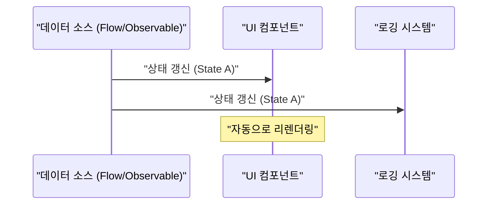
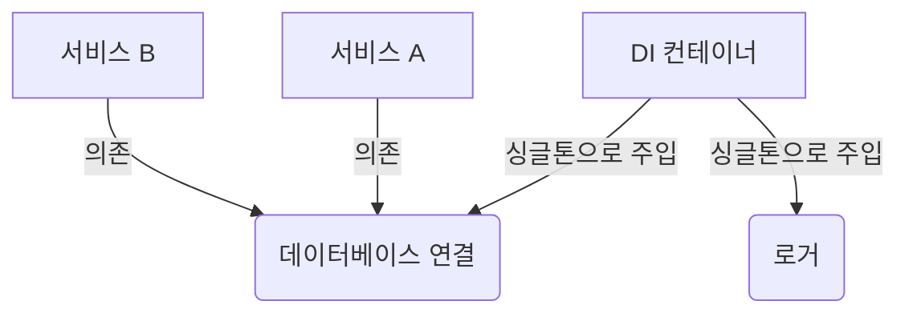

## 1. 시작하며: GoF의 주술과 해방

1994년, 소프트웨어 공학의 역사에 있어서 기념비적인 서적 『객체지향에서의 재사용을 위한 디자인 패턴』(통칭: **GoF** 책)이 출판되었습니다. 이 책은 당시의 C++나 Smalltalk와 같은 언어를 사용한 객체지향 설계의 베스트 프랙티스를 23개의 패턴으로 카탈로그화하여, 전 세계의 개발자들에게 공통의 어휘를 제공했습니다.

하지만, 현재는 **"GoF 패턴은 구식이다"** 라는 주장을 듣는 경우가 늘어나고 있습니다. 그 배경에는 프로그래밍 언어의 진화, 함수형 프로그래밍(FP) 패러다임의 보급, 그리고 클라우드 네이티브한 분산 시스템의 대두가 있습니다.

본 기사에서는 현대의 소프트웨어 개발에서 GoF 패턴이 어떤 위치에 있는지, 그리고 현대의 베스트 프랙티스는 무엇인지를 코드 예제와 도해를 섞어가며 깊게 파고들어 보겠습니다.

## 2. 디자인 패턴이란 무엇인가? 왜 태어났는가?

디자인 패턴이란 **"특정 문맥에서 빈번하게 발생하는 문제에 대한 범용적인 해결책"** 입니다. GoF가 해결하고자 했던 문제의 대부분은 사실 '당시 언어 기능의 부족'을 보완하기 위한 워크어라운드(차선책)이기도 했습니다.

예를 들어, 일급 함수(First-class functions)가 존재하지 않는 언어에서는 행위를 객체로서 캡슐화하기 위해 `Strategy` 패턴이나 `Command` 패턴이 필요했습니다. 하지만, 함수를 직접 전달할 수 있는 현대의 언어에서는 이러한 패턴은 장황한 보일러플레이트(상투적인 코드)에 지나지 않습니다. 예를 들어, 클래스 수 $C$ 와 인터페이스 수 $I$ 가 있을 때, 기존 GoF의 복잡성은 $\mathcal{O}(C \times I)$ 로 표현할 수 있지만, 함수형 접근 방식에서는 이것이 극적으로 감소합니다.

## 3. GoF 패턴의 현대적 재평가와 대안

여기서는 대표적인 GoF 패턴을 살펴보고, 그것들이 현대의 모던 언어(TypeScript, Kotlin, [Rust](https://kenji.blog/ko/p/webassembly-wasm-current-future/) 등)에서 어떻게 대체되고 있는지를 보겠습니다.

### 3.1. Strategy 패턴: 일급 함수에 의한 구축

`Strategy` 패턴은 알고리즘군을 정의하고, 각각을 캡슐화하여 교환 가능하게 만드는 패턴입니다.

**기존의 GoF적 접근 방식 (Java풍)**

```java
// 인터페이스 정의
interface DiscountStrategy {
    double applyDiscount(double price);
}

// 구체적인 전략 구현
class HalfPriceDiscount implements DiscountStrategy {
    public double applyDiscount(double price) {
        return price * 0.5;
    }
}

// 컨텍스트
class ShoppingCart {
    private DiscountStrategy strategy;

    public ShoppingCart(DiscountStrategy strategy) {
        this.strategy = strategy;
    }

    public double calculateTotal(double price) {
        return strategy.applyDiscount(price);
    }
}
```

**현대의 접근 방식 (TypeScript / 함수형)**

현대의 언어에서는 함수 자체를 인수로 전달하는(고차 함수) 것만으로 해결됩니다. 인터페이스나 클래스 계층은 필요하지 않습니다.

```typescript
// 타입 별칭으로 충분
type DiscountStrategy = (price: number) => number;

// 전략은 단순한 함수
const halfPriceDiscount: DiscountStrategy = price => price * 0.5;

// 컨텍스트도 단순한 함수나 클래스
class ShoppingCart {
    constructor(private discount: DiscountStrategy) {}

    calculateTotal(price: number): number {
        return this.discount(price);
    }
}

// 사용 예
const cart = new ShoppingCart(halfPriceDiscount);
```

### 3.2. Observer 패턴: Reactive Programming으로의 승화

상태의 변화를 의존하는 객체에 통지하는 `Observer` 패턴은 현대의 GUI 개발이나 비동기 처리에서 필수적이지만, 구현 방법은 크게 진화했습니다. Rx(Reactive Extensions)나 Kotlin Flow, Swift Combine과 같은 라이브러리/프레임워크가 그 역할을 담당하고 있습니다.



**기존의 GoF적 접근 방식** 에서는 Subject에 Observer를 등록하고 루프를 돌며 `update()` 메서드를 호출하는 촌스러운 구현이 필요했습니다.

**현대의 접근 방식 (Kotlin Flow)**

```kotlin
// Flow를 사용한 리액티브 상태 관리
class WeatherStation {
    private val _temperature = MutableStateFlow(0.0)
    val temperature: StateFlow<Double> = _temperature.asStateFlow()

    fun updateTemperature(newTemp: Double) {
        _temperature.value = newTemp
    }
}

// 감시 측 (Observer)
coroutineScope.launch {
    weatherStation.temperature.collect { temp ->
        println("온도가 갱신되었습니다: $temp")
    }
}
```

언어 수준에서 비동기 스트림이 지원되기 때문에, 자체적으로 통지 메커니즘을 만들 필요는 없습니다.

### 3.3. Visitor 패턴: 패턴 매칭과 대수적 데이터 타입 (ADT)

`Visitor` 패턴은 데이터 구조와 그에 대한 처리를 분리하기 위한 패턴이지만, 구현이 매우 복잡하고 직관에 반하는(더블 디스패치를 필요로 하는) 문제가 있었습니다.

현대에서는 **대수적 데이터 타입 (ADT)** 과 **패턴 매칭** 을 갖춘 언어([Rust](https://kenji.blog/ko/p/webassembly-wasm-current-future/), Kotlin, Swift, Scala 등)를 사용함으로써, 이 문제가 아름답게 해결됩니다.

**현대의 접근 방식 (Rust의 열거형과 패턴 매칭)**

```rust
// 대수적 데이터 타입 (배리언트를 가지는 Enum)
enum Shape {
    Circle { radius: f64 },
    Rectangle { width: f64, height: f64 },
}

// Visitor 클래스 대신 패턴 매칭을 사용
fn calculate_area(shape: &Shape) -> f64 {
    match shape {
        Shape::Circle { radius } => std::f64::consts::PI * radius * radius,
        Shape::Rectangle { width, height } => width * height,
    }
}
```

이처럼, `accept` 나 `visit` 메서드의 연쇄는 완전히 불필요해지며, 코드의 의도가 명확해집니다. 컴파일러가 망라성(모든 케이스가 처리되었는지)을 체크해주기 때문에, 안전성도 비약적으로 향상됩니다.

### 3.4. Singleton 패턴: 최악의 안티 패턴인가?

`Singleton` 패턴은 전역 상태를 만들어내어 테스트를 어렵게 하고 멀티스레드 환경에서 버그의 온상이 되기 때문에, 현재는 **안티 패턴** 으로 간주되는 경우가 많습니다.

현대의 베스트 프랙티스에서는 **의존성 주입 (Dependency Injection: DI)** 을 사용하여 라이프사이클을 관리합니다.



Spring Framework(Java)나 NestJS(TypeScript), Dagger/Hilt(Android) 등의 DI 컨테이너가 인스턴스의 생성과 파기를 관리하므로, 클래스 자체에 Singleton 로직( `getInstance()` 나 `private constructor` )을 작성해서는 안 됩니다.

## 4. 함수형 프로그래밍에서의 디자인 패턴

함수형 프로그래밍의 세계에는 GoF와는 다른 차원의 '패턴'이 존재합니다. 이것들은 수학적인 범주론(Category Theory)에 의해 뒷받침되고 있습니다.

### 4.1. Monad(모나드)에 의한 부수 효과의 제어

GoF의 패턴이 '상태의 뮤테이션'을 전제로 하는 반면, 함수형 접근 방식에서는 부수 효과(예외, 비동기 처리, Null의 가능성)를 타입 시스템에 가둡니다.

예를 들어, Null 객체 패턴이나 예외 처리는 `Maybe` (Optional)이나 `Either` (Result)와 같은 모나드로 대체됩니다.

$$
f: A \rightarrow M[B]
$$
$$
g: B \rightarrow M[C]
$$
$$
bind: M[A] \times (A \rightarrow M[B]) \rightarrow M[B]
$$

**[Rust](https://kenji.blog/ko/p/webassembly-wasm-current-future/)에서의 Result 타입 (Either 모나드의 응용)**

```rust
fn divide(numerator: f64, denominator: f64) -> Result<f64, String> {
    if denominator == 0.0 {
        Err("0으로 나눌 수 없습니다".to_string())
    } else {
        Ok(numerator / denominator)
    }
}

// 에러 핸들링의 합성 (flatMap / and_then)
let result = divide(10.0, 2.0).and_then(|res| divide(res, 2.0));
```

## 5. 현대에도 살아남았거나, 혹은 진화한 GoF 패턴

모든 GoF 패턴이 사멸한 것은 아닙니다. 아키텍처의 경계에서 활약하는 패턴은 지금도 지극히 중요합니다.

1. **Facade(파사드)**: 복잡한 서브시스템에 대한 심플한 인터페이스를 제공하는 개념은 마이크로서비스 아키텍처에서 [API Gateway](https://kenji.blog/ko/p/microservices-architecture-bff-api-gateway/)([BFF](https://kenji.blog/ko/p/microservices-architecture-bff-api-gateway/): [Backend for Frontend](https://kenji.blog/ko/p/microservices-architecture-bff-api-gateway/))로서 스케일 업하고 있습니다.
2. **Adapter(어댑터)**: 외부 시스템과의 통합이나, 클린 아키텍처/헥사고날 아키텍처에서의 '포트와 어댑터'로서 시스템을 느슨하게 결합 상태로 유지하기 위한 핵심이 되고 있습니다.
3. **Decorator(데코레이터)**: Python이나 TypeScript에서 어노테이션 기반의 메타 프로그래밍 기능 `@Decorator` 로서 언어 기능으로 승화되었습니다.

## 6. 요약: 패러다임 시프트를 수용하기

**"GoF는 구식인가?"** 라는 질문에 대한 대답은 "언어의 기능으로서 흡수된 것들에 대해서는 YES, 설계의 추상적인 개념으로서는 NO"입니다.

과거 수십 줄의 클래스 계층을 필요로 했던 설계는 현대의 언어에서 몇 줄의 함수나 열거형으로 표현할 수 있게 되었습니다. 우리 소프트웨어 엔지니어는 GoF의 형태(클래스 다이어그램이나 구현 방법)에 집착할 것이 아니라, 그들이 **"무엇을 해결하려고 했는가"** 라는 본질에 눈을 돌려야 합니다.

현대의 베스트 프랙티스는 다음과 같습니다.

- **상속보다는 컴포지션 (이것은 GoF로부터의 보편적인 진리)**
- **클래스보다는 함수 (일급 함수의 활용)**
- **Visitor 패턴보다는 패턴 매칭과 ADT**
- **Singleton보다는 DI 컨테이너**
- **상태의 뮤테이션보다는 불변성 (Immutability)과 순수 함수**

디자인 패턴은 죽지 않았습니다. 그것은 프로그래밍 언어의 진화와 함께, 더 세련된 모습으로 형태를 바꾸었을 뿐입니다.
