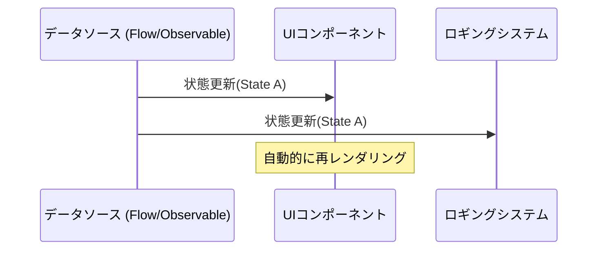
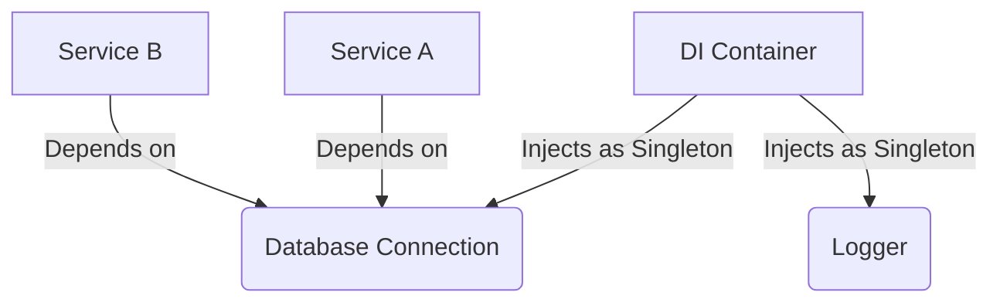

## 1. はじめに：GoFの呪縛と解放

1994年、ソフトウェア工学の歴史において記念碑的な書籍『[オブジェクト指向](https://kenji.blog/p/oop-vs-fp-vs-dop/)における再利用のためのデザインパターン』（通称： **GoF** 本）が出版されました。この本は、当時のC++やSmalltalkといった言語を用いたオブジェクト指向設計のベストプラクティスを23のパターンとしてカタログ化し、世界中の開発者に共通の語彙を提供しました。

しかし、現在では **「GoFパターンは時代遅れである」** という主張を耳にすることが増えています。その背景には、プログラミング言語の進化、[関数型プログラミング](https://kenji.blog/p/oop-vs-fp-vs-dop/)（FP）のパラダイムの普及、そしてクラウドネイティブな[分散システム](https://kenji.blog/p/cap-theorem-distributed-systems-tradeoff/)の台頭があります。

本記事では、現代のソフトウェア開発において GoF パターンがどのような立ち位置にあるのか、そして現代のベストプラクティスとは何なのかを、コード例と図解を交えながら深く掘り下げます。

## 2. デザインパターンとは何か？なぜ生まれたのか？

デザインパターンとは、 **「特定の文脈において頻繁に発生する問題に対する、汎用的な解決策」** です。GoFが解決しようとした問題の多くは、実は「当時の言語機能の不足」を補うためのワークアラウンド（次善策）でもありました。

例えば、第一級関数（First-class functions）が存在しない言語では、振る舞いをオブジェクトとしてカプセル化するために `Strategy` パターンや `Command` パターンが必要でした。しかし、関数を直接渡せる現代の言語では、これらのパターンは冗長なボイラープレート（お決まりのコード）に過ぎません。例えば、クラス数 $C$ とインターフェース数 $I$ があるとき、従来のGoFの複雑性は $\mathcal{O}(C \times I)$ と表現できますが、関数型のアプローチではこれが劇的に減少します。

## 3. GoFパターンの現代的再評価と代替案

ここでは、代表的なGoFパターンを取り上げ、それらが現代のモダンな言語（TypeScript, Kotlin, [Rust](https://kenji.blog/p/webassembly-wasm-current-future/)など）でどのように置き換えられているかを見ていきます。

### 3.1. Strategy パターン：第一級関数による駆逐

`Strategy` パターンは、アルゴリズムのファミリを定義し、それぞれをカプセル化して交換可能にするパターンです。

**従来のGoF的アプローチ（Java風）**

```java
// インターフェースの定義
interface DiscountStrategy {
    double applyDiscount(double price);
}

// 具象戦略の実装
class HalfPriceDiscount implements DiscountStrategy {
    public double applyDiscount(double price) {
        return price * 0.5;
    }
}

// コンテキスト
class ShoppingCart {
    private DiscountStrategy strategy;

    public ShoppingCart(DiscountStrategy strategy) {
        this.strategy = strategy;
    }

    public double calculateTotal(double price) {
        return strategy.applyDiscount(price);
    }
}
```

**現代のアプローチ（TypeScript / 関数型）**

現代の言語では、関数そのものを引数として渡す（高階関数）だけで解決します。インターフェースやクラスの階層は不要です。

```typescript
// 型エイリアスで十分
type DiscountStrategy = (price: number) => number;

// 戦略は単なる関数
const halfPriceDiscount: DiscountStrategy = price => price * 0.5;

// コンテキストもシンプルな関数やクラス
class ShoppingCart {
    constructor(private discount: DiscountStrategy) {}

    calculateTotal(price: number): number {
        return this.discount(price);
    }
}

// 使用例
const cart = new ShoppingCart(halfPriceDiscount);
```

### 3.2. Observer パターン：Reactive Programmingへの昇華

状態の変化を依存するオブジェクトに通知する `Observer` パターンは、現代のGUI開発や[非同期処理](https://kenji.blog/p/event-driven-architecture-async/)において不可欠ですが、実装方法は大きく進化しました。Rx (Reactive Extensions) や Kotlin Flow、Swift Combine といったライブラリ・フレームワークがその役割を担っています。



**従来のGoF的アプローチ** では、SubjectにObserverを登録し、ループを回して `update()` メソッドを呼ぶ泥臭い実装が必要でした。

**現代のアプローチ（Kotlin Flow）**

```kotlin
// Flowを使ったリアクティブな状態管理
class WeatherStation {
    private val _temperature = MutableStateFlow(0.0)
    val temperature: StateFlow<Double> = _temperature.asStateFlow()

    fun updateTemperature(newTemp: Double) {
        _temperature.value = newTemp
    }
}

// 監視側（Observer）
coroutineScope.launch {
    weatherStation.temperature.collect { temp ->
        println("Temperature updated: $temp")
    }
}
```

言語レベルで非同期ストリームがサポートされているため、自前で通知の仕組みを作る必要はありません。

### 3.3. Visitor パターン：パターンマッチングと代数的データ型 (ADT)

`Visitor` パターンは、データ構造とそれに対する処理を分離するためのパターンですが、実装が非常に複雑で直感に反する（ダブルディスパッチを必要とする）という問題がありました。

現代では、 **代数的データ型 (ADT)** と **パターンマッチング** を備えた言語（[Rust](https://kenji.blog/p/webassembly-wasm-current-future/), Kotlin, Swift, Scalaなど）を使用することで、この問題は美しく解決されます。

**現代のアプローチ（Rustの列挙型とパターンマッチ）**

```rust
// 代数的データ型（バリアントを持つEnum）
enum Shape {
    Circle { radius: f64 },
    Rectangle { width: f64, height: f64 },
}

// Visitor クラスの代わりにパターンマッチを使用
fn calculate_area(shape: &Shape) -> f64 {
    match shape {
        Shape::Circle { radius } => std::f64::consts::PI * radius * radius,
        Shape::Rectangle { width, height } => width * height,
    }
}
```

このように、 `accept` や `visit` メソッドの連鎖は完全に不要となり、コードの意図が明確になります。コンパイラが網羅性（すべてのケースが処理されているか）をチェックしてくれるため、安全性も飛躍的に向上します。

### 3.4. Singleton パターン：最悪のアンチパターンか？

`Singleton` パターンは、グローバル状態を生み出し、テストを困難にし、マルチスレッド環境でのバグの温床となるため、現在では **アンチパターン** と見なされることが多いです。

現代のベストプラクティスでは、 **依存性の注入 (Dependency Injection: DI)** を使用してライフサイクルを管理します。



Spring Framework (Java) や NestJS (TypeScript)、Dagger/Hilt (Android) などのDIコンテナがインスタンスの生成と破棄を管理するため、クラス自体にSingletonのロジック（ `getInstance()` や `private constructor` ）を書くべきではありません。

## 4. [関数型プログラミング](https://kenji.blog/p/oop-vs-fp-vs-dop/)におけるデザインパターン

関数型プログラミングの世界には、GoFとは異なる次元の「パターン」が存在します。これらは数学的な圏論（Category Theory）に裏打ちされています。

### 4.1. Monad（モナド）による副作用の制御

GoFのパターンが「状態のミューテーション」を前提としているのに対し、関数型のアプローチでは副作用（例外、[非同期処理](https://kenji.blog/p/event-driven-architecture-async/)、Nullの可能性）を型システムに閉じ込めます。

例えば、Nullオブジェクトパターンや例外処理は、 `Maybe` (Optional) や `Either` (Result) といったモナドに置き換わります。

$$
f: A \rightarrow M[B]
$$
$$
g: B \rightarrow M[C]
$$
$$
bind: M[A] \times (A \rightarrow M[B]) \rightarrow M[B]
$$

**[Rust](https://kenji.blog/p/webassembly-wasm-current-future/)における Result型 (Eitherモナドの応用)**

```rust
fn divide(numerator: f64, denominator: f64) -> Result<f64, String> {
    if denominator == 0.0 {
        Err("Cannot divide by zero".to_string())
    } else {
        Ok(numerator / denominator)
    }
}

// エラーハンドリングの合成（flatMap / and_then）
let result = divide(10.0, 2.0).and_then(|res| divide(res, 2.0));
```

## 5. 現代でも生き残っている、あるいは進化したGoFパターン

すべてのGoFパターンが死滅したわけではありません。アーキテクチャの境界で活躍するパターンは、今でも極めて重要です。

1. **Facade（ファサード）**: 複雑なサブシステムに対するシンプルなインターフェースを提供する概念は、[マイクロサービス](https://kenji.blog/p/microservices-architecture-bff-api-gateway/)アーキテクチャにおける[API Gateway](https://kenji.blog/p/microservices-architecture-bff-api-gateway/)（[BFF](https://kenji.blog/p/microservices-architecture-bff-api-gateway/): [Backend for Frontend](https://kenji.blog/p/microservices-architecture-bff-api-gateway/)）としてスケールアップしています。
2. **Adapter（アダプター）**: 外部システムとの統合や、クリーンアーキテクチャ・ヘキサゴナルアーキテクチャにおける「ポートとアダプター」として、システムを疎結合に保つための要となっています。
3. **Decorator（デコレータ）**: PythonやTypeScriptにおいて、アノテーションベースのメタプログラミング機能 `@Decorator` として言語機能に昇華されました。

## 6. まとめ：パラダイムシフトを受け入れる

**「GoFは時代遅れか？」** という問いに対する答えは、「言語の機能として吸収されたものについては YES、設計の抽象的な概念としては NO」です。

かつて数十行のクラス階層を必要とした設計は、現代の言語では数行の関数や列挙型で表現できるようになりました。私たちソフトウェアエンジニアは、GoFの形（クラス図や実装方法）に固執するのではなく、彼らが **「何を解決しようとしていたのか」** という本質に目を向けるべきです。

現代のベストプラクティスは以下の通りです。

- **継承よりもコンポジション（これはGoFからの普遍の真理）**
- **クラスよりも関数（第一級関数の活用）**
- **VisitorパターンよりもパターンマッチングとADT**
- **SingletonよりもDIコンテナ**
- **状態のミューテーションよりも不変性（Immutability）と純粋関数**

デザインパターンは死んでいません。それはプログラミング言語の進化とともに、より洗練された姿へと形を変えただけなのです。
