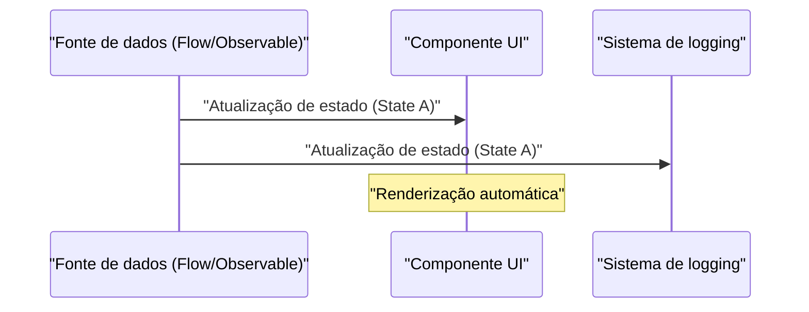
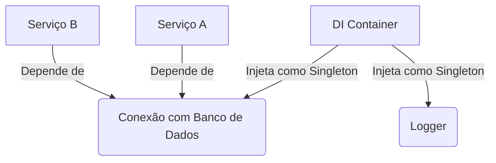

## 1. Introdução: O feitiço e a libertação do GoF

Em 1994, foi publicado o livro monumental na história da engenharia de software, "Design Patterns: Elements of Reusable [Object-Oriented](https://kenji.blog/pt/p/oop-vs-fp-vs-dop/) Software" (comumente conhecido como o livro **GoF**). Este livro catalogou as melhores práticas de design orientado a objetos usando linguagens da época como C++ e Smalltalk em 23 padrões, fornecendo um vocabulário comum para desenvolvedores em todo o mundo.

No entanto, hoje em dia, ouvimos cada vez mais a afirmação de que **"os padrões GoF estão obsoletos"**. Por trás disso está a evolução das linguagens de programação, a popularização do paradigma da programação funcional (FP) e a ascensão de sistemas distribuídos nativos da nuvem.

Neste artigo, aprofundaremos a posição dos padrões GoF no desenvolvimento de software moderno e quais são as melhores práticas atuais, com exemplos de código e ilustrações.

## 2. O que são Padrões de Projeto? Por que eles nasceram?

Padrões de projeto são **"soluções gerais para problemas que ocorrem frequentemente em contextos específicos"**. Muitos dos problemas que o GoF tentou resolver eram, na verdade, soluções alternativas (workarounds) para compensar a "falta de recursos das linguagens da época".

Por exemplo, em linguagens que não possuíam funções de primeira classe (First-class functions), padrões como `Strategy` e `Command` eram necessários para encapsular o comportamento como objetos. No entanto, em linguagens modernas onde funções podem ser passadas diretamente, esses padrões não passam de um código repetitivo (boilerplate) redundante. Por exemplo, quando temos o número de classes $C$ e o número de interfaces $I$, a complexidade tradicional do GoF pode ser expressa como $\mathcal{O}(C \times I)$, mas com uma abordagem funcional, isso diminui drasticamente.

## 3. Reavaliação moderna e alternativas dos padrões GoF

Aqui, abordaremos alguns padrões GoF representativos e veremos como eles estão sendo substituídos em linguagens modernas (TypeScript, Kotlin, [Rust](https://kenji.blog/pt/p/webassembly-wasm-current-future/), etc.).

### 3.1. Padrão Strategy: Eliminação por funções de primeira classe

O padrão `Strategy` define uma família de algoritmos, encapsula cada um deles e os torna intercambiáveis.

**Abordagem tradicional no estilo GoF (estilo Java)**

```java
// Definição da interface
interface DiscountStrategy {
    double applyDiscount(double price);
}

// Implementação da estratégia concreta
class HalfPriceDiscount implements DiscountStrategy {
    public double applyDiscount(double price) {
        return price * 0.5;
    }
}

// Contexto
class ShoppingCart {
    private DiscountStrategy strategy;

    public ShoppingCart(DiscountStrategy strategy) {
        this.strategy = strategy;
    }

    public double calculateTotal(double price) {
        return strategy.applyDiscount(price);
    }
}
```

**Abordagem moderna (TypeScript / Funcional)**

Em linguagens modernas, isso é resolvido apenas passando a própria função como argumento (funções de ordem superior). Hierarquias de interfaces e classes são desnecessárias.

```typescript
// Um alias de tipo é suficiente
type DiscountStrategy = (price: number) => number;

// A estratégia é apenas uma função
const halfPriceDiscount: DiscountStrategy = price => price * 0.5;

// O contexto também é uma função ou classe simples
class ShoppingCart {
    constructor(private discount: DiscountStrategy) {}

    calculateTotal(price: number): number {
        return this.discount(price);
    }
}

// Exemplo de uso
const cart = new ShoppingCart(halfPriceDiscount);
```

### 3.2. Padrão Observer: Elevação para Programação Reativa

O padrão `Observer`, que notifica objetos dependentes sobre mudanças de estado, é essencial no desenvolvimento de GUIs modernas e no processamento assíncrono, mas sua implementação evoluiu muito. Bibliotecas e frameworks como Rx (Reactive Extensions), Kotlin Flow e Swift Combine assumiram esse papel.



**Na abordagem tradicional do GoF**, era necessária uma implementação deselegante onde o Observer era registrado no Subject, e iterava-se um loop para chamar o método `update()`.

**Abordagem moderna (Kotlin Flow)**

```kotlin
// Gerenciamento de estado reativo usando Flow
class WeatherStation {
    private val _temperature = MutableStateFlow(0.0)
    val temperature: StateFlow<Double> = _temperature.asStateFlow()

    fun updateTemperature(newTemp: Double) {
        _temperature.value = newTemp
    }
}

// Lado observador (Observer)
coroutineScope.launch {
    weatherStation.temperature.collect { temp ->
        println("Temperature updated: $temp")
    }
}
```

Como fluxos assíncronos são suportados no nível da linguagem, não há necessidade de criar seu próprio mecanismo de notificação.

### 3.3. Padrão Visitor: Correspondência de padrões e Tipos de Dados Algébricos (ADT)

O padrão `Visitor` separa a estrutura de dados das operações sobre ela, mas tinha o problema de sua implementação ser extremamente complexa e contra-intuitiva (exigindo double dispatch).

Hoje em dia, usando linguagens (como [Rust](https://kenji.blog/pt/p/webassembly-wasm-current-future/), Kotlin, Swift, Scala, etc.) que possuem **Tipos de Dados Algébricos (ADT)** e **Correspondência de padrões (Pattern matching)**, esse problema é resolvido de maneira elegante.

**Abordagem moderna (Enums e Pattern match no Rust)**

```rust
// Tipo de dados algébrico (Enum com variantes)
enum Shape {
    Circle { radius: f64 },
    Rectangle { width: f64, height: f64 },
}

// Uso de pattern match em vez da classe Visitor
fn calculate_area(shape: &Shape) -> f64 {
    match shape {
        Shape::Circle { radius } => std::f64::consts::PI * radius * radius,
        Shape::Rectangle { width, height } => width * height,
    }
}
```

Dessa forma, a cadeia de chamadas aos métodos `accept` e `visit` torna-se completamente desnecessária, e a intenção do código fica clara. A segurança também melhora drasticamente, pois o compilador verifica a exaustividade (se todos os casos foram tratados).

### 3.4. Padrão Singleton: O pior antipadrão?

O padrão `Singleton` cria um estado global, dificulta os testes e é um foco de bugs em ambientes multithreaded, por isso é frequentemente considerado um **antipadrão** atualmente.

Nas melhores práticas modernas, a **Injeção de Dependência (Dependency Injection: DI)** é usada para gerenciar o ciclo de vida.



Como contêineres de DI como Spring Framework (Java), NestJS (TypeScript) e Dagger/Hilt (Android) gerenciam a criação e destruição de instâncias, você não deve escrever a lógica de Singleton (`getInstance()` ou construtores privados) na própria classe.

## 4. Padrões de projeto na Programação Funcional

No mundo da programação funcional, existem "padrões" em uma dimensão diferente do GoF. Eles são apoiados pela teoria das categorias matemáticas (Category Theory).

### 4.1. Controle de efeitos colaterais com Monad

Enquanto os padrões GoF assumem "mutação de estado", a abordagem funcional confina os efeitos colaterais (exceções, processamento assíncrono, possibilidade de Null) no sistema de tipos.

Por exemplo, o padrão Null Object e o tratamento de exceções são substituídos por mônadas como `Maybe` (Optional) e `Either` (Result).

$$
f: A \rightarrow M[B]
$$
$$
g: B \rightarrow M[C]
$$
$$
bind: M[A] \times (A \rightarrow M[B]) \rightarrow M[B]
$$

**Tipo Result em [Rust](https://kenji.blog/pt/p/webassembly-wasm-current-future/) (Aplicação da mônada Either)**

```rust
fn divide(numerator: f64, denominator: f64) -> Result<f64, String> {
    if denominator == 0.0 {
        Err("Cannot divide by zero".to_string())
    } else {
        Ok(numerator / denominator)
    }
}

// Composição do tratamento de erros (flatMap / and_then)
let result = divide(10.0, 2.0).and_then(|res| divide(res, 2.0));
```

## 5. Padrões GoF que sobrevivem ou evoluíram até hoje

Nem todos os padrões GoF morreram. Padrões que operam nas fronteiras da arquitetura continuam sendo de extrema importância.

1. **Facade**: O conceito de fornecer uma interface simples para um subsistema complexo escalou como um API Gateway (BFF: Backend for Frontend) em arquiteturas de microsserviços.
2. **Adapter**: É a chave para manter o baixo acoplamento do sistema, integrando sistemas externos e atuando como "portas e adaptadores" na arquitetura limpa e hexagonal.
3. **Decorator**: Em Python e TypeScript, foi elevado a um recurso de linguagem como a funcionalidade de metaprogramação baseada em anotação `@Decorator`.

## 6. Conclusão: Aceitando a mudança de paradigma

A resposta à pergunta **"O GoF está obsoleto?"** é "SIM, para os recursos absorvidos pelas linguagens, e NÃO, como conceitos abstratos de design".

Os designs que antes exigiam dezenas de linhas de hierarquia de classes podem agora ser expressos com algumas linhas de funções ou enums nas linguagens modernas. Como engenheiros de software, não devemos nos apegar às formas do GoF (diagramas de classes ou métodos de implementação), mas sim focar na essência do que eles **"tentavam resolver"**.

As melhores práticas modernas são as seguintes:

- **Composição sobre herança (uma verdade universal do GoF)**
- **Funções sobre classes (uso de funções de primeira classe)**
- **Correspondência de padrões e ADTs sobre o padrão Visitor**
- **Contêineres de DI sobre Singleton**
- **Imutabilidade e funções puras sobre a mutação de estado**

Os padrões de projeto não estão mortos. Eles apenas se transformaram em formas mais refinadas, acompanhando a evolução das linguagens de programação.
