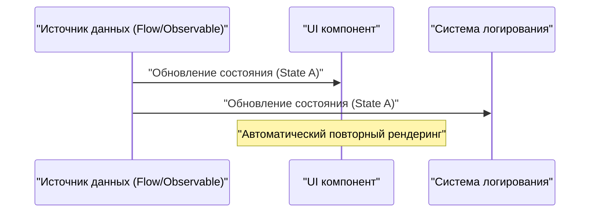
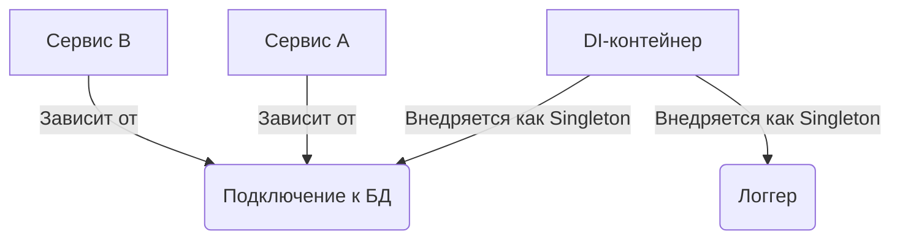

## 1. Введение: Проклятие и освобождение от GoF

В 1994 году в истории программной инженерии была опубликована монументальная книга «Приемы объектно-ориентированного проектирования. Паттерны проектирования» (известная как книга **GoF**). Эта книга каталогизировала лучшие практики объектно-ориентированного проектирования с использованием языков того времени, таких как C++ и Smalltalk, в виде 23 паттернов, предоставив разработчикам по всему миру общий словарь.

Однако сегодня мы все чаще слышим утверждение: **«Паттерны GoF устарели»**. За этим стоят эволюция языков программирования, распространение парадигмы функционального программирования (FP) и появление облачно-нативных распределенных систем.

В этой статье мы глубоко исследуем, какое место занимают паттерны GoF в современной разработке программного обеспечения, и каковы современные лучшие практики, иллюстрируя это примерами кода и диаграммами.

## 2. Что такое паттерны проектирования? Почему они появились?

Паттерны проектирования — это **«универсальные решения часто возникающих проблем в определенном контексте»**. Многие из проблем, которые пыталась решить GoF, на самом деле были обходными путями для компенсации «недостатка языковых функций того времени».

Например, в языках без функций первого класса (First-class functions) для инкапсуляции поведения как объекта требовались паттерны `Strategy` или `Command`. Однако в современных языках, где функции можно передавать напрямую, эти паттерны являются не более чем избыточным шаблонным кодом (boilerplate). Например, при наличии $C$ классов и $I$ интерфейсов сложность традиционного GoF можно выразить как $\mathcal{O}(C \times I)$, но при функциональном подходе она резко снижается.

## 3. Современная переоценка паттернов GoF и альтернативы

Здесь мы рассмотрим типичные паттерны GoF и то, как они заменяются в современных языках (TypeScript, Kotlin, [Rust](https://kenji.blog/ru/p/webassembly-wasm-current-future/) и т.д.).

### 3.1. Паттерн Strategy: Вытеснение функциями первого класса

Паттерн `Strategy` определяет семейство алгоритмов, инкапсулирует каждый из них и делает их взаимозаменяемыми.

**Традиционный подход GoF (в стиле Java)**

```java
// Определение интерфейса
interface DiscountStrategy {
    double applyDiscount(double price);
}

// Конкретная реализация стратегии
class HalfPriceDiscount implements DiscountStrategy {
    public double applyDiscount(double price) {
        return price * 0.5;
    }
}

// Контекст
class ShoppingCart {
    private DiscountStrategy strategy;

    public ShoppingCart(DiscountStrategy strategy) {
        this.strategy = strategy;
    }

    public double calculateTotal(double price) {
        return strategy.applyDiscount(price);
    }
}
```

**Современный подход (TypeScript / Функциональный)**

В современных языках эта проблема решается просто передачей самой функции в качестве аргумента (функции высшего порядка). Иерархии интерфейсов и классов не нужны.

```typescript
// Псевдонима типа достаточно
type DiscountStrategy = (price: number) => number;

// Стратегия — это просто функция
const halfPriceDiscount: DiscountStrategy = price => price * 0.5;

// Контекст также является простой функцией или классом
class ShoppingCart {
    constructor(private discount: DiscountStrategy) {}

    calculateTotal(price: number): number {
        return this.discount(price);
    }
}

// Пример использования
const cart = new ShoppingCart(halfPriceDiscount);
```

### 3.2. Паттерн Observer: Возвышение до Reactive Programming

Паттерн `Observer`, который уведомляет зависимые объекты об изменениях состояния, необходим в современной разработке GUI и асинхронной обработке, но метод его реализации значительно эволюционировал. Эту роль теперь играют библиотеки и фреймворки, такие как Rx (Reactive Extensions), Kotlin Flow и Swift Combine.



В **традиционном подходе GoF** требовалась грубая реализация: регистрация Observer в Subject и вызов метода `update()` в цикле.

**Современный подход (Kotlin Flow)**

```kotlin
// Реактивное управление состоянием с использованием Flow
class WeatherStation {
    private val _temperature = MutableStateFlow(0.0)
    val temperature: StateFlow<Double> = _temperature.asStateFlow()

    fun updateTemperature(newTemp: Double) {
        _temperature.value = newTemp
    }
}

// Сторона наблюдения (Observer)
coroutineScope.launch {
    weatherStation.temperature.collect { temp ->
        println("Temperature updated: $temp")
    }
}
```

Поскольку асинхронные потоки поддерживаются на уровне языка, нет необходимости создавать собственный механизм уведомлений.

### 3.3. Паттерн Visitor: Сопоставление с образцом и алгебраические типы данных (ADT)

Паттерн `Visitor` предназначен для разделения структур данных и операций над ними, но у него была проблема: реализация была очень сложной и неинтуитивной (требовалась двойная диспетчеризация).

В наше время эта проблема элегантно решается с использованием языков ([Rust](https://kenji.blog/ru/p/webassembly-wasm-current-future/), Kotlin, Swift, Scala и т.д.), которые поддерживают **алгебраические типы данных (ADT)** и **сопоставление с образцом (pattern matching)**.

**Современный подход (Перечисления и сопоставление с образцом в Rust)**

```rust
// Алгебраический тип данных (Enum с вариантами)
enum Shape {
    Circle { radius: f64 },
    Rectangle { width: f64, height: f64 },
}

// Использование сопоставления с образцом вместо класса Visitor
fn calculate_area(shape: &Shape) -> f64 {
    match shape {
        Shape::Circle { radius } => std::f64::consts::PI * radius * radius,
        Shape::Rectangle { width, height } => width * height,
    }
}
```

Таким образом, цепочки методов `accept` и `visit` становятся совершенно ненужными, а намерения кода становятся очевидными. Поскольку компилятор проверяет полноту (обработаны ли все возможные варианты), безопасность также значительно повышается.

### 3.4. Паттерн Singleton: Худший антипаттерн?

Паттерн `Singleton` сегодня часто рассматривается как **антипаттерн**, поскольку он порождает глобальное состояние, усложняет тестирование и является источником ошибок в многопоточных средах.

Современная лучшая практика заключается в использовании **внедрения зависимостей (Dependency Injection: DI)** для управления жизненным циклом.



Поскольку DI-контейнеры, такие как Spring Framework (Java), NestJS (TypeScript) или Dagger/Hilt (Android), управляют созданием и уничтожением экземпляров, вам не следует писать логику Singleton (`getInstance()` или `private constructor`) в самом классе.

## 4. Паттерны проектирования в функциональном программировании

В мире функционального программирования существуют «паттерны» другого измерения, отличные от GoF. Они опираются на математическую теорию категорий (Category Theory).

### 4.1. Управление побочными эффектами с помощью Монад (Monad)

В то время как паттерны GoF предполагают «мутацию состояния», функциональный подход инкапсулирует побочные эффекты (исключения, асинхронную обработку, возможность Null) в систему типов.

Например, паттерн Null-объект и обработка исключений заменяются монадами, такими как `Maybe` (Optional) или `Either` (Result).

$$
f: A \rightarrow M[B]
$$
$$
g: B \rightarrow M[C]
$$
$$
bind: M[A] \times (A \rightarrow M[B]) \rightarrow M[B]
$$

**Тип Result в [Rust](https://kenji.blog/ru/p/webassembly-wasm-current-future/) (Применение монады Either)**

```rust
fn divide(numerator: f64, denominator: f64) -> Result<f64, String> {
    if denominator == 0.0 {
        Err("Cannot divide by zero".to_string())
    } else {
        Ok(numerator / denominator)
    }
}

// Композиция обработки ошибок (flatMap / and_then)
let result = divide(10.0, 2.0).and_then(|res| divide(res, 2.0));
```

## 5. Паттерны GoF, которые выжили или эволюционировали в наше время

Не все паттерны GoF вымерли. Паттерны, которые работают на границах архитектуры, по-прежнему крайне важны.

1. **Facade (Фасад)**: Концепция предоставления простого интерфейса к сложной подсистеме масштабировалась до API Gateway (BFF: Backend for Frontend) в микросервисной архитектуре.
2. **Adapter (Адаптер)**: Он является ключом к поддержанию слабой связанности системы, выступая в качестве «портов и адаптеров» в чистой архитектуре (Clean Architecture) и гексагональной архитектуре, а также при интеграции с внешними системами.
3. **Decorator (Декоратор)**: В Python и TypeScript он был возвышен до языковой функции как метапрограммирование на основе аннотаций `@Decorator`.

## 6. Заключение: Принятие смены парадигмы

Ответом на вопрос **«Устарела ли GoF?»** будет: «ДА, для тех паттернов, которые были поглощены функциями языков, и НЕТ, для них как для абстрактных концепций проектирования».

Конструкции, для которых раньше требовались десятки строк иерархии классов, теперь могут быть выражены в современных языках несколькими строками функций или перечислений. Нам, инженерам-программистам, не следует зацикливаться на формах GoF (диаграммах классов и методах реализации), а нужно сосредоточиться на сути: **«какую проблему они пытались решить»**.

Современные лучшие практики таковы:

- **Композиция вместо наследования (это универсальная истина из GoF)**
- **Функции вместо классов (использование функций первого класса)**
- **Сопоставление с образцом и ADT вместо паттерна Visitor**
- **DI-контейнеры вместо Singleton**
- **Неизменяемость (Immutability) и чистые функции вместо мутации состояния**

Паттерны проектирования не умерли. Они просто изменили форму, став более изощренными по мере эволюции языков программирования.
