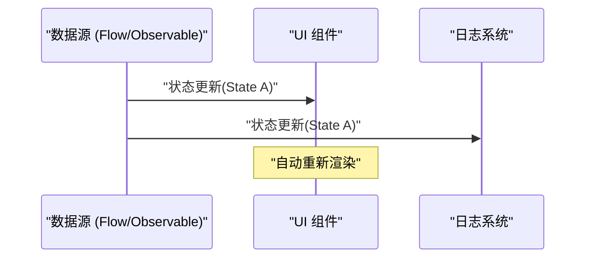
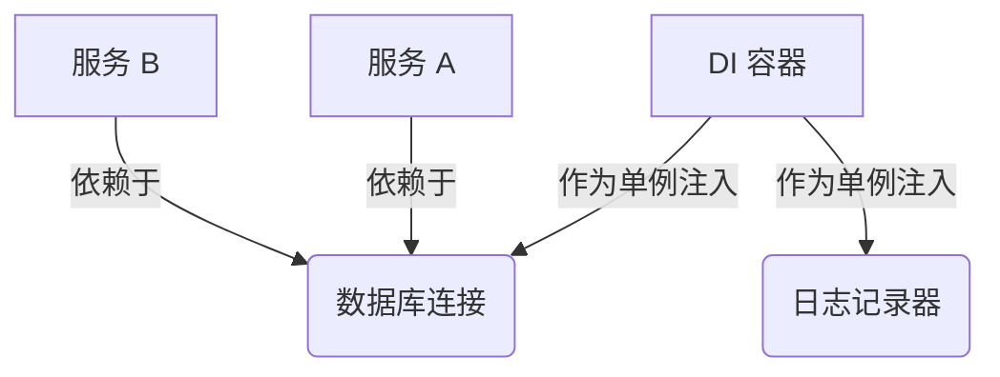

## 1. 引言：GoF 的束缚与解放

1994 年，软件工程历史上具有里程碑意义的书籍《设计模式：可复用面向对象软件的基础》（俗称： **GoF** 本）出版了。这本书将当时使用 C++ 和 Smalltalk 等语言进行面向对象设计的最佳实践归纳为 23 种模式，为全世界的开发者提供了共通的词汇。

然而，如今我们越来越常听到 **“GoF 模式已经过时了”** 这种主张。其背景在于编程语言的进化、函数式编程（FP）范式的普及，以及云原生分布式系统的崛起。

本文将结合代码示例和图解，深入探讨在现代软件开发中 GoF 模式处于怎样的地位，以及现代的最佳实践究竟是什么。

## 2. 什么是设计模式？为什么会产生？

设计模式是 **“针对在特定上下文中频繁出现的问题，提供的一种通用解决方案”** 。GoF 试图解决的许多问题，实际上也是为了弥补“当时语言功能不足”而采取的变通方案（次优解）。

例如，在不存在头等函数（First-class functions）的语言中，为了将行为作为对象进行封装，就需要使用 `Strategy` 模式或 `Command` 模式。但是，在可以直接传递函数的现代语言中，这些模式只不过是冗长的样板代码（Boilerplate）。例如，当有 $C$ 个类和 $I$ 个接口时，传统的 GoF 复杂性可以表示为 $\mathcal{O}(C \times I)$，但在函数式方法中，这种复杂性会大幅减少。

## 3. GoF 模式的现代重新评估与替代方案

在这里，我们将列举一些具代表性的 GoF 模式，并看看在现代语言（TypeScript, Kotlin, [Rust](https://kenji.blog/zh-cn/p/webassembly-wasm-current-future/) 等）中它们是如何被替代的。

### 3.1. Strategy 模式：被头等函数驱逐

`Strategy` 模式定义了一系列算法，并将每个算法封装起来，使它们可以相互替换。

**传统的 GoF 方法（[Java](https://kenji.blog/zh-cn/p/programming-languages-history-paradigm-evolution/) 风格）**

```java
// 接口定义
interface DiscountStrategy {
    double applyDiscount(double price);
}

// 具体策略的实现
class HalfPriceDiscount implements DiscountStrategy {
    public double applyDiscount(double price) {
        return price * 0.5;
    }
}

// 上下文
class ShoppingCart {
    private DiscountStrategy strategy;

    public ShoppingCart(DiscountStrategy strategy) {
        this.strategy = strategy;
    }

    public double calculateTotal(double price) {
        return strategy.applyDiscount(price);
    }
}
```

**现代方法（TypeScript / 函数式）**

在现代语言中，只需将函数本身作为参数传递（高阶函数）即可解决问题。不需要接口或类的层级结构。

```typescript
// 类型别名就足够了
type DiscountStrategy = (price: number) => number;

// 策略只是一个简单的函数
const halfPriceDiscount: DiscountStrategy = price => price * 0.5;

// 上下文也是简单的函数或类
class ShoppingCart {
    constructor(private discount: DiscountStrategy) {}

    calculateTotal(price: number): number {
        return this.discount(price);
    }
}

// 使用示例
const cart = new ShoppingCart(halfPriceDiscount);
```

### 3.2. Observer 模式：升华为 Reactive Programming

在状态发生变化时通知依赖对象的 `Observer` 模式，在现代 GUI 开发和异步处理中是不可或缺的，但其实现方式已经发生了巨大的演变。Rx (Reactive Extensions) 、Kotlin Flow 以及 Swift Combine 等库和框架承担了这一角色。



**传统的 GoF 方法** 中，需要将 Observer 注册到 Subject 中，并通过循环调用 `update()` 方法，这是一种比较繁琐的实现。

**现代方法（Kotlin Flow）**

```kotlin
// 使用 Flow 进行响应式状态管理
class WeatherStation {
    private val _temperature = MutableStateFlow(0.0)
    val temperature: StateFlow<Double> = _temperature.asStateFlow()

    fun updateTemperature(newTemp: Double) {
        _temperature.value = newTemp
    }
}

// 观察端（Observer）
coroutineScope.launch {
    weatherStation.temperature.collect { temp ->
        println("Temperature updated: $temp")
    }
}
```

由于语言级别支持异步流，因此不需要自己去实现通知机制。

### 3.3. Visitor 模式：模式匹配与代数数据类型 (ADT)

`Visitor` 模式是为了将数据结构与其上的操作分离而设计的模式，但它存在实现非常复杂且违反直觉（需要双重分派）的问题。

在现代，通过使用具备 **代数数据类型 (ADT)** 和 **模式匹配** 的语言（如 [Rust](https://kenji.blog/zh-cn/p/webassembly-wasm-current-future/), Kotlin, Swift, Scala 等），这个问题可以被优雅地解决。

**现代方法（[Rust](https://kenji.blog/zh-cn/p/programming-languages-history-paradigm-evolution/) 的枚举和模式匹配）**

```rust
// 代数数据类型（带有变体的 Enum）
enum Shape {
    Circle { radius: f64 },
    Rectangle { width: f64, height: f64 },
}

// 使用模式匹配代替 Visitor 类
fn calculate_area(shape: &Shape) -> f64 {
    match shape {
        Shape::Circle { radius } => std::f64::consts::PI * radius * radius,
        Shape::Rectangle { width, height } => width * height,
    }
}
```

这样一来，就完全不需要链式的 `accept` 或 `visit` 方法，代码的意图变得更加清晰。编译器会检查穷尽性（是否处理了所有情况），因此安全性也得到了飞跃性的提升。

### 3.4. Singleton 模式：最糟糕的反模式？

`Singleton` 模式会产生全局状态，使测试变得困难，并成为多线程环境下产生 bug 的温床，因此现在通常被视为 **反模式** 。

在现代的最佳实践中，我们使用 **依赖注入 (Dependency Injection: DI)** 来管理生命周期。



由于 Spring Framework ([Java](https://kenji.blog/zh-cn/p/programming-languages-history-paradigm-evolution/))、NestJS (TypeScript) 以及 Dagger/Hilt (Android) 等 DI 容器负责管理实例的创建和销毁，因此不应该在类本身中编写 Singleton 的逻辑（如 `getInstance()` 或 `private constructor` ）。

## 4. 函数式编程中的设计模式

在函数式编程的世界中，存在着与 GoF 不同维度的“模式”。这些模式由数学上的范畴论（Category Theory）提供理论支持。

### 4.1. 使用 [Monad](https://kenji.blog/zh-cn/p/functional-programming-concepts-pure-functions-monads/)（单子）控制副作用

GoF 的模式是以“状态的突变”为前提的，而在函数式的方法中，副作用（异常、异步处理、Null 的可能性）被限制在类型系统中。

例如，Null 对象模式或异常处理，被替换为了 `Maybe` (Optional) 或 `Either` (Result) 等 [Monad](https://kenji.blog/zh-cn/p/functional-programming-concepts-pure-functions-monads/)。

$$
f: A \rightarrow M[B]
$$
$$
g: B \rightarrow M[C]
$$
$$
bind: M[A] \times (A \rightarrow M[B]) \rightarrow M[B]
$$

**[Rust](https://kenji.blog/zh-cn/p/webassembly-wasm-current-future/) 中的 Result 类型 (Either 单子的应用)**

```rust
fn divide(numerator: f64, denominator: f64) -> Result<f64, String> {
    if denominator == 0.0 {
        Err("Cannot divide by zero".to_string())
    } else {
        Ok(numerator / denominator)
    }
}

// 错误处理的组合（flatMap / and_then）
let result = divide(10.0, 2.0).and_then(|res| divide(res, 2.0));
```

## 5. 在现代依然存活，或者说已经进化的 GoF 模式

并非所有的 GoF 模式都已经消亡。在架构边界处活跃的模式，如今依然极其重要。

1. **Facade（外观）**: 为复杂的子系统提供简单接口的概念，在微服务架构中扩展为了 [API Gateway](https://kenji.blog/zh-cn/p/microservices-architecture-bff-api-gateway/)（[BFF](https://kenji.blog/zh-cn/p/microservices-architecture-bff-api-gateway/): [Backend for Frontend](https://kenji.blog/zh-cn/p/microservices-architecture-bff-api-gateway/)）。
2. **Adapter（适配器）**: 在与外部系统集成，或在整洁架构与六边形架构的“端口和适配器”中，作为保持系统松耦合的关键发挥着作用。
3. **Decorator（装饰器）**: 在 Python 和 TypeScript 中，作为基于注解的元编程功能 `@Decorator` 升华为了语言特性。

## 6. 总结：拥抱范式转移

对于 **“GoF 是否已经过时了？”** 这个问题，答案是：“对于被吸收为语言特性的部分，答案是 YES；但作为设计的抽象概念，答案是 NO。”

曾经需要几十行类层次结构的设计，在现代语言中可以用几行函数或枚举类型来表达。我们软件工程师不应固执于 GoF 的形式（类图或实现方法），而应该关注他们 **“试图解决什么问题”** 的本质。

现代的最佳实践如下所示：

- **组合优于继承（这是来自 GoF 的普遍真理）**
- **函数优于类（利用头等函数）**
- **模式匹配和 ADT 优于 Visitor 模式**
- **DI 容器优于 Singleton**
- **不可变性（Immutability）和纯函数优于状态的突变**

设计模式并没有消亡。它只是随着编程语言的进化，改变为了更加精炼的形态。
