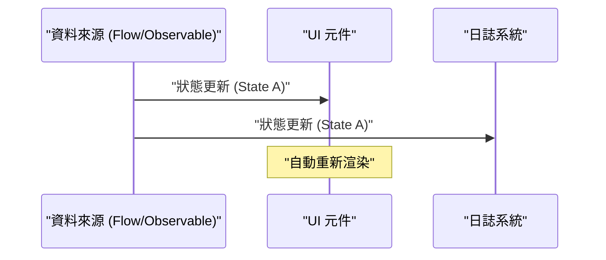
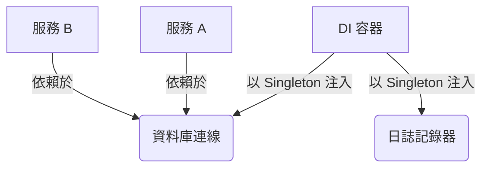

## 1. 前言：GoF 的束縛與解放

1994 年，軟體工程歷史上具紀念碑意義的書籍《設計模式：可復用物件導向軟體的基礎》（通稱： **GoF** 書籍）出版了。這本書將當時使用 C++ 與 Smalltalk 等語言進行物件導向設計的最佳實踐彙整成 23 種模式，為全世界的開發者提供了共通的詞彙。

然而，現在越來越常聽到 **「GoF 模式已經過時了」** 這種主張。其背景在於程式語言的進化、函數式編程（FP）典範的普及，以及雲端原生分散式系統的崛起。

本文將結合程式碼範例與圖解，深入探討 GoF 模式在現代軟體開發中的定位，以及現代的最佳實踐究竟為何。

## 2. 設計模式是什麼？為什麼會誕生？

設計模式是 **「針對在特定情境下頻繁發生的問題，所提出的通用解決方案」** 。GoF 試圖解決的許多問題，其實也是為了彌補「當時語言功能不足」而採取的變通方案（Workaround）。

例如，在不存在一級函式（First-class functions）的語言中，為了將行為封裝為物件，需要使用 `Strategy` 模式或 `Command` 模式。但是，在可以直接傳遞函式的現代語言中，這些模式不過是冗長的樣板程式碼（Boilerplate）。例如，假設有類別數量 $C$ 與介面數量 $I$ ，傳統 GoF 的複雜度可以表示為 $\mathcal{O}(C \times I)$ ，但在函數式的作法中，這種複雜度會大幅降低。

## 3. GoF 模式的現代重新評估與替代方案

在這裡，我們將探討具代表性的 GoF 模式，並觀察它們在現代語言（如 TypeScript、Kotlin、[Rust](https://kenji.blog/zh-tw/p/webassembly-wasm-current-future/) 等）中是如何被取代的。

### 3.1. Strategy 模式：被一級函式驅逐

`Strategy` 模式定義了演算法家族，將它們分別封裝起來，並使它們可以互相替換。

**傳統的 GoF 作法（Java 風格）**

```java
// 定義介面
interface DiscountStrategy {
    double applyDiscount(double price);
}

// 具體策略的實作
class HalfPriceDiscount implements DiscountStrategy {
    public double applyDiscount(double price) {
        return price * 0.5;
    }
}

// 文本（Context）
class ShoppingCart {
    private DiscountStrategy strategy;

    public ShoppingCart(DiscountStrategy strategy) {
        this.strategy = strategy;
    }

    public double calculateTotal(double price) {
        return strategy.applyDiscount(price);
    }
}
```

**現代的作法（TypeScript / 函數式）**

在現代語言中，只需將函式本身作為參數傳遞（高階函式）即可解決，不需要介面或類別的階層結構。

```typescript
// 型別別名就足夠了
type DiscountStrategy = (price: number) => number;

// 策略只是一個簡單的函式
const halfPriceDiscount: DiscountStrategy = price => price * 0.5;

// 文本也是簡單的函式或類別
class ShoppingCart {
    constructor(private discount: DiscountStrategy) {}

    calculateTotal(price: number): number {
        return this.discount(price);
    }
}

// 使用範例
const cart = new ShoppingCart(halfPriceDiscount);
```

### 3.2. Observer 模式：昇華為響應式編程（Reactive Programming）

將狀態的變化通知給依賴物件的 `Observer` 模式，在現代的 GUI 開發與非同步處理中是不可或缺的，但其實作方式已經有了大幅的進化。Rx (Reactive Extensions)、Kotlin Flow、Swift Combine 等函式庫與框架擔當了這個角色。



**傳統的 GoF 作法** 中，必須將 Observer 註冊到 Subject，並透過迴圈呼叫 `update()` 方法，這種實作非常繁瑣。

**現代的作法（Kotlin Flow）**

```kotlin
// 使用 Flow 進行響應式狀態管理
class WeatherStation {
    private val _temperature = MutableStateFlow(0.0)
    val temperature: StateFlow<Double> = _temperature.asStateFlow()

    fun updateTemperature(newTemp: Double) {
        _temperature.value = newTemp
    }
}

// 觀察端（Observer）
coroutineScope.launch {
    weatherStation.temperature.collect { temp ->
        println("溫度已更新: $temp")
    }
}
```

由於語言層級支援非同步串流，因此不需要自行建立通知機制。

### 3.3. Visitor 模式：模式匹配（Pattern Matching）與代數資料型別（ADT）

`Visitor` 模式是為了將資料結構與其對應的處理分離而存在的模式，但它有一個問題：實作非常複雜且違反直覺（需要雙重分派 Double Dispatch）。

在現代，透過使用具備 **代數資料型別 (ADT)** 與 **模式匹配** 的語言（如 [Rust](https://kenji.blog/zh-tw/p/webassembly-wasm-current-future/)、Kotlin、Swift、Scala 等），這個問題得以完美解決。

**現代的作法（Rust 的列舉與模式匹配）**

```rust
// 代數資料型別（帶有變體的 Enum）
enum Shape {
    Circle { radius: f64 },
    Rectangle { width: f64, height: f64 },
}

// 使用模式匹配取代 Visitor 類別
fn calculate_area(shape: &Shape) -> f64 {
    match shape {
        Shape::Circle { radius } => std::f64::consts::PI * radius * radius,
        Shape::Rectangle { width, height } => width * height,
    }
}
```

如此一來， `accept` 或 `visit` 方法的連鎖呼叫就完全不需要了，程式碼的意圖變得非常明確。編譯器會檢查網羅性（Exhaustiveness，是否處理了所有情況），因此安全性也獲得了飛躍性的提升。

### 3.4. Singleton 模式：最糟糕的反模式（Anti-pattern）？

`Singleton` 模式會產生全域狀態，使測試變得困難，並成為多執行緒環境中產生 Bug 的溫床，因此現在通常被視為 **反模式** 。

在現代的最佳實踐中，我們使用 **依賴注入 (Dependency Injection: DI)** 來管理生命週期。



Spring Framework (Java)、NestJS (TypeScript)、Dagger/Hilt (Android) 等 DI 容器會管理實體的建立與銷毀，因此不應該在類別本身編寫 Singleton 的邏輯（如 `getInstance()` 或 `private constructor` ）。

## 4. 函數式編程中的設計模式

在函數式編程的世界中，存在著與 GoF 不同維度的「模式」。這些模式都有數學範疇論（Category Theory）作為基礎。

### 4.1. 透過 Monad（單子）控制副作用

相較於 GoF 模式以「狀態的變異（Mutation）」為前提，函數式的作法將副作用（例外、非同步處理、可能為 Null 的情況）封裝在型別系統中。

例如，Null Object 模式或例外處理可以替換為 `Maybe` (Optional) 或 `Either` (Result) 等 Monad。

$$
f: A \rightarrow M[B]
$$
$$
g: B \rightarrow M[C]
$$
$$
bind: M[A] \times (A \rightarrow M[B]) \rightarrow M[B]
$$

**[Rust](https://kenji.blog/zh-tw/p/webassembly-wasm-current-future/) 中的 Result 型別 (Either Monad 的應用)**

```rust
fn divide(numerator: f64, denominator: f64) -> Result<f64, String> {
    if denominator == 0.0 {
        Err("無法除以零".to_string())
    } else {
        Ok(numerator / denominator)
    }
}

// 錯誤處理的組合（flatMap / and_then）
let result = divide(10.0, 2.0).and_then(|res| divide(res, 2.0));
```

## 5. 至今仍存活或已進化的 GoF 模式

並非所有的 GoF 模式都已消亡。在架構邊界發揮作用的模式，至今依然極為重要。

1. **Facade（外觀）** : 為複雜的子系統提供簡單介面的概念，已擴展為微服務架構中的 [API Gateway](https://kenji.blog/zh-tw/p/microservices-architecture-bff-api-gateway/)（[BFF](https://kenji.blog/zh-tw/p/microservices-architecture-bff-api-gateway/): [Backend for Frontend](https://kenji.blog/zh-tw/p/microservices-architecture-bff-api-gateway/)）。
2. **Adapter（轉接器）** : 作為與外部系統整合，或在整潔架構（Clean Architecture）、六角架構中的「埠與轉接器（Ports and Adapters）」，是保持系統鬆散耦合的關鍵。
3. **Decorator（裝飾者）** : 在 Python 或 TypeScript 中，已昇華為基於標註的元編程（Metaprogramming）功能 `@Decorator` 作為語言特性。

## 6. 總結：擁抱典範轉移

對於 **「GoF 過時了嗎？」** 這個問題的答案是：「對於已被吸收為語言功能的部分，答案是 YES；但作為設計的抽象概念，答案是 NO」。

過去需要數十行類別階層結構的設計，在現代語言中只需幾行函式或列舉即可表達。我們軟體工程師不應固執於 GoF 的形式（類別圖或實作方法），而應該關注他們 **「試圖解決什麼問題」** 的本質。

現代的最佳實踐如下：

- **組合優於繼承（這是來自 GoF 的普遍真理）**
- **函式優於類別（活用一級函式）**
- **模式匹配與 ADT 優於 Visitor 模式**
- **DI 容器優於 Singleton**
- **不可變性（Immutability）與純函式優於狀態的變異**

設計模式並沒有死。它只是隨著程式語言的進化，轉變為更精煉的樣貌而已。
