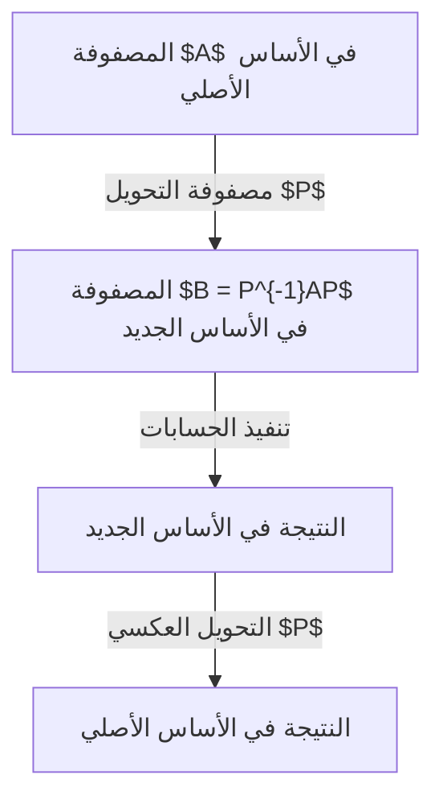

## مقدمة

أثناء تعلم الجبر الخطي، يواجه العديد من الطلاب عقبة كبرى تتمثل في **الاستقطار** (Diagonalization) و**صيغة جوردان القياسية** (Jordan Normal Form). المصفوفات هي أدوات قوية لوصف التحويلات الخطية، ولكن غالبًا ما يكون من الصعب قراءة خصائصها في شكلها المعقد. هذا المقال يشرح بالتفصيل كيفية تبسيط المصفوفات إلى أقصى حد.

## ما هي المصفوفة: كتحويل هندسي

تمثل المصفوفة المربعة تحويلاً خطيًا يعتمد على "القاعدة" (الأساس) المختارة. من خلال تغيير الأساس، يمكننا تبسيط المصفوفة بشكل كبير.



## مفاهيم الاستقطار

### الفهم البديهي

قابلية المصفوفة $A$ للاستقطار تعني أنه يمكننا إيجاد منظور (أساس جديد) بحيث يصبح التحويل مجرد "تمدد أو انكماش" على طول المحاور.

### التعريف الرياضي

المصفوفة $A$ من الحجم $n \times n$ قابلة للاستقطار إذا وجدت مصفوفة قابلة للعكس $P$ بحيث تكون:

$$
P^{-1} A P = D
$$

حيث $D$ هي مصفوفة قطرية عناصرها هي **القيم الذاتية** $\lambda_i$، وأعمدة $P$ هي **المتجهات الذاتية** $\mathbf{v}_i$.

## مثال حسابي للاستقطار

لدينا المصفوفة $A$:
$$
A = \begin{pmatrix}
4 & -1 & 6 \\
2 & 1 & 6 \\
2 & -1 & 8
\end{pmatrix}
$$

بعد حساب المعادلة المميزة $\det(A - \lambda I) = 0$، نحصل على القيم الذاتية $\lambda = 2$ و $\lambda = 9$.
والمتجهات الذاتية المقابلة تعطينا المصفوفة $P$، ليصبح التحويل:
$$
P^{-1} A P = \begin{pmatrix}
2 & 0 & 0 \\
0 & 2 & 0 \\
0 & 0 & 9
\end{pmatrix}
$$

## لماذا لا يمكن استقطار بعض المصفوفات؟

يجب أن تتحقق العلاقة التالية:
$$
1 \leq \text{التعددية الهندسية} \leq \text{التعددية الجبرية}
$$
إذا كانت التعددية الهندسية أقل تمامًا من التعددية الجبرية، فلن نمتلك متجهات ذاتية كافية، وبالتالي لا يمكن استقطار المصفوفة (مصفوفة ناقصة).

## نظرية صيغة جوردان القياسية

للمصفوفات غير القابلة للاستقطار، نلجأ إلى **صيغة جوردان القياسية**.

### كتل جوردان
$$
J_k(\lambda) = \begin{pmatrix}
\lambda & 1 & 0 & \cdots & 0 \\
0 & \lambda & 1 & \cdots & 0 \\
\vdots & \vdots & \ddots & \ddots & 1 \\
0 & 0 & \cdots & 0 & \lambda
\end{pmatrix}
$$

### المتجهات الذاتية المعممة
التي تحقق الشرط:
$$
(A - \lambda I)^k \mathbf{v} = \mathbf{0} \quad \text{و} \quad (A - \lambda I)^{k-1} \mathbf{v} \neq \mathbf{0}
$$

## التطبيقات: المعادلات التفاضلية والدوال الأسية للمصفوفات

حل النظام $\frac{d\mathbf{x}}{dt} = A \mathbf{x}$ هو $\mathbf{x}(t) = e^{At} \mathbf{x}(0)$.
عن طريق الاستقطار:
$$
e^{At} = P e^{Dt} P^{-1}
$$
في حالة صيغة جوردان، تظهر حدود مثل $t e^{\lambda t}$ والتي تفسر ظواهر فيزيائية كالرنين.

## مبرهنة كايلي-هاميلتون ومتعدد الحدود الأصغر

كل مصفوفة تحقق معادلتها المميزة $p(A) = 0$. متعدد الحدود الأصغر يحدد قابلية المصفوفة للاستقطار بناءً على تكرار الجذور.

## الفرق بين الاستقطار و[تحليل القيمة المفردة (SVD)](https://kenji.blog/ar/p/singular-value-decomposition/)


## تطبيقات في ميكانيكا الكم وهندسة التحكم

في ميكانيكا الكم، يتم استقطار مصفوفة هاميلتون لإيجاد مستويات الطاقة. وفي هندسة التحكم، يُستخدم لفصل الأنماط لتحديد **قابلية التحكم** و**قابلية الملاحظة**.

## مثال بالبايثون (Python)

```python
import numpy as np
from scipy.linalg import schur, eigvals

A = np.array([[5, 4, 2, 1],
              [0, 1, -1, -1],
              [-1, -1, 3, 0],
              [1, 1, -1, 2]])

# القيم الذاتية
eigenvalues = eigvals(A)
print("القيم الذاتية:", eigenvalues)

# تحليل شور
T, Z = schur(A, output='complex')
print("مصفوفة T:")
print(np.round(T, 4))
```

## الخاتمة
[الاستقطار وصيغة جوردان القياسية](https://kenji.blog/ar/p/diagonalization-and-jordan-normal-form/) هي أدوات رياضية قوية وأساسية في فهم النظم المعقدة في مجالات متعددة.
