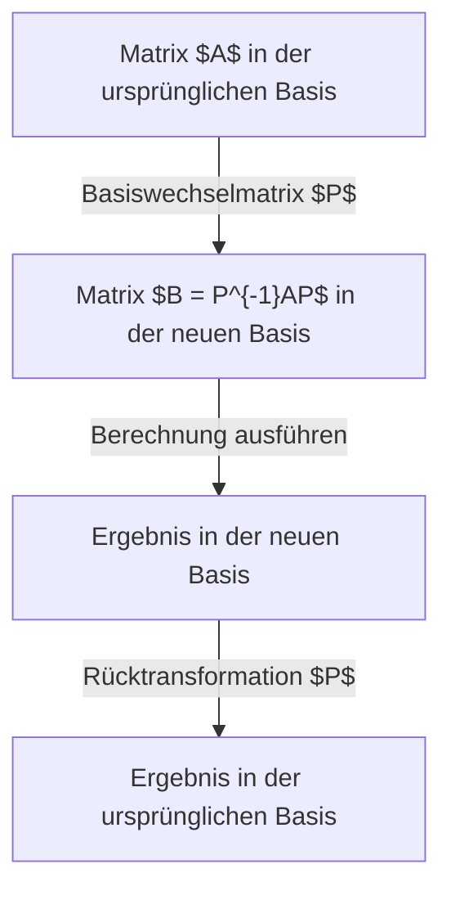
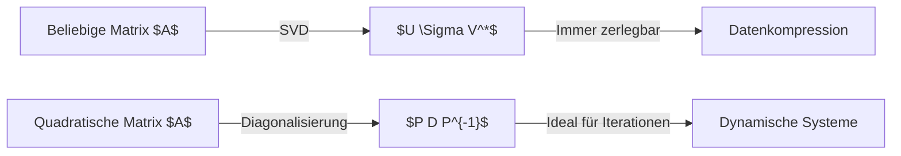

## Einführung

Eine große Hürde in der linearen Algebra ist die **Diagonalisierung** und die **Jordansche Normalform**. Matrizen beschreiben räumliche Transformationen, aber ihre Eigenschaften sind in ihrer ursprünglichen Form oft schwer zu erkennen. Dieser Artikel erklärt ausführlich, wie man komplexe Matrizen extrem vereinfacht und wie man mit Matrizen umgeht, die nicht diagonalisierbar sind.

## Was ist eine Matrix? Eine Perspektive als Transformation

Eine $n \times n$ Matrix $A$ stellt eine lineare Transformation dar. Diese Darstellung hängt von der gewählten "Basis" ab. Durch einen Basiswechsel kann dieselbe Transformation wesentlich einfacher dargestellt werden.



## Grundkonzepte der Diagonalisierung

### Intuitive Bedeutung

Eine Matrix $A$ ist diagonalisierbar, wenn die Transformation in einer geeigneten Basis nur eine "einfache Streckung entlang der Koordinatenachsen" ist. Scherungen verschwinden komplett.

### Mathematische Definition

Eine $n \times n$ Matrix $A$ ist diagonalisierbar, wenn eine invertierbare Matrix $P$ existiert, sodass:

$$
P^{-1} A P = D
$$

Die Diagonalelemente von $D$ sind die **Eigenwerte** $\lambda_i$ von $A$, und die Spalten von $P$ sind die **Eigenvektoren** $\mathbf{v}_i$.

## Berechnungsbeispiel der Diagonalisierung

### Beispiel einer 3x3 Matrix

Wir diagonalisieren:
$$
A = \begin{pmatrix}
4 & -1 & 6 \\
2 & 1 & 6 \\
2 & -1 & 8
\end{pmatrix}
$$

**Schritt 1: Eigenwerte berechnen**
$\det(A - \lambda I) = 0$ liefert $\lambda = 2$ und $\lambda = 9$.

**Schritt 2: Eigenvektoren berechnen**
Für $\lambda = 2$:
$$
\mathbf{v}_1 = \begin{pmatrix} 1 \\ 2 \\ 0 \end{pmatrix}, \quad \mathbf{v}_2 = \begin{pmatrix} -3 \\ 0 \\ 1 \end{pmatrix}
$$
Für $\lambda = 9$:
$$
\mathbf{v}_3 = \begin{pmatrix} 1 \\ 1 \\ 1 \end{pmatrix}
$$

**Schritt 3: Diagonalisierung**
Mit $P = (\mathbf{v}_1 \ \mathbf{v}_2 \ \mathbf{v}_3)$ ergibt sich:
$$
P^{-1} A P = \begin{pmatrix}
2 & 0 & 0 \\
0 & 2 & 0 \\
0 & 0 & 9
\end{pmatrix}
$$

## Warum gibt es nicht-diagonalisierbare Matrizen?

Nicht alle Matrizen haben $n$ linear unabhängige Eigenvektoren.
Es gilt:
$$
1 \leq \text{Geometrische Vielfachheit} \leq \text{Algebraische Vielfachheit}
$$
Wenn die geometrische Vielfachheit echt kleiner als die algebraische Vielfachheit ist, ist die Matrix **defekt** und nicht diagonalisierbar.

## Jordansche Normalform

Die **Jordansche Normalform** vereinfacht auch nicht-diagonalisierbare Matrizen.

### Jordan-Blöcke
Ein Jordan-Block hat die Form:
$$
J_k(\lambda) = \begin{pmatrix}
\lambda & 1 & 0 & \cdots & 0 \\
0 & \lambda & 1 & \cdots & 0 \\
\vdots & \vdots & \ddots & \ddots & 1 \\
0 & 0 & \cdots & 0 & \lambda
\end{pmatrix}
$$

### Hauptvektoren
Zur Konstruktion benötigt man **Hauptvektoren** (verallgemeinerte Eigenvektoren):
$$
(A - \lambda I)^k \mathbf{v} = \mathbf{0} \quad \text{und} \quad (A - \lambda I)^{k-1} \mathbf{v} \neq \mathbf{0}
$$

## Anwendungen: Differentialgleichungen und Matrixexponential

Die Lösung von $\frac{d\mathbf{x}}{dt} = A \mathbf{x}$ ist $\mathbf{x}(t) = e^{At} \mathbf{x}(0)$.
Falls diagonalisierbar:
$$
e^{At} = P e^{Dt} P^{-1}
$$
Für einen Jordan-Block:
$$
e^{J_k(\lambda)t} = e^{\lambda t} \begin{pmatrix}
1 & t & \cdots & \frac{t^{k-1}}{(k-1)!} \\
0 & 1 & \cdots & \frac{t^{k-2}}{(k-2)!} \\
\vdots & \vdots & \ddots & \vdots \\
0 & 0 & \cdots & 1
\end{pmatrix}
$$
Dies erklärt das Auftreten von Resonanztermen wie $te^{\lambda t}$ in der Physik.

## Cayley-Hamilton-Theorem und Minimalpolynom

Jede Matrix erfüllt ihre charakteristische Gleichung $p(A) = 0$ (**Cayley-Hamilton-Theorem**).
Das **Minimalpolynom** $m(\lambda)$ ist das Polynom kleinsten Grades mit $m(A) = 0$. Sind alle Nullstellen von $m$ einfach, ist die Matrix diagonalisierbar.

## Unterschied zur Singulärwertzerlegung (SVD)



## Quantenmechanik und Kontrolltheorie

In der Quantenmechanik bedeutet die Diagonalisierung des Hamilton-Operators das Finden der Energieeigenzustände. In der Kontrolltheorie hilft es, **Steuerbarkeit** und **Beobachtbarkeit** zu analysieren.

## Programmierung

Beispiel in Python:
```python
import numpy as np
from scipy.linalg import schur, eigvals

A = np.array([[5, 4, 2, 1],
              [0, 1, -1, -1],
              [-1, -1, 3, 0],
              [1, 1, -1, 2]])

# Eigenwerte
eigenvalues = eigvals(A)
print("Eigenwerte:", eigenvalues)

# Schur-Zerlegung (numerisch stabiler als Jordan-Normalform)
T, Z = schur(A, output='complex')
print("Obere Dreiecksmatrix T:")
print(np.round(T, 4))
```

## Fazit

Diagonalisierung und Jordansche Normalform sind unverzichtbare Werkzeuge der modernen Mathematik und spielen in fast allen quantitativen Disziplinen eine Schlüsselrolle.
