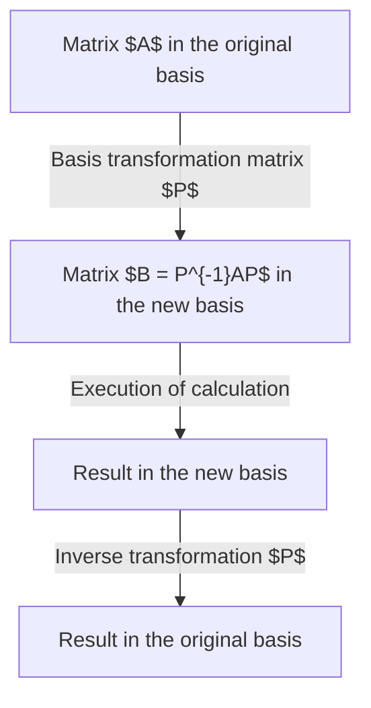
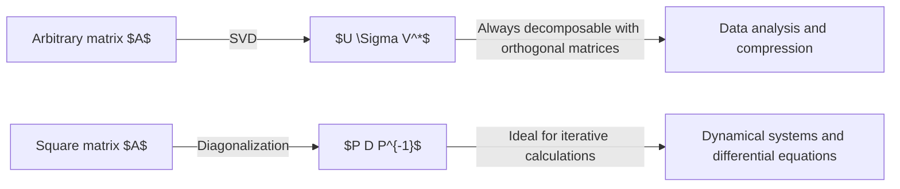

## Introduction

While learning linear algebra, one major hurdle many face is **diagonalization** and the **Jordan normal form**. Matrices are powerful tools for describing spatial deformations (linear transformations), but it is often difficult to read their properties directly from their raw forms. This article provides an extremely detailed explanation of diagonalization—a powerful method to simplify complex matrices to their limits—and the Jordan normal form, which rescues matrices that cannot be diagonalized, covering everything from intuitive background meanings and strict mathematical definitions to applications in physics and engineering.

This is intended for readers who understand basic concepts of linear algebra, such as vector spaces and basis transformations. However, abundant concrete calculation examples are included so that even beginners can understand step-by-step. Let's step into the profound world of matrices.

## What is a Matrix: A Perspective as a Transformation

The first step to intuitively understanding diagonalization is not to view a matrix merely as an "array of numbers" but to understand it as a rule of geometric transformation—"how it distorts space."

An $n \times n$ square matrix $A$ represents a linear transformation in an $n$-dimensional vector space. However, this transformation is merely a representation dependent on the "basis" (set of coordinate axes) we currently adopt. By choosing an appropriate new basis, the matrix representation of the exact same transformation can become dramatically simpler. This is the fundamental motivation for "similarity transformations."



## Basic Concepts of Diagonalization

### Intuitive Understanding

Saying that a matrix $A$ is diagonalizable means that, from an appropriate viewpoint (a new basis), the transformation represented by the matrix is nothing more than "simple stretching and shrinking along each coordinate axis." Complex diagonal shifts (shearing) disappear, leaving a state where the spatial deformation can be described purely by scaling.

### Mathematical Definition and Theorems

An $n \times n$ matrix $A$ is diagonalizable if there exists an invertible matrix $P$ such that a diagonal matrix $D$ can be formed satisfying:

$$
P^{-1} A P = D
$$

Here, the diagonal elements of $D$ are the **eigenvalues** $\lambda_i$ of $A$, and each column vector of $P$ is the corresponding **eigenvector** $\mathbf{v}_i$.

**Necessary and sufficient condition for diagonalization:**
The necessary and sufficient condition for an $n \times n$ matrix $A$ to be diagonalizable is that $A$ possesses $n$ linearly independent eigenvectors.

## Concrete Calculation Example of Diagonalization

### Example of a 3x3 Square Matrix

Let's diagonalize the following matrix $A$:

$$
A = \begin{pmatrix}
4 & -1 & 6 \\
2 & 1 & 6 \\
2 & -1 & 8
\end{pmatrix}
$$

**Step 1: Calculate eigenvalues**
Solve the characteristic equation $\det(A - \lambda I) = 0$.

$$
\det \begin{pmatrix}
4-\lambda & -1 & 6 \\
2 & 1-\lambda & 6 \\
2 & -1 & 8-\lambda
\end{pmatrix} = -(\lambda-2)^2 (\lambda-9) = 0
$$

Therefore, the eigenvalues are $\lambda = 2$ (multiplicity of 2) and $\lambda = 9$.

**Step 2: Calculate eigenvectors**
When $\lambda = 2$, solving $(A - 2I)\mathbf{x} = \mathbf{0}$ yields two linearly independent eigenvectors:

$$
\mathbf{v}_1 = \begin{pmatrix} 1 \\ 2 \\ 0 \end{pmatrix}, \quad \mathbf{v}_2 = \begin{pmatrix} -3 \\ 0 \\ 1 \end{pmatrix}
$$

When $\lambda = 9$, solving $(A - 9I)\mathbf{x} = \mathbf{0}$ yields:

$$
\mathbf{v}_3 = \begin{pmatrix} 1 \\ 1 \\ 1 \end{pmatrix}
$$

**Step 3: Execute diagonalization**
By setting the matrix $P$ as $P = (\mathbf{v}_1 \ \mathbf{v}_2 \ \mathbf{v}_3)$, we get:

$$
P^{-1} A P = \begin{pmatrix}
2 & 0 & 0 \\
0 & 2 & 0 \\
0 & 0 & 9
\end{pmatrix}
$$

The diagonalization is now complete.

## Why Do Non-Diagonalizable Matrices Exist?

Not all matrices can be diagonalized. The condition for diagonalization is "having $n$ linearly independent eigenvectors."

The eigenvalues, which are the roots of the characteristic equation, have an **algebraic multiplicity** (the number of repeated roots) and a **geometric multiplicity** (the dimension of the corresponding eigenspace, i.e., the number of independent eigenvectors). Mathematically, the following relationship always holds:

$$
1 \leq \text{Geometric multiplicity} \leq \text{Algebraic multiplicity}
$$

If the geometric multiplicity is strictly less than the algebraic multiplicity, the matrix does not have the required number of eigenvectors and cannot be diagonalized. Such a matrix is called a **defective matrix**.

### Concrete Example of a Non-Diagonalizable Matrix

$$
B = \begin{pmatrix}
1 & 1 \\
0 & 1
\end{pmatrix}
$$

The eigenvalue of this matrix is $\lambda = 1$ (algebraic multiplicity of 2), but when we find the eigenspace:

$$
(B - I)\mathbf{x} = \begin{pmatrix} 0 & 1 \\ 0 & 0 \end{pmatrix} \begin{pmatrix} x_1 \\ x_2 \end{pmatrix} = \begin{pmatrix} 0 \\ 0 \end{pmatrix}
$$

This gives $x_2 = 0$, meaning the eigenvector is only a scalar multiple of $\mathbf{v} = \begin{pmatrix} 1 \\ 0 \end{pmatrix}$. That is, the geometric multiplicity is 1, and it cannot be diagonalized.

## Theory of the Jordan Normal Form

The **Jordan Normal Form** responds to the demand to transform even non-diagonalizable matrices into the simplest possible form.

### Definition of Jordan Blocks

The Jordan normal form consists of blocks called **Jordan blocks** aligned on the diagonal, where the eigenvalues are on the main diagonal and $1$s are placed on the superdiagonal just above it.

$$
J_k(\lambda) = \begin{pmatrix}
\lambda & 1 & 0 & \cdots & 0 \\
0 & \lambda & 1 & \cdots & 0 \\
0 & 0 & \lambda & \ddots & \vdots \\
\vdots & \vdots & \ddots & \ddots & 1 \\
0 & 0 & \cdots & 0 & \lambda
\end{pmatrix}
$$

### Generalized Eigenvectors and Chains

Because ordinary eigenvectors are not enough to construct the Jordan normal form, we introduce **generalized eigenvectors**.

A vector $\mathbf{v}$ satisfying:

$$
(A - \lambda I)^k \mathbf{v} = \mathbf{0} \quad \text{and} \quad (A - \lambda I)^{k-1} \mathbf{v} \neq \mathbf{0}
$$

is called a generalized eigenvector of rank $k$. These form a chain-like structure (Jordan chain):

$$
(A - \lambda I)\mathbf{v}_k = \mathbf{v}_{k-1}, \quad (A - \lambda I)\mathbf{v}_{k-1} = \mathbf{v}_{k-2}, \quad \dots, \quad (A - \lambda I)\mathbf{v}_2 = \mathbf{v}_1
$$

Here, $\mathbf{v}_1$ is a standard eigenvector.

## Example of Deriving the Jordan Normal Form

Let's consider the non-diagonalizable matrix $B$ from earlier.

$$
B = \begin{pmatrix} 1 & 1 \\ 0 & 1 \end{pmatrix}
$$

The eigenvector is $\mathbf{v}_1 = \begin{pmatrix} 1 \\ 0 \end{pmatrix}$. To find the generalized eigenvector $\mathbf{v}_2$, we solve the equation $(B - I)\mathbf{v}_2 = \mathbf{v}_1$.

$$
\begin{pmatrix} 0 & 1 \\ 0 & 0 \end{pmatrix} \begin{pmatrix} x \\ y \end{pmatrix} = \begin{pmatrix} 1 \\ 0 \end{pmatrix}
$$

From this, $y = 1$ is obtained, and $x$ is arbitrary. If we choose $x = 0$, then $\mathbf{v}_2 = \begin{pmatrix} 0 \\ 1 \end{pmatrix}$.
If we set the matrix $P = (\mathbf{v}_1 \ \mathbf{v}_2) = \begin{pmatrix} 1 & 0 \\ 0 & 1 \end{pmatrix} = I$, then $P^{-1}BP = B$, which shows that matrix $B$ is already in Jordan normal form consisting of a single Jordan block.

## Applications: Solving Systems of Linear Differential Equations and the Matrix Exponential

The Jordan normal form is not just pure mathematical theory; it is an extremely practical tool in physics and engineering. It is particularly powerful in solving systems of linear differential equations.

### Definition of the Matrix Exponential $e^{At}$

The solution to the system $\frac{d\mathbf{x}}{dt} = A \mathbf{x}$ is given by $\mathbf{x}(t) = e^{At} \mathbf{x}(0)$. The matrix exponential function is defined by the following Taylor expansion:

$$
e^{At} = I + At + \frac{1}{2!}(At)^2 + \frac{1}{3!}(At)^3 + \cdots
$$

### Calculating $e^{At}$ Using the Jordan Normal Form

It is very difficult to raise $A$ to powers directly, but if it is diagonalizable such that $A = PDP^{-1}$, then $A^k = P D^k P^{-1}$, and it can be easily calculated as:

$$
e^{At} = P e^{Dt} P^{-1}
$$

Even if it cannot be diagonalized, by using the Jordan normal form $A = PJP^{-1}$, the problem can be reduced to calculating the exponential function of Jordan blocks. The exponential of a Jordan block $J_k(\lambda)$ is as follows:

$$
e^{J_k(\lambda)t} = e^{\lambda t} \begin{pmatrix}
1 & t & \frac{t^2}{2!} & \cdots & \frac{t^{k-1}}{(k-1)!} \\
0 & 1 & t & \cdots & \frac{t^{k-2}}{(k-2)!} \\
\vdots & \vdots & \ddots & \ddots & \vdots \\
0 & 0 & \cdots & 1 & t \\
0 & 0 & \cdots & 0 & 1
\end{pmatrix}
$$

This result clearly shows the mechanism by which secular terms like $te^{\lambda t}$ and $t^2e^{\lambda t}$ appear in the solutions of differential equations. This provides mathematical backing for physical phenomena such as resonance and critical damping in control systems.

## The [Cayley-Hamilton Theorem](https://kenji.blog/en/p/cayley-hamilton-theorem/) and the Minimal Polynomial

To understand the Jordan normal form more deeply, it is essential to consider the polynomials of a matrix. Every $n \times n$ matrix $A$ satisfies its own characteristic polynomial $p(\lambda) = \det(\lambda I - A)$. That is, $p(A) = 0$ (the zero matrix). This is called the **[Cayley-Hamilton Theorem](https://kenji.blog/en/p/cayley-hamilton-theorem/)**.

However, the characteristic polynomial is not the only polynomial that makes matrix $A$ the zero matrix. Among the monic polynomials (polynomials with a leading coefficient of 1) that make $A$ the zero matrix, the one with the lowest degree is called the **minimal polynomial**. If we let the minimal polynomial be $m(\lambda)$, there is a close relationship between the Jordan normal form and the minimal polynomial.

If the minimal polynomial $m(\lambda)$ can be factored into a product of linear terms and has no repeated roots, that is, if it can be expressed as:
$$
m(\lambda) = (\lambda - \lambda_1)(\lambda - \lambda_2)\cdots(\lambda - \lambda_k)
$$
then the matrix $A$ is diagonalizable. Conversely, if it has repeated roots, it cannot be diagonalized, and the highest multiplicity of the repeated root matches the size of the largest Jordan block. Thus, the minimal polynomial is a powerful tool for determining the diagonalizability of a matrix.

## Difference Between Diagonalization and [Singular Value Decomposition (SVD)](https://kenji.blog/en/p/singular-value-decomposition/)

A matrix decomposition method similar to diagonalization is **[Singular Value Decomposition (SVD)](https://kenji.blog/en/p/singular-value-decomposition/)**. These two methods differ in purpose and scope of application.

Diagonalization $A = PDP^{-1}$ is applicable only to square matrices and is extremely useful when calculating matrix "repeated application (exponentiation)" or "exponential functions".

On the other hand, [Singular Value Decomposition](/en/p/singular-value-decomposition/) $A = U \Sigma V^*$ is applicable to any $m \times n$ matrix. Here, $U$ and $V$ are unitary matrices, respectively, and $\Sigma$ is a matrix with non-negative real numbers (singular values) lined up on the diagonal. [SVD](/en/p/singular-value-decomposition/) decomposes the transformation represented by a matrix into three steps: "rotation," "scaling," and "rotation," and is widely used for data compression and calculating pseudoinverses.



## Applications to Dynamical Systems and [Markov Chains](https://kenji.blog/en/p/markov-chain/)

Powerful applications of diagonalization include discrete dynamical systems and [Markov chains](/en/p/markov-chain/).

Suppose the state vector of a system at the $k$-th step is $\mathbf{x}_k$, and the state transition is described by $\mathbf{x}_{k+1} = A \mathbf{x}_k$. Then, the state after $k$ steps is $\mathbf{x}_k = A^k \mathbf{x}_0$.

If the matrix $A$ is diagonalizable and can be expressed as $A = P D P^{-1}$, then:
$$
A^k = P D^k P^{-1}
$$
Here, $D^k$ can be calculated simply by raising the diagonal elements to the power of $k$. With this calculation, the asymptotic behavior of the system's state after a long period, i.e., as $k \to \infty$, can be easily analyzed.

For example, concepts of matrix eigenvalues and diagonalization are essential for analyzing complex networks and stochastic processes in the real world, such as the study of transition probability matrices foundational to Google's PageRank algorithm.

## Meaning of Diagonalization in Quantum Mechanics

In physics, especially in quantum mechanics, matrix diagonalization is deeply connected to the concept of "observation." In quantum mechanics, physical quantities (e.g., energy, momentum) are represented as Hermitian matrices. An important property of Hermitian matrices is that "they always have real eigenvalues and are diagonalizable by a unitary matrix."

Diagonalizing a Hermitian matrix is nothing other than the task of finding a set of "states with definite values (eigenstates)" for that physical quantity as a basis. For instance, diagonalizing the Hamiltonian (the operator representing energy) means finding the energy eigenstates of the system, making it the most central computational task in quantum chemistry and solid-state physics.

## Controllability and Observability in Modern Control Theory

In the field of engineering, particularly in modern control theory, diagonalization and the Jordan normal form also play central roles. A Linear Time-Invariant (LTI) system is described using a state-space representation as follows:

$$
\frac{d\mathbf{x}}{dt} = A\mathbf{x} + B\mathbf{u}
$$
$$
\mathbf{y} = C\mathbf{x} + D\mathbf{u}
$$

By diagonalizing this system matrix $A$, or converting it to the Jordan normal form, the complex simultaneous equations of the entire system are decomposed into a collection of mutually independent simple first-order lag systems. By performing this transformation (mode expansion), it becomes possible to intuitively and quantitatively evaluate which input affects which mode (**controllability**) and which mode is observable from the output (**observability**).

## Numerical Computation and Programming Approach

Today, it is common to use computers for these calculations. Below is an example using Python to calculate matrix eigenvalues and orthogonal transformations.

```python
import numpy as np
from scipy.linalg import schur, eigvals

# Define a complex matrix
A = np.array([[5, 4, 2, 1],
              [0, 1, -1, -1],
              [-1, -1, 3, 0],
              [1, 1, -1, 2]])

# Calculate eigenvalues
# Check if there are eigenvalues with multiplicity
eigenvalues = eigvals(A)
print("Eigenvalues:", eigenvalues)

# Perform Schur decomposition using SciPy
# In numerical computations, Schur decomposition using orthogonal matrices
# is often preferred over the unstable Jordan normal form
T, Z = schur(A, output='complex')
print("Upper triangular matrix T (eigenvalues aligned on the diagonal):")
print(np.round(T, 4))
```

## Conclusion

Diagonalization is a technique to simplify matrices to their absolute limits, and the Jordan normal form is its ultimate generalization. Understanding these makes it possible to clearly grasp the behavior of complex systems. These advanced topics in linear algebra are active in all fields, from quantum mechanics to modern control theory, and even the mathematical foundations behind machine learning. We hope this article helps you acquire the intuition and computational skills to decode the true nature of matrices.
