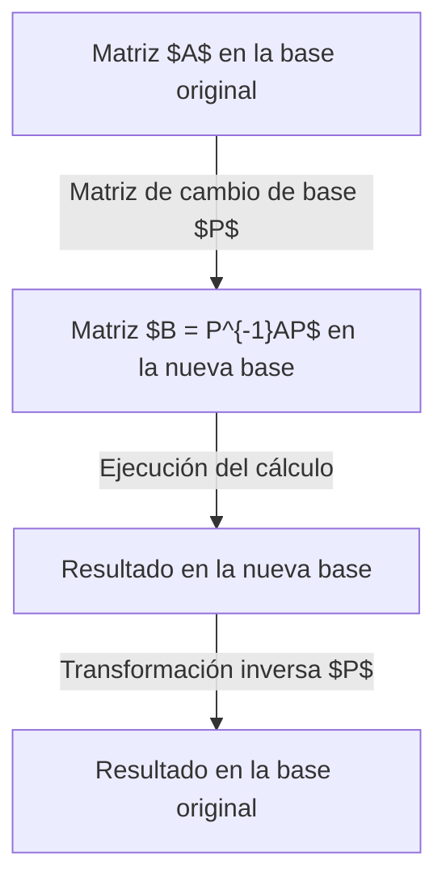
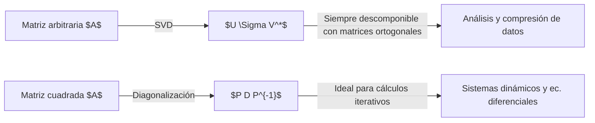

## Introducción

Al estudiar álgebra lineal, uno de los mayores obstáculos a los que muchos se enfrentan es la **diagonalización** y la **forma canónica de Jordan**. Las matrices son herramientas poderosas para describir deformaciones espaciales (transformaciones lineales), pero a menudo es difícil leer sus propiedades directamente desde su forma original. Este artículo ofrece una explicación extremadamente detallada de la diagonalización (un método poderoso para simplificar matrices complejas al máximo) y de la forma canónica de Jordan, que rescata a las matrices que no se pueden diagonalizar, cubriendo desde su significado intuitivo hasta definiciones matemáticas estrictas y aplicaciones en física e ingeniería.

Está dirigido a lectores que comprenden conceptos básicos de álgebra lineal, como espacios vectoriales y cambios de base, pero se incluyen abundantes ejemplos de cálculo concreto para que incluso los principiantes puedan entender paso a paso. Adentrémonos en el profundo mundo de las matrices.

## ¿Qué es una matriz? Una perspectiva como transformación

El primer paso para comprender intuitivamente la diagonalización es no ver a la matriz simplemente como un "arreglo de números", sino entenderla como una regla de transformación geométrica: "cómo distorsiona el espacio".

Una matriz cuadrada $A$ de $n \times n$ representa una transformación lineal en un espacio vectorial de $n$ dimensiones. Sin embargo, esta transformación es solo una representación que depende de la "base" (conjunto de ejes de coordenadas) que estamos adoptando actualmente. Al elegir una nueva base adecuada, la representación matricial de la misma transformación puede volverse drásticamente más simple. Esta es la motivación fundamental de las "transformaciones de similitud".



## Conceptos básicos de la diagonalización

### Comprensión intuitiva

Decir que una matriz $A$ es diagonalizable significa que, desde una perspectiva adecuada (una nueva base), la transformación representada por la matriz no es más que "un simple estiramiento y encogimiento a lo largo de cada eje de coordenadas". Los desplazamientos diagonales complejos (cizallamiento) desaparecen, dejando un estado donde la deformación espacial se puede describir puramente mediante el escalamiento.

### Definición matemática y teoremas

Una matriz $A$ de $n \times n$ es diagonalizable si existe una matriz invertible $P$ tal que se pueda formar una matriz diagonal $D$ que satisfaga:

$$
P^{-1} A P = D
$$

Aquí, los elementos diagonales de $D$ son los **valores propios** $\lambda_i$ de $A$, y cada vector columna de $P$ es el **vector propio** correspondiente $\mathbf{v}_i$.

**Condición necesaria y suficiente para la diagonalización:**
La condición necesaria y suficiente para que una matriz cuadrada $A$ de $n \times n$ sea diagonalizable es que $A$ posea $n$ vectores propios linealmente independientes.

## Ejemplo de cálculo concreto de diagonalización

### Ejemplo de matriz cuadrada de 3x3

Diagonalicemos la siguiente matriz $A$:

$$
A = \begin{pmatrix}
4 & -1 & 6 \\
2 & 1 & 6 \\
2 & -1 & 8
\end{pmatrix}
$$

**Paso 1: Calcular valores propios**
Resolvemos la ecuación característica $\det(A - \lambda I) = 0$.

$$
\det \begin{pmatrix}
4-\lambda & -1 & 6 \\
2 & 1-\lambda & 6 \\
2 & -1 & 8-\lambda
\end{pmatrix} = -(\lambda-2)^2 (\lambda-9) = 0
$$

Por lo tanto, los valores propios son $\lambda = 2$ (multiplicidad 2) y $\lambda = 9$.

**Paso 2: Calcular vectores propios**
Cuando $\lambda = 2$, resolver $(A - 2I)\mathbf{x} = \mathbf{0}$ produce dos vectores propios linealmente independientes:

$$
\mathbf{v}_1 = \begin{pmatrix} 1 \\ 2 \\ 0 \end{pmatrix}, \quad \mathbf{v}_2 = \begin{pmatrix} -3 \\ 0 \\ 1 \end{pmatrix}
$$

Cuando $\lambda = 9$, resolver $(A - 9I)\mathbf{x} = \mathbf{0}$ produce:

$$
\mathbf{v}_3 = \begin{pmatrix} 1 \\ 1 \\ 1 \end{pmatrix}
$$

**Paso 3: Ejecutar la diagonalización**
Definiendo la matriz $P$ como $P = (\mathbf{v}_1 \ \mathbf{v}_2 \ \mathbf{v}_3)$, obtenemos:

$$
P^{-1} A P = \begin{pmatrix}
2 & 0 & 0 \\
0 & 2 & 0 \\
0 & 0 & 9
\end{pmatrix}
$$

La diagonalización se ha completado.

## ¿Por qué existen matrices no diagonalizables?

No todas las matrices pueden diagonalizarse. La condición es "tener $n$ vectores propios linealmente independientes".

Los valores propios, que son las soluciones de la ecuación característica, tienen una **multiplicidad algebraica** (el número de raíces repetidas) y una **multiplicidad geométrica** (la dimensión del espacio propio correspondiente, es decir, el número de vectores propios independientes). Matemáticamente, siempre se cumple la siguiente relación:

$$
1 \leq \text{Multiplicidad geométrica} \leq \text{Multiplicidad algebraica}
$$

Si la multiplicidad geométrica es estrictamente menor que la algebraica, la matriz no tiene el número requerido de vectores propios y no puede diagonalizarse. Dicha matriz se llama **matriz defectiva**.

### Ejemplo concreto de matriz no diagonalizable

$$
B = \begin{pmatrix}
1 & 1 \\
0 & 1
\end{pmatrix}
$$

El valor propio es $\lambda = 1$ (multiplicidad algebraica 2), pero al buscar el espacio propio:

$$
(B - I)\mathbf{x} = \begin{pmatrix} 0 & 1 \\ 0 & 0 \end{pmatrix} \begin{pmatrix} x_1 \\ x_2 \end{pmatrix} = \begin{pmatrix} 0 \\ 0 \end{pmatrix}
$$

Esto da $x_2 = 0$, lo que significa que el vector propio es solo un múltiplo escalar de $\mathbf{v} = \begin{pmatrix} 1 \\ 0 \end{pmatrix}$. Es decir, la multiplicidad geométrica es 1, y no se puede diagonalizar.

## Teoría de la forma canónica de Jordan

La **forma canónica de Jordan** responde a la necesidad de transformar incluso las matrices no diagonalizables en la forma más simple posible.

### Definición de bloques de Jordan

La forma canónica de Jordan consiste en bloques llamados **bloques de Jordan** alineados en la diagonal, donde los valores propios están en la diagonal principal y hay números $1$ justo por encima de ellos.

$$
J_k(\lambda) = \begin{pmatrix}
\lambda & 1 & 0 & \cdots & 0 \\
0 & \lambda & 1 & \cdots & 0 \\
0 & 0 & \lambda & \ddots & \vdots \\
\vdots & \vdots & \ddots & \ddots & 1 \\
0 & 0 & \cdots & 0 & \lambda
\end{pmatrix}
$$

### Vectores propios generalizados y cadenas

Como los vectores propios ordinarios no son suficientes para construir la forma de Jordan, introducimos los **vectores propios generalizados**.

Un vector $\mathbf{v}$ que satisface:

$$
(A - \lambda I)^k \mathbf{v} = \mathbf{0} \quad \text{y} \quad (A - \lambda I)^{k-1} \mathbf{v} \neq \mathbf{0}
$$

se llama vector propio generalizado de rango $k$. Forman una estructura en cadena (cadena de Jordan):

$$
(A - \lambda I)\mathbf{v}_k = \mathbf{v}_{k-1}, \quad (A - \lambda I)\mathbf{v}_{k-1} = \mathbf{v}_{k-2}, \quad \dots, \quad (A - \lambda I)\mathbf{v}_2 = \mathbf{v}_1
$$

Aquí, $\mathbf{v}_1$ es un vector propio ordinario.

## Ejemplo de derivación de la forma de Jordan

Consideremos la matriz $B$ de antes.

$$
B = \begin{pmatrix} 1 & 1 \\ 0 & 1 \end{pmatrix}
$$

El vector propio es $\mathbf{v}_1 = \begin{pmatrix} 1 \\ 0 \end{pmatrix}$. Para encontrar $\mathbf{v}_2$, resolvemos $(B - I)\mathbf{v}_2 = \mathbf{v}_1$.

$$
\begin{pmatrix} 0 & 1 \\ 0 & 0 \end{pmatrix} \begin{pmatrix} x \\ y \end{pmatrix} = \begin{pmatrix} 1 \\ 0 \end{pmatrix}
$$

De esto se obtiene $y = 1$, y $x$ es arbitrario. Si $x = 0$, $\mathbf{v}_2 = \begin{pmatrix} 0 \\ 1 \end{pmatrix}$.
Si $P = (\mathbf{v}_1 \ \mathbf{v}_2) = \begin{pmatrix} 1 & 0 \\ 0 & 1 \end{pmatrix} = I$, entonces $P^{-1}BP = B$, lo que muestra que $B$ ya está en forma de Jordan con un solo bloque.

## Aplicaciones: Ecuaciones diferenciales y exponencial de matrices

La forma de Jordan es una herramienta muy práctica en física e ingeniería, especialmente para resolver sistemas de ecuaciones diferenciales lineales.

### Definición de la matriz exponencial $e^{At}$

La solución de $\frac{d\mathbf{x}}{dt} = A \mathbf{x}$ está dada por $\mathbf{x}(t) = e^{At} \mathbf{x}(0)$. La exponencial de matrices se define por expansión de Taylor:

$$
e^{At} = I + At + \frac{1}{2!}(At)^2 + \frac{1}{3!}(At)^3 + \cdots
$$

### Cálculo con la forma de Jordan

Elevar $A$ a potencias es difícil, pero si $A = PDP^{-1}$, entonces $A^k = P D^k P^{-1}$, calculándose como:

$$
e^{At} = P e^{Dt} P^{-1}
$$

Si no es diagonalizable, usando $A = PJP^{-1}$, el problema se reduce a la exponencial de bloques de Jordan $J_k(\lambda)$:

$$
e^{J_k(\lambda)t} = e^{\lambda t} \begin{pmatrix}
1 & t & \frac{t^2}{2!} & \cdots & \frac{t^{k-1}}{(k-1)!} \\
0 & 1 & t & \cdots & \frac{t^{k-2}}{(k-2)!} \\
\vdots & \vdots & \ddots & \ddots & \vdots \\
0 & 0 & \cdots & 1 & t \\
0 & 0 & \cdots & 0 & 1
\end{pmatrix}
$$

Esto explica por qué aparecen términos seculares como $te^{\lambda t}$ y $t^2e^{\lambda t}$ en soluciones, apoyando matemáticamente fenómenos como la resonancia.

## [Teorema de Cayley-Hamilton](https://kenji.blog/es/p/cayley-hamilton-theorem/) y el polinomio mínimo

Para comprender mejor, consideramos polinomios de matrices. Toda matriz $A$ satisface su polinomio característico $p(\lambda) = \det(\lambda I - A)$, o sea $p(A) = 0$. Esto es el **[Teorema de Cayley-Hamilton](https://kenji.blog/es/p/cayley-hamilton-theorem/)**.

El polinomio mónico de menor grado tal que $A$ es la matriz nula es el **polinomio mínimo** $m(\lambda)$. Si $m(\lambda)$ se factoriza en términos lineales sin raíces repetidas:
$$
m(\lambda) = (\lambda - \lambda_1)(\lambda - \lambda_2)\cdots(\lambda - \lambda_k)
$$
la matriz es diagonalizable. Si tiene raíces repetidas, no lo es, y su grado coincide con el mayor bloque de Jordan.

## Diferencia con la [Descomposición en Valores Singulares (SVD)](https://kenji.blog/es/p/singular-value-decomposition/)

Similar es la **[Descomposición en Valores Singulares (SVD)](https://kenji.blog/es/p/singular-value-decomposition/)**.
La diagonalización $A = PDP^{-1}$ aplica solo a matrices cuadradas y es útil para iteraciones y exponenciales.
La SVD $A = U \Sigma V^*$ aplica a cualquier matriz $m \times n$. Aquí $U$ y $V$ son matrices unitarias. Descompone transformaciones en "rotación", "escalamiento" y "rotación", útil en compresión de datos.



## Aplicaciones a sistemas dinámicos y cadenas de Markov

Un ejemplo fuerte son los sistemas dinámicos. Si el estado es $\mathbf{x}_{k+1} = A \mathbf{x}_k$, tras $k$ pasos tenemos $\mathbf{x}_k = A^k \mathbf{x}_0$.
Si $A = P D P^{-1}$, entonces $A^k = P D^k P^{-1}$, facilitando analizar el estado cuando $k \to \infty$. Conceptos vitales para analizar redes, como el algoritmo PageRank de Google.

## Significado en la Mecánica Cuántica

En cuántica, la diagonalización se conecta a la "observación". Las cantidades físicas son matrices hermitianas, que siempre tienen valores propios reales y son diagonalizables por matrices unitarias.
Diagonalizar el Hamiltoniano (energía) significa encontrar los estados propios de energía, la tarea computacional central en química cuántica.

## Controlabilidad y Observabilidad

En teoría de control moderno, para sistemas LTI:
$$
\frac{d\mathbf{x}}{dt} = A\mathbf{x} + B\mathbf{u}
$$
$$
\mathbf{y} = C\mathbf{x} + D\mathbf{u}
$$
Diagonalizar la matriz $A$ descompone el sistema en partes independientes, permitiendo evaluar qué entrada afecta a qué modo (**controlabilidad**) y qué modo se observa (**observabilidad**).

## Cálculo numérico y programación

Con computadoras, usamos librerías. Aquí un ejemplo en Python:

```python
import numpy as np
from scipy.linalg import schur, eigvals

# Definir matriz compleja
A = np.array([[5, 4, 2, 1],
              [0, 1, -1, -1],
              [-1, -1, 3, 0],
              [1, 1, -1, 2]])

# Calcular valores propios
eigenvalues = eigvals(A)
print("Valores propios:", eigenvalues)

# Ejecutar descomposición de Schur
# En cálculo numérico, Schur es preferible por estabilidad
T, Z = schur(A, output='complex')
print("Matriz triangular superior T:")
print(np.round(T, 4))
```

## Conclusión

La diagonalización simplifica las matrices al máximo, y la forma de Jordan es su generalización definitiva. Estas herramientas son vitales desde la cuántica hasta el control moderno y el machine learning. Esperamos que este artículo potencie tu intuición sobre las matrices.
