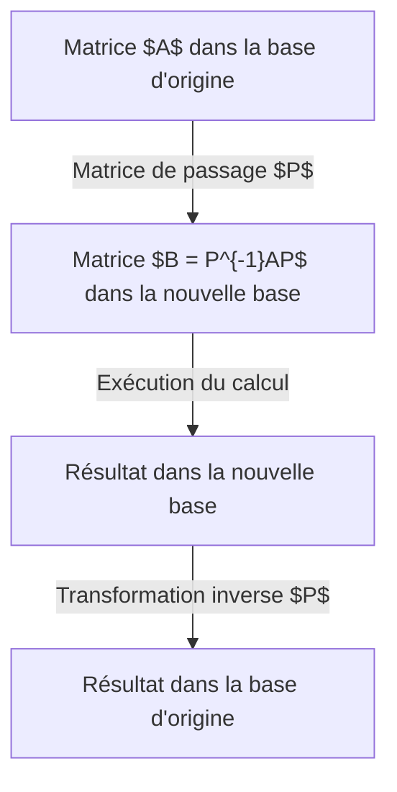

## Introduction

Lors de l'apprentissage de l'algèbre linéaire, l'un des obstacles majeurs est la **diagonalisation** et la **réduite de Jordan**. Les matrices sont de puissants outils pour décrire les déformations spatiales (transformations linéaires), mais leurs propriétés sont souvent difficiles à lire. Cet article explique en détail la diagonalisation pour simplifier à l'extrême les matrices, ainsi que la forme de Jordan qui sauve celles qui ne peuvent pas être diagonalisées, de la compréhension intuitive aux applications en physique.

## Qu'est-ce qu'une matrice : perspective de transformation

Une matrice carrée $A$ de $n \times n$ représente une transformation linéaire. Cette transformation dépend de la "base" adoptée. En changeant de base, la représentation matricielle peut devenir radicalement plus simple. C'est la motivation des "transformations de similitude".



## Concepts de base de la diagonalisation

### Compréhension intuitive

Une matrice $A$ est diagonalisable si, d'un point de vue approprié (nouvelle base), la transformation est simplement "un étirement et un rétrécissement le long de chaque axe". Les glissements (cisaillements) disparaissent.

### Définition mathématique

Une matrice $A$ est diagonalisable s'il existe une matrice inversible $P$ telle qu'une matrice diagonale $D$ satisfasse :

$$
P^{-1} A P = D
$$

Les éléments diagonaux de $D$ sont les **valeurs propres** $\lambda_i$, et les colonnes de $P$ sont les **vecteurs propres** $\mathbf{v}_i$.

## Exemple de calcul concret

### Exemple de matrice 3x3

Diagonalisons :

$$
A = \begin{pmatrix}
4 & -1 & 6 \\
2 & 1 & 6 \\
2 & -1 & 8
\end{pmatrix}
$$

**Étape 1 : Valeurs propres**
L'équation caractéristique $\det(A - \lambda I) = 0$ donne :
$\lambda = 2$ (multiplicité 2) et $\lambda = 9$.

**Étape 2 : Vecteurs propres**
Pour $\lambda = 2$ :
$$
\mathbf{v}_1 = \begin{pmatrix} 1 \\ 2 \\ 0 \end{pmatrix}, \quad \mathbf{v}_2 = \begin{pmatrix} -3 \\ 0 \\ 1 \end{pmatrix}
$$
Pour $\lambda = 9$ :
$$
\mathbf{v}_3 = \begin{pmatrix} 1 \\ 1 \\ 1 \end{pmatrix}
$$

**Étape 3 : Diagonalisation**
Avec $P = (\mathbf{v}_1 \ \mathbf{v}_2 \ \mathbf{v}_3)$, on a :

$$
P^{-1} A P = \begin{pmatrix}
2 & 0 & 0 \\
0 & 2 & 0 \\
0 & 0 & 9
\end{pmatrix}
$$

## Pourquoi certaines matrices ne sont-elles pas diagonalisables ?

La condition est d'avoir $n$ vecteurs propres linéairement indépendants.
Nous avons la **multiplicité algébrique** et la **multiplicité géométrique**.

$$
1 \leq \text{Multiplicité géométrique} \leq \text{Multiplicité algébrique}
$$

Si la multiplicité géométrique est strictement inférieure à la multiplicité algébrique, la matrice ne peut pas être diagonalisée. C'est une **matrice défective**.

### Exemple non diagonalisable

$$
B = \begin{pmatrix} 1 & 1 \\ 0 & 1 \end{pmatrix}
$$
La valeur propre est $\lambda = 1$ (multiplicité algébrique 2), mais l'espace propre est engendré par $\begin{pmatrix} 1 \\ 0 \end{pmatrix}$, donc la multiplicité géométrique est 1.

## La forme de Jordan

La **réduite de Jordan** transforme les matrices non diagonalisables en une forme très simple.

### Blocs de Jordan

Elle est composée de **blocs de Jordan** :

$$
J_k(\lambda) = \begin{pmatrix}
\lambda & 1 & 0 & \cdots & 0 \\
0 & \lambda & 1 & \cdots & 0 \\
\vdots & \vdots & \ddots & \ddots & 1 \\
0 & 0 & \cdots & 0 & \lambda
\end{pmatrix}
$$

### Vecteurs propres généralisés

On introduit les **vecteurs propres généralisés** :
$$
(A - \lambda I)^k \mathbf{v} = \mathbf{0} \quad \text{et} \quad (A - \lambda I)^{k-1} \mathbf{v} \neq \mathbf{0}
$$

## Applications : Équations différentielles et exponentielle de matrice

### L'exponentielle $e^{At}$
La solution de $\frac{d\mathbf{x}}{dt} = A \mathbf{x}$ est $\mathbf{x}(t) = e^{At} \mathbf{x}(0)$.
Si $A = PDP^{-1}$, alors :
$$
e^{At} = P e^{Dt} P^{-1}
$$

Pour un bloc de Jordan $J_k(\lambda)$ :
$$
e^{J_k(\lambda)t} = e^{\lambda t} \begin{pmatrix}
1 & t & \frac{t^2}{2!} & \cdots & \frac{t^{k-1}}{(k-1)!} \\
0 & 1 & t & \cdots & \frac{t^{k-2}}{(k-2)!} \\
\vdots & \vdots & \ddots & \ddots & \vdots \\
0 & 0 & \cdots & 1 & t \\
0 & 0 & \cdots & 0 & 1
\end{pmatrix}
$$
Cela explique les termes résonants $te^{\lambda t}$ en physique.

## Théorème de Cayley-Hamilton et polynôme minimal

Toute matrice $A$ annule son polynôme caractéristique $p(A) = 0$ (**Théorème de Cayley-Hamilton**).
Le **polynôme minimal** $m(\lambda)$ est celui de plus bas degré tel que $m(A) = 0$. Si ses racines sont simples, la matrice est diagonalisable.

## Différence avec la décomposition en valeurs singulières (SVD)

La SVD s'applique à toute matrice $m \times n$ : $A = U \Sigma V^*$ (avec matrices orthogonales). La diagonalisation est réservée aux matrices carrées pour les itérations.


## Mécanique quantique et théorie du contrôle

En mécanique quantique, diagonaliser le Hamiltonien donne les états propres d'énergie. En théorie du contrôle, cela permet de découpler les modes pour analyser la **contrôlabilité** et l'**observabilité**.

## Programmation

Exemple en Python :
```python
import numpy as np
from scipy.linalg import schur, eigvals

A = np.array([[5, 4, 2, 1],
              [0, 1, -1, -1],
              [-1, -1, 3, 0],
              [1, 1, -1, 2]])

# Valeurs propres
eigenvalues = eigvals(A)
print("Valeurs propres:", eigenvalues)

# Décomposition de Schur
T, Z = schur(A, output='complex')
print("Matrice triangulaire T :")
print(np.round(T, 4))
```

## Conclusion

La diagonalisation et la forme de Jordan sont des piliers des mathématiques modernes, de la mécanique quantique au machine learning.
