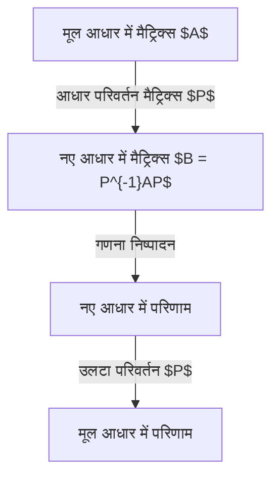
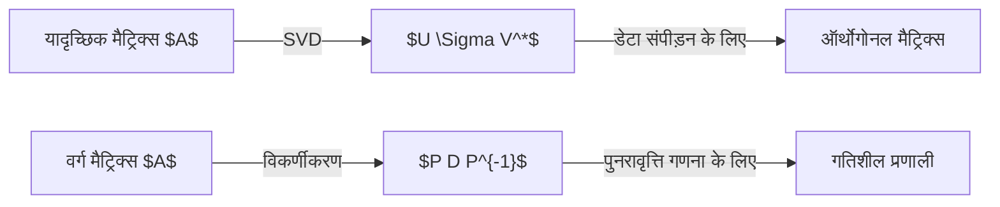

## प्रस्तावना

रैखिक बीजगणित (Linear Algebra) सीखते समय, सबसे बड़ी बाधा **विकर्णीकरण (Diagonalization)** और **जॉर्डन सामान्य रूप (Jordan Normal Form)** होती है। मैट्रिक्स ज्यामितीय परिवर्तनों को दर्शाते हैं, लेकिन उनके मूल रूप में उन्हें समझना कठिन होता है। यह लेख इन अवधारणाओं को गहराई से समझाता है।

## मैट्रिक्स क्या है: एक परिवर्तन के रूप में

एक मैट्रिक्स को सही "आधार" (Basis) में बदलने से इसकी गणना बेहद सरल हो जाती है।



## विकर्णीकरण की अवधारणा

### गणितीय परिभाषा

एक मैट्रिक्स $A$ विकर्णीय है यदि एक व्युत्क्रमणीय मैट्रिक्स $P$ मौजूद है जिससे:

$$
P^{-1} A P = D
$$

जहाँ $D$ के विकर्ण तत्व **आइगेनवैल्यू (Eigenvalues)** $\lambda_i$ हैं, और $P$ के स्तंभ **आइगेनवेक्टर (Eigenvectors)** $\mathbf{v}_i$ हैं।

## गणना का उदाहरण

### 3x3 मैट्रिक्स का उदाहरण

$$
A = \begin{pmatrix}
4 & -1 & 6 \\
2 & 1 & 6 \\
2 & -1 & 8
\end{pmatrix}
$$

**चरण 1: आइगेनवैल्यू की गणना**
$\det(A - \lambda I) = 0$ को हल करने पर $\lambda = 2$ और $\lambda = 9$ मिलता है।

**चरण 2: आइगेनवेक्टर की गणना**
$\lambda = 2$ के लिए:
$$
\mathbf{v}_1 = \begin{pmatrix} 1 \\ 2 \\ 0 \end{pmatrix}, \quad \mathbf{v}_2 = \begin{pmatrix} -3 \\ 0 \\ 1 \end{pmatrix}
$$
$\lambda = 9$ के लिए:
$$
\mathbf{v}_3 = \begin{pmatrix} 1 \\ 1 \\ 1 \end{pmatrix}
$$

**चरण 3: विकर्णीकरण**
$$
P^{-1} A P = \begin{pmatrix}
2 & 0 & 0 \\
0 & 2 & 0 \\
0 & 0 & 9
\end{pmatrix}
$$

## कुछ मैट्रिक्स विकर्णीय क्यों नहीं होते?

शर्त यह है कि:
$$
1 \leq \text{ज्यामितीय बहुलता} \leq \text{बीजगणितीय बहुलता}
$$
यदि ज्यामितीय बहुलता कम है, तो पर्याप्त आइगेनवेक्टर नहीं होते हैं।

## जॉर्डन सामान्य रूप का सिद्धांत

ऐसे मामलों में हम **जॉर्डन सामान्य रूप** का उपयोग करते हैं।

### जॉर्डन ब्लॉक
$$
J_k(\lambda) = \begin{pmatrix}
\lambda & 1 & 0 & \cdots & 0 \\
0 & \lambda & 1 & \cdots & 0 \\
\vdots & \vdots & \ddots & \ddots & 1 \\
0 & 0 & \cdots & 0 & \lambda
\end{pmatrix}
$$

### सामान्यीकृत आइगेनवेक्टर
$$
(A - \lambda I)^k \mathbf{v} = \mathbf{0} \quad \text{और} \quad (A - \lambda I)^{k-1} \mathbf{v} \neq \mathbf{0}
$$

## अनुप्रयोग: विभेदक समीकरण

$\frac{d\mathbf{x}}{dt} = A \mathbf{x}$ का हल $\mathbf{x}(t) = e^{At} \mathbf{x}(0)$ है।
विकर्णीकरण द्वारा:
$$
e^{At} = P e^{Dt} P^{-1}
$$

## SVD और विकर्णीकरण में अंतर



## प्रोग्रामिंग उदाहरण

Python में:
```python
import numpy as np
from scipy.linalg import schur, eigvals

A = np.array([[5, 4, 2, 1],
              [0, 1, -1, -1],
              [-1, -1, 3, 0],
              [1, 1, -1, 2]])

# आइगेनवैल्यू
eigenvalues = eigvals(A)
print("आइगेनवैल्यू:", eigenvalues)

# Schur Decomposition
T, Z = schur(A, output='complex')
print("मैट्रिक्स T:")
print(np.round(T, 4))
```

## निष्कर्ष
विकर्णीकरण मैट्रिक्स को सरल बनाने की सर्वोत्तम तकनीक है, और क्वांटम यांत्रिकी से लेकर नियंत्रण सिद्धांत तक इसके कई उपयोग हैं।
