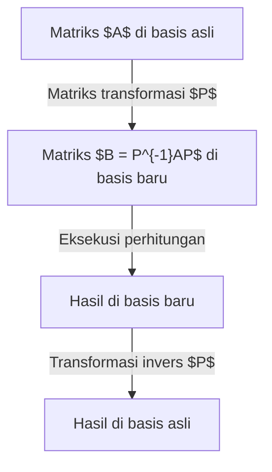
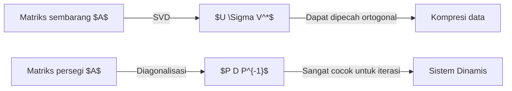

## Pengantar

Dalam mempelajari aljabar linear, hambatan utama adalah **diagonalisasi** dan **bentuk normal Jordan**. Matriks adalah alat kuat untuk transformasi, namun sering kali sifat-sifatnya sulit dibaca secara langsung. Artikel ini menjelaskan diagonalisasi untuk menyederhanakan matriks dan bentuk Jordan untuk matriks yang tidak bisa didiagonalisasi.

## Matriks sebagai Transformasi

Matriks $n \times n$ mewakili transformasi linear yang bergantung pada "basis". Dengan basis baru yang tepat, representasi matriks menjadi lebih sederhana.



## Konsep Diagonalisasi

### Definisi Matematika

Matriks $A$ dapat didiagonalisasi jika ada matriks $P$ sedemikian rupa sehingga:

$$
P^{-1} A P = D
$$

Di mana elemen diagonal $D$ adalah **nilai eigen** $\lambda_i$, dan kolom $P$ adalah **vektor eigen** $\mathbf{v}_i$.

## Contoh Perhitungan

### Matriks 3x3

$$
A = \begin{pmatrix}
4 & -1 & 6 \\
2 & 1 & 6 \\
2 & -1 & 8
\end{pmatrix}
$$

**Langkah 1: Nilai eigen**
Dari $\det(A - \lambda I) = 0$, kita dapatkan $\lambda = 2$ dan $\lambda = 9$.

**Langkah 2: Vektor eigen**
Untuk $\lambda = 2$:
$$
\mathbf{v}_1 = \begin{pmatrix} 1 \\ 2 \\ 0 \end{pmatrix}, \quad \mathbf{v}_2 = \begin{pmatrix} -3 \\ 0 \\ 1 \end{pmatrix}
$$
Untuk $\lambda = 9$:
$$
\mathbf{v}_3 = \begin{pmatrix} 1 \\ 1 \\ 1 \end{pmatrix}
$$

**Langkah 3: Diagonalisasi**
$$
P^{-1} A P = \begin{pmatrix}
2 & 0 & 0 \\
0 & 2 & 0 \\
0 & 0 & 9
\end{pmatrix}
$$

## Mengapa Ada Matriks yang Tidak Dapat Didiagonalisasi?

Kita harus memenuhi:
$$
1 \leq \text{Multiplisitas geometrik} \leq \text{Multiplisitas aljabar}
$$
Jika geometrik lebih kecil, matriks kekurangan vektor eigen dan disebut matriks cacat (defective).

## Bentuk Normal Jordan

Untuk matriks cacat, kita gunakan **Bentuk Normal Jordan**.

### Blok Jordan
$$
J_k(\lambda) = \begin{pmatrix}
\lambda & 1 & 0 & \cdots & 0 \\
0 & \lambda & 1 & \cdots & 0 \\
\vdots & \vdots & \ddots & \ddots & 1 \\
0 & 0 & \cdots & 0 & \lambda
\end{pmatrix}
$$

### Vektor Eigen yang Diperumum (Generalized Eigenvectors)
$$
(A - \lambda I)^k \mathbf{v} = \mathbf{0} \quad \text{dan} \quad (A - \lambda I)^{k-1} \mathbf{v} \neq \mathbf{0}
$$

## Aplikasi: Persamaan Diferensial

Solusi $\frac{d\mathbf{x}}{dt} = A \mathbf{x}$ adalah $\mathbf{x}(t) = e^{At} \mathbf{x}(0)$.
$$
e^{At} = P e^{Dt} P^{-1}
$$

## SVD vs Diagonalisasi



## Mekanika Kuantum dan Teori Kontrol

Dalam kuantum, diagonalisasi Hamiltonian menemukan keadaan eigen energi. Dalam kontrol, ini mengevaluasi **kontrobalitas** dan **observabilitas**.

## Pemrograman

```python
import numpy as np
from scipy.linalg import schur, eigvals

A = np.array([[5, 4, 2, 1],
              [0, 1, -1, -1],
              [-1, -1, 3, 0],
              [1, 1, -1, 2]])

# Nilai eigen
eigenvalues = eigvals(A)
print("Nilai eigen:", eigenvalues)

# Dekomposisi Schur
T, Z = schur(A, output='complex')
print("Matriks T:")
print(np.round(T, 4))
```

## Kesimpulan
Diagonalisasi adalah metode untuk menyederhanakan sistem, dan Jordan melengkapinya untuk segala kasus. Menguasainya sangat esensial bagi ilmu data dan fisika.
