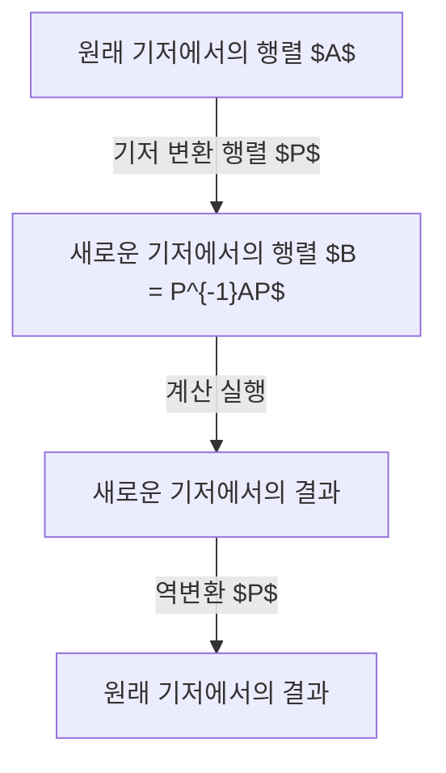
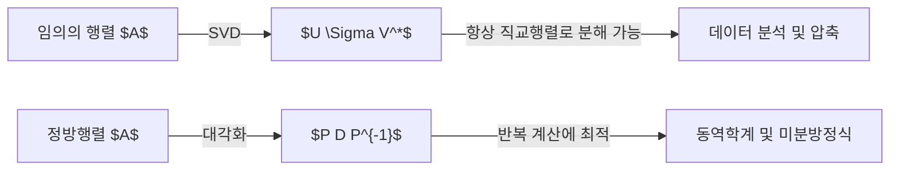

## 머리말

선형대수학을 배우는 과정에서 많은 사람이 직면하는 큰 벽 중 하나가 바로 **대각화**와 **조르단 표준형**입니다. 행렬은 공간의 변형(선형 변환)을 기술하는 강력한 도구이지만, 그 형태 그대로는 성질을 파악하기 어려운 경우가 많습니다. 이 글에서는 복잡한 행렬을 극한까지 단순하게 표현하기 위한 대각화와, 대각화할 수 없는 행렬을 구제하는 조르단 표준형에 대해 자세히 알아봅니다.

## 행렬이란 무엇인가: 변환으로서의 관점

행렬 $n \times n$은 선형 변환을 나타냅니다. 그러나 이 변환은 현재 채택하고 있는 '기저(basis)'에 의존하는 표현일 뿐입니다. 적절한 새로운 기저를 선택함으로써 행렬 표현은 극적으로 단순해질 수 있습니다.



## 대각화의 기본 개념

### 직관적 이해

행렬 $A$가 대각화 가능하다는 것은, 적절한 시점(새로운 기저)에서 보면 그 행렬이 나타내는 변환이 '각 좌표축을 따른 단순한 신축(늘어나고 줄어듦)'에 불과하다는 것을 의미합니다.

### 수학적 정의

$n \times n$ 행렬 $A$가 대각화 가능하다는 것은, 가역행렬 $P$가 존재하여 다음을 만족하는 대각행렬 $D$를 만들 수 있음을 의미합니다:

$$
P^{-1} A P = D
$$

여기서 $D$의 대각 성분은 $A$의 **고윳값** $\lambda_i$이며, $P$의 각 열벡터는 대응하는 **고유벡터** $\mathbf{v}_i$입니다.

## 대각화의 구체적인 계산 예

### 3차 정방행렬의 예

$$
A = \begin{pmatrix}
4 & -1 & 6 \\
2 & 1 & 6 \\
2 & -1 & 8
\end{pmatrix}
$$

**1단계: 고윳값 계산**
특성방정식 $\det(A - \lambda I) = 0$을 풀면 $\lambda = 2$와 $\lambda = 9$가 나옵니다.

**2단계: 고유벡터 계산**
$\lambda = 2$일 때:
$$
\mathbf{v}_1 = \begin{pmatrix} 1 \\ 2 \\ 0 \end{pmatrix}, \quad \mathbf{v}_2 = \begin{pmatrix} -3 \\ 0 \\ 1 \end{pmatrix}
$$
$\lambda = 9$일 때:
$$
\mathbf{v}_3 = \begin{pmatrix} 1 \\ 1 \\ 1 \end{pmatrix}
$$

**3단계: 대각화 실행**
$P = (\mathbf{v}_1 \ \mathbf{v}_2 \ \mathbf{v}_3)$로 두면:
$$
P^{-1} A P = \begin{pmatrix}
2 & 0 & 0 \\
0 & 2 & 0 \\
0 & 0 & 9
\end{pmatrix}
$$

## 왜 대각화할 수 없는 행렬이 존재하는가?

다음 관계가 성립해야 합니다:
$$
1 \leq \text{기하학적 중복도} \leq \text{대수적 중복도}
$$
기하학적 중복도가 대수적 중복도보다 엄밀히 작을 경우, 행렬은 충분한 수의 고유벡터를 가지지 못해 대각화할 수 없습니다.

## 조르단 표준형의 이론

### 조르단 블록의 정의

대각화 불가능한 행렬을 단순화하는 것이 **조르단 표준형**입니다.
$$
J_k(\lambda) = \begin{pmatrix}
\lambda & 1 & 0 & \cdots & 0 \\
0 & \lambda & 1 & \cdots & 0 \\
\vdots & \vdots & \ddots & \ddots & 1 \\
0 & 0 & \cdots & 0 & \lambda
\end{pmatrix}
$$

### 일반화된 고유벡터
다음을 만족하는 벡터를 일반화된 고유벡터라고 합니다:
$$
(A - \lambda I)^k \mathbf{v} = \mathbf{0} \quad \text{및} \quad (A - \lambda I)^{k-1} \mathbf{v} \neq \mathbf{0}
$$

## 응용: 미분방정식과 행렬 지수 함수

시스템 $\frac{d\mathbf{x}}{dt} = A \mathbf{x}$의 해는 $\mathbf{x}(t) = e^{At} \mathbf{x}(0)$입니다.
$$
e^{At} = P e^{Dt} P^{-1}
$$
조르단 표준형을 이용하면 $te^{\lambda t}$와 같은 항이 어떻게 미분방정식의 해로 나타나는지 명확해집니다.

## 대각화와 특이값 분해(SVD)의 차이



## 양자역학과 제어이론에서의 의미

양자역학에서 해밀토니안의 대각화는 에너지 고유상태를 구하는 것을 의미합니다. 현대 제어이론에서는 시스템의 **가제어성(Controllability)**과 **가관측성(Observability)**을 평가하는 데 핵심적인 역할을 합니다.

## 프로그래밍을 통한 수치 계산

```python
import numpy as np
from scipy.linalg import schur, eigvals

A = np.array([[5, 4, 2, 1],
              [0, 1, -1, -1],
              [-1, -1, 3, 0],
              [1, 1, -1, 2]])

# 고윳값
eigenvalues = eigvals(A)
print("고윳값:", eigenvalues)

# 슈어 분해(Schur Decomposition)
T, Z = schur(A, output='complex')
print("상삼각행렬 T:")
print(np.round(T, 4))
```

## 결론
[대각화와 조르단 표준형](https://kenji.blog/ko/p/diagonalization-and-jordan-normal-form/)은 복잡한 시스템의 행동을 명확하게 파악할 수 있도록 해주는 수학적 기초입니다.
