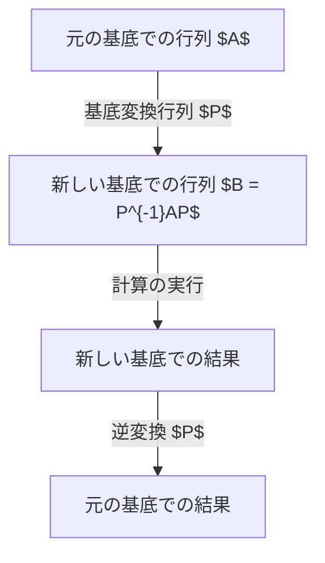
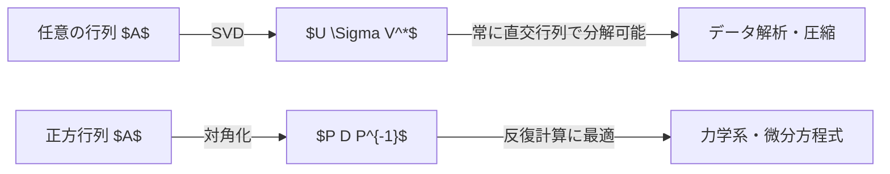

## はじめに

線形代数を学ぶ中で、多くの人が直面する一つの大きな壁が **対角化** と **ジョルダン標準形** です。行列は、空間の変形（線形変換）を記述する強力なツールですが、そのままの形ではその性質を読み取るのが難しいことがよくあります。この記事では、複雑な行列を限界までシンプルに表現するための強力な手法である対角化と、対角化できない行列を救済するジョルダン標準形について、その背景にある直観的な意味から厳密な数学的定義、そして物理学や工学への応用までを極めて詳細に解説します。

線形代数の基礎的な概念であるベクトル空間や基底の変換を理解している読者を対象としていますが、初学者でもステップバイステップで理解できるように具体的な計算例を豊富に盛り込んでいます。それでは、行列の深淵なる世界へと足を踏み入れてみましょう。

## 行列とは何か：変換としての視点

行列というものを単なる「数字の並び」として捉えるのではなく、「空間をどのように歪めるか」という幾何学的な変換のルールとして理解することが、対角化を直観的に理解する第一歩です。

$n$ 次正方行列 $A$ は、$n$ 次元ベクトル空間における線形変換を表現します。しかし、この変換は我々が現在採用している「基底」（座標軸のセット）に依存した表現に過ぎません。適切な基底を選び直すことで、同じ変換であってもその行列表現は劇的にシンプルになる可能性があります。これが「相似変換」の基本的なモチベーションです。



## 対角化の基本概念

### 直観的な理解

行列 $A$ が対角化可能であるとは、適切な視点（新しい基底）から見れば、その行列が表す変換が「各座標軸に沿った単なる伸び縮み」にすぎないことを意味します。斜め方向への複雑なズレ（せん断）がなくなり、純粋なスケーリングのみで空間の変形を記述できる状態です。

### 数学的定義と定理

$n \times n$ 行列 $A$ が対角化可能であるとは、ある正則行列 $P$ が存在して、

$$
P^{-1} A P = D
$$

となる対角行列 $D$ が作れることを指します。ここで、$D$ の対角成分は $A$ の **固有値** $\lambda_i$ であり、$P$ の各列ベクトルは対応する **固有ベクトル** $\mathbf{v}_i$ です。

**対角化のための必要十分条件：**
$n$ 次正方行列 $A$ が対角化可能であるための必要十分条件は、$A$ が $n$ 個の線形独立な固有ベクトルを持つことです。

## 対角化の具体的な計算例

### 3次正方行列の例

次の行列 $A$ を対角化してみましょう。

$$
A = \begin{pmatrix}
4 & -1 & 6 \\
2 & 1 & 6 \\
2 & -1 & 8
\end{pmatrix}
$$

**ステップ1：固有値の計算**
固有方程式 $\det(A - \lambda I) = 0$ を解きます。

$$
\det \begin{pmatrix}
4-\lambda & -1 & 6 \\
2 & 1-\lambda & 6 \\
2 & -1 & 8-\lambda
\end{pmatrix} = -(\lambda-2)^2 (\lambda-9) = 0
$$

したがって、固有値は $\lambda = 2$ (重複度2) と $\lambda = 9$ です。

**ステップ2：固有ベクトルの計算**
$\lambda = 2$ のとき、$(A - 2I)\mathbf{x} = \mathbf{0}$ を解くと、2つの線形独立な固有ベクトルが得られます。

$$
\mathbf{v}_1 = \begin{pmatrix} 1 \\ 2 \\ 0 \end{pmatrix}, \quad \mathbf{v}_2 = \begin{pmatrix} -3 \\ 0 \\ 1 \end{pmatrix}
$$

$\lambda = 9$ のとき、$(A - 9I)\mathbf{x} = \mathbf{0}$ を解くと、

$$
\mathbf{v}_3 = \begin{pmatrix} 1 \\ 1 \\ 1 \end{pmatrix}
$$

**ステップ3：対角化の実行**
行列 $P$ を $P = (\mathbf{v}_1 \ \mathbf{v}_2 \ \mathbf{v}_3)$ とおくと、

$$
P^{-1} A P = \begin{pmatrix}
2 & 0 & 0 \\
0 & 2 & 0 \\
0 & 0 & 9
\end{pmatrix}
$$

これで対角化が完了しました。

## なぜ対角化できない行列が存在するのか？

すべての行列が対角化できるわけではありません。対角化の条件は、「$n$ 個の線形独立な固有ベクトルを持つこと」です。

固有方程式の解である固有値には、**代数的重複度** （方程式の解としての重根の数）と **幾何学的重複度** （対応する固有空間の次元、すなわち独立な固有ベクトルの数）があります。数学的に、次の関係が常に成り立ちます。

$$
1 \leq \text{幾何学的重複度} \leq \text{代数的重複度}
$$

幾何学的重複度が代数的重複度よりも厳密に小さい場合、その行列は必要な数の固有ベクトルを持たず、対角化できません。このような行列を **欠陥行列** と呼びます。

### 対角化不可能な具体例

$$
B = \begin{pmatrix}
1 & 1 \\
0 & 1
\end{pmatrix}
$$

この行列の固有値は $\lambda = 1$ (代数的重複度2) ですが、固有空間を求めると、

$$
(B - I)\mathbf{x} = \begin{pmatrix} 0 & 1 \\ 0 & 0 \end{pmatrix} \begin{pmatrix} x_1 \\ x_2 \end{pmatrix} = \begin{pmatrix} 0 \\ 0 \end{pmatrix}
$$

ここから $x_2 = 0$ が得られ、固有ベクトルは $\mathbf{v} = \begin{pmatrix} 1 \\ 0 \end{pmatrix}$ の定数倍のみとなります。つまり幾何学的重複度は1であり、対角化できません。

## ジョルダン標準形の理論

対角化できない行列でも、可能な限りシンプルな形に変形したいという要求に応えるのが **ジョルダン標準形 (Jordan Normal Form)** です。

### ジョルダン細胞の定義

ジョルダン標準形は、対角線上に固有値が並び、その一つ上の成分に $1$ が配置された **ジョルダン細胞** と呼ばれるブロックを対角上に並べた形をしています。

$$
J_k(\lambda) = \begin{pmatrix}
\lambda & 1 & 0 & \cdots & 0 \\
0 & \lambda & 1 & \cdots & 0 \\
0 & 0 & \lambda & \ddots & \vdots \\
\vdots & \vdots & \ddots & \ddots & 1 \\
0 & 0 & \cdots & 0 & \lambda
\end{pmatrix}
$$

### 広義固有ベクトルと鎖

ジョルダン標準形を構成するには、通常の固有ベクトルだけでは足りないため、**広義固有ベクトル** （一般化固有ベクトル）を導入します。

$$
(A - \lambda I)^k \mathbf{v} = \mathbf{0} \quad \text{および} \quad (A - \lambda I)^{k-1} \mathbf{v} \neq \mathbf{0}
$$

を満たすベクトル $\mathbf{v}$ をランク $k$ の広義固有ベクトルと呼びます。これらは鎖のような構造（ジョルダン鎖）を形成します。

$$
(A - \lambda I)\mathbf{v}_k = \mathbf{v}_{k-1}, \quad (A - \lambda I)\mathbf{v}_{k-1} = \mathbf{v}_{k-2}, \quad \dots, \quad (A - \lambda I)\mathbf{v}_2 = \mathbf{v}_1
$$

ここで $\mathbf{v}_1$ は通常の固有ベクトルです。

## ジョルダン標準形の導出例

先ほどの対角化できない行列 $B$ を考えてみましょう。

$$
B = \begin{pmatrix} 1 & 1 \\ 0 & 1 \end{pmatrix}
$$

固有ベクトルは $\mathbf{v}_1 = \begin{pmatrix} 1 \\ 0 \end{pmatrix}$ です。広義固有ベクトル $\mathbf{v}_2$ を求めるため、方程式 $(B - I)\mathbf{v}_2 = \mathbf{v}_1$ を解きます。

$$
\begin{pmatrix} 0 & 1 \\ 0 & 0 \end{pmatrix} \begin{pmatrix} x \\ y \end{pmatrix} = \begin{pmatrix} 1 \\ 0 \end{pmatrix}
$$

これから $y = 1$ が得られ、$x$ は任意です。$x = 0$ と選ぶと、$\mathbf{v}_2 = \begin{pmatrix} 0 \\ 1 \end{pmatrix}$ となります。
行列 $P = (\mathbf{v}_1 \ \mathbf{v}_2) = \begin{pmatrix} 1 & 0 \\ 0 & 1 \end{pmatrix} = I$ とすると、$P^{-1}BP = B$ となり、行列 $B$ はすでに一つのジョルダン細胞からなるジョルダン標準形であることがわかります。

## 応用：連立線形微分方程式と行列指数関数

ジョルダン標準形は、純粋な数学理論にとどまらず、物理学や工学における極めて実用的なツールです。特に連立線形微分方程式の解法においてその威力を発揮します。

### 行列指数関数 $e^{At}$ の定義

システム $\frac{d\mathbf{x}}{dt} = A \mathbf{x}$ の解は $\mathbf{x}(t) = e^{At} \mathbf{x}(0)$ で与えられます。行列指数関数は次のようにテイラー展開で定義されます。

$$
e^{At} = I + At + \frac{1}{2!}(At)^2 + \frac{1}{3!}(At)^3 + \cdots
$$

### ジョルダン標準形を用いた $e^{At}$ の計算

$A$ をそのまま累乗するのは非常に困難ですが、対角化可能な場合 $A = PDP^{-1}$ とすれば、$A^k = P D^k P^{-1}$ となり、

$$
e^{At} = P e^{Dt} P^{-1}
$$

と簡単に計算できます。対角化不可能な場合でも、$A = PJP^{-1}$ とジョルダン標準形を用いることで、ジョルダン細胞の指数関数を計算する問題に帰着できます。ジョルダン細胞 $J_k(\lambda)$ の指数関数は以下のようになります。

$$
e^{J_k(\lambda)t} = e^{\lambda t} \begin{pmatrix}
1 & t & \frac{t^2}{2!} & \cdots & \frac{t^{k-1}}{(k-1)!} \\
0 & 1 & t & \cdots & \frac{t^{k-2}}{(k-2)!} \\
\vdots & \vdots & \ddots & \ddots & \vdots \\
0 & 0 & \cdots & 1 & t \\
0 & 0 & \cdots & 0 & 1
\end{pmatrix}
$$

この結果は、微分方程式の解に $te^{\lambda t}$ や $t^2e^{\lambda t}$ のような項（永年項）が現れるメカニズムを明確に示しています。これは、共振現象や制御システムにおける臨界減衰などの物理現象を数学的に裏付けるものです。

## ケイリー・ハミルトンの定理と最小多項式

ジョルダン標準形をより深く理解するためには、行列の多項式について考察することが不可欠です。すべての $n$ 次正方行列 $A$ は、自身の固有多項式 $p(\lambda) = \det(\lambda I - A)$ を満たします。すなわち、$p(A) = 0$ （零行列）となります。これを **ケイリー・ハミルトンの定理** と呼びます。

しかし、行列 $A$ を零行列にする多項式は固有多項式だけではありません。$A$ を零行列にするモニック多項式の中で、次数が最小のものを **最小多項式** と呼びます。最小多項式を $m(\lambda)$ とすると、ジョルダン標準形と最小多項式の間には密接な関係があります。

最小多項式 $m(\lambda)$ が一次式の積に分解でき、かつ重根を持たない場合、その行列 $A$ は対角化可能となります。逆に重根を持つ場合は対角化不可能であり、重根の次数が最大のジョルダン細胞のサイズと一致します。

## 対角化と[特異値分解 (SVD)](https://kenji.blog/p/singular-value-decomposition/) の違い

対角化とよく似た行列の分解手法として **[特異値分解 (SVD)](https://kenji.blog/p/singular-value-decomposition/)** があります。これら二つの手法は、目的と適用範囲が異なります。

対角化 $A = PDP^{-1}$ は、正方行列にのみ適用可能であり、行列の「反復適用（累乗）」や「指数関数」を計算する際に極めて有用です。

一方、特異値分解 $A = U \Sigma V^*$ は、任意の $m \times n$ 行列に対して適用可能です。ここで、$U$ と $V$ はそれぞれユニタリ行列、$\Sigma$ は非負の実数が対角に並ぶ行列（特異値）です。特異値分解は、行列が表す変換を「回転」「拡大縮小」「回転」の3つのステップに分解するものであり、データの圧縮や擬似逆行列の計算に広く用いられます。



## 力学系と[マルコフ連鎖](https://kenji.blog/p/markov-chain/)への応用

対角化の強力な応用例として、離散力学系および[マルコフ連鎖](https://kenji.blog/p/markov-chain/)が挙げられます。

あるシステムの $k$ ステップ目の状態ベクトルを $\mathbf{x}_k$ とし、状態遷移が $\mathbf{x}_{k+1} = A \mathbf{x}_k$ で記述されるとします。このとき、$k$ ステップ後の状態は $\mathbf{x}_k = A^k \mathbf{x}_0$ となります。

行列 $A$ が対角化可能で、$A = P D P^{-1}$ と表せる場合、
$$
A^k = P D^k P^{-1}
$$
となります。ここで、$D^k$ は対角成分を単に $k$ 乗するだけで計算できます。この計算により、長期間経過後のシステムの状態、すなわち $k \to \infty$ における漸近的な振る舞いを容易に解析することができます。

例えば、Google のページランクアルゴリズムの基礎となる推移確率行列の研究など、現実世界の複雑なネットワークや確率過程を解析する上で、行列の固有値と対角化の概念は必要不可欠です。

## 量子力学における対角化の意味

物理学、特に量子力学において、行列の対角化は「観測」の概念と深く結びついています。量子力学では、物理量（例えばエネルギー、運動量など）はエルミート行列として表現されます。エルミート行列の重要な性質は、「必ず実数の固有値を持ち、かつユニタリ行列によって対角化可能である」という点です。

エルミート行列を対角化するということは、その物理量に対して「確定した値を持つ状態（固有状態）」のセットを基底として見つける作業に他なりません。例えば、ハミルトニアン（エネルギーを表す演算子）を対角化することは、系のエネルギー固有状態を求めることであり、量子化学や固体物理学において最も中心的な計算タスクとなっています。

## 現代制御理論における可制御性と可観測性

工学の分野、とりわけ現代制御理論においても、[対角化とジョルダン標準形](https://kenji.blog/p/diagonalization-and-jordan-normal-form/)は中心的な役割を果たします。線形時不変システム（LTIシステム）は、状態空間表現を用いて以下のように記述されます。

$$
\frac{d\mathbf{x}}{dt} = A\mathbf{x} + B\mathbf{u}
$$
$$
\mathbf{y} = C\mathbf{x} + D\mathbf{u}
$$

このシステム行列 $A$ を対角化、あるいはジョルダン標準形に変換することで、システム全体の複雑な連立方程式が、互いに独立した単純な1次遅れ系の集まりに分解されます。この変換（モード展開）を行うことで、どの入力がどのモードに影響を与えるか（**可制御性**）、またどのモードが出力から観測可能か（**可観測性**）を直観的かつ定量的に評価することが可能になります。

## 数値計算とプログラミングによるアプローチ

現代では、これらの計算はコンピュータを用いるのが一般的です。以下に Python を用いて行列の固有値と直交変換を計算する例を示します。

```python
import numpy as np
from scipy.linalg import schur, eigvals

# 複雑な行列を定義
A = np.array([[5, 4, 2, 1],
              [0, 1, -1, -1],
              [-1, -1, 3, 0],
              [1, 1, -1, 2]])

# 固有値を計算
# 重複度のある固有値が存在するか確認する
eigenvalues = eigvals(A)
print("固有値:", eigenvalues)

# SciPyを用いてシュール分解を実行
# 数値計算においては、不安定なジョルダン標準形よりも
# 直交行列を用いたシュール分解が好まれることが多い
T, Z = schur(A, output='complex')
print("上三角行列 T (固有値が対角に並ぶ):")
print(np.round(T, 4))
```

## まとめ

対角化は行列を限界までシンプルにする手法であり、ジョルダン標準形はその究極の一般化です。これらを理解することで、複雑なシステムの振る舞いを明確に把握することが可能になります。線形代数のこれらの高度なトピックは、量子力学から現代制御理論、さらには機械学習の背後にある数学的基盤まで、あらゆる分野で活躍しています。ぜひこの記事を通じて、行列の真の姿を読み解く直観力と計算力を身につけてください。
